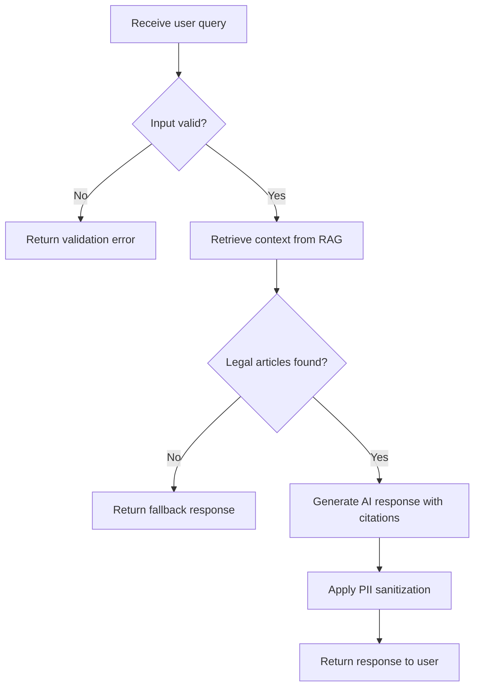

# Spec: [Feature Name]

> Created: YYYY-MM-DD
> Author: [Name]
> Status: Draft | In Progress | Ready for Review | Approved

## How to Use This Template

### Required Sections (must complete)
- **Section 1**: System Overview — always fill in PRD reference, problem, and solution
- **Section 2**: Feature Description — at minimum: Functional Requirements, Acceptance Criteria
- **Section 8**: Test Specification — at minimum: Test Plan table

### Conditional Sections (complete if applicable)
- **Section 4**: Data Model — if database changes are needed
- **Section 5**: API Specification — if exposing new or modified endpoints
- **Section 6.3**: Legal Calculation Logic — if implementing labor law calculations
- **Section 8.3**: Legal Module Testing — if implementing legal features

### Optional Sections (nice to have)
- **Section 3**: Technical Architecture — can reference existing architecture docs
- **Section 6.2**: Flowchart — recommended for complex business logic
- **Section 7**: Performance Requirements — if performance-critical feature
- **Appendix E**: Cost Estimation — recommended for AI/RAG features

### Quick Start
1. Copy this template to `.claude/docs/specs/pending/<feature-name>-spec.md`
2. Replace all `[placeholders]` with actual content
3. Delete sections marked "(if applicable)" that don't apply
4. Check off acceptance criteria as you implement
5. When done, move the file to `.claude/docs/specs/completed/`

---

## 1. System Overview

### Related PRD Reference
- **Epic**: [e.g., Epic 01: AI Chat Interface]
- **Feature ID**: [e.g., M-05: Basic Q&A Interface]
- **Priority**: Must Have | Should Have | Could Have

### System Context
[Where does this feature sit within the overall system architecture? Which components are involved?]

### Problem Statement
[What problem does this feature solve? Who is affected?]

### Proposed Solution
[High-level description of the solution approach]

## 2. Feature Description

### Functional Requirements
[Concrete description of what the feature does]

### Acceptance Criteria
> Use SMART criteria format. Each criterion should be independently testable.

- [ ] [Criterion 1]
- [ ] [Criterion 2]
- [ ] [Criterion 3]

#### Legal Compliance (if applicable)
- [ ] [Law article reference and compliance requirement]

### Non-Functional Requirements
- [ ] **Usability**: [e.g., response time < 3 seconds, mobile-friendly]
- [ ] **Scalability**: [e.g., support 1000 concurrent users]
- [ ] **Availability**: [e.g., 99.5% uptime]
- [ ] **Maintainability**: [e.g., code coverage > 80%, clear logging]
- [ ] **Accessibility**: [e.g., WCAG 2.1 AA compliance] (if frontend feature)
- [ ] **Localization**: [e.g., support zh-TW, fallback to en]

### Input
| Input | Source | Format | Validation Rules | Example |
|-------|--------|--------|-----------------|---------|
| | | | | |

### Processing Logic
[Core business logic and processing flow, step by step]

### Output
| Output | Destination | Format | Example |
|--------|-------------|--------|---------|
| | | | |

## 3. Technical Architecture

### Architecture Overview
[How does this fit into the existing system? Include component diagram description if helpful]

### Tech Stack
| Layer | Technology | Purpose |
|-------|-----------|---------|
| | | |

Example:
| Layer | Technology | Purpose |
|-------|-----------|---------|
| Frontend | Next.js 15 + TypeScript | SSR, UI components |
| Backend | FastAPI (Python 3.11) | REST API server |
| Database | PostgreSQL 15 + pgvector | Relational data + vector embeddings |
| Cache | Redis (Upstash) | Response caching, rate limiting |
| AI/LLM | Claude Sonnet 4.5 | Legal Q&A generation |
| Search | pgvector | Vector similarity search for RAG |

### Backend Components
[Services, repositories, utilities to create or modify]

### Frontend Components (if applicable)
[Pages, components, state management changes]

### Security Considerations
| Concern | Approach |
|---------|----------|
| Authentication | [Auth method: JWT / API key / session] |
| Authorization | [Role-based access, permission checks] |
| Data Privacy | [PII handling, encryption at rest/in transit] |
| Input Sanitization | [XSS prevention, SQL injection prevention] |
| Rate Limiting | [Limits per endpoint, throttling strategy] |

## 4. Data Model

### Schema Changes
[New tables or modified schemas]

```sql
-- Assumes PostgreSQL with pgvector extension. Adjust for other databases.
-- Example:

CREATE TABLE conversation_history (
  id UUID PRIMARY KEY DEFAULT gen_random_uuid(),
  session_id UUID NOT NULL,
  query_text TEXT NOT NULL,
  response_text TEXT NOT NULL,
  legal_articles JSONB,           -- Array of referenced law article IDs
  confidence_score DECIMAL(3,2),  -- AI response confidence (0.00-1.00)
  created_at TIMESTAMPTZ DEFAULT NOW(),

  CONSTRAINT query_not_empty CHECK (length(trim(query_text)) > 0),
  CONSTRAINT valid_confidence CHECK (confidence_score BETWEEN 0 AND 1)
);

-- Indexes defined in Section 4.4 below
```

### Migration Requirements
[Migration strategy, backward compatibility, data backfill needs]

### Rollback Plan
[How to revert this migration if issues are found in production]
- Rollback SQL / Alembic downgrade command
- Data recovery steps (if destructive migration)
- Estimated rollback time

### Indexes
| Table | Column(s) | Type | Purpose |
|-------|-----------|------|---------|
| | | | |

## 5. API Specification

### Versioning Policy
- Current API version: `v1`
- Breaking changes require version bump (`v1` → `v2`)
- Non-breaking additions (new fields, new endpoints) stay in current version
- Deprecated endpoints must be supported for at least 2 release cycles

### Endpoints

#### `[METHOD] /api/v1/[resource]`
- **Description**: [What this endpoint does]
- **Authentication**: [Required / Public]

**Request**:
| Parameter | Location | Type | Required | Default | Description |
|-----------|----------|------|----------|---------|-------------|
| | | | | | |

**Response** (`200 OK`):
```json
{
}
```

**Error Responses**:
| Status | Code | Description |
|--------|------|-------------|
| 400 | INVALID_INPUT | [When/why this occurs] |
| 401 | UNAUTHORIZED | [Authentication required or token expired] |
| 403 | FORBIDDEN | [Insufficient permissions for this resource] |
| 404 | NOT_FOUND | [When/why this occurs] |
| 500 | INTERNAL_ERROR | [When/why this occurs] |

## 6. Algorithm Description

### Core Algorithm
[Detailed description of the key algorithm and its flow]

### Flowchart


> Replace the above with your feature's actual flow. Use [Mermaid syntax](https://mermaid.js.org/syntax/flowchart.html).

### Legal Calculation Logic (if applicable)
[Formulas, rules, and edge cases for labor law calculations.
Reference specific law articles.]

Example:
```
Overtime pay = Base hourly wage x Overtime hours x Multiplier
- First 2 hours: multiplier = 1.34 (Labor Standards Act §24-1)
- Beyond 2 hours: multiplier = 1.67 (Labor Standards Act §24-2)
- Base hourly wage = Monthly salary / 30 / 8
```

### Edge Cases & Exception Handling

| Edge Case | Expected Behavior | Reference |
|-----------|------------------|-----------|
| [e.g., Empty user input] | [e.g., Return validation error] | |
| [e.g., Query exceeds max length] | [e.g., Truncate and warn user] | |
| [e.g., External API timeout] | [e.g., Return error with retry option] | |
| [e.g., No legal articles found] | [e.g., Return fallback response with disclaimer] | |

## 7. Performance Requirements

| Metric | Current | Target | Measurement Method |
|--------|---------|--------|-------------------|
| Response time (P95) | | | |
| Throughput (requests/sec) | | | |
| Concurrent users | | | |
| Cache hit rate | | | |
| Database query time | | | |

### Optimization Strategy
[Caching approach, query optimization, lazy loading, etc.]

### Observability Requirements

| Type | Details |
|------|---------|
| Logging | [Key events to log, log level, structured fields] |
| Metrics | [Custom metrics to track, dashboard requirements] |
| Alerts | [Alert conditions, thresholds, notification channels] |

Example:
```
Logging:
  Events: user_query_received, rag_search_completed, llm_response_generated
  Level: INFO (normal flow), ERROR (failures)
  Fields: {session_id, query_length, response_time_ms, legal_articles_count}

Metrics:
  - query_count_total (counter)
  - response_time_seconds (histogram, P50/P95/P99)
  - rag_cache_hit_ratio (gauge)

Alerts:
  - Response time P95 > 5s for 5 min → Slack #alerts
  - Error rate > 5% for 2 min → PagerDuty
  - LLM API quota > 90% → Email team lead
```

## 8. Test Specification

### Test Plan

| Test Type | Scope | Key Scenarios |
|-----------|-------|---------------|
| Unit | | |
| Integration | | |
| E2E | | |
| BDD | | |

### BDD Scenarios
```gherkin
# Example:
# Feature: [Feature name]
#   Scenario: [Scenario name]
#     Given [precondition]
#     When [action]
#     Then [expected result]
```

### Legal Module Testing (if applicable)
- Coverage target: 95% for legal calculation modules
- Cross-validation with government calculators required
- Must test edge cases: variable working hours (變形工時), part-time workers (部分工時),
  probation period (試用期), less than one year of service (未滿一年資遣),
  foreign workers (外籍勞工)

---

## Appendix

### A. Dependencies

| Type | Dependency | Version | Notes |
|------|-----------|---------|-------|
| Upstream | [What must be completed first] | | |
| Downstream | [What depends on this] | | |
| External | [Third-party APIs, services] | | |

### B. Risks and Mitigation

| Risk | Impact | Probability | Mitigation |
|------|--------|-------------|------------|
| | | | |

### C. Localization Requirements

| Aspect | Requirement |
|--------|------------|
| Language | Traditional Chinese (zh-TW) as primary; multilingual per Epic 05 |
| Currency | TWD (NT$), no decimal places |
| Date format | YYYY/MM/DD (Taiwan standard) |
| Number format | Comma-separated thousands (e.g., 27,470) |
| Legal terms | Use official MOL (勞動部) terminology |

### D. Implementation Notes

**Estimated Effort**:
- [ ] Small (< 1 day)
- [ ] Medium (1-3 days)
- [ ] Large (3-5 days)
- [ ] Extra Large (> 5 days)

**Open Questions**:
- [Questions that need answers before or during implementation]

### E. Cost Estimation

| Resource | Unit Cost | Estimated Usage | Monthly Cost |
|----------|----------|----------------|-------------|
| LLM API calls | [e.g., $0.003 per 1K input tokens] | [e.g., 500 queries/day] | |
| Vector DB queries | [e.g., $0.10 per 1M queries] | | |
| Database storage | [e.g., Neon free tier 10GB] | | |
| Redis cache | [e.g., Upstash free tier 10K cmd/day] | | |
| **Total** | | | **$X/month** |

---

> **Workflow**: When implementation is complete, move this file from
> `pending/` to `completed/` and update the Status field above.
