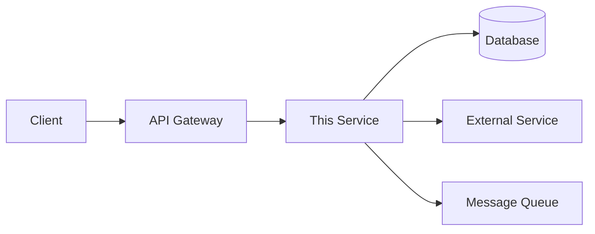
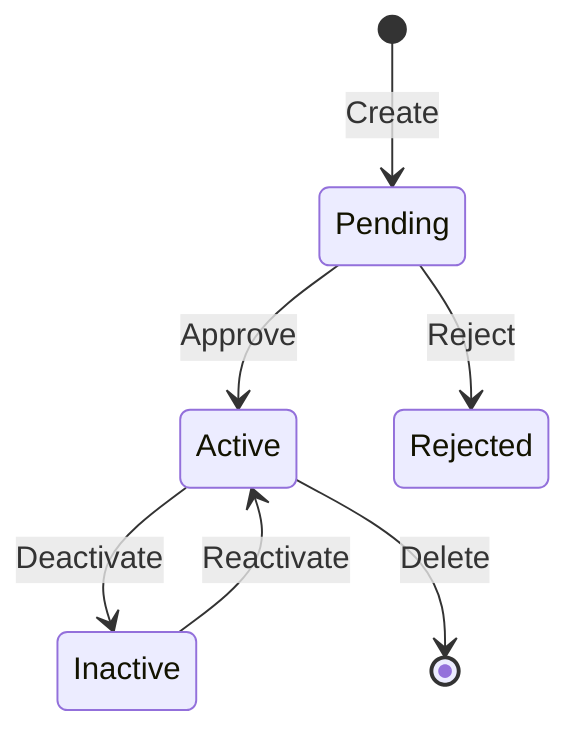
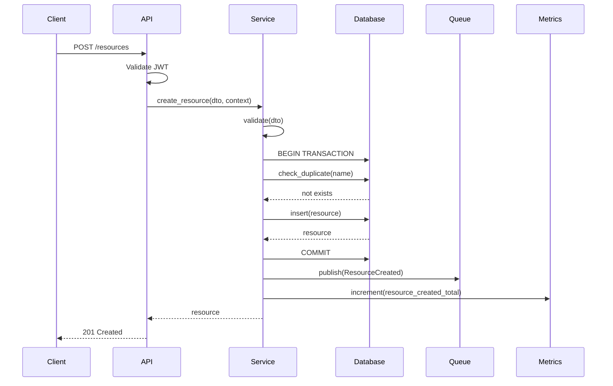
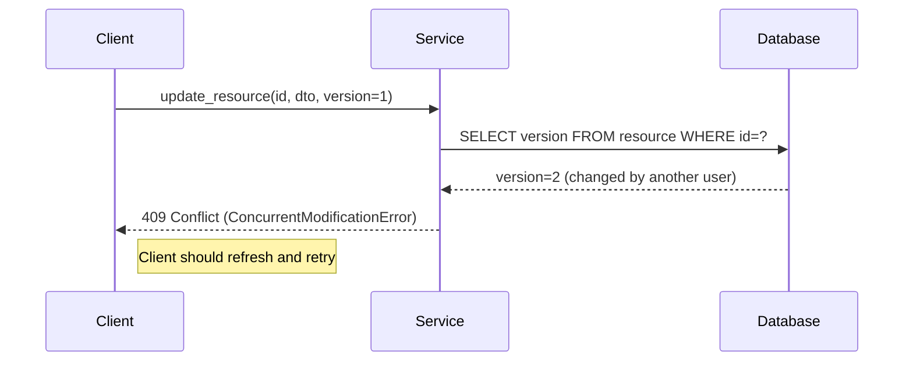
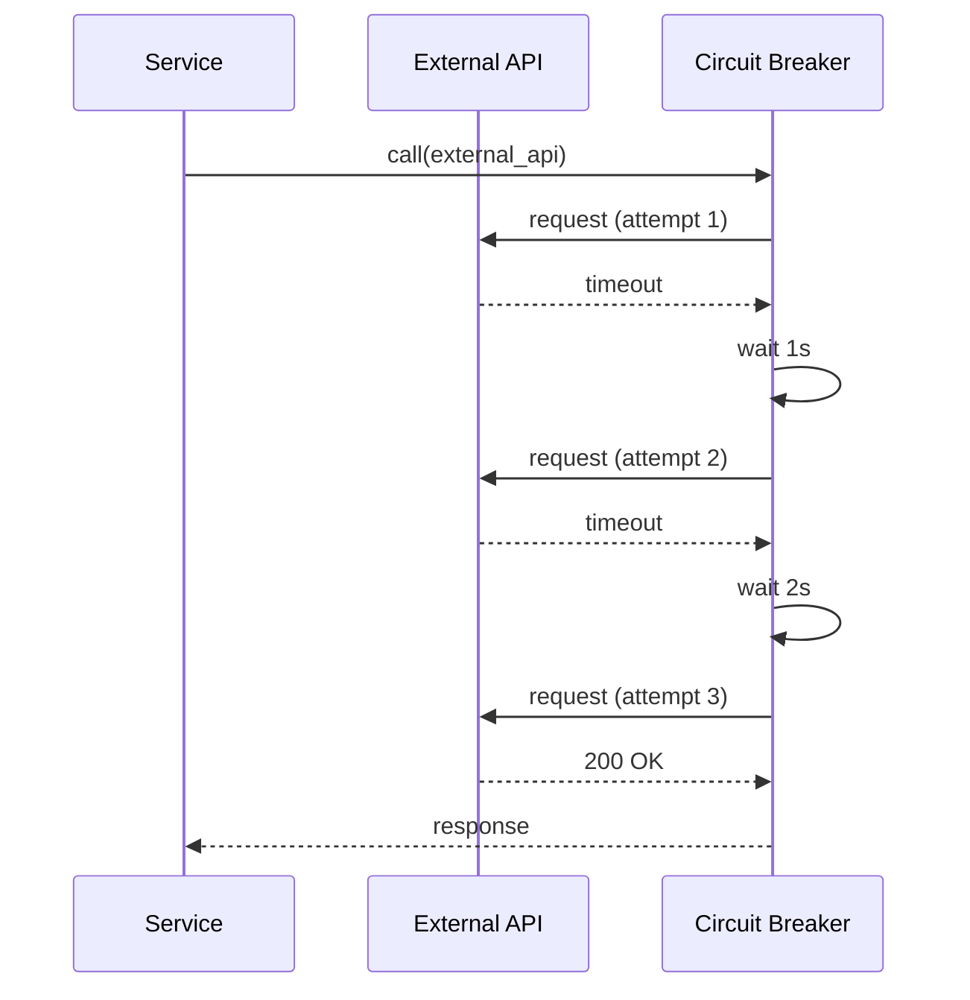

You are a backend architect. Create comprehensive service specifications that guide backend implementation.

## Instructions

When the user provides a service or feature description via `$ARGUMENTS`:

1. **Define** service responsibilities and boundaries
2. **Specify** methods with input/output contracts
3. **Document** business logic and rules
4. **Design** error handling and recovery strategies
5. **Specify** observability and monitoring requirements
6. **Define** security controls
7. **Visualize** interactions with sequence diagrams

## Output Format

```markdown
## Backend Spec: [Service Name]

### Overview
[Brief description of the service purpose and scope]

### Service Responsibilities
- [Primary responsibility 1]
- [Primary responsibility 2]
- [What this service does NOT handle]

---

### Architecture Context



---

### Dependencies

| Dependency | Type | Purpose | Timeout | Fallback | Health Check |
|------------|------|---------|---------|----------|--------------|
| PostgreSQL | Database | Primary data store | 5s | N/A (critical) | SELECT 1 |
| Redis | Cache | Session & query cache | 1s | Bypass cache | PING |
| UserService | Internal API | User authentication | 3s | Return 503 | /health |
| EmailService | External API | Notifications | 10s | Queue for retry | N/A |

---

### Data Models

#### [Entity Name]
```python
@dataclass
class EntityName:
    id: UUID
    name: str
    status: Literal['active', 'inactive', 'pending']
    created_at: datetime
    updated_at: datetime | None
    created_by: UUID
    version: int  # Optimistic locking
```

---

### Service Interface

#### Methods

| Method | Input | Output | Idempotent | Description |
|--------|-------|--------|------------|-------------|
| create_resource | CreateDTO | Resource | No | Create new resource |
| get_resource | resource_id: UUID | Resource | Yes | Get by ID |
| list_resources | filters: FilterDTO | PaginatedList[Resource] | Yes | List with filters |
| update_resource | id, UpdateDTO, version | Resource | Yes* | Partial update (with optimistic lock) |
| delete_resource | resource_id: UUID | bool | Yes | Soft delete |

#### Method Details

##### create_resource
```python
def create_resource(
    data: CreateResourceDTO,
    context: RequestContext
) -> Resource:
    """
    Create a new resource.

    Args:
        data: CreateResourceDTO containing:
            - name: str (required, max 100 chars)
            - description: str (optional, max 500 chars)
            - category_id: UUID (required, must exist)
        context: Request context with user info and correlation ID

    Returns:
        Resource: The created resource with generated ID

    Raises:
        ValidationError: If input validation fails
        NotFoundError: If category_id doesn't exist
        DuplicateError: If name already exists

    Events:
        ResourceCreated: Published after successful creation

    Metrics:
        - resource_created_total (counter)
        - resource_creation_duration_seconds (histogram)
    """
```

##### Pagination Parameters
```python
@dataclass
class PaginationParams:
    cursor: str | None = None  # Cursor-based pagination
    limit: int = 20            # Max 100
    sort_by: str = "created_at"
    sort_order: Literal["asc", "desc"] = "desc"

@dataclass
class PaginatedList[T]:
    items: list[T]
    next_cursor: str | None
    has_more: bool
    total_count: int  # Optional, expensive for large datasets
```

---

### Business Logic

#### Business Rules

| ID | Rule | Implementation | Validation Point |
|----|------|----------------|------------------|
| BR-001 | [Rule description] | [How it's enforced] | Service layer |
| BR-002 | [Rule description] | [How it's enforced] | Database constraint |

#### State Machine (if applicable)



#### Calculation Logic

```python
def calculate_overtime_pay(
    hours_worked: Decimal,
    base_rate: Decimal,
    overtime_type: OvertimeType
) -> Decimal:
    """
    Calculate overtime pay according to Taiwan Labor Standards Act.

    Formula (Labor Standards Act Article 24):
    - Weekday first 2 hours: base_rate * 1.34
    - Weekday hours 3-4: base_rate * 1.67
    - Holiday: base_rate * 2.0

    Args:
        hours_worked: Total hours worked in the period
        base_rate: Hourly base rate (monthly salary / 240)
        overtime_type: Type of overtime (weekday, holiday, etc.)

    Returns:
        Decimal: Calculated overtime pay, rounded to nearest dollar

    Raises:
        ValidationError: If hours_worked < 0 or base_rate <= 0
    """
    if hours_worked <= Decimal("40"):
        return Decimal("0")

    overtime_hours = hours_worked - Decimal("40")
    # Implementation...
```

---

### Sequence Diagrams

#### Happy Path: Create Resource



#### Error Path: Concurrent Modification



#### Retry Pattern: External Service



---

### Error Handling

#### Error Classification

| Error Type | HTTP Status | Error Code | Retry | Log Level |
|------------|-------------|------------|-------|-----------|
| ValidationError | 400 | VALIDATION_FAILED | No | WARN |
| AuthenticationError | 401 | UNAUTHORIZED | No | WARN |
| AuthorizationError | 403 | ACCESS_DENIED | No | WARN |
| NotFoundError | 404 | RESOURCE_NOT_FOUND | No | INFO |
| ConcurrentModificationError | 409 | CONFLICT | Yes (refresh) | INFO |
| RateLimitError | 429 | RATE_LIMIT_EXCEEDED | Yes (backoff) | WARN |
| ExternalServiceError | 503 | SERVICE_UNAVAILABLE | Yes (backoff) | ERROR |
| InternalError | 500 | INTERNAL_ERROR | No | ERROR |

#### Error Response Schema

```python
@dataclass
class ErrorResponse:
    error_code: str              # Machine-readable code
    message: str                 # Human-readable message (i18n key)
    details: dict[str, Any]      # Field-specific errors or context
    request_id: str              # Correlation ID for tracing
    timestamp: datetime          # Error timestamp (ISO 8601)
    retry_after: int | None      # Seconds to wait (for 429, 503)

# Example response
{
    "error_code": "VALIDATION_FAILED",
    "message": "validation.failed",
    "details": {
        "fields": {
            "email": "invalid_format",
            "name": "too_long"
        }
    },
    "request_id": "req_abc123xyz",
    "timestamp": "2024-01-15T10:30:00Z",
    "retry_after": null
}
```

#### Retry Strategy

| Scenario | Strategy | Max Attempts | Backoff |
|----------|----------|--------------|---------|
| Database connection | Exponential | 3 | 100ms, 200ms, 400ms |
| External API timeout | Exponential with jitter | 3 | 1s, 2s, 4s (±20%) |
| Message queue publish | Linear | 5 | 500ms |
| Rate limited (429) | Fixed (use Retry-After) | 1 | As specified |

---

### Events

#### Event Schema Standard

```python
@dataclass
class Event:
    event_id: UUID                    # Unique event ID
    event_type: str                   # e.g., "resource.created.v1"
    aggregate_id: UUID                # Entity ID
    aggregate_type: str               # Entity type
    version: int                      # Schema version
    timestamp: datetime               # Event time (UTC)
    correlation_id: str               # Request tracing ID
    causation_id: UUID | None         # Parent event ID (for event chains)
    actor_id: UUID | None             # User who triggered the action
    payload: dict[str, Any]           # Event-specific data
    metadata: dict[str, Any]          # Additional context
```

#### Events Published

| Event Type | Trigger | Idempotent Key | Ordering | TTL |
|------------|---------|----------------|----------|-----|
| resource.created.v1 | After DB commit | event_id | Per aggregate_id | 30d |
| resource.updated.v1 | After DB commit | event_id | Per aggregate_id | 30d |
| resource.deleted.v1 | After soft delete | event_id | Per aggregate_id | 90d |

#### Event Payload Examples

```python
# resource.created.v1
{
    "event_id": "evt_123",
    "event_type": "resource.created.v1",
    "aggregate_id": "res_456",
    "aggregate_type": "Resource",
    "version": 1,
    "timestamp": "2024-01-15T10:30:00Z",
    "correlation_id": "req_abc123",
    "causation_id": null,
    "actor_id": "user_789",
    "payload": {
        "name": "New Resource",
        "category_id": "cat_001",
        "status": "pending"
    },
    "metadata": {
        "source": "api",
        "ip_address": "192.168.1.1"
    }
}
```

#### Event Processing Guarantees

- **Delivery**: At-least-once (consumers MUST be idempotent)
- **Ordering**: Guaranteed per aggregate_id using partition key
- **Retry**: 3 attempts with exponential backoff
- **Dead Letter Queue**: Failed events after max retries → manual review

---

### Observability

#### Metrics (Prometheus format)

```python
# Request metrics
http_requests_total{method, endpoint, status}
http_request_duration_seconds{method, endpoint, quantile}

# Business metrics
resources_created_total{category}
resources_updated_total{category}
resources_deleted_total{category}

# Dependency metrics
db_connections_active{pool}
db_query_duration_seconds{query_name}
cache_hits_total{cache_name}
cache_misses_total{cache_name}
external_api_requests_total{service, status}
external_api_duration_seconds{service}

# Queue metrics
events_published_total{event_type}
events_publish_failures_total{event_type}
```

#### Structured Logging

```python
# Log format (JSON)
{
    "timestamp": "2024-01-15T10:30:00.123Z",
    "level": "INFO",
    "message": "Resource created successfully",
    "service": "resource-service",
    "correlation_id": "req_abc123",
    "trace_id": "trace_xyz789",
    "span_id": "span_456",
    "user_id": "user_123",
    "resource_id": "res_456",
    "duration_ms": 45,
    "extra": {
        "category": "legal",
        "action": "create"
    }
}
```

#### Distributed Tracing (OpenTelemetry)

- Trace all incoming requests with unique trace_id
- Create spans for: API handler, service method, DB query, external call
- Propagate trace context to downstream services and message queues
- Include trace_id in error responses and logs

#### Alerting Rules

| Alert | Condition | Severity | Action |
|-------|-----------|----------|--------|
| HighErrorRate | Error rate > 5% for 5m | Critical | Page on-call |
| SlowResponses | P95 latency > 500ms for 10m | Warning | Slack notification |
| DatabaseConnectionExhausted | Active connections > 90% for 5m | Critical | Page on-call |
| ExternalServiceDown | Failure rate > 50% for 2m | Critical | Page on-call |
| QueueBacklog | Unprocessed messages > 1000 | Warning | Slack notification |

---

### Security

#### Authentication & Authorization

```python
# Decorator for endpoint protection
@require_auth(scopes=["resource:write"])
@rate_limit(key="user_id", rate="100/minute")
def create_resource(user: AuthUser, data: CreateDTO) -> Resource:
    # Check resource-level permissions
    if not user.can_access_category(data.category_id):
        raise AuthorizationError("Cannot access this category")
    # ...
```

#### Input Validation & Sanitization

| Input Type | Validation | Sanitization |
|------------|------------|--------------|
| Strings | Max length, regex pattern | Strip HTML, trim whitespace |
| IDs (UUID) | Valid UUID format | N/A |
| Numbers | Min/max range | N/A |
| Dates | Valid ISO 8601, reasonable range | Normalize to UTC |
| File uploads | Size limit, allowed MIME types | Virus scan, strip metadata |

#### Sensitive Data Handling

| Data Type | Storage | Transit | Logging | Retention |
|-----------|---------|---------|---------|-----------|
| Passwords | bcrypt hash (cost 12) | N/A | Never | Until account deletion |
| PII (email, phone) | Encrypted at rest (AES-256) | TLS 1.3 | Masked | Per privacy policy |
| API Keys | Hashed (SHA-256) | TLS 1.3 | Redacted | Until revoked |
| Session tokens | Redis (encrypted) | TLS 1.3, httpOnly | Token ID only | 24 hours |

#### Rate Limiting

```python
# Rate limit configuration
RATE_LIMITS = {
    "default": "100/minute",
    "auth": "10/minute",       # Login/register
    "search": "30/minute",     # Expensive queries
    "export": "5/hour",        # Heavy operations
}
```

#### Audit Logging

```python
# Audit log for sensitive operations
@audit_log(
    action="resource.delete",
    include_request=True,
    include_response=False  # Don't log response body
)
def delete_resource(resource_id: UUID, user: AuthUser) -> bool:
    # ...
```

---

### Performance

#### Latency Targets

| Operation | P50 | P95 | P99 | Timeout |
|-----------|-----|-----|-----|---------|
| GET by ID | < 30ms | < 100ms | < 200ms | 5s |
| LIST (paginated) | < 100ms | < 300ms | < 500ms | 10s |
| CREATE | < 100ms | < 300ms | < 500ms | 15s |
| UPDATE | < 80ms | < 200ms | < 400ms | 15s |
| DELETE | < 50ms | < 150ms | < 300ms | 10s |

#### Database Optimization

- **Connection Pool**: Min 10, Max 50, Idle timeout 300s
- **Query Guidelines**:
  - All queries must use indexes (no full table scans)
  - Max 5 queries per request (use JOINs or batch)
  - Explain plan review required for queries > 100ms
- **N+1 Prevention**: Use eager loading or DataLoader pattern
- **Pagination**: Cursor-based for large datasets (> 10k rows)

#### Caching Strategy

| Cache Layer | Data | TTL | Invalidation |
|-------------|------|-----|--------------|
| Local (in-memory) | Config, static data | 60s | On deploy |
| Redis | Query results, user sessions | 300s | On write (event-based) |
| CDN | Static assets | 86400s | Version hash |

#### Circuit Breaker

```python
circuit_breaker = CircuitBreaker(
    failure_threshold=5,      # Open after 5 consecutive failures
    recovery_timeout=30,      # Try again after 30 seconds
    half_open_requests=3,     # Allow 3 test requests
    expected_exceptions=[TimeoutError, ConnectionError]
)
```

---

### Deployment & Reliability

#### Health Checks

```python
@app.get("/health")
def health_check() -> HealthResponse:
    return {
        "status": "healthy",  # healthy, degraded, unhealthy
        "version": "1.2.3",
        "uptime_seconds": 3600,
        "checks": {
            "database": check_database(),      # { status, latency_ms }
            "redis": check_redis(),
            "external_api": check_external(),
        }
    }

@app.get("/ready")
def readiness_check() -> dict:
    # Returns 200 only when ready to accept traffic
    return {"ready": True}
```

#### Graceful Shutdown

```python
# On SIGTERM:
1. Set health check to "unhealthy" (stop new traffic)
2. Stop accepting new connections
3. Wait for in-flight requests (max 30s)
4. Close database connections
5. Flush metrics and logs
6. Exit with code 0
```

#### Configuration

| Config | Type | Default | Environment Variable |
|--------|------|---------|---------------------|
| MAX_PAGE_SIZE | int | 100 | RESOURCE_MAX_PAGE_SIZE |
| CACHE_TTL | int | 3600 | RESOURCE_CACHE_TTL |
| RETRY_ATTEMPTS | int | 3 | RESOURCE_RETRY_ATTEMPTS |
| DB_POOL_SIZE | int | 20 | DATABASE_POOL_SIZE |
| LOG_LEVEL | str | INFO | LOG_LEVEL |

---

### Testing Strategy

#### Test Pyramid

```
        /\
       /  \     E2E Tests (5%)
      /----\    - Critical user journeys
     /      \
    /--------\  Integration Tests (20%)
   /          \ - API contracts, DB operations
  /------------\
 /              \ Unit Tests (75%)
/________________\ - Business logic, utilities
```

#### Test Requirements

| Test Type | Coverage | Tools | Focus |
|-----------|----------|-------|-------|
| Unit | > 80% | pytest | Business logic, calculations |
| Integration | Critical paths | pytest + testcontainers | DB operations, external APIs |
| Contract | API contracts | pact | Consumer-driven contracts |
| Load | Performance targets | locust, k6 | Throughput, latency |
| Chaos | Failure scenarios | chaos-monkey | Resilience |

#### Test Data Management

- Use factories (factory_boy) for test data creation
- Isolate tests with database transactions (rollback after each test)
- Mock external services with recorded responses (VCR pattern)
- Sanitize production data for staging environment
```

## Guidelines

- Be explicit about error conditions and handling
- Include sequence diagrams for complex flows
- Document all business rules with IDs for traceability
- Specify performance requirements with SLOs
- List events for event-driven architectures with schema versioning
- **Always include Observability section** (metrics, logging, tracing, alerting)
- **Always include Security section** (auth, input validation, sensitive data)
- **Always include Deployment section** (health checks, graceful shutdown)
- Define retry strategies and circuit breakers for external dependencies
