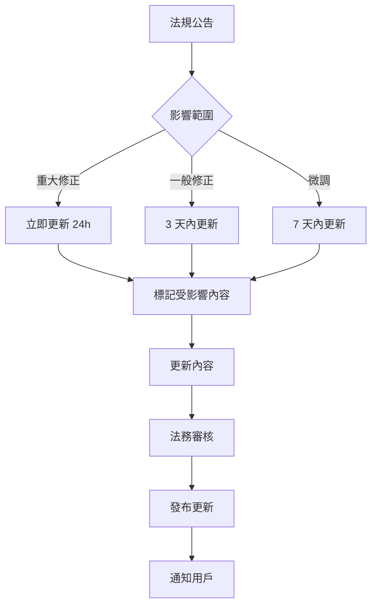

# 法律內容撰寫指南

## 目的

本指南規範如何將台灣勞動法規轉化為易懂的用戶內容，確保準確性與可讀性的平衡。

---

## 核心原則

### 1. 準確性優先 (Accuracy First)
- ✅ 永遠優先確保法律資訊正確
- ✅ 有疑問時保留法律原文
- ✅ 明確標示資訊來源與更新日期
- ❌ 絕不為了簡化而犧牲準確性

### 2. 可讀性第二 (Readability Second)
- ✅ 在不損準確性前提下盡可能簡化
- ✅ 目標讀者：國小六年級閱讀程度
- ✅ 使用日常用語取代法律術語

### 3. 可追溯性 (Traceability)
- ✅ 所有陳述必須可追溯到法條或官方解釋
- ✅ 提供法條完整編號（法規名稱 + 第 X 條）
- ✅ 附上官方連結

---

## 白話文轉換原則

### 原則 1: 從用戶角度出發

**❌ 法條原文**
```
勞工繼續工作四小時，至少應有三十分鐘之休息。
```

**✅ 白話文版本**
```
您連續工作 4 小時後，至少要有 30 分鐘的休息時間。
這是法律保障您的權益，老闆不能要求您連續工作超過 4 小時。
```

**說明**
- 使用「您」而非「勞工」
- 說明「為什麼」（保障權益）
- 增加實際應用情境（老闆不能...）

---

### 原則 2: 使用主動語態

**❌ 被動語態**
```
勞工之工資應由僱主直接給付，不得使用他人代領。
```

**✅ 主動語態**
```
老闆必須直接把薪水給您本人，不能透過其他人轉交。
```

---

### 原則 3: 具體化與範例化

**❌ 抽象描述**
```
延長工作時間之工資，應按平日每小時工資額加給三分之一以上。
```

**✅ 具體說明 + 範例**
```
加班費怎麼算？

平日加班（前 2 小時）：
- 公式：時薪 × 1.34 倍
- 範例：時薪 200 元 → 加班費 268 元/小時

平日加班（第 3-4 小時）：
- 公式：時薪 × 1.67 倍
- 範例：時薪 200 元 → 加班費 334 元/小時

💡 小提醒：週六加班前 8 小時是 1.34 倍，第 9 小時開始是 1.67 倍。
```

---

### 原則 4: 分層呈現資訊

每個法律問題的回答應包含以下層級：

```markdown
## 📋 您的問題：[用戶問題]

### ✅ 直接回答（30 字內）
簡潔明確的答案，類似新聞標題。

### 📖 詳細說明（200-300 字）
白話文解釋，包含：
- 為什麼有這個規定
- 適用情況
- 具體範例
- 常見誤解

### 📜 法條依據（可展開）
<details>
<summary>查看完整法條</summary>

**勞動基準法第 24 條**
> [完整法條原文]

**官方連結**：[全國法規資料庫連結]
</details>

### 💼 實際案例（可展開，如有）
<details>
<summary>查看相關案例</summary>

- 案例來源：[勞動部 / 法院判決]
- 情境描述
- 判決結果
</details>

### 🎯 您可以這樣做
1. [具體行動步驟 1]
2. [具體行動步驟 2]
3. [具體行動步驟 3]

### ⚠️ 注意事項
- [特殊情況說明]
- [常見陷阱]

### 📞 需要協助？
- 1955 勞工諮詢專線
- [各縣市勞工局連結]

---

**📊 資訊來源**
- 法規：勞動基準法第 X 條
- 更新日期：2026-01-15
- 資料來源：勞動部

**⚖️ 法律聲明**
本資訊僅供參考，不構成法律建議。具體案件請諮詢專業律師。
```

---

## 術語轉換對照表

| 法律術語 | 白話文 | 使用時機 |
|---------|--------|---------|
| 勞工 | 您、員工、工作者 | 一般說明 |
| 僱主 | 老闆、公司、雇主 | 一般說明 |
| 勞動契約 | 工作合約、聘僱合約 | 一般說明 |
| 工資 | 薪水、薪資 | 一般說明 |
| 延長工作時間 | 加班 | 一般說明 |
| 特別休假 | 特休、年假 | 一般說明 |
| 終止勞動契約 | 離職、解雇 | 視情況區分 |
| 資遣 | 非自願離職、被裁員 | 需說明與「解雇」差異 |
| 職業災害 | 職災、工作受傷 | 一般說明 |
| 勞資爭議 | 勞資糾紛、勞資問題 | 一般說明 |

**使用規則**
1. 第一次出現法律術語時，附註白話文解釋
2. 後續使用白話文，必要時括號註明法律術語
3. 正式引用法條時使用法律術語

**範例**
```
特別休假（俗稱「特休」或「年假」）是您工作滿一定期間後，
法律保障您可以請的有薪假。
```

---

## 數字與單位規範

### 時間
- ✅ 使用「小時」不用「時」
- ✅ 使用「天」不用「日」
- ✅ 範例：「8 小時」「7 天」

### 金額
- ✅ 使用「元」不用「圓」
- ✅ 千分位加逗號
- ✅ 範例：「25,250 元」

### 百分比
- ✅ 優先使用「倍數」而非百分比
- ✅ 範例：「1.34 倍」優於「加給 33.3%」

---

## 情境式內容架構

### 薪資類問題範本

```markdown
## 您的問題：[具體問題]

### ✅ 直接回答
[30 字內簡答]

### 📖 詳細說明

**法律規定**
- [白話文法律說明]

**計算方式**
1. 步驟一：[說明]
2. 步驟二：[說明]

**實際範例**
假設您的月薪是 30,000 元：
- 時薪 = 30,000 ÷ 240 = 125 元
- 平日加班費 = 125 × 1.34 = 168 元/小時

**常見誤解**
❌ 錯誤：[常見錯誤觀念]
✅ 正確：[正確說明]

### 🎯 您可以這樣做
1. [行動步驟]
2. [證據收集]
3. [申訴管道]

### 📜 法條依據
[可展開的完整法條]
```

### 權益受損類問題範本

```markdown
## 您的問題：[具體問題]

### ⚠️ 緊急提醒
如果您正面臨緊急情況，請立即撥打：
- 📞 1955 勞工諮詢專線（24 小時）
- 📞 110 報警（如涉及人身安全）

### ✅ 這樣做是否違法？
[明確判斷：合法/違法/視情況而定]

### 📖 法律規定
[白話文說明]

### 🎯 保護自己的步驟

**立即行動**
1. [緊急應對措施]
2. [證據保全方法]

**後續處理**
3. [申訴管道]
4. [法律資源]

**需要準備的證據**
- [證據清單 1]
- [證據清單 2]

### 📞 可以協助您的單位
- 勞工局：[連結]
- 法律扶助基金會：[連結]
- 勞工團體：[連結]

### 📜 法條依據
[完整法條]
```

---

## 免責聲明規範

### 位置要求
1. **首頁**：明顯位置顯示系統性質
2. **每次回答**：頁尾附上簡短聲明
3. **複雜案件**：加強警示建議諮詢專業

### 標準免責聲明

**完整版（首次使用、關於頁面）**
```
⚖️ 重要聲明

本系統是「勞動法律資訊查詢工具」，提供一般性法律知識參考。

✅ 我們提供什麼：
- 勞動法規的白話文說明
- 常見問題的一般性解答
- 法條引用與官方資料連結

❌ 我們不提供什麼：
- 個案的專業法律建議
- 法律文件的撰寫或審核
- 訴訟代理或法律服務

⚠️ 請注意：
- 每個案件情況不同，本系統回答僅供參考
- 重要決定前請諮詢專業律師
- 我們盡力確保資訊準確，但不保證完全無誤
- 如您因使用本系統資訊而產生損失，本系統不負法律責任

📞 需要專業協助？
- 法律扶助基金會：[連結]
- 各地律師公會：[連結]
```

**簡短版（每次回答頁尾）**
```
⚖️ 本資訊僅供參考，不構成法律建議。具體案件請諮詢專業律師。
📅 資料更新：2026-01-15 ｜ 📊 信心度：高
```

**加強警示版（複雜案件）**
```
⚠️ 這是複雜的法律問題

您的情況可能涉及：
- [複雜因素 1]
- [複雜因素 2]

強烈建議您：
1. 保全相關證據
2. 盡快諮詢專業律師
3. 不要僅依賴本系統資訊做出重大決定

📞 免費法律諮詢：
- 法律扶助基金會：[電話/連結]
```

---

## 信心度標示規範

每個 AI 生成回答必須標示信心度：

| 信心度 | 圖示 | 條件 | 說明 |
|--------|-----|------|------|
| **高** | 🟢 | RAG 找到明確法條 + 問題常見 | 「此答案有明確法律依據」 |
| **中** | 🟡 | RAG 找到相關法條但需推論 | 「此答案根據法律推論，建議進一步確認」 |
| **低** | 🟠 | 僅找到部分相關資訊 | 「資訊有限，強烈建議諮詢專業人士」 |
| **無法回答** | 🔴 | 超出系統範圍 | 「此問題超出系統能力，請諮詢律師」 |

**範例**
```
📊 信心度：🟢 高
✓ 有明確法條依據（勞基法第 24 條）
✓ 勞動部有官方解釋
✓ 此為常見問題

📊 信心度：🟡 中
! 法條適用需視個案情況而定
! 建議收集證據後諮詢勞工局

📊 信心度：🔴 無法回答
✗ 此問題涉及複雜法律判斷
✗ 請立即諮詢專業律師
📞 法律扶助專線：02-xxxx-xxxx
```

---

## 內容品質檢查表

每篇內容發布前必須通過以下檢查：

### 準確性檢查
- [ ] 所有法條引用正確（條號、內容）
- [ ] 有提供官方來源連結
- [ ] 數字計算經過驗證
- [ ] 無過時資訊（檢查法規最新版本）
- [ ] 有標示資料更新日期

### 可讀性檢查
- [ ] 符合國小六年級閱讀程度
- [ ] 無過長句子（建議 < 30 字）
- [ ] 有使用白話文術語
- [ ] 有提供具體範例
- [ ] 段落分明（一段一重點）

### 完整性檢查
- [ ] 有「直接回答」區塊
- [ ] 有「詳細說明」區塊
- [ ] 有「法條依據」（可展開）
- [ ] 有「行動指南」（如適用）
- [ ] 有免責聲明
- [ ] 有信心度標示

### 使用者體驗檢查
- [ ] 標題清楚（用戶能理解在看什麼）
- [ ] 有視覺層級（標題、粗體、清單）
- [ ] 重要資訊有標記（✅ ❌ ⚠️）
- [ ] 有「下一步行動」指引
- [ ] 有相關問題連結（如適用）

---

## 更新與維護

### 法規更新流程



### 版本控制
- 每次更新必須記錄在內容的 Metadata
- 保留修改歷史（Git）
- 重大變更發布更新通知

---

## 附錄：常見問題處理指南

### A. 法條衝突或不明確時
```
當法條解釋有爭議時，應：
1. 列出不同解釋觀點
2. 說明各方依據
3. 標註「此問題有不同見解」
4. 建議諮詢勞工局或律師
5. 提供勞動部官方解釋函（如有）
```

### B. 個案性問題
```
當問題高度個案化時：
1. 不提供確定性答案
2. 說明一般原則
3. 列出需要考量的因素
4. 強烈建議專業諮詢
5. 提供諮詢管道連結
```

### C. 緊急危險情況
```
偵測到以下關鍵字時：
- 「今天被解雇」
- 「職災」
- 「威脅」
- 「暴力」

立即顯示：
⚠️ 緊急協助
📞 1955 勞工諮詢專線
📞 110 報警（如涉及人身安全）
```

---

**文件版本**：v1.0
**更新日期**：2026-02-02
**負責人**：Content Team
**審核者**：Legal Team
