# Wireframes & Interaction Flows

## Document Metadata

| Field | Value |
|-------|-------|
| **Version** | v1.0 |
| **Created** | 2026-02-13 |
| **Last Updated** | 2026-02-13 |
| **Status** | Draft |
| **Owner** | UX/UI Designer |
| **Reviewers** | Product Owner, Frontend Developer, Accessibility Specialist |
| **Design System** | [PRD Appendix I: Visual Design System](../prd/README.md#appendix-i-visual-design-system) |

---

## Table of Contents

1. [Design System Summary](#1-design-system-summary)
2. [Site Map](#2-site-map)
3. [Core Page Wireframes](#3-core-page-wireframes)
4. [Key Interaction Flows](#4-key-interaction-flows)
5. [Responsive Breakpoints](#5-responsive-breakpoints)
6. [Cross-References](#6-cross-references)

---

## 1. Design System Summary

> Full design system specification: [PRD Appendix I](../prd/README.md#appendix-i-visual-design-system)

| Element | Specification |
|---------|--------------|
| **Primary color** | Professional Teal `#00A896` |
| **Secondary color** | Warm Orange `#FF9800` |
| **AI accent** | Purple `#9C27B0` |
| **Font family** | Noto Sans TC, -apple-system, Microsoft JhengHei |
| **Body text** | 16px Regular, line-height 1.6 |
| **Border radius** | Cards: 12px, Buttons: 8px, Chat bubbles: 18px |
| **Touch targets** | Minimum 44px (mobile: 48px) |
| **Contrast** | All text >= 4.5:1 (WCAG 2.1 AA) |

---

## 2. Site Map

Reference: [PRD SS7 Information Architecture](../prd/README.md#7-information-architecture)

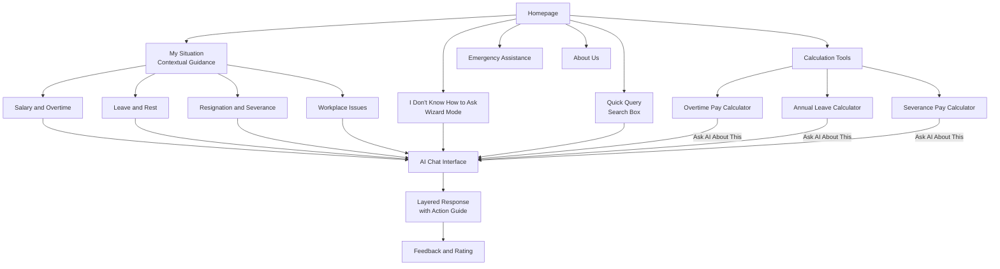

---

## 3. Core Page Wireframes

### 3.1 Homepage - Identity Selection

Source: [Epic 01 M-01](../prd/epics/01-chat-interface.md)

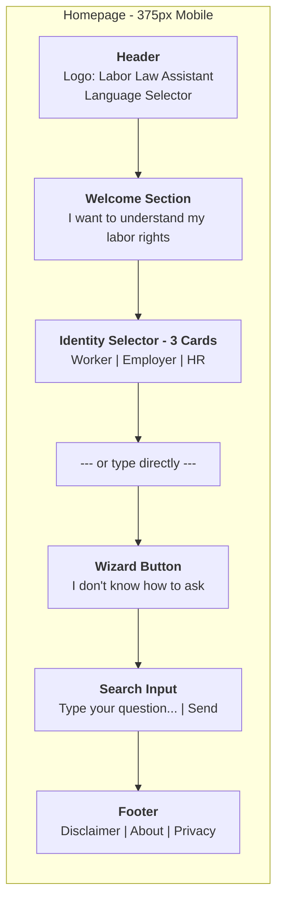

**Key interactions**:
- Identity selection is optional (can skip to free-form input)
- Selecting an identity shows scenario templates (salary, leave, resignation, etc.)
- Each scenario provides 5-10 clickable question templates

---

### 3.2 Chat Interface

Source: [Epic 01 M-05](../prd/epics/01-chat-interface.md)

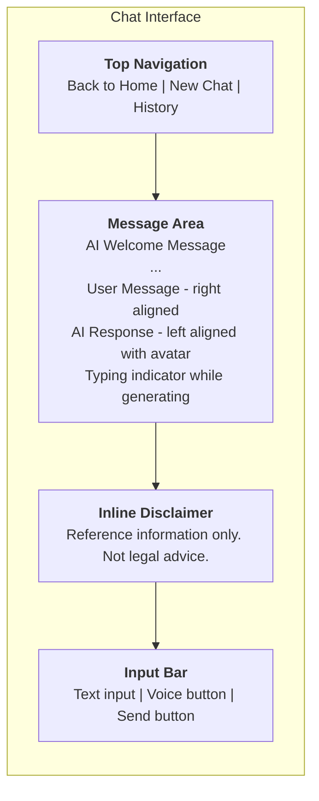

**Key interactions**:
- Streaming text generation (token-by-token)
- Auto-scroll to latest message
- Input auto-focuses on page load
- Enter key submits, Shift+Enter for newline

---

### 3.3 Layered Information Response

Source: [Epic 01 M-03](../prd/epics/01-chat-interface.md)

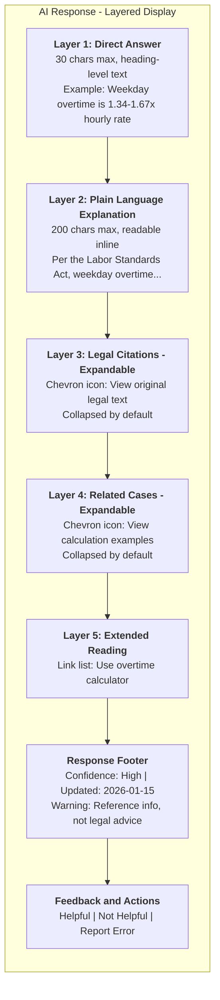

**Key interactions**:
- Expand/collapse animation < 300ms
- Expand/collapse state persists during session
- Confidence indicator color-coded: High (green), Medium (orange), Low (red)

---

### 3.4 Wizard Mode

Source: [Epic 01 M-15](../prd/epics/01-chat-interface.md)

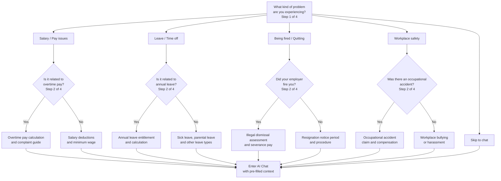

**Key interactions**:
- Maximum 5 questions to reach a result
- Progress indicator: "Step 2 of 4"
- Back button to revise previous answers
- Exit to free-form input at any time

---

### 3.5 Emergency Assistance Panel

Source: [Epic 04 M-10](../prd/epics/04-action-guide-emergency.md)

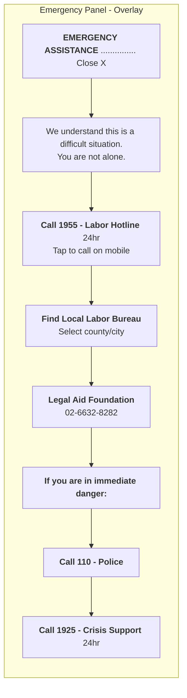

**Key interactions**:
- Overlays the AI response (does not replace it)
- Dismissible with X button, re-accessible via persistent button
- Self-harm keywords trigger crisis resources BEFORE legal content
- One-tap call on mobile devices

---

### 3.6 Action Guide

Source: [Epic 04 M-06](../prd/epics/04-action-guide-emergency.md)

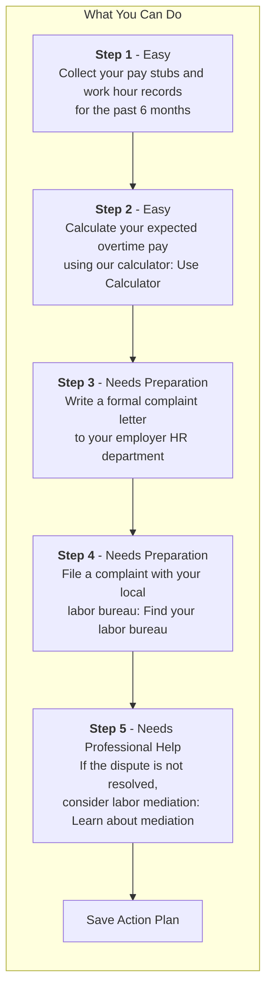

**Key interactions**:
- Each step labeled with difficulty: Easy / Needs Preparation / Needs Professional Help
- Steps tailored to user identity (worker vs employer vs HR)
- "Save action plan" saves to conversation history
- Safety assessment for sensitive scenarios (harassment/violence)

---

### 3.7 Legal Citation Display

Source: [Epic 02 M-04](../prd/epics/02-rag-legal-search.md)

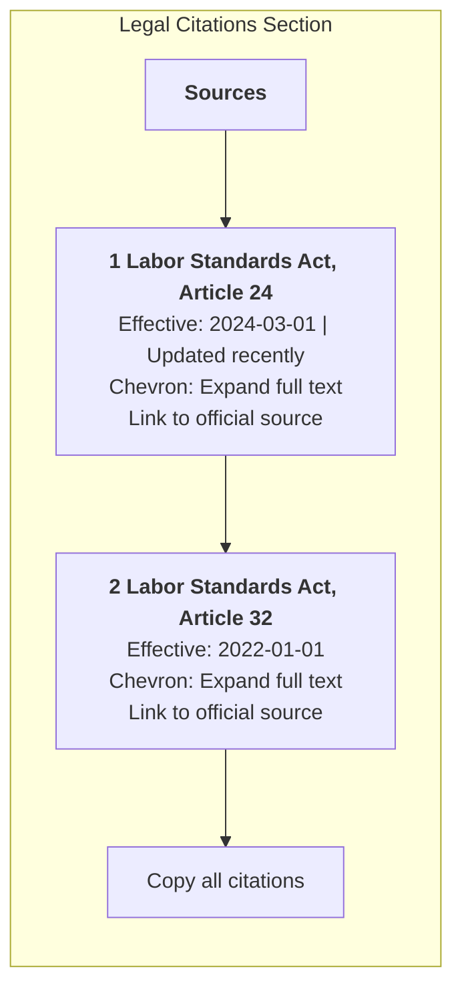

**Key interactions**:
- Click to expand full article text inline
- Each citation links to official law.moj.gov.tw
- "Recently updated" badge for recently amended articles
- Copy citation button for HR users

---

### 3.8 Feedback Rating

Source: [Epic 03 M-09](../prd/epics/03-response-quality.md)

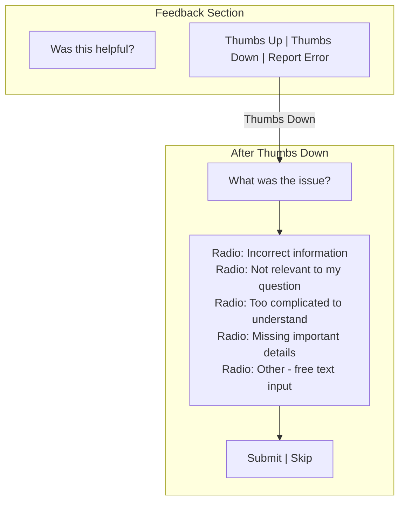

---

### 3.9 Overtime Pay Calculator

Source: [Epic 06 S-03a](../prd/epics/06-calculation-tools.md)

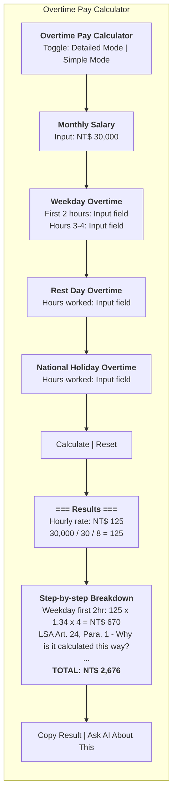

---

### 3.10 Annual Leave Calculator

Source: [Epic 06 S-03b](../prd/epics/06-calculation-tools.md)

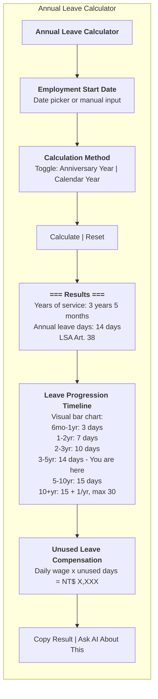

---

### 3.11 Severance Pay Calculator

Source: [Epic 06 S-03c](../prd/epics/06-calculation-tools.md)

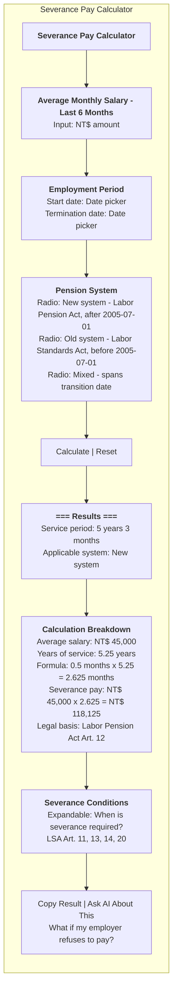

---

## 4. Key Interaction Flows

### 4.1 First-Time User Onboarding

Reference: [PRD Appendix H](../prd/README.md#appendix-h-user-onboarding-strategy)

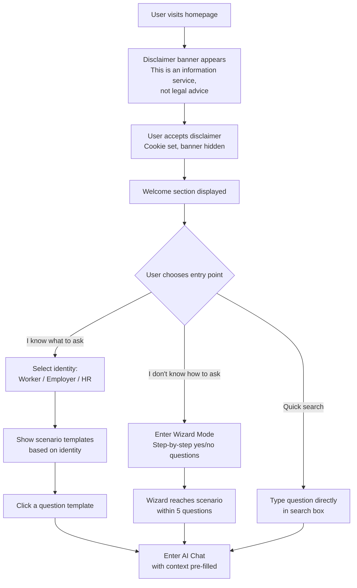

---

### 4.2 Complete Query Flow

Reference: [Epic 01 M-05](../prd/epics/01-chat-interface.md), [Epic 02 M-02](../prd/epics/02-rag-legal-search.md)

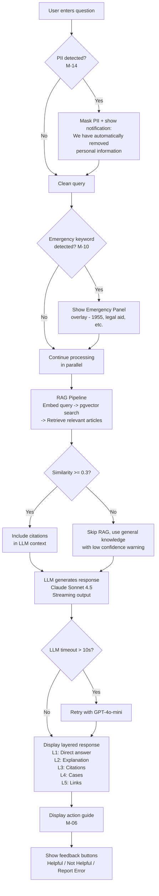

---

### 4.3 Emergency Query Flow

Reference: [Epic 04 M-10](../prd/epics/04-action-guide-emergency.md)

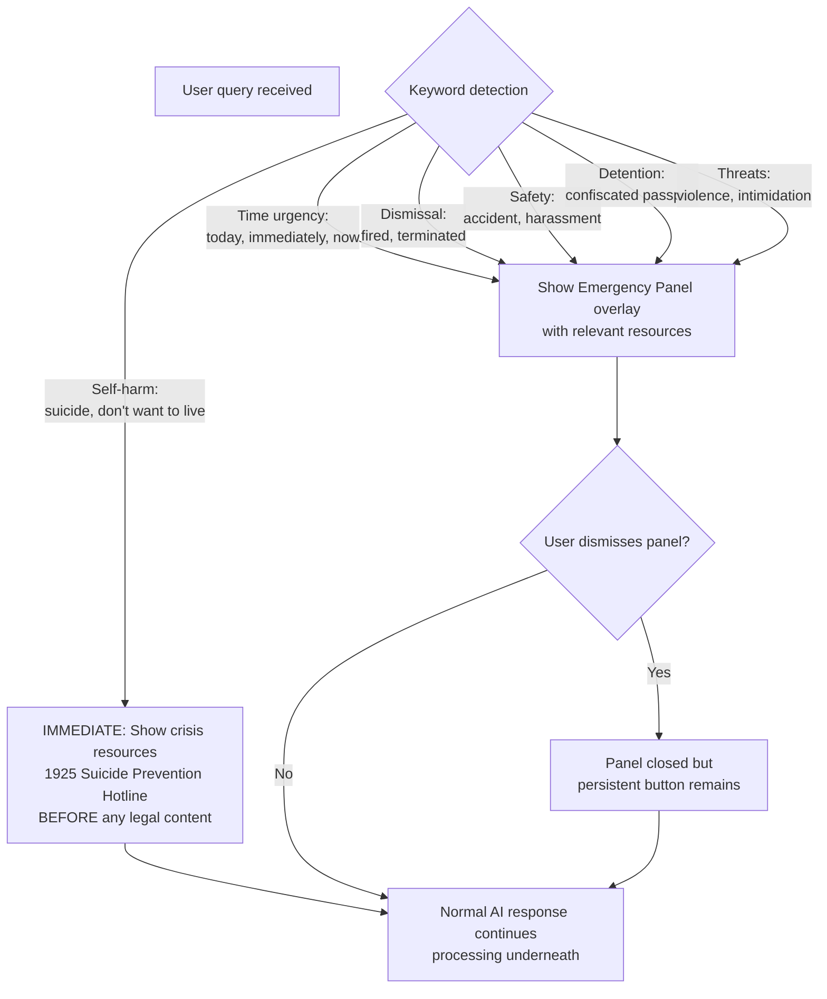

---

### 4.4 Calculator Usage Flow

Reference: [Epic 06 S-03](../prd/epics/06-calculation-tools.md)

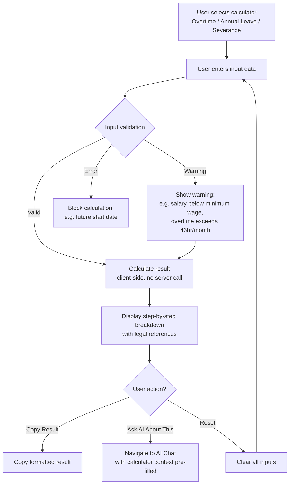

---

## 5. Responsive Breakpoints

Reference: [PRD Appendix I.5](../prd/README.md#appendix-i-visual-design-system)

| Breakpoint | Width | Layout | Key Adaptations |
|-----------|:-----:|--------|----------------|
| **Mobile** | < 640px | Single column | Full-width cards, bottom input bar, hamburger menu, large touch targets (48px) |
| **Tablet** | 640-1023px | Single column, wider margins | Side-by-side identity cards, expanded input area |
| **Laptop** | 1024-1279px | Two-column optional | Chat + sidebar (history/calculator), visible navigation |
| **Desktop** | >= 1280px | Two-column | Chat (60%) + sidebar (40%), all navigation visible |

**Mobile-first design priorities** (Reference: [Epic 05 M-11](../prd/epics/05-accessibility-i18n.md)):
- All features fully functional at 375px width
- Touch targets minimum 48x48px on mobile
- Bottom-fixed input bar on chat page
- Collapsible navigation for mobile

---

## 6. Cross-References

| Document | Path | Related Content |
|----------|------|----------------|
| PRD SS7: Information Architecture | [`docs/prd/README.md`](../prd/README.md#7-information-architecture) | Site map, navigation structure |
| PRD Appendix H: Onboarding Strategy | [`docs/prd/README.md`](../prd/README.md#appendix-h-user-onboarding-strategy) | First-time user flow, feature tour |
| PRD Appendix I: Visual Design System | [`docs/prd/README.md`](../prd/README.md#appendix-i-visual-design-system) | Colors, typography, components, breakpoints |
| Epic 01: Chat Interface | [`docs/prd/epics/01-chat-interface.md`](../prd/epics/01-chat-interface.md) | M-01, M-03, M-05, M-14, M-15 wireframes |
| Epic 02: RAG Legal Search | [`docs/prd/epics/02-rag-legal-search.md`](../prd/epics/02-rag-legal-search.md) | M-04 citation display |
| Epic 03: Response Quality | [`docs/prd/epics/03-response-quality.md`](../prd/epics/03-response-quality.md) | M-09 feedback UI |
| Epic 04: Action Guide | [`docs/prd/epics/04-action-guide-emergency.md`](../prd/epics/04-action-guide-emergency.md) | M-06, M-10 wireframes |
| Epic 05: Accessibility | [`docs/prd/epics/05-accessibility-i18n.md`](../prd/epics/05-accessibility-i18n.md) | M-11, M-12 responsive + a11y |
| Epic 06: Calculators | [`docs/prd/epics/06-calculation-tools.md`](../prd/epics/06-calculation-tools.md) | S-03a/b/c calculator wireframes |
| Epic 07: Future Features | [`docs/prd/epics/07-future-features.md`](../prd/epics/07-future-features.md) | C-03~C-07 Phase 3+ features |
| ADR-004: Frontend Framework | [`docs/adr/004-frontend-nextjs.md`](../adr/004-frontend-nextjs.md) | Next.js 15, App Router, responsive design |
| ADR-006: Observability Stack | [`docs/adr/006-observability-stack.md`](../adr/006-observability-stack.md) | Sentry error tracking, performance monitoring |
| ADR-009: Authentication Strategy | [`docs/adr/009-authentication-strategy.md`](../adr/009-authentication-strategy.md) | Anonymous-first, optional OAuth2 |
| UI Text Guide | [`docs/style-guides/ui-text-guide.md`](../style-guides/ui-text-guide.md) | Button labels, error messages, tone |
| Mermaid Flowchart Guide | [`docs/style-guides/mermaid-flowchart-guide.md`](../style-guides/mermaid-flowchart-guide.md) | Diagram conventions |
