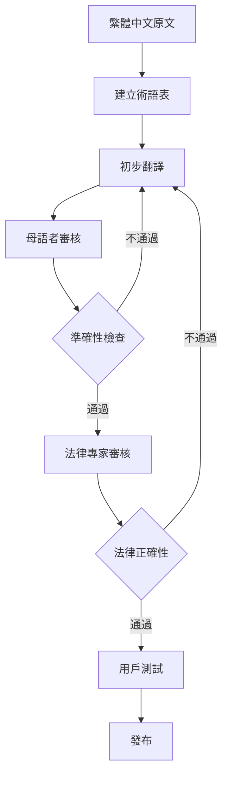
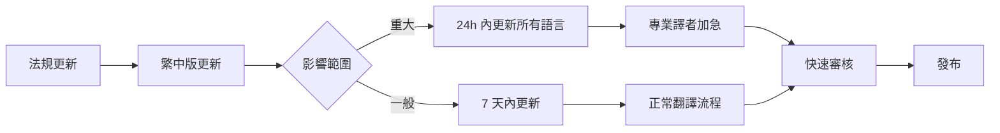

# 多語言翻譯指南

## 目的

本指南規範如何將繁體中文內容翻譯為其他語言，確保翻譯品質與文化適當性。

---

## 支援語言總覽

| 優先級 | 語言 | 代碼 | 目標用戶 | 人口數 | 時程 |
|--------|------|------|---------|--------|------|
| P0 | 繁體中文 | zh-TW | 本地勞工 | 主要用戶 | MVP |
| P0 | 簡易中文 | zh-TW-EASY | 語言能力較低者 | 20-30% 用戶 | MVP |
| P1 | 越南語 | vi | 越南籍勞工 | ~23 萬人 | V2 |
| P1 | 印尼語 | id | 印尼籍勞工 | ~26 萬人 | V2 |
| P2 | 泰語 | th | 泰國籍勞工 | ~7 萬人 | V2 |
| P2 | 菲律賓語 | fil | 菲律賓籍勞工 | ~15 萬人 | V2 |
| P3 | 英語 | en | 其他外籍人士 | 少數 | V3 |

---

## 翻譯原則

### 1. 準確性優先 (Accuracy First)
法律內容絕不可因翻譯而改變意義。

### 2. 文化適當性 (Cultural Appropriateness)
考量目標文化的溝通習慣。

### 3. 可理解性 (Comprehensibility)
使用目標用戶的日常用語。

### 4. 一致性 (Consistency)
術語翻譯必須一致。

---

## 翻譯流程



### 步驟詳解

#### 1. 建立術語表
- 列出所有法律術語
- 找出官方翻譯
- 如無官方翻譯，由法律專家與母語者共同決定

#### 2. 初步翻譯
- 由專業翻譯人員執行
- 必須參照術語表
- 保留原文的語氣與風格

#### 3. 母語者審核
- 由目標語言母語者檢查
- 確認用語自然、文化適當
- 標記難以理解的部分

#### 4. 準確性檢查
- 對照原文確認無遺漏或誤解
- 法律術語翻譯正確
- 數字、日期、計算正確

#### 5. 法律專家審核
- 確認法律意義未改變
- 適用性說明清楚
- 免責聲明完整

#### 6. 用戶測試
- 找 3-5 位目標用戶測試
- 確認能理解
- 收集回饋並調整

---

## 術語翻譯對照表

### 台灣勞動法專有名詞

| 繁體中文 | 英文 | 越南語 | 印尼語 | 泰語 | 菲律賓語 | 備註 |
|---------|------|--------|--------|------|---------|------|
| 勞動基準法 | Labor Standards Act | Luật Tiêu chuẩn Lao động | Undang-Undang Standar Ketenagakerjaan | [待補] | [待補] | 官方譯名 |
| 勞工 | Worker / Employee | Người lao động | Pekerja | [待補] | Manggagawa | |
| 僱主 | Employer | Người sử dụng lao động | Pemberi kerja | [待補] | Employer | |
| 工資 | Wage / Salary | Tiền lương | Upah/Gaji | [待補] | Sahod | |
| 加班 | Overtime | Làm thêm giờ | Lembur | [待補] | Overtime | |
| 特別休假 | Annual Leave | Nghỉ phép năm | Cuti tahunan | [待補] | Annual leave | 俗稱特休 |
| 資遣 | Layoff | Sa thải | PHK (Pemutusan Hubungan Kerja) | [待補] | Layoff | |
| 職業災害 | Occupational Injury | Tai nạn lao động | Kecelakaan kerja | [待補] | Work accident | |

**使用規則**
1. 第一次出現時使用：翻譯（繁體中文原文）
2. 後續使用翻譯即可
3. 重要法條必須附註繁體中文法規名稱

---

## 不同語言的特殊考量

### 越南語 (Tiếng Việt)

**文化考量**
- 越南文化重視禮貌和階級，使用適當的尊稱
- 避免過於直接的表達

**語言特性**
- 使用拉丁字母，閱讀方向同中文（左到右）
- 句子結構與中文相似
- 有六種聲調，翻譯時注意正確標註

**範例**

繁體中文：
> 老闆必須給您加班費。

❌ 直譯：
> Ông chủ phải trả tiền làm thêm giờ cho bạn.
（過於直接，可能顯得不禮貌）

✅ 建議翻譯：
> Theo luật, người sử dụng lao động có nghĩa vụ trả tiền làm thêm giờ cho người lao động.
（根據法律，僱主有義務支付勞工加班費）

---

### 印尼語 (Bahasa Indonesia)

**文化考量**
- 印尼文化重視和諧，避免過於對抗性的表達
- 穆斯林文化背景，注意宗教敏感性

**語言特性**
- 使用拉丁字母
- 文法相對簡單，無時態變化
- 許多外來詞（荷蘭語、英語、阿拉伯語）

**範例**

繁體中文：
> 如果老闆違法，您可以申訴。

❌ 直譯：
> Jika atasan melanggar hukum, Anda bisa mengadu.
（「mengadu」有負面含意）

✅ 建議翻譯：
> Jika pemberi kerja melanggar peraturan, Anda memiliki hak untuk mengajukan pengaduan resmi.
（如果僱主違反規定，您有權提出正式申訴）

---

### 泰語 (ภาษาไทย)

**文化考量**
- 泰國文化極重視禮貌和階級（「kreng jai」概念）
- 避免使勞工感到冒犯僱主

**語言特性**
- 使用泰文字母（非拉丁字母）
- 無標點符號（空格區隔）
- 有禮貌層級的用語

**翻譯挑戰**
- 需要專業泰語譯者
- UI 設計需考慮泰文字體

---

### 菲律賓語 (Filipino/Tagalog)

**文化考量**
- 菲律賓深受西班牙和美國文化影響
- 英語普及率高，可混用英語術語

**語言特性**
- 使用拉丁字母
- 文法較複雜（動詞變化多）
- 許多英語外來詞可直接使用

**範例**

繁體中文：
> 加班費怎麼計算？

✅ 建議翻譯：
> Paano kinakalkula ang overtime pay?
（可直接使用 "overtime pay"，菲律賓人熟悉）

---

## 簡易中文版本規範

### 目標用戶
- 教育程度較低者
- 年長者
- 新移民
- 閱讀障礙者

### 簡化原則

#### 1. 詞彙簡化

| 標準版 | 簡易版 | 說明 |
|-------|-------|------|
| 延長工作時間 | 加班 | 使用口語 |
| 僱主 | 老闆 | 使用常見詞 |
| 勞動契約 | 工作合約 | 避免法律術語 |
| 給付 | 給、付 | 簡化動詞 |
| 申訴 | 投訴 | 使用熟悉詞 |

#### 2. 句子簡化

**標準版**
> 根據勞動基準法第 24 條規定，雇主延長勞工工作時間者，
> 其延長工作時間之工資，應按平日每小時工資額加給三分之一以上。

**簡易版**
> 加班要給加班費。
>
> 平日加班：
> - 前 2 小時：每小時多給 1/3
> - 第 3 小時開始：每小時多給 2/3
>
> 例子：
> 時薪 100 元
> 加班 1 小時 = 100 + 33 = 133 元

#### 3. 結構簡化

**標準版結構**
```
✅ 直接回答
📖 詳細說明
📜 法條依據
🎯 您可以這樣做
📞 需要協助？
```

**簡易版結構**
```
💡 答案
📖 說明
🎯 怎麼做
📞 找誰幫忙
```

#### 4. 視覺輔助

簡易版應：
- 更多圖示和圖表
- 更大的字體
- 更多留白
- 使用顏色區分重點

**範例：加班費計算**

```
【簡易版】

💰 加班費怎麼算？

平日加班：
┌─────────────┐
│ 前 2 小時   │ 時薪 × 1.34
├─────────────┤
│ 第 3 小時   │ 時薪 × 1.67
└─────────────┘

📊 例子：
時薪 $100

加班 1 小時 = $134
加班 3 小時 = $134 + $134 + $167 = $435

🎯 怎麼做：
1️⃣ 記錄加班時間
2️⃣ 算出應得的錢
3️⃣ 檢查薪水單

📞 不懂可以問：
1955（打電話免費）
```

---

## UI 翻譯規範

### 按鈕與連結

**原則**
- 簡短有力
- 動詞開頭（如語言允許）
- 符合目標語言習慣

**範例**

| 繁體中文 | 英文 | 越南語 | 印尼語 |
|---------|------|--------|--------|
| 送出問題 | Submit | Gửi câu hỏi | Kirim |
| 查詢 | Search | Tìm kiếm | Cari |
| 返回 | Back | Quay lại | Kembali |
| 下載 | Download | Tải xuống | Unduh |
| 分享 | Share | Chia sẻ | Bagikan |

### 錯誤訊息

**原則**
- 清楚說明問題
- 提供解決方法
- 保持友善語氣

**範例**

繁體中文：
> 請輸入月薪才能計算加班費

英文：
> Please enter your monthly salary to calculate overtime pay

越南語：
> Vui lòng nhập lương tháng để tính tiền làm thêm giờ

印尼語：
> Mohon masukkan gaji bulanan untuk menghitung upah lembur

---

## 數字、日期、單位格式

### 數字

| 語言 | 千分位 | 小數點 | 範例 |
|------|--------|--------|------|
| 繁體中文 | , | . | 30,000.50 |
| 英文 | , | . | 30,000.50 |
| 越南語 | . | , | 30.000,50 |
| 印尼語 | . | , | 30.000,50 |

**注意**：顯示時需根據語言自動轉換

### 日期

| 語言 | 格式 | 範例 |
|------|------|------|
| 繁體中文 | YYYY年MM月DD日 | 2026年2月2日 |
| 英文 | MMM DD, YYYY | Feb 2, 2026 |
| 越南語 | DD/MM/YYYY | 02/02/2026 |
| 印尼語 | DD/MM/YYYY | 02/02/2026 |

### 貨幣

| 語言 | 格式 | 範例 |
|------|------|------|
| 繁體中文 | NT$ X 元 | NT$ 30,000 元 |
| 英文 | NT$ X | NT$ 30,000 |
| 越南語 | NT$ X | NT$ 30.000 |
| 印尼語 | NT$ X | NT$ 30.000 |

**注意**：台幣固定使用 NT$ 或 TWD

---

## 翻譯記憶庫 (Translation Memory)

### 工具
推薦使用：
- POEditor
- Crowdin
- Lokalise

### 術語庫管理

```json
{
  "term": "勞動基準法",
  "translations": {
    "en": "Labor Standards Act",
    "vi": "Luật Tiêu chuẩn Lao động",
    "id": "Undang-Undang Standar Ketenagakerjaan"
  },
  "context": "台灣主要勞動法規",
  "approved": true,
  "last_updated": "2026-02-02"
}
```

---

## 翻譯品質檢查清單

### 發布前檢查

#### 準確性
- [ ] 法律術語翻譯正確
- [ ] 數字、計算無誤
- [ ] 法條引用正確
- [ ] 無遺漏或增加內容

#### 可讀性
- [ ] 目標用戶能理解
- [ ] 句子通順自然
- [ ] 符合目標語言習慣
- [ ] 無機翻痕跡

#### 文化適當性
- [ ] 語氣適合目標文化
- [ ] 無文化禁忌
- [ ] 範例符合目標用戶情境

#### 技術性
- [ ] 字符正確顯示
- [ ] 排版正常
- [ ] 連結有效
- [ ] UI 元素未被截斷

#### 一致性
- [ ] 術語使用一致
- [ ] 風格一致
- [ ] 語氣一致

---

## 持續改進

### 用戶回饋收集

每個翻譯版本應有回饋機制：

```
這個翻譯有幫助嗎？
👍 清楚易懂  👎 看不太懂

[如果選擇看不太懂]
哪裡不清楚？
□ 用詞太難
□ 句子太長
□ 看不懂意思
□ 其他：[填寫]
```

### 翻譯品質監控

| 指標 | 目標值 | 檢查頻率 |
|------|--------|---------|
| 翻譯正評率 | > 80% | 每週 |
| 錯誤回報率 | < 3% | 每週 |
| 母語者審核通過率 | > 95% | 每次發布 |
| 用戶理解度測試 | > 85% | 每季 |

---

## 緊急更新流程

當法規更新需要緊急翻譯時：



---

## 外包譯者指南

### 提供給譯者的資料包

1. **術語表** (Glossary)
2. **翻譯記憶庫** (TM)
3. **風格指南** (Style Guide)
4. **原文檔案**
5. **參考資料**（法規原文、官方翻譯）
6. **目標用戶說明**

### 譯者資格要求

| 語言 | 要求 |
|------|------|
| 所有語言 | - 母語者<br>- 有法律翻譯經驗<br>- 了解台灣勞動法規<br>- 通過測試翻譯 |
| 越南語 | 在台越南移工背景尤佳 |
| 印尼語 | 在台印尼移工背景尤佳 |

---

## 附錄：常用句型翻譯範本

### 開場句

| 繁體中文 | 英文 | 越南語 | 印尼語 |
|---------|------|--------|--------|
| 您的問題是... | Your question is... | Câu hỏi của bạn là... | Pertanyaan Anda adalah... |
| 根據法律規定 | According to the law | Theo quy định pháp luật | Menurut peraturan |
| 簡單來說 | Simply put | Nói một cách đơn giản | Sederhananya |

### 說明句

| 繁體中文 | 英文 | 越南語 | 印尼語 |
|---------|------|--------|--------|
| 這表示... | This means... | Điều này có nghĩa là... | Ini berarti... |
| 舉例來說 | For example | Ví dụ | Contohnya |
| 您可以... | You can... | Bạn có thể... | Anda dapat... |

### 行動指引

| 繁體中文 | 英文 | 越南語 | 印尼語 |
|---------|------|--------|--------|
| 建議您... | We suggest you... | Chúng tôi khuyên bạn... | Kami sarankan Anda... |
| 請記得... | Please remember... | Xin nhớ... | Harap ingat... |
| 下一步... | Next step... | Bước tiếp theo... | Langkah selanjutnya... |

---

**文件版本**：v1.0
**更新日期**：2026-02-02
**負責人**：i18n Team
**下次審核**：每季更新
