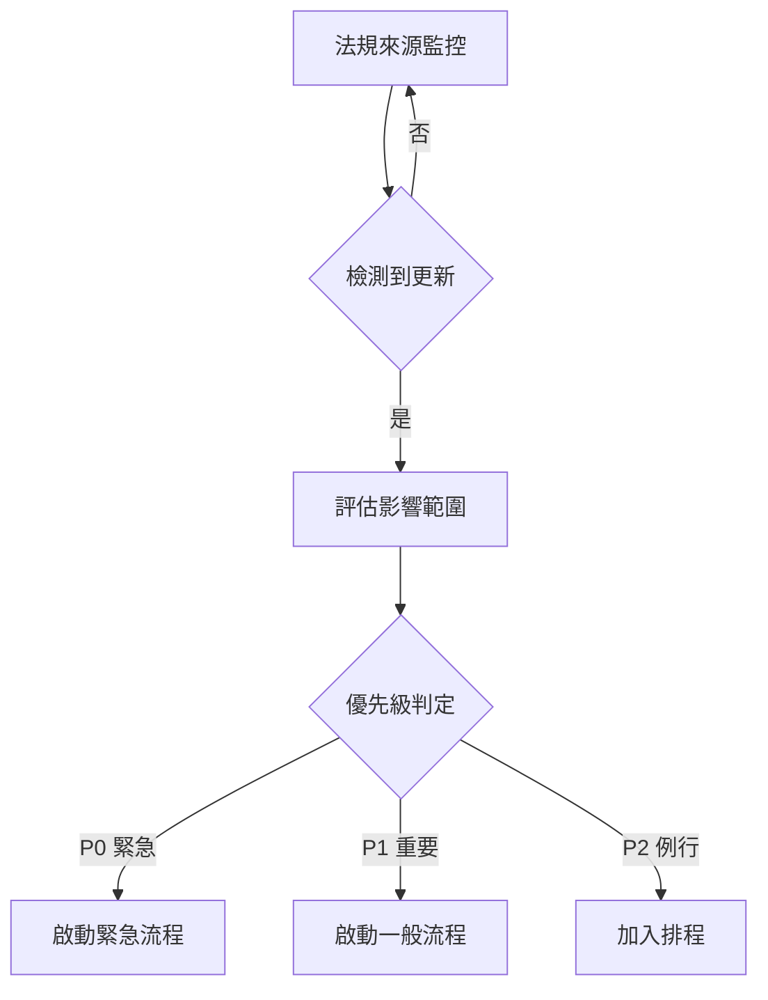
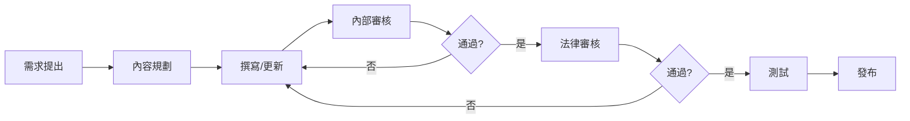
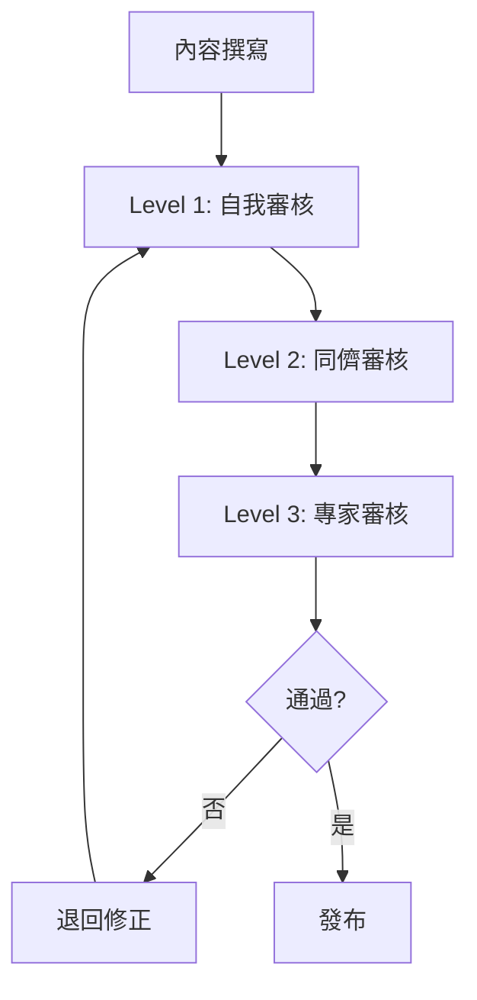
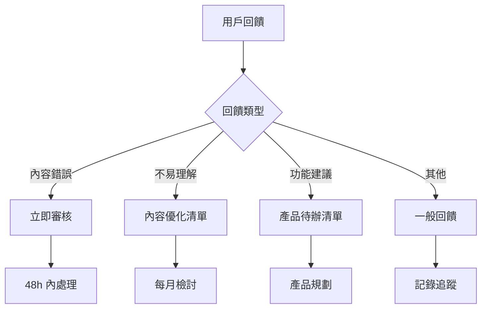

# 內容更新工作流程

## 目的

本文件規範法規更新、內容維護、品質保證的完整工作流程。

---

## 內容更新類型

| 類型 | 觸發條件 | 優先級 | SLA |
|------|---------|--------|-----|
| **緊急更新** | 法規重大修正、系統重大錯誤 | P0 | 24 小時 |
| **重要更新** | 法規一般修正、內容錯誤 | P1 | 3 天 |
| **例行更新** | 內容優化、新增 FAQ | P2 | 7 天 |
| **計畫性更新** | 新功能、季度審核 | P3 | 依排程 |

---

## 法規更新流程

### 監控機制



### 法規來源

**官方來源（每日監控）**
1. 全國法規資料庫 - https://law.moj.gov.tw/
2. 勞動部官網 - https://www.mol.gov.tw/
3. 行政院公報 - https://gazette.nat.gov.tw/

**監控方式**
- 自動化爬蟲（每日）
- RSS 訂閱
- 人工每週檢查

---

## 緊急更新流程（P0）

### 觸發條件
- 勞動法規重大修正（如基本工資調整）
- 系統回答重大錯誤
- 安全性問題

### 流程時程（24 小時完成）

| 時間 | 階段 | 負責人 | 任務 |
|------|------|--------|------|
| 0-2h | 評估 | Content Lead | 評估影響範圍、受影響內容清單 |
| 2-8h | 更新 | Content Writer | 更新所有受影響內容 |
| 8-12h | 審核 | Legal Reviewer | 法律準確性審核 |
| 12-16h | 測試 | QA Team | 測試更新內容 |
| 16-20h | 翻譯 | Translator | 更新多語言版本（如適用）|
| 20-24h | 發布 | DevOps | 部署上線、通知用戶 |

### 緊急更新檢查表

```markdown
## 緊急更新：[更新主題]

**日期**：2026-XX-XX
**負責人**：[姓名]
**法規**：[法規名稱 + 條號]

### 1. 影響評估（2h 內完成）
- [ ] 識別受影響的內容頁面
- [ ] 評估影響用戶數
- [ ] 判定是否需要系統公告

**受影響頁面清單**：
- [ ] 頁面 1
- [ ] 頁面 2

### 2. 內容更新（8h 內完成）
- [ ] 更新主要說明內容
- [ ] 更新法條引用
- [ ] 更新計算公式（如適用）
- [ ] 更新範例
- [ ] 標註更新日期

### 3. 法律審核（12h 內完成）
審核者：[姓名]
- [ ] 法條引用正確
- [ ] 法律解釋準確
- [ ] 免責聲明適當
- [ ] 無遺漏重要資訊

### 4. 品質測試（16h 內完成）
- [ ] 計算正確性測試
- [ ] 連結有效性測試
- [ ] 多裝置顯示測試
- [ ] 無障礙性測試

### 5. 多語言更新（20h 內完成）
- [ ] 繁體中文 ✓
- [ ] 簡易中文
- [ ] 越南語（如適用）
- [ ] 印尼語（如適用）

### 6. 發布（24h 內完成）
- [ ] 部署到正式環境
- [ ] 清除快取
- [ ] 發布系統公告
- [ ] 通知受影響用戶（如適用）

### 7. 後續追蹤
- [ ] 監控用戶回饋
- [ ] 錯誤回報處理
- [ ] 記錄 Lessons Learned
```

---

## 一般更新流程（P1）

### 觸發條件
- 法規一般性修正
- 內容錯誤回報
- 官方解釋函更新

### 流程時程（3 天完成）



### 工作清單範本

```markdown
## 一般更新：[更新主題]

**預計完成**：[日期]
**負責人**：[姓名]

### Day 1: 規劃與撰寫
- [ ] 收集相關法規資料
- [ ] 確認更新範圍
- [ ] 撰寫/更新內容
- [ ] 自我檢查（使用檢查表）

### Day 2: 審核
- [ ] 內容團隊審核
- [ ] 法律團隊審核
- [ ] 修正回饋意見

### Day 3: 測試與發布
- [ ] QA 測試
- [ ] 多語言更新（如需要）
- [ ] 發布
- [ ] 更新紀錄
```

---

## 例行更新流程（P2）

### 觸發條件
- 內容優化
- 新增常見問題
- 補充範例
- 使用者回饋改進

### 批次處理
- 每週收集
- 每兩週批次處理
- 統一測試發布

---

## 計畫性更新流程（P3）

### 季度內容審核

**目的**：確保所有內容保持準確、最新、高品質

**時程**：每季第一個月

```markdown
## Q[X] 內容審核計畫

### Week 1: 準備
- [ ] 產生所有頁面清單
- [ ] 確認法規最新版本
- [ ] 分配審核責任

### Week 2-3: 審核
每個內容頁面檢查：
- [ ] 法規版本最新
- [ ] 資訊準確無誤
- [ ] 範例仍適用
- [ ] 連結有效
- [ ] 無過時資訊
- [ ] 風格一致
- [ ] 更新日期標註

### Week 4: 修正與發布
- [ ] 彙整需修正項目
- [ ] 優先級排序
- [ ] 執行修正
- [ ] 統一測試
- [ ] 批次發布
- [ ] 產出審核報告
```

### 季度審核報告範本

```markdown
# 2026 Q[X] 內容審核報告

## 摘要
- 審核頁面數：[數字]
- 需更新頁面：[數字]（[百分比]%）
- 已完成更新：[數字]
- 待處理項目：[數字]

## 主要發現

### 1. 法規更新
- [法規名稱]：[變更內容]
- [法規名稱]：[變更內容]

### 2. 內容品質問題
- 過時資訊：[數量]
- 錯誤資訊：[數量]
- 連結失效：[數量]
- 範例過時：[數量]

### 3. 優化建議
1. [建議 1]
2. [建議 2]
3. [建議 3]

## 下季重點工作
- [ ] [任務 1]
- [ ] [任務 2]
- [ ] [任務 3]

---
審核者：[姓名]
日期：2026-XX-XX
```

---

## 內容版本控制

### Git 工作流程

```bash
# 1. 從 main 創建功能分支
git checkout main
git pull
git checkout -b content/update-overtime-rules

# 2. 進行內容更新
# 編輯文件...

# 3. 提交變更
git add docs/content/overtime.md
git commit -m "docs: update overtime calculation rules for 2026"

# 4. 推送到遠端
git push origin content/update-overtime-rules

# 5. 建立 Pull Request
# 在 GitHub/GitLab 上建立 PR

# 6. Code Review 後合併
# PR 被批准後合併到 main
```

### Commit Message 規範

```
類型(範圍): 簡短描述

[可選] 詳細說明

[可選] 相關 Issue
```

**類型**
- `docs`: 文件更新
- `fix`: 內容錯誤修正
- `feat`: 新增內容
- `update`: 法規更新
- `style`: 格式調整

**範例**
```
docs(overtime): update overtime pay calculation for 2026

- Update basic wage to NT$28,590
- Update examples with new rates
- Add note about transition period

Closes #123
```

---

## 內容審核機制

### 三級審核制度



### Level 1: 自我審核（作者）

使用「內容品質檢查表」（見附錄 A）

### Level 2: 同儕審核（Content Team）

**審核重點**
- 可讀性
- 結構完整性
- 風格一致性
- 範例適當性

**審核表單**
```markdown
## 同儕審核：[內容標題]

審核者：[姓名]
日期：[日期]

### 可讀性（滿分 10）
- 語言簡潔：[分數] / 10
- 結構清晰：[分數] / 10
- 易於理解：[分數] / 10

### 完整性
- [ ] 有直接回答
- [ ] 有詳細說明
- [ ] 有法條依據
- [ ] 有行動指南
- [ ] 有範例

### 一致性
- [ ] 符合風格指南
- [ ] 術語使用一致
- [ ] 格式正確

### 建議
- [建議 1]
- [建議 2]

### 結論
- [ ] 通過，可進入專家審核
- [ ] 需修正（見上方建議）
```

### Level 3: 專家審核（Legal Team）

**審核重點**
- 法律準確性
- 法條引用正確性
- 適用性說明
- 風險提示充足性

**審核表單**
```markdown
## 法律專家審核：[內容標題]

審核者：[姓名]
資格：[律師/法律專業背景]
日期：[日期]

### 法律準確性
- [ ] 法條引用正確（條號、內容）
- [ ] 法律解釋準確
- [ ] 適用範圍說明清楚
- [ ] 例外情況已說明

### 時效性
- [ ] 使用最新版本法規
- [ ] 有標註法規修正日期
- [ ] 過渡期規定已說明（如適用）

### 完整性
- [ ] 相關法條已涵蓋
- [ ] 實務運作符合現況
- [ ] 官方解釋函已納入（如有）

### 風險管理
- [ ] 免責聲明適當
- [ ] 複雜案件有警示
- [ ] 建議諮詢專業的時機正確

### 問題與建議
[詳細說明]

### 結論
- [ ] 批准發布
- [ ] 需修正後再審
- [ ] 建議不發布（說明原因）

---
簽名：[姓名]
日期：[日期]
```

---

## 用戶回饋處理

### 回饋收集管道



### 錯誤回報處理（48h SLA）

```markdown
## 錯誤回報處理單

**回報 ID**：[自動產生]
**回報日期**：2026-XX-XX
**回報來源**：[頁面 URL]

### 用戶回報內容
"[用戶原始回報]"

### 初步分類
- [ ] 法條錯誤
- [ ] 計算錯誤
- [ ] 過時資訊
- [ ] 連結失效
- [ ] 其他

### 影響評估
- 優先級：P0 / P1 / P2
- 受影響頁面：[清單]
- 影響用戶數：[估計]

### 處理記錄

**調查結果**（24h 內）
- 是否確認錯誤：是 / 否
- 錯誤原因：[說明]

**修正動作**（48h 內）
- [ ] 更新內容
- [ ] 通過審核
- [ ] 已發布
- [ ] 通知回報者（如有聯絡方式）

**預防措施**
- [未來如何避免類似錯誤]

---
處理人：[姓名]
完成日期：[日期]
```

---

## 內容效能監控

### 關鍵指標（每週檢視）

| 指標 | 定義 | 目標值 | 警示閾值 |
|------|------|--------|---------|
| **內容新鮮度** | 更新日期 < 6 個月的內容佔比 | > 90% | < 80% |
| **準確率** | 無錯誤回報的內容佔比 | > 98% | < 95% |
| **有用率** | 獲得正評的內容佔比 | > 85% | < 75% |
| **完整度** | 通過檢查表的內容佔比 | 100% | < 95% |
| **回應時效** | 錯誤回報平均處理時間 | < 24h | > 48h |

### 每週內容報告

```markdown
# 內容品質週報 - 2026 W[XX]

## 關鍵指標

| 指標 | 本週 | 上週 | 趨勢 |
|------|------|------|------|
| 內容新鮮度 | 92% | 90% | ↑ |
| 準確率 | 97% | 98% | ↓ |
| 有用率 | 87% | 85% | ↑ |
| 平均處理時間 | 18h | 22h | ↑ |

## 本週更新

### 新增內容（[數量]）
- [內容 1]
- [內容 2]

### 更新內容（[數量]）
- [內容 1]：[更新原因]
- [內容 2]：[更新原因]

### 錯誤修正（[數量]）
- [內容 1]：[錯誤描述]
- [內容 2]：[錯誤描述]

## 用戶回饋

### 正面回饋（[數量]）
- "[引用用戶回饋]"

### 改進建議（[數量]）
- 建議 1：[說明]
- 建議 2：[說明]

### 錯誤回報（[數量]）
- 已處理：[數量]
- 處理中：[數量]
- 待處理：[數量]

## 下週計畫
- [ ] [任務 1]
- [ ] [任務 2]
- [ ] [任務 3]

## 需要注意
- ⚠️ [警示項目]

---
報告人：[姓名]
日期：2026-XX-XX
```

---

## 工具與系統

### 內容管理系統（CMS）

**推薦選項**
1. **Headless CMS**（建議）
   - Strapi
   - Contentful
   - Sanity

2. **傳統 CMS**
   - WordPress + Custom Fields

**功能需求**
- 版本控制
- 工作流程管理（草稿→審核→發布）
- 多語言支援
- 預定發布
- 權限管理
- API 整合

### 協作工具

| 用途 | 工具 | 說明 |
|------|------|------|
| 文件協作 | Google Docs / Notion | 初稿撰寫、協作 |
| 版本控制 | Git / GitHub | 最終內容管理 |
| 專案管理 | Jira / Linear | 任務追蹤 |
| 溝通 | Slack / Teams | 團隊溝通 |
| 翻譯管理 | Crowdin / POEditor | 多語言翻譯 |

---

## 團隊角色與職責

| 角色 | 職責 | 人數 |
|------|------|------|
| **Content Lead** | 內容策略、審核、團隊管理 | 1 |
| **Content Writer** | 內容撰寫、更新、優化 | 2-3 |
| **Legal Reviewer** | 法律準確性審核 | 1-2 |
| **Translator** | 多語言翻譯 | 依語言數 |
| **QA Tester** | 內容測試、品質保證 | 1 |

### 工作時間分配（以 Content Writer 為例）

```
每週 40 小時：
- 新內容撰寫：40%（16h）
- 內容更新維護：30%（12h）
- 審核與測試：15%（6h）
- 用戶回饋處理：10%（4h）
- 學習與研究：5%（2h）
```

---

## 附錄 A：內容品質檢查表

```markdown
# 內容品質自我檢查表

**內容標題**：[標題]
**作者**：[姓名]
**日期**：[日期]

## 1. 準確性（必須全部通過）
- [ ] 所有法條引用正確（條號、法規名稱）
- [ ] 法條內容與官方版本一致
- [ ] 使用最新版本法規
- [ ] 數字計算經過驗證
- [ ] 所有陳述可追溯到來源
- [ ] 有標註資料更新日期

## 2. 完整性（必須全部通過）
- [ ] 有「✅ 直接回答」區塊（20-30 字）
- [ ] 有「📖 詳細說明」區塊（200-400 字）
- [ ] 有「📜 法條依據」區塊（可展開）
- [ ] 有「🎯 您可以這樣做」區塊
- [ ] 有「📞 需要協助？」區塊
- [ ] 有信心度標示
- [ ] 有免責聲明

## 3. 可讀性（8/10 以上通過）
- [ ] 符合國小六年級閱讀程度
- [ ] 無過長句子（< 30 字）
- [ ] 使用白話文術語（或有解釋）
- [ ] 段落分明（一段一重點）
- [ ] 有使用具體範例
- [ ] 視覺層級清楚（標題、粗體、清單）
- [ ] 重要資訊有標記（✅ ❌ ⚠️）
- [ ] 有「下一步行動」指引

## 4. 風格一致性（必須全部通過）
- [ ] 符合 UI 文字撰寫規範
- [ ] 符合法律內容撰寫指南
- [ ] 術語使用一致（參考術語表）
- [ ] 語氣符合品牌定位（專業但溫暖）
- [ ] 格式符合範本

## 5. 技術性（必須全部通過）
- [ ] 所有連結有效
- [ ] 圖片有 alt text
- [ ] 行動裝置顯示正常
- [ ] 無拼字或文法錯誤
- [ ] Markdown 語法正確

## 6. 使用者導向（必須全部通過）
- [ ] 標題清楚（用戶能理解在看什麼）
- [ ] 有提供具體可執行的建議
- [ ] 複雜案件有警示
- [ ] 緊急情況有快速通道
- [ ] 有相關問題連結（如適用）

---

**總評**：
- [ ] 通過，可進入同儕審核
- [ ] 需修正

**備註**：
[任何補充說明]
```

---

## 附錄 B：法規監控清單

| 法規名稱 | 監控頻率 | 最後檢查 | 下次檢查 | 負責人 |
|---------|---------|---------|---------|--------|
| 勞動基準法 | 每日 | 2026-02-02 | 2026-02-03 | [姓名] |
| 勞工退休金條例 | 每週 | 2026-02-01 | 2026-02-08 | [姓名] |
| 就業服務法 | 每週 | 2026-02-01 | 2026-02-08 | [姓名] |
| 性別工作平等法 | 每週 | 2026-02-01 | 2026-02-08 | [姓名] |
| 職業安全衛生法 | 每週 | 2026-02-01 | 2026-02-08 | [姓名] |

---

**文件版本**：v1.0
**更新日期**：2026-02-02
**負責人**：Content Operations Team
**下次審核**：每季更新
