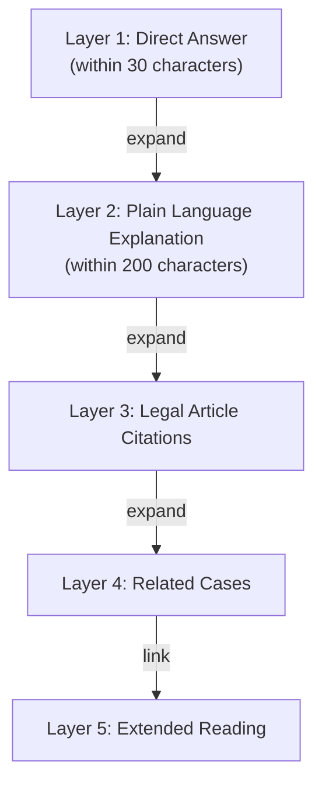
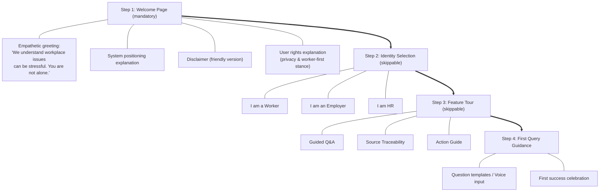
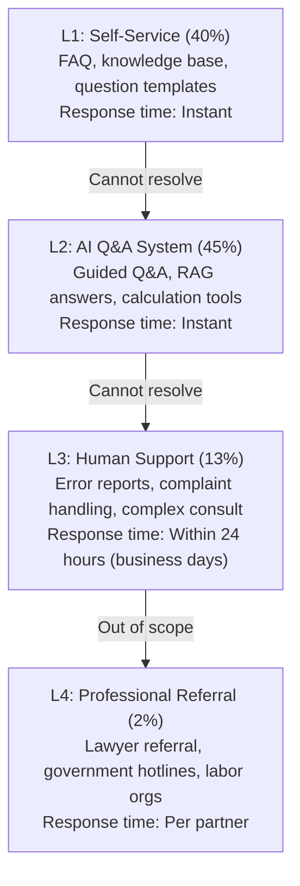

# Product Requirements Document (PRD)

## Labor Law Assistant - Taiwan Labor Law Query Assistant

| Document Info | |
|---------|---------|
| **Version** | v2.7 |
| **Created** | 2026-02-02 |
| **Last Updated** | 2026-03-10 |
| **Status** | Draft - Pending Stakeholder Review |
| **Owner** | Product Owner |

---

## Table of Contents

1. [Product Overview](#1-product-overview)
2. [Product Vision & Goals](#2-product-vision--goals)
3. [Target Users](#3-target-users)
4. [User Journey](#4-user-journey)
5. [Feature Requirements](#5-feature-requirements)
6. [Non-Functional Requirements](#6-non-functional-requirements)
7. [Information Architecture](#7-information-architecture)
8. [Risk Assessment](#8-risk-assessment)
9. [Success Metrics](#9-success-metrics)
10. [Timeline](#10-timeline)
11. [Appendices](#11-appendices)

  +-------------------+--------------------------------------------------------------+
  |       Section     |                           Contents                           |
  +-------------------+--------------------------------------------------------------+
  | 1. Product Overview       | Problem statement, solution, positioning, value proposition  |
  | 2. Product Vision & Goals | Vision, mission, business goals, user rights charter (11)    |
  | 3. Target Users           | 3 personas + 7 vulnerable groups + 10 hypotheses             |
  | 4. User Journey           | Complete journey map, 6-stage touchpoints & design ops       |
  | 5. Feature Requirements   | MoSCoW (13 Must + 10 Should + 7 Could) + Epic links         |
  | 6. Non-Functional Reqs    | WCAG 2.1 AA, 5 languages, privacy, performance              |
  | 7. Info Architecture      | Navigation, layered info, search design                      |
  | 8. Risk Assessment        | Product/tech/legal risk matrix & mitigation                  |
  | 9. Success Metrics        | Product health, tech, content quality, user rights KPI       |
  | 10. Timeline              | 19-month 5-phase plan (incl. Phase 0.5 user research 10 wks) |
  | 11. Appendices            | Legal scope, tech stack, support, research, budget, etc.     |
  +-------------------+--------------------------------------------------------------+

---

## 1. Product Overview

### 1.1 Product Introduction

Labor Law Assistant is an **AI-powered Taiwan labor law knowledge base and guided Q&A system**, designed to help general workers, HR specialists, and SME owners quickly query, understand, and apply Taiwan labor regulations.

### 1.2 Problem Statement

| Problem | Impact |
|------|------|
| Labor regulations are written in difficult legal language | Workers cannot understand their own rights |
| Regulations are scattered across multiple laws | Difficult and time-consuming to search |
| Professional legal consultation is expensive | Vulnerable workers cannot afford it |
| Information asymmetry | Workers are at a disadvantage in labor disputes |
| Digital divide | Foreign workers, elderly, disabled persons have difficulty accessing information |

### 1.3 Solution

Provide a **free, accessible, multilingual** AI Q&A system that enables everyone to:
- Understand labor regulations in plain language
- Obtain accurate information with traceable sources
- Know what action to take when encountering problems

### 1.4 Product Positioning

```
+-------------------------------------------------------------+
|                Labor Law Information Service Spectrum         |
+-------------------------------------------------------------+
|                                                              |
|  Gov Websites  ->  This Product  ->  Legal Consult  -> Law   |
|  (Info display)    (AI-assisted)     (Professional)    Firm  |
|                                                              |
|  Free/Passive      Free/Active      Paid/Expert      High   |
|  Hard to understand Plain interactive Case judgment   Legal  |
|                                                              |
+-------------------------------------------------------------+
```

**Product positioning**: A "smart bridge" between government information and professional legal consultation

### 1.5 Core Value Proposition

> **"Enabling every Taiwan worker to easily understand their labor rights and know how to protect themselves."**

---

## 2. Product Vision & Goals

### 2.1 Product Vision

Become Taiwan's most trusted labor law information platform, closing the labor-management information gap and promoting labor rights protection.

### 2.2 Product Mission

- **Protect workers first**: System stance clearly stands for protecting worker rights
- **Information equality**: Ensure all people (including vulnerable groups) can access information
- **Transparent and trustworthy**: All answers traceable to sources, limitations clearly marked

### 2.3 Business Goals

| Goal | Metric | Timeline |
|------|------|------|
| Build user base | MAU 10,000+ | 6 months after launch |
| Achieve product-market fit | NPS 30+ | 3 months after launch |
| Become trusted source | Answer satisfaction 85%+ | 6 months after launch |
| Cover major regulations | 8 major labor laws 100% | MVP |

### 2.4 User Rights Charter

This product commits to the following principles:

| # | Commitment |
|------|------|
| 1 | **Protect workers first**: System stance clearly stands for protecting worker rights, refuses to assist in circumventing regulations |
| 2 | **Absolute privacy protection**: No personally identifiable information recorded, query records never provided to third parties |
| 3 | **Equal access**: Ensure all people (including disabled persons, foreign workers, elderly) can use the system |
| 4 | **Information transparency**: Clearly mark information sources, update dates, accuracy |
| 5 | **Core features permanently free**: No charges to users |
| 6 | **Error accountability**: Establish error reporting and correction mechanisms, publicly disclose error rates |
| 7 | **Continuous improvement**: Regular user research, optimize system based on feedback |
| 8 | **Emergency support**: Provide human assistance referrals, never let AI handle crisis situations alone |
| 9 | **Open transparency**: System operation logic and algorithm principles publicly explained |
| 10 | **Social responsibility**: Proactively promote labor rights education, close information gaps |
| 11 | **Psychological safety first**: System design follows trauma-informed principles, avoids triggering secondary trauma, provides emotional support resources |

---

## 3. Target Users

### 3.1 Primary User Personas

#### Persona 1: General Worker - Xiao Ming

| Attribute | Description |
|------|------|
| **Demographics** | 28 years old, restaurant service worker, high school education |
| **Digital literacy** | Medium, accustomed to using mobile phone |
| **Usage timing** | Encountering rights issues, suspecting employer violations, wanting to understand rights |
| **Goals** | Understand overtime pay calculation, annual leave days, resignation notice period |
| **Pain points** | Legal language is difficult, doesn't know where to search, afraid to ask the boss, doesn't know the right keywords |
| **Expectations** | Get answers in plain language, resolve questions within 5 minutes, know what to do next |
| **Context** | Queries on phone after work, may be anxious or angry |
| **Past labor disputes** | Has experienced wage theft, skeptical of employer intentions |
| **Trust in AI** | Medium — willing to try but needs verification |
| **Emotional state when querying** | Anxious, time-pressured, seeking validation |

#### Persona 2: HR Specialist - Linda

| Attribute | Description |
|------|------|
| **Demographics** | 35 years old, mid-size company HR, university HR major |
| **Digital literacy** | High, proficient in Office software |
| **Usage timing** | Handling employee issues, designing company policies, handling labor disputes |
| **Goals** | Quick regulation lookup, preparing labor meetings, designing company policies |
| **Pain points** | Can't keep up with regulation updates, needs to cite articles, complex cases hard to judge |
| **Expectations** | Professional and accurate, citable sources, similar cases, regulation update notifications |
| **Context** | Desktop queries during office hours, needs to print or share |
| **Past labor disputes** | Handles employee disputes regularly, needs accurate legal backing |
| **Trust in AI** | High — accustomed to AI tools, values efficiency |
| **Emotional state when querying** | Calm, task-oriented, seeking authoritative sources |

#### Persona 3: Small Business Owner - Boss Wang

| Attribute | Description |
|------|------|
| **Demographics** | 45 years old, operates a 20-person factory, vocational school education |
| **Digital literacy** | Low, primarily uses mobile phone |
| **Usage timing** | Hiring employees, designing salary systems, handling resignations, receiving labor inspection notices |
| **Goals** | Ensure legal employment compliance, avoid fines or labor inspections |
| **Pain points** | Doesn't understand law, worried about violations, lawyers too expensive, limited resources |
| **Expectations** | Simple and clear guidance, tell me what to do |
| **Context** | Emergency queries when encountering problems |
| **Past labor disputes** | No direct experience, fears government penalties |
| **Trust in AI** | Low — prefers human advice, needs simple interface |
| **Emotional state when querying** | Stressed, overwhelmed, seeking clear "what to do" guidance |

### 3.2 Vulnerable User Groups

| User Group | Potential Barrier | Required Support | Priority |
|---------|---------|-------------|--------|
| **Foreign workers** | Language barrier (~700K people) | Vietnamese, Indonesian, Thai, Filipino | P0 |
| **Visually impaired** | Cannot use visual interface | WCAG 2.1 AA, screen reader support | P0 |
| **Hearing impaired** | Need subtitles for voice features | Text messaging, video subtitles | P1 |
| **Elderly** | Small fonts, complex operations, unfamiliar with AI | Large font mode, simplified steps | P0 |
| **Low digital literacy** | Don't understand system operation | Plain language explanations, human support backup | P0 |
| **Low-wage workers** | Old phones, limited data | Lightweight, offline cache, PWA | P1 |
| **Night shift workers** | Late-night use, fatigue | Night mode, quick query shortcuts | P2 |

### 3.3 User Assumptions & Validation

| ID | Behavioral Assumption | Risk Level | Validation Method |
|---------|---------|---------|---------|
| H1 | Users can clearly describe legal problems | High | Cognitive walkthrough, field observation |
| H2 | Users willing to answer multiple guidance questions | Medium | A/B testing |
| H3 | Users will read complete legal article content | High | Eye tracking, scroll depth analysis |
| H4 | Users understand plain language legal explanations | Medium | Comprehension testing |
| H5 | Users care about information source traceability | Medium | Trust survey |
| H6 | Users primarily query on mobile | Low | Device usage data |
| H7 | Users will proactively provide feedback | High | Participation rate data |
| H10 | Users trust AI-generated legal advice | High | Trust study |

---

## 4. User Journey

### 4.1 General Worker Journey Map

```
Stages: Discover Problem -> Find Channel -> Use System -> Understand Info -> Take Action -> Follow Up

+---------------------------------------------------------------------+
| Discover Problem                                                     |
+---------------------------------------------------------------------+
| Touchpoint: Workplace                                                |
| Behavior: Notice anomaly (no overtime pay, asked to sign documents)  |
| Emotion: Anxious, angry                                              |
| Pain point: Not sure if this is right, don't know who to ask         |
+---------------------------------------------------------------------+
                                    |
                                    v
+---------------------------------------------------------------------+
| Find Channel                                                         |
+---------------------------------------------------------------------+
| Touchpoint: Google, LINE groups, coworkers                           |
| Behavior: Search "how to calculate overtime pay"                     |
| Emotion: Confused                                                    |
| Pain point: Scattered info, unknown credibility, can't read legalese |
| Opportunity: System should appear in search results                  |
+---------------------------------------------------------------------+
                                    |
                                    v
+---------------------------------------------------------------------+
| Use System                                                           |
+---------------------------------------------------------------------+
| Touchpoint: System homepage, search box                              |
| Behavior: Type question or select scenario                           |
| Emotion: Uncertain                                                   |
| Pain point: Don't know how to describe problem, afraid of asking     |
| Opportunity: Scenario selector, question templates, voice input      |
+---------------------------------------------------------------------+
                                    |
                                    v
+---------------------------------------------------------------------+
| Understand Information                                               |
+---------------------------------------------------------------------+
| Touchpoint: View AI response                                         |
| Behavior: Read response, check legal citations                       |
| Emotion: Confused -> Understanding                                   |
| Pain point: Articles too long, don't know how to apply to own case   |
| Opportunity: Layered display (summary->detail), keyword highlighting |
+---------------------------------------------------------------------+
                                    |
                                    v
+---------------------------------------------------------------------+
| Take Action                                                          |
+---------------------------------------------------------------------+
| Touchpoint: Leaving system                                           |
| Behavior: Decide next step (talk to boss, file complaint, find lawyer)|
| Emotion: Helpless -> Confident                                       |
| Pain point: Don't know what to do, don't know what evidence needed   |
| Opportunity: Action guide, evidence checklist, complaint channel links|
+---------------------------------------------------------------------+
                                    |
                                    v
+---------------------------------------------------------------------+
| Follow Up (Phase 2: S-10 Post-Action Check-In)                      |
+---------------------------------------------------------------------+
| Need: Track progress, get ongoing support, avoid abandonment         |
| Emotion: Uncertain -> Supported (if follow-up available)             |
| Pain point: Feel isolated after taking action, fear retaliation      |
| Opportunity: Optional reminders, escalation options, resolution      |
|              tracking, ongoing emotional support resources            |
+---------------------------------------------------------------------+
```

### 4.2 Key Touchpoints & Design Opportunities

| Stage | Key Touchpoint | Currently Covered | Design Opportunity |
|------|---------|:--------:|---------|
| Enter system | Homepage, search box | Partial | Scenario selector, question template library |
| Describe problem | Input box, guided Q&A | Planned | Voice input, keyword suggestions |
| Understand answer | AI response content | Partial | Layered display, visual explanations |
| Verify credibility | Source marking | Planned | Confidence score, update date |
| Take action | Leaving system | Missing | Action guide, evidence checklist |
| Report issues | Feedback mechanism | Planned | Error reporting, human review |
| Ongoing support | Referral services | Missing | Lawyer referral, government hotlines |

---

## 5. Feature Requirements

### 5.1 Feature Priority Overview (MoSCoW)

#### Must Have - MVP Core Features

| Feature ID | Feature Name | Description | User Value |
|---------|---------|------|---------|
| **M-01** | Contextual Question Guidance | Guide questions based on user identity and context | Solve "don't know how to ask" problem |
| **M-02** | RAG Source Tracing System | Generate answers based on legal database with source attribution | Ensure answers are verifiable |
| **M-03** | Layered Information Display | Summary first, expandable detailed legal articles | Avoid information overload |
| **M-04** | Legal Citation & Links | Show cited legal articles in full with official links | Build trust, facilitate verification |
| **M-05** | Basic Q&A Interface | Clean conversational query interface | Core interaction functionality |
| **M-06** | Action Guide | Tell users what to do next | Actually solve the problem |
| **M-07** | Response Quality Control | Confidence scores, accuracy indicators | Manage user expectations |
| **M-08** | Disclaimer System | Legal disclaimers on homepage and in responses | Reduce legal risk |
| **M-09** | Feedback Rating | Thumbs up/down, error reporting | Continuously optimize AI |
| **M-10** | Emergency Fast Track | Detect emergency keywords, provide hotline links | Handle urgent needs |
| **M-11** | Mobile-First Design | Mobile-First RWD | Workers primarily use phones |
| **M-12** | Accessibility Basics | WCAG 2.1 AA compliance | Ensure equal access |
| **M-15** | Simplified Wizard Mode | Step-by-step yes/no guidance for users who cannot describe problems freely | Serve low digital literacy users |

#### Should Have - Phase 2 Features

| Feature ID | Feature Name | Description | User Value |
|---------|---------|------|---------|
| **S-01** | Multi-language Support | Vietnamese, Indonesian, Thai, Filipino | Serve foreign workers |
| **S-02** | Voice Input | Speech-to-text queries | Lower input barriers |
| **S-03** | Calculation Tools | Overtime, annual leave, severance calculators | Provide practical value |
| **S-04** | Evidence Collection Guide | Tell users what evidence to collect and how to preserve it | Assist subsequent actions |
| **S-05** | Appeal Process Guide | Step-by-step instructions for various appeal channels | Complete problem resolution |
| **S-06** | Regulation Update Notifications | Push notifications for important regulatory changes | Information timeliness |
| **S-07** | Advanced Feedback Collection | Surveys, interview recruitment | Deep user understanding |
| **S-08** | Conversation History | Save query history (local storage) | Convenient for future reference |
| **S-09** | FAQ Knowledge Base | Common questions with standard answers | Reduce AI burden |
| **S-10** | Post-Action Check-In | Optional follow-up reminders, resolution tracking, escalation options | Reduce abandonment, provide ongoing support |

#### Could Have - Advanced Features

| Feature ID | Feature Name | Description | User Value |
|---------|---------|------|---------|
| **C-01** | Document Template Library | Labor contract, regulation templates download | HR/business owner needs |
| **C-02** | Compliance Self-Assessment Tool | Enterprise labor law compliance check | Business owner needs |
| **C-03** | Case Database | Real case analysis (de-identified) | Deep learning |
| **C-04** | Community Forum | Anonymous experience sharing, mutual help | Peer support |
| **C-05** | Expert Referral Service | Lawyer, labor group connections | Complex case handling |
| **C-06** | Analytics Dashboard | Usage data visualization | Operations management |
| **C-07** | CMS Content Management | Backend legal content management | Maintenance efficiency |

#### Won't Have - Not Developing

| Feature | Reason |
|------|------|
| Live lawyer matching service | Beyond product scope, involves legal practice regulations |
| Automatic legal document generation | Extremely high legal risk, requires professional team backing |
| Paid subscription advanced features | Business model not yet determined |
| iOS/Android Native App | High development cost, RWD can satisfy needs first |
| Case judgment prediction | AI technology and legal risks too high |

### 5.2 Epic Breakdown

Detailed feature specifications are organized into Epic files for Sprint planning:

| Epic | Scope | Features | Spec |
|------|-------|----------|------|
| **Epic 01** | AI Chat Interface | M-05, M-01, M-03, M-15, S-02, S-08 | [01-chat-interface.md](epics/01-chat-interface.md) |
| **Epic 02** | RAG Legal Search & Citation | M-02, M-04, S-09 | [02-rag-legal-search.md](epics/02-rag-legal-search.md) |
| **Epic 03** | Response Quality & Trust | M-07, M-08, M-09, S-06, S-07 | [03-response-quality.md](epics/03-response-quality.md) |
| **Epic 04** | Action Guide & Emergency | M-06, M-10, S-04, S-05, S-10 | [04-action-guide-emergency.md](epics/04-action-guide-emergency.md) |
| **Epic 05** | Accessibility & i18n | M-11, M-12, S-01 | [05-accessibility-i18n.md](epics/05-accessibility-i18n.md) |
| **Epic 06** | Calculation Tools | S-03 | [06-calculation-tools.md](epics/06-calculation-tools.md) |
| **Epic 07** | Future Features (Phase 3+) | C-03, C-04, C-05, C-06, C-07 | [07-future-features.md](epics/07-future-features.md) |

> **Note**: Features C-01 and C-02 are planned for Phase 3+ and will be specified when prioritized. Features C-03~C-07 are detailed in [Epic 07: Future Features](epics/07-future-features.md). See [Could Have Roadmap](#53-could-have-roadmap) below.

### 5.3 Could Have Roadmap

These advanced features are not yet assigned to epics. Brief planning for future prioritization:

| Feature ID | Feature Name | Potential Epic | Prerequisites | Estimated Effort |
|---|---|---|---|---|
| **C-01** | Document Template Library | New Epic or Epic 04 extension | Legal advisor review of templates | 2-3 sprints |
| **C-02** | Compliance Self-Assessment Tool | New Epic or Epic 06 extension | Legal database complete | 3-4 sprints |
| **C-03** | Case Database | [Epic 07](epics/07-future-features.md#c-03-case-database) | De-identification pipeline, legal review | 4-5 sprints |
| **C-04** | Community Forum | [Epic 07](epics/07-future-features.md#c-04-community-forum) | Moderation system, user accounts (ADR-009) | 4-5 sprints |
| **C-05** | Expert Referral Service | [Epic 07](epics/07-future-features.md#c-05-expert-referral-service) | Partnership agreements with legal aid orgs | 2-3 sprints |
| **C-06** | Admin Dashboard | [Epic 07](epics/07-future-features.md#c-06--c-07-admin-dashboard--cms) | Feedback system (M-09), FAQ CMS (S-09), analytics infra | 3-4 sprints |
| **C-07** | CMS Content Management | [Merged with C-06](epics/07-future-features.md#c-06--c-07-admin-dashboard--cms) | Legal database versioning, admin auth | Included in C-06 |

**Priority recommendation for Phase 3+**:
1. **C-06 + C-07** (Admin Dashboard + CMS) — Required for operations team efficiency
2. **C-05** (Expert Referral) — High user value, extends M-10 emergency flow
3. **C-03** (Case Database) — Differentiator, requires significant legal content work

#### Could Have Decision Framework (Post-Launch)

**Decision Point**: Phase 4, Month 3 (3 months after official launch)

**Evaluation Criteria (RICE Scoring)**:

| Feature | Reach (users/month) | Impact (1-3) | Confidence (%) | Effort (weeks) | RICE Score |
|---|:---:|:---:|:---:|:---:|:---:|
| C-06 Admin Dashboard | 3 (ops team) | 3 (critical for ops) | 90% | 12 | 0.68 |
| C-05 Expert Referral | 500 (est. 2% of MAU) | 3 (high value) | 80% | 8 | 150 |
| C-03 Case Database | 2,000 (est. 20% of MAU) | 2 (medium) | 60% | 20 | 120 |
| C-01 Document Templates | 800 (est. 8% of MAU) | 2 (medium) | 70% | 10 | 112 |
| C-04 Community Forum | 1,000 (est. 10% of MAU) | 2 (medium) | 50% | 18 | 56 |
| C-02 Compliance Tool | 300 (est. 3% of MAU) | 2 (medium) | 60% | 14 | 26 |

> **Note**: RICE scores above are estimates. Actual scores will be updated based on real MAU, feature request frequency, and support ticket volume at the Phase 4 decision point.

**Go/No-Go Threshold**: RICE >= 100 AND aligns with business goals (§2.3)

**Phase 4 Planning Process**:
1. Month 2 post-launch: conduct user survey to validate demand for C-01 to C-07
2. Month 3: update RICE scores with actual usage data
3. Month 3: Product Owner + Tech Lead select top 2 features for Phase 4 development

#### Phase 4 Decision Meeting Protocol

**Required Participants**:
| Role | Attendance | Decision Authority |
|------|:----------:|-------------------|
| Product Owner | Required (Chair) | Final decision authority |
| Tech Lead | Required | Technical feasibility veto |
| Legal Advisor | Required | Legal compliance veto |
| UX Designer | Required | User impact assessment |
| Support Manager | Optional | User feedback & support load input |
| DevOps | Optional | Infrastructure & cost impact input |

**Agenda** (90-minute meeting):
| # | Item | Time | Owner |
|---|------|:----:|-------|
| 1 | Review updated RICE scores with real usage data | 20 min | PO |
| 2 | Technical feasibility assessment for top candidates | 25 min | Tech Lead |
| 3 | Legal & compliance review of candidate features | 15 min | Legal Advisor |
| 4 | Prioritization vote and Go/No-Go decision | 30 min | All required |

**Decision Method**:
- PO-led discussion with structured input from all required participants
- Tech Lead has **technical veto** (can block a feature if technically infeasible within budget/timeline)
- Legal Advisor has **compliance veto** (can block a feature if it creates legal liability)
- Consensus preferred; if no consensus after 30 minutes, PO makes final call
- **Escalation**: If PO decision is vetoed by Tech Lead or Legal Advisor, escalate to Project Sponsor for resolution within 5 business days

### 5.4 Epic Dependency Map

```
Epic 02 (RAG) ──────────────────────────────┐
  |                                          |
  v                                          v
Epic 01 (Chat) ──> Epic 03 (Quality) ──> Epic 04 (Action Guide)
                                             |
Epic 05 (A11y/i18n) ── parallel ────────────-+
Epic 06 (Calculators) ── independent ────────+
                                             |
Epic 07 (Future Features) ── Phase 3+ ──────-+ depends on Epic 02, 03, 04
```

| Epic | Depends On | Can Develop In Parallel With | Integrates With |
|------|------------|------------------------------|-----------------|
| Epic 01 | Epic 02 (RAG for meaningful answers) | Epic 05, Epic 06 | Epic 03, Epic 04 |
| Epic 02 | None (foundation) | Epic 05, Epic 06 | Epic 01, Epic 03 |
| Epic 03 | Epic 01 (chat UI), Epic 02 (RAG for confidence) | Epic 06 | Epic 01, Epic 02 |
| Epic 04 | Epic 01 (chat UI), Epic 02 (legal content) | Epic 06 | Epic 01, Epic 10 (emergency) |
| Epic 05 | None (cross-cutting) | All epics | All epics |
| Epic 06 | None (standalone) | All epics | Epic 01 (chat integration) |
| Epic 07 | Epic 02 (RAG), Epic 03 (feedback), Epic 04 (emergency referral) | Epic 05, Epic 06 | Epic 01, Epic 02, Epic 04 |

---

## 6. Non-Functional Requirements

### 6.1 Accessibility (WCAG 2.1)

| WCAG 2.1 Principle | Requirement | Acceptance Criteria |
|--------------|------|---------|
| **Perceivable** | Information receivable by multiple senses | - All images have alt text<br>- Screen reader support<br>- High contrast mode<br>- Text scalable to 200% |
| **Operable** | Operable by multiple methods | - Full keyboard navigation<br>- Skip to content<br>- No time limits<br>- Voice input support |
| **Understandable** | Information is clear and understandable | - Simple language (6th grade level)<br>- Consistent navigation<br>- Clear error messages |
| **Robust** | Compatible with assistive technology | - Compatible with NVDA, JAWS, VoiceOver<br>- Semantic HTML<br>- ARIA labels |

**Minimum compliance target**: WCAG 2.1 AA

### 6.2 Multilingual (i18n)

| Priority | Language | Target Users | Timeline |
|--------|------|---------|------|
| P0 | Traditional Chinese | Local workers | MVP |
| P0 | Simplified Chinese | Lower language ability users | MVP |
| P1 | Vietnamese | Vietnamese workers (~230K) | V2 |
| P1 | Indonesian | Indonesian workers (~260K) | V2 |
| P2 | Thai | Thai workers (~70K) | V2 |
| P2 | Filipino | Filipino workers (~150K) | V2 |
| P3 | English | Other foreign nationals | V3 |

### 6.3 Privacy & Security

| Category | Requirement | Implementation |
|------|------|---------|
| **Anonymous first** | Core features require no registration | No login wall |
| **Minimal collection** | No personally identifiable information collected | No name, ID, phone fields |
| **Local storage** | Conversation history stored on user's device | LocalStorage/IndexedDB |
| **Encrypted transmission** | All data via HTTPS | TLS 1.3 |
| **Auto-sanitization** | Detect and mask sensitive information | ID number, phone regex filtering |
| **No third-party sharing** | Query records never leaked | Privacy policy explicit commitment |
| **Regulatory compliance** | Comply with Taiwan Personal Data Protection Act | Legal review |

### 6.4 Performance

| Metric | Target | Measurement |
|------|--------|---------|
| First load time | < 3 sec (3G network) | Lighthouse |
| API response time (P95) | < 3 sec | APM |
| RAG retrieval time | < 1 sec | Internal log |
| LLM generation time | < 5 sec | Internal log |
| Uptime | 99% | Monitoring service |
| Error rate | < 1% | Error tracking |

### 6.5 Scalability

| Phase | Expected Traffic | Architecture Requirement |
|------|---------|---------|
| MVP | 100 DAU | Single server can handle |
| V2 | 1,000 DAU | Horizontal scaling capability |
| V3 | 10,000 DAU | Load balancing, CDN |

---

## 7. Information Architecture

### 7.1 Main Navigation Structure

```mermaid
graph TD
    Home["🏠 Homepage"]

    Home --> Situation["My Situation<br/>(contextual guidance)"]
    Home --> Tools["Calculation Tools"]
    Home --> Emergency["Emergency Assistance"]
    Home --> Search["Quick Query<br/>(search box)"]
    Home --> About["About Us"]

    Situation --> Salary["Salary & Overtime"]
    Situation --> Leave["Leave & Rest"]
    Situation --> Resign["Resignation & Severance"]
    Situation --> Workplace["Workplace Issues"]
    Situation --> Other["Other Questions"]

    Salary --> S1["Overtime pay calculation"]
    Salary --> S2["Salary deductions"]
    Salary --> S3["Minimum wage"]

    Leave --> L1["Annual leave calculation"]
    Leave --> L2["Sick leave rules"]
    Leave --> L3["Leave types"]

    Resign --> R1["Severance pay calculation"]
    Resign --> R2["Resignation notice"]
    Resign --> R3["Illegal dismissal"]

    Workplace --> W1["Workplace bullying"]
    Workplace --> W2["Sexual harassment"]
    Workplace --> W3["Occupational accidents"]

    Other --> O1["Labor/health insurance"]
    Other --> O2["Unions"]
    Other --> O3["Employment contracts"]

    Tools --> T1["Overtime pay calculator"]
    Tools --> T2["Annual leave calculator"]
    Tools --> T3["Severance pay calculator"]

    Emergency --> E1["1955 Labor Hotline"]
    Emergency --> E2["County/city labor bureaus"]
    Emergency --> E3["Legal aid"]

    About --> A1["User guide"]
    About --> A2["Disclaimer"]
    About --> A3["Privacy policy"]
```



### 7.2 Information Display Layers



### 7.3 Search & Navigation Design

| Feature | Design | Purpose |
|------|------|------|
| **Scenario selector** | 3 identity entry points on homepage | Lower selection barriers |
| **Keyword suggestions** | Auto-suggest while typing | Guide correct terminology |
| **Question templates** | Click to ask | Lower input barriers |
| **Breadcrumb navigation** | Show current location | Avoid getting lost |
| **Related questions** | Recommend after answering | Extended exploration |

> **📐 Wireframes & Interaction Flows**: For detailed page wireframes, responsive layouts, and interaction flow diagrams, see [Design Wireframes](../design/wireframes.md).

---

## 8. Risk Assessment

### 8.1 Product Risks

| Risk | Probability | Impact | Level | Mitigation |
|------|:----:|:----:|:----:|---------|
| AI provides incorrect legal information causing user loss | Medium | Very High | Critical | Mandatory disclaimer, RAG source tracing, human review |
| Legal article data outdated or incorrect | Med-High | Very High | Critical | Article version control, regular updates, show update date |
| AI hallucination | Medium | High | Critical | RAG forced citation, confidence score, error reporting |
| Users mistake AI for professional lawyer | High | High | Critical | First-use education, mark limitations each time |
| Personal data leak | Low | Very High | Critical | Anonymous first, no PII storage, encrypted transmission |
| Users over-rely on system | High | Medium | Warning | Complex cases proactively refer to professional services |
| Vulnerable users excluded | High | High | Critical | Accessible design, multilingual support |

### 8.2 Technical Risks

| Risk | Probability | Impact | Level | Mitigation |
|------|:----:|:----:|:----:|---------|
| LLM API cost exceeds budget | High | High | Warning | Caching mechanism, token limits, cost monitoring |
| RAG retrieval slow | Medium | Medium | Warning | Vector database optimization, async processing |
| Third-party API service outage | Low | High | Warning | Backup provider, fallback mechanism |
| Technology selection uncertainty | High | Medium | Warning | Technical POC, architecture decision records |

### 8.3 Legal Risks

| Risk | Probability | Impact | Level | Mitigation |
|------|:----:|:----:|:----:|---------|
| User takes action based on incorrect info and sues | Low | Very High | Critical | Complete disclaimer, legal review, insurance |
| Violate Personal Data Protection Act | Low | High | Warning | Regulatory compliance review, minimal collection |
| Deemed as unauthorized legal practice | Very Low | Very High | Warning | Clearly position as information service, not legal advice |

### 8.4 External Dependencies & Constraints

#### 8.4.1 Third-Party Service Dependencies & SLA

> Consolidated from [ADR-005](../adr/005-caching-redis.md), [ADR-007](../adr/007-embedding-model.md), [ADR-008](../adr/008-llm-provider.md), [ADR-010](../adr/010-deployment-infrastructure.md)

| Service | Provider | Purpose | MVP Cost | SLA / Limits | Degradation Strategy |
|---------|----------|---------|:--------:|-------------|---------------------|
| LLM (Primary) | Anthropic Claude Sonnet 4.5 | AI response generation | ~$40-50/mo | Rate limit, no public uptime SLA | GPT-4o-mini fallback |
| LLM (Fallback) | OpenAI GPT-4o-mini | Fallback LLM | ~$0.0015/query | 99.5% uptime | Show FAQ + error message |
| Embedding | OpenAI text-embedding-3-large | Vector embedding | <$0.01/mo | Rate limit | Use cached embeddings |
| Frontend Hosting | Vercel (Free) | Frontend deployment | $0 | 100GB bandwidth/mo | Degrade to static page |
| Backend Hosting | Fly.io (HK) | API server | $5-10/mo | 1 shared CPU, 256MB | Horizontal scaling |
| Database | Neon PostgreSQL | Data storage + pgvector | $0 (Free) | 10GB storage, 100hr compute/mo | Upgrade to Pro plan ($19/mo) |
| Cache | Upstash Redis | FAQ cache, rate limiting | $0 (Free) | 10K commands/day, 256MB | Direct DB query |
| Observability | Sentry + structlog | Error tracking | $0 (Free) | 5K errors/mo | Degrade to log-only |
| Legal Data Source | law.moj.gov.tw | Regulation texts | $0 | No SLA, may restructure | Weekly backup, manual scraping contingency |

**Total MVP infrastructure cost**: ~$6-11/month (see [ADR-010 Cost Analysis](../adr/010-deployment-infrastructure.md))

#### Cost Monitoring & Alert Thresholds

MVP LLM budget baseline: ~$40-50/month (per [ADR-008](../adr/008-llm-provider.md) cost analysis, assuming 5,000 queries/month with 70% cache hit rate).

| Alert Level | Trigger | Notification | Action |
|:-----------:|---------|:------------:|--------|
| **Warning** | Daily LLM cost > $3 | Tech Lead (Slack/email) | Investigate spike; check for bot traffic or cache miss surge |
| **Critical** | Daily LLM cost > $5 | PO + Tech Lead (Slack/email + PagerDuty) | Consider emergency cache optimization or temporary rate-limit reduction |

**Escalation Rule**: If Warning level is triggered for 7 consecutive days, PO must make a decision within 48 hours:
1. **Approve budget increase**: Adjust monthly budget ceiling and update Appendix L
2. **Optimize costs**: Deploy aggressive caching (increase cache TTL, expand FAQ coverage to reduce LLM calls)
3. **Reduce traffic**: Lower per-user rate limit from 20 queries/hour to 10 queries/hour

**Monitoring Implementation**:
- Daily cost aggregation from Anthropic billing API (or token-counting proxy)
- Displayed in C-06 Analytics Dashboard (LLM Cost/Day metric, see [Epic 07](epics/07-future-features.md))
- Alert delivery via existing Sentry notification channel (see [ADR-006](../adr/006-observability-stack.md))

> **Cross-reference**: See [C-06 Dashboard Metrics](epics/07-future-features.md) for the LLM Cost/Day metric definition. See [ADR-008](../adr/008-llm-provider.md) for the LLM cost model and fallback strategy.

#### 8.4.2 Development Team Resource Plan

> Note: §J.2 covers the customer support team. This section covers the development team.

| Role | Count | Phase | Responsibilities |
|------|:-----:|-------|-----------------|
| Product Owner | 1 | All phases | Requirement management, priority decisions, stakeholder communication |
| Tech Lead / Backend | 1 | Phase 0 onward | Architecture design, API development, RAG pipeline |
| Backend Developer | 1 | Phase 1 onward | API development, database, testing |
| Frontend Developer | 1-2 | Phase 1 Sprint 5 onward | Next.js UI, calculators, accessibility |
| UX/UI Designer | 0.5 | Phase 0.5-1 | Wireframes, design system, usability testing |
| Legal Advisor | 0.5 | All phases | Legal content review, Golden Data validation, Golden Data fixture creation (Sprint 1-2) |
| QA Engineer | 1 | Phase 1 Sprint 7 onward | E2E testing, screen reader testing |
| DevOps | 0.5 | Phase 0 onward | CI/CD, infrastructure, performance testing |
| **Total** | **6-7** | | |

**Key resource risks**:
- Legal Advisor: Single point of failure. Mitigation: Pre-identify 2 backup candidates before Phase 0
- Vietnamese/Indonesian translators: Scarce for legal domain. Mitigation: Engage NGOs (TIWA, SPA) during Phase 0.5

#### 8.4.3 Regulatory Compliance & External Review Timeline

> For regulation update SLA (24hr/3d/7d), see [Appendix G.4](#appendix-g-content-strategy-framework)

| Review Item | Owner | Timeline | Notes |
|------------|-------|----------|-------|
| PDPA (Personal Data Protection Act) compliance review | Legal Advisor + External consultant | Phase 0.5 (Week 5-8) | Confirm anonymous-first design is compliant |
| Legal disclaimer review | Legal Advisor | Before Phase 1 Sprint 4 | M-08 disclaimer content finalized |
| Legal database first audit | Legal Advisor | Phase 1 Sprint 2 | Verify accuracy of 8 major laws |
| WCAG 2.1 AA compliance audit | QA + External a11y consultant | Phase 2 (pre-Beta) | External audit required |
| Pre-launch legal review | Legal Advisor + External lawyer | Phase 3 Week 1-2 | Go/No-Go prerequisite |

#### 8.4.4 Key Constraints

| Constraint | Description | Impact | Contingency |
|-----------|-------------|--------|-------------|
| Anthropic has no public uptime SLA | Primary LLM provider has no guaranteed availability | May affect service stability | GPT-4o-mini fallback + Redis cache (70-80% hit rate) |
| Neon Free Tier compute limit | 100hr/month compute, overage requires paid plan | May be insufficient post-MVP | Monitor usage, budget for Pro upgrade ($19/mo) |
| No API for legal data source | law.moj.gov.tw is web-only, no structured API | Regulation updates require scraping or manual work | Weekly scheduled scraping + manual verification |
| Legal translator scarcity | Vietnamese/Indonesian translators with legal expertise are rare | V2 multilingual may be delayed | Engage NGO partners during Phase 0.5 |
| MVP is anonymous (no auth) | Cannot track individual user behavior | Personalization limited | Session cookie for basic segmentation |

---

## 9. Success Metrics

### 9.1 Product Health Metrics

| Category | Metric | MVP Target | 6-Month Target | Measurement Tool |
|------|------|---------|-----------|---------|
| **Usage** | DAU | 100+ | 1,000+ | Analytics |
| | MAU | 500+ | 10,000+ | Analytics |
| | Queries/day | 200+ | 2,000+ | Backend log |
| **Engagement** | Avg session duration | 3 min+ | 5 min+ | Analytics |
| | Queries per session | 2+ | 3+ | Backend analysis |
| | 7-day return rate | 20%+ | 35%+ | Cohort |
| **Satisfaction** | Positive rating rate | 75%+ | 85%+ | Built-in feedback |
| | NPS | 30+ | 50+ | Survey |
| | Error report rate | < 5% | < 2% | Reporting system |

### 9.2 Technical Performance Metrics

| Category | Metric | Target |
|------|------|--------|
| **Performance** | API response time (P95) | < 3 sec |
| | RAG retrieval time | < 1 sec |
| | LLM generation time | < 5 sec |
| **Stability** | Uptime | 99%+ |
| | Error rate | < 1% |
| **Cost** | Avg query cost | < NT$1 |

### 9.3 Content Quality Metrics

| Category | Metric | Target |
|------|------|--------|
| **Accuracy** | Legal citation accuracy | 98%+ |
| | Expert scoring accuracy | 85%+ |
| | Data timeliness | Regulation updates synced < 7 days |
| **Completeness** | Regulation coverage | 8 major laws 100% |
| | FAQ coverage | Common questions 90%+ |

### 9.4 User Outcome & Empowerment Metrics

| Category | Metric | MVP Target | 6-Month Target | Measurement Tool |
|------|------|---------|-----------|---------|
| **User Outcomes** | Action completion rate (% who saved action plan and took at least one step) | 40%+ | 55%+ | Follow-up survey |
| | Issue resolution rate (% who reported issue resolved) | 30%+ | 45%+ | Follow-up survey |
| | Legal aid referral click rate | 15%+ | 25%+ | Analytics |
| **Empowerment** | % of users reporting "I feel more confident about protecting my rights" | — | 75%+ | Survey |
| | % of users who took at least one action after using the system | — | 50%+ | Follow-up survey |
| | % of users who shared the system with others | — | 40%+ | Survey |
| **Psychological Safety** | % of harassment queries receiving trauma-informed responses | 100% | 100% | Content audit |
| | Emotional support resource view rate (when triggered) | 50%+ | 60%+ | Analytics |
| | User report: "did not feel re-traumatized" | — | 100% | Beta testing |

### 9.5 User Rights Metrics

| Category | Metric | Target |
|------|------|--------|
| **Accessibility** | WCAG compliance level | AA |
| | Screen reader compatibility | 100% |
| **Multilingual** | Language coverage | 5 languages (V2) |
| **Privacy** | PII incidents | 0 |
| | Privacy complaints | 0 |

---

## 10. Timeline

### 10.1 Overall Timeline (21 Months)

```
2026 Q1         2026 Q2        2026 Q3        2026 Q4        2027 Q1
|---------------|--------------|--------------|--------------|
  Phase 0.5       Phase 0        Phase 1        Phase 2        Phase 3
  User Research   Tech Prep      MVP Dev        Beta Test      Launch
  (10 weeks)      (5 weeks)      (17 weeks)     (7 weeks)      (5 weeks)
  Feb-Apr         May-Jun        Jun-Oct        Oct-Nov        Dec
                                                                  |
                                                              Phase 4
                                                              Continuous
                                                              Improvement
```

| Phase | Duration | Timeline | Critical Milestone |
|---|---|---|---|
| Phase 0.5 | 10 weeks | 2026 Q1 (Feb-Apr) | User research complete, requirements validated |
| Phase 0 | 5 weeks | 2026 Q2 (May-Jun) | Tech stack confirmed |
| Phase 1 | 17 weeks | 2026 Q2-Q3 (Jun-Oct) | MVP tested |
| Phase 2 | 7 weeks | 2026 Q3-Q4 (Oct-Nov) | Beta complete |
| Phase 3 | 5 weeks | 2026 Q4 (Dec) | Official launch |

**Total**: 44 weeks (~10.5 months) from kickoff to launch. **Launch target**: 2026-12-15

### 10.2 Phase 0.5: User Research (10 Weeks)

**Goal**: Validate requirement assumptions, ensure correct product direction, include vulnerable group perspectives

| Week | Task | Output |
|------|------|------|
| Week 1-2 | Research design, recruit participants (including vulnerable groups) | Research plan, 35 participants (15 general + 20 vulnerable) |
| Week 3-5 | In-depth interviews (20 people): general workers (7), HR specialists (6), SME owners (5), foreign workers with translators (4: Vietnamese + Indonesian), visually impaired with screen reader (2) | Pain point map, requirements list, accessibility insights |
| Week 6 | Card sorting (15 people, mixed groups) | Information architecture |
| Week 7 | Accessibility usability testing (5 people: 2 visually impaired, 2 elderly, 1 low-literacy) | Accessibility issue list |
| Week 8 | Online survey (150+ respondents, multi-language: zh-TW, Vietnamese, Indonesian) | Requirement priorities |
| Week 9-10 | Low-fidelity prototype testing (9 people, mixed) + report writing | Usability issue list, research report |

#### Mid-Point Review (Week 4)

A structured checkpoint at the midpoint of Phase 0.5 to detect early signals that may require timeline or scope adjustment.

| Review Item | Expected by Week 4 | Decision Criteria |
|-------------|-------------------|-------------------|
| Interview completion | >= 50% of planned interviews (10/20) | If < 50% completed → extend recruitment by 1 week (use buffer) |
| Persona coverage | >= 3 of 5 target personas interviewed | If < 3 personas covered → prioritize missing personas in Week 5-6 |
| Accessibility research | >= 1 visually impaired + 1 elderly participant | If 0 accessibility participants → escalate recruitment to NGO partners |
| Key insight convergence | Initial pain point themes emerging | If no convergence → review interview guide with UX Researcher |

**Participants**: PO + Tech Lead + UX Researcher
**Output**: Mid-Point Review memo (1 page) documenting progress, risks, and any timeline adjustments
**Pivot Signal**: If > 50% of interviews are incomplete AND primary persona (general worker) has not been interviewed → PO may invoke the 2-week buffer (Section 10.2) and adjust Week 5-10 schedule

**Milestone**: User research report completed, requirement assumptions validated (including vulnerable group needs)

#### Research Quality Validation

To ensure Phase 0.5 research outputs are rigorous enough to base product decisions on:

| Quality Metric | Target | Verification Method |
|----------------|--------|---------------------|
| Participant screening pass rate | >= 90% of recruits meet screening criteria | Screening questionnaire pass/fail log |
| Research finding triangulation | Each key finding supported by >= 3 research methods (interview + survey + card sorting/prototype test) | Cross-method evidence matrix in research report |
| Inter-rater reliability | >= 80% agreement between 2 independent coders on thematic analysis | Cohen's Kappa or percent agreement on 20% sample |
| Stakeholder sign-off | PO + Tech Lead + Legal Advisor sign off on research report | Signed approval in research report appendix |

Findings that do not meet triangulation threshold are flagged as "preliminary" and excluded from Go/No-Go decision criteria.

**Go/No-Go Review (Week 8)**:
- After interviews + card sorting, conduct requirement validation review
- Decision criteria: if >30% of Must-Have features are invalidated by user research → pivot to alternative feature set
- Contingency: 2-week buffer reserved; if Phase 0.5 overruns, compress Week 9-10 into a single-week summary sprint
- Decision authority: Product Owner + Tech Lead joint sign-off

### 10.3 Phase 0: Technical Preparation (5 Weeks)

| Week | Task | Output |
|------|------|------|
| Week 1-3 | Technology selection POC | ADR documents |
| Week 1-4 | Legal data collection and processing | Structured legal database |
| Week 4-5 | Architecture design, environment setup | Architecture docs, CI/CD |

**Milestone**: Technology stack confirmed, development environment ready

### 10.4 Phase 1: MVP Development (17 Weeks)

| Sprint | Weeks | Development Focus |
|--------|------|---------|
| Sprint 1-2 | 1-4 | Backend API foundation, database |
| Sprint 3-4 | 5-8 | RAG system development |
| Sprint 5-6 | 9-12 | AI Q&A functionality, guided Q&A |
| Sprint 7-8 | 13-16 | Frontend development, accessibility implementation |
| Sprint 9 | 17 | Integration testing, performance optimization |

#### Epic → Sprint Mapping

| Sprint | Weeks | Epic | Features | Milestone | Feature-Level Notes |
|--------|-------|------|----------|-----------|---------------------|
| S1-2 | 1-4 | Epic 02 (foundation) | M-02 RAG pipeline, legal DB schema, embedding pipeline | RAG retrieval operational | M-13 legal DB versioning schema included; Week 2: Legal Advisor collects MOL official examples and builds Golden Data fixtures for 8 major laws |
| S3-4 | 5-8 | Epic 02, Epic 03 (partial) | M-04 legal citation, M-07 confidence scoring, M-08 disclaimer | RAG system complete with quality controls | M-07 confidence formula depends on M-02 retrieval scores |
| S5-6 | 9-12 | Epic 01, Epic 03 (partial) | M-05 chat UI, M-01 guided Q&A, M-15 wizard, M-03 layered display, M-09 feedback | Chat interface functional | M-01 uses placeholder templates in S5, integrates RAG responses in S6; M-15 wizard built on M-01 tree in S6 |
| S7-8 | 13-16 | Epic 04, Epic 05, Epic 06 | M-06 action guide, M-10 emergency, M-14 PII, M-11 RWD, M-12 a11y, S-03 calculators | All MVP features complete | M-06 trauma-informed AC requires content review by legal advisor |
| S9 | 17 | Cross-epic | Integration testing, e2e testing, performance tuning | MVP tested and ready | Load testing (k6), WCAG audit (axe-core), PII sanitization verification |

> **Note**: Epic 05 (Accessibility) and Epic 06 (Calculators) can start earlier if team bandwidth allows. The mapping above is the recommended critical path.

> For the complete testing strategy (unit, integration, E2E, performance, security, accessibility, legal accuracy), see [Testing Strategy](../testing/testing-strategy.md).

#### Non-Functional Requirements Testing Schedule

| NFR Category | Test Type | Tool | Frequency | Owner | Blocker? |
|---|---|---|---|---|:---:|
| Performance (§6.4) | Lighthouse CI | Lighthouse CLI | Every PR | Frontend lead | Yes (score < 80) |
| Accessibility (§6.1) | Automated scan | axe-core + Playwright | Every PR | Frontend lead | Yes (critical issues) |
| Security (§6.3) | PII sanitization test | Custom regex tests | Sprint 6+ (after M-14) | Backend lead | Yes (failure) |
| i18n (§6.2) | Translation completeness | CI script (missing keys) | Before deploy | Product Owner | No (warn only) |
| Load testing | Stress test | k6 or Artillery | Sprint 9 (before Beta) | DevOps | No (monitor only) |

**Definition of Done (all sprints)**:
- All PRs pass Lighthouse CI (performance >= 80, accessibility 100)
- All PRs pass axe-core (0 critical, 0 serious)
- All new features have keyboard navigation tests

**Milestone**: MVP features complete, passed internal testing

### 10.5 Phase 2: Beta Testing (7 Weeks)

| Week | Task | Success Criteria |
|------|------|---------|
| Week 1-2 | Internal testing optimization | 0 Critical bugs |
| Week 3 | Beta user recruitment | 100 Beta users |
| Week 4-7 | Beta testing, collect feedback | 500+ queries, 75%+ satisfaction |

#### Beta Testing Plan

**Recruitment Channels**
| Channel | Target | Expected Yield | Quality Criteria |
|---------|--------|----------------|------------------|
| Legal Aid Foundation partnership | General workers with recent labor disputes | 20-30 users | Recent case (< 6 months) |
| HR professional communities (LinkedIn, Facebook groups) | HR specialists | 20-30 users | 2+ years experience |
| SME associations | Small business owners | 15-20 users | 5-50 employees |
| Foreign worker NGOs (e.g., TIWA, SPA) | Foreign workers (10 Vietnamese, 10 Indonesian, 5 Thai, 5 Filipino) | 25-30 users | Active workers, diverse industries |
| Accessibility advocacy groups (e.g., TFCB) | Visually impaired users | 8-10 users | Daily screen reader users |
| Senior centers, community colleges | Elderly workers (55+) | 8-10 users | Low-medium digital literacy |
| University labor law courses | Students with legal knowledge (quality feedback) | 10-15 users | — |

#### Recruitment Contingency

**Minimum Viable Sample**: >= 50 Beta users total, with >= 20% from vulnerable groups (foreign workers, visually impaired, elderly)

**Fallback Escalation Steps** (if recruitment target not met by Week 3 of Beta phase):

| Step | Trigger | Action | Timeline |
|:----:|---------|--------|----------|
| 1 | < 80 users by Week 3 | Extend recruitment period by 2 weeks | Week 3-5 |
| 2 | < 50 users after extension | Shift to depth interviews with 20 available users (qualitative-heavy approach) | Week 5-6 |
| 3 | < 30 users after Step 2 | PO + Tech Lead assessment: proceed with limited sample or delay launch | Week 6 |

**Alternative Recruitment Channels** (activated at Step 1):
- Homepage banner on existing project website: "Help us test the Labor Law Assistant"
- Participant compensation: NT$1,000 gift card per participant (budget from Appendix K contingency)
- Social media outreach via labor rights Facebook groups and LINE groups

**Test Focus by Epic**
| Priority | Epic | Test Scenarios | Key Metrics |
|----------|------|----------------|-------------|
| P0 | Epic 01 + 02 | Chat Q&A with real labor law questions | Response relevance, citation accuracy, completion rate |
| P0 | Epic 03 | Confidence scoring accuracy, disclaimer visibility | False confidence rate, disclaimer comprehension |
| P0 | Epic 04 | Emergency keyword detection, action guide usefulness | Emergency trigger accuracy, action plan save rate |
| P0 | Epic 04 (trauma) | Trauma-sensitive response testing: sexual harassment query, occupational death query, illegal detention query | User report: "felt supported" (>80%), "did not feel re-traumatized" (100%) |
| P0 | Epic 05 (a11y) | Screen reader full-flow testing, elderly user task completion | Task success rate (>70%), WCAG 2.1 AA audit pass |
| P1 | Epic 05 | Mobile usability across devices | Mobile task completion rate |
| P1 | Epic 06 | Calculator accuracy against manual calculation | Calculation correctness rate, user comprehension |

**Feedback Collection**
| Method | Timing | Questions |
|--------|--------|-----------|
| In-app rating | After each query | Thumbs up/down + optional comment |
| NPS survey | Day 7, Day 14 | "How likely are you to recommend?" (0-10) |
| Exit survey | End of beta | Satisfaction, missing features, trust level, suggestions |
| Moderated interviews | Week 5-6 (selected 10 users: 5 general + 2 foreign workers + 2 visually impaired + 1 elderly) | Deep dive on pain points, workflow, comprehension, emotional safety, trust in AI, accessibility barriers |

#### Beta Exit Criteria & Contingency Plan

**Go-Live Criteria** (all must pass):

| Criteria | Target | Measured By |
|---|---|---|
| P0 Critical bugs | 0 | Bug tracker |
| User satisfaction | >= 75% | NPS survey |
| Total queries executed | >= 500 | Backend log |
| WCAG 2.1 AA compliance | Pass | axe-core audit |
| Legal citation accuracy (sample) | >= 95% | Manual review (100 samples) |

**If criteria NOT met**:
| Scenario | Action |
|----------|--------|
| Satisfaction 60-75% | Extend Beta 2 weeks, targeted fixes, retest |
| Satisfaction < 60% | Halt launch, conduct root cause analysis, pivot decision |
| < 300 queries | Reassess market fit, user acquisition strategy |
| P0 bug exists | Immediate fix, regression test, delay launch |

**Decision Authority**: Product Owner + Tech Lead joint sign-off required for launch

**Milestone**: Beta testing report completed

### 10.6 Phase 3: Official Launch (5 Weeks)

| Week | Task |
|------|------|
| Week 1-2 | Security audit, accessibility audit |
| Week 3-4 | Performance optimization, bug fixes |
| Week 5 | Documentation preparation, deployment |

**Milestone**: Official launch

### 10.7 Key Milestones

| Milestone | Expected Time | Deliverable |
|--------|---------|--------|
| M0.5 | Week 10 | User research report (incl. vulnerable group insights) |
| M0 | Week 15 | Technology selection confirmed, environment ready |
| M1 | Week 32 | MVP features complete |
| M2 | Week 39 | Beta testing complete |
| M3 | Week 44 | Official launch |

---

## 11. Appendices

### Appendix A: Legal Coverage Scope

MVP should cover 8 major labor laws:

| Law Name | Priority | Key Sections |
|---------|--------|---------|
| Labor Standards Act | P0 | Wages, working hours, leave, contract termination |
| Labor Pension Act | P0 | Pension contributions, collection |
| Labor Insurance Act | P0 | Insurance enrollment, benefits |
| Employment Insurance Act | P0 | Unemployment benefits, parental leave |
| Occupational Safety and Health Act | P1 | Occupational accidents, safety regulations |
| Act of Gender Equality in Employment | P1 | Sexual harassment, parental leave |
| Act for Settlement of Labor-Management Disputes | P1 | Mediation, arbitration, strikes |
| Act for Worker Protection of Mass Redundancy | P2 | Mass layoff procedures |

### Appendix B: Technology Stack

> Updated to reflect Architecture Decision Records (ADR-001 to ADR-010)

| Item | Technology | ADR | Rationale |
|------|---------|-----|------|
| Package Manager | uv | [ADR-001](../adr/001-package-manager-uv.md) | Fast, reliable, lockfile support |
| Backend Framework | FastAPI | [ADR-002](../adr/002-web-framework-fastapi.md) | High performance, type hints, async support |
| ORM | SQLAlchemy 2.0 + asyncpg | [ADR-003](../adr/003-orm-sqlalchemy.md) | Type-safe, async, mature ecosystem |
| Frontend Framework | Next.js 15 (App Router) | [ADR-004](../adr/004-frontend-nextjs.md) | SSR, global CDN, ecosystem |
| Caching | Redis (Upstash) | [ADR-005](../adr/005-caching-redis.md) | Serverless, global edge, session management |
| Observability | Sentry + structlog + Prometheus + Grafana + OpenTelemetry | [ADR-006](../adr/006-observability-stack.md) | Full-stack monitoring, free tier |
| Embedding Model | OpenAI text-embedding-3-large (1536 dims) | [ADR-007](../adr/007-embedding-model.md) | Best multilingual performance, pgvector compatible |
| LLM Provider | Anthropic Claude Sonnet 4.5 (primary) + GPT-4o-mini (fallback) | [ADR-008](../adr/008-llm-provider.md) | Best instruction following, Traditional Chinese quality |
| Authentication | Anonymous-first + Optional OAuth2 (Google/Line) | [ADR-009](../adr/009-authentication-strategy.md) | Privacy-preserving, progressive trust |
| Deployment | Vercel + Fly.io (HK) + Neon + Upstash | [ADR-010](../adr/010-deployment-infrastructure.md) | Low cost (~$6/mo), APAC latency optimized |
| Database | PostgreSQL + pgvector | [ADR-003](../adr/003-orm-sqlalchemy.md), [ADR-010](../adr/010-deployment-infrastructure.md) | ACID, vector search, serverless (Neon) |
| Vector Search | pgvector (PostgreSQL extension) | [ADR-007](../adr/007-embedding-model.md) | No separate vector DB needed for ~2,500 vectors |

### Appendix C: User Support Architecture

| Level | Channel | Response Time | Handled Content |
|------|------|---------|---------|
| L1 | Self-service FAQ | Instant | General questions, system operation |
| L2 | AI Q&A | Instant | Legal queries, guided Q&A |
| L3 | Human support | Within 24 hours (business days) | System issues, feedback |
| L4 | Professional referral | Per partner | Complex legal cases |

### Appendix D: User Research Plan

**Phase 0.5 Research Plan (10 Weeks)**

| Research Method | Target | Sample Size | Special Accommodation | Output |
|---------|------|-------|------|------|
| In-depth interview | General workers | 7 | — | Pain point map |
| In-depth interview | HR specialists | 6 | — | Workflow |
| In-depth interview | Small business owners | 5 | — | Requirements list |
| In-depth interview | Foreign workers | 4 | Translator + cultural consultant + location at NGO (TIWA/SPA) | Language/cultural barriers |
| In-depth interview | Visually impaired | 2 | Screen reader setup, home visit option, 1.5hr sessions | A11y requirements |
| Card sorting | Mixed | 15 | — | Information architecture |
| Accessibility usability testing | Mixed vulnerable groups | 5 | Screen reader, large font, simplified interface | A11y issue list |
| Online survey | Broad | 150+ | Multi-language (zh-TW, Vietnamese, Indonesian) | Requirement priorities |
| Prototype testing | Mixed | 9 | — | Usability issues |

#### Research Ethics & Trauma-Informed Protocols

| Consideration | Protocol |
|--------------|----------|
| **Informed consent** | All participants receive plain-language consent form explaining data use, voluntary participation, right to withdraw |
| **Emotional safety** | Interviewer trained in trauma-informed interviewing, warm-up/cool-down protocols |
| **Trigger warnings** | Avoid asking participants to re-narrate traumatic workplace experiences in detail; focus on needs, not trauma |
| **Compensation** | NT$500-1000 per session (1-1.5 hours), provided upfront to honor participants' time |
| **Confidentiality** | No PII collected, audio recordings deleted after transcription, de-identified data storage |
| **Cultural sensitivity** | Foreign worker interviews conducted at trusted NGO locations with cultural consultants present |

### Appendix E: Competitive Analysis

| Competitor | Type | Strengths | Weaknesses | Differentiation Opportunity |
|------|------|------|------|-----------|
| Ministry of Labor website | Official | Authoritative, complete | Hard to understand, poor search | Plain language, AI interaction |
| 1955 hotline | Human | Professional, immediate | Long wait times, no records | 24-hour, with records |
| PTT forums | Community | Real experience | Unprofessional, hard to search | Accurate, with sources |
| Lawyer consultation | Professional | Case-specific judgment | Expensive | Free, fast |

### Appendix F: Glossary

| Term | Definition |
|------|------|
| RAG | Retrieval-Augmented Generation |
| LLM | Large Language Model |
| WCAG | Web Content Accessibility Guidelines |
| MVP | Minimum Viable Product |
| DAU/MAU | Daily/Monthly Active Users |
| NPS | Net Promoter Score |
| PWA | Progressive Web App |

---

### Appendix G: Content Strategy & Documentation Standards

> Provided by Senior Technical Writer evaluation

#### G.1 Content Strategy Overview

| Aspect | Strategy |
|------|------|
| **Core principle** | Accuracy > Readability > Aesthetics |
| **Language style** | Plain language first, legal terms need explanations |
| **Target readability** | 6th grade level comprehension |
| **Layered display** | 5-layer progressive disclosure (direct answer -> plain explanation -> legal text -> case -> extended) |

#### G.2 Four-Dimension Quality Scoring (100-point scale)

| Dimension | Weight | Assessment Items |
|------|:----:|---------|
| **Accuracy** | 40% | Legal citation correctness, information timeliness, no AI hallucination |
| **Readability** | 25% | Concise language, clear structure, example illustrations |
| **Completeness** | 20% | Complete answer, action guide, risk warnings |
| **User-oriented** | 15% | Empathy, actionability, resource links |

**Passing score**: 60 | **Target**: 90 (Excellent)

#### G.3 Three-Level Review Mechanism

```
Level 1: Self-review (Author)
    -> 30+ item checklist
         |
Level 2: Peer review (Content Team)
    -> Readability, completeness, consistency
         |
Level 3: Legal expert review (Legal Team)
    -> Accuracy, risk management
         |
    Publish + Continuous monitoring
```

#### G.4 Regulation Update SLA

| Priority | Trigger | SLA | Example |
|--------|---------|-----|------|
| **P0 Emergency** | Major regulation amendment | **24 hours** | Minimum wage adjustment |
| **P1 Important** | General regulation amendment | **3 days** | Article text correction |
| **P2 Routine** | Content optimization | **7 days** | FAQ supplement |

#### G.4.1 Escalation Matrix

If a regulation update SLA is at risk of being missed, the following escalation path applies:

| Priority | Escalation Step 1 | Trigger | Escalation Step 2 | Trigger | Final Escalation |
|:--------:|------------------|---------|-------------------|---------|-----------------|
| P0 (24hr) | PO + Legal Advisor review | 8 hours elapsed | Project Sponsor notified | 16 hours elapsed | Emergency external legal consultant engaged |
| P1 (3 days) | PO review | 2 days elapsed | Expedited review (skip peer review) | 3 days elapsed | Publish with "under review" flag |
| P2 (7 days) | Content Team backlog | 5 days elapsed | Add to current Sprint backlog | 7 days elapsed | Carry to next Sprint with PO acknowledgment |

**Notification Channels**: All escalations are communicated via Slack `#legal-updates` channel + email to affected role. P0 escalations additionally trigger PagerDuty alert.

#### G.5 Multilingual Content Strategy

| Language | Target Users | Special Handling | Timeline |
|------|---------|---------|------|
| Traditional Chinese | Local workers | Standard version | MVP |
| **Simplified Chinese** | Lower language ability | Simplified vocabulary, sentences < 15 chars | MVP |
| Vietnamese | Vietnamese workers | Native translators, honorific handling | V2 |
| Indonesian | Indonesian workers | Religious cultural considerations | V2 |
| Thai | Thai workers | Gentle tone | V2 |
| Filipino | Filipino workers | English option | V2 |

#### G.6 Established Document List

| Document | Path | Purpose |
|------|------|------|
| Content Strategy Master | `/docs/strategy/content-strategy.md` | Overall strategy framework |
| Legal Content Writing Guide | `/docs/content-guidelines/legal-content-guide.md` | Plain language conversion standards |
| AI Response Quality Standards | `/docs/content-guidelines/ai-response-quality.md` | Four-dimension scoring mechanism |
| UI Text Writing Standards | `/docs/style-guides/ui-text-guide.md` | Interface text consistency |
| Multilingual Translation Guide | `/docs/i18n/translation-guide.md` | 7-language strategy |
| Content Update Workflow | `/docs/maintenance/content-update-workflow.md` | Regulation update SLA |
| Getting Started Guide | `/docs/user-guides/getting-started.md` | User instructions |
| Documentation Assessment Report | `/docs/reports/documentation-assessment.md` | Current state analysis |

---

### Appendix H: User Onboarding Strategy

> Provided by Senior Onboarding Specialist evaluation

#### H.1 Six-Dimension Onboarding Architecture

| Dimension | Goal | Core Mechanism |
|------|------|---------|
| **First-use guidance** | Quick success experience | Welcome -> Identity -> Feature tour -> First query |
| **Feature education** | Lower learning curve | Learn by Doing, Contextual Help |
| **Contextual guidance** | Real-time assistance | Emergency fast track, lost navigation, failure handling |
| **Trust building** | Build credibility | Transparency, verifiability, professional endorsement |
| **Continuous education** | Raise labor rights awareness | Daily tips, weekly report, regulation updates |
| **Accessible guidance** | Include all users | Multilingual, large font, voice navigation |

#### H.2 First-Use Flow Design



**Goal**: Let users successfully get their first useful answer within 5 minutes

#### H.3 Differentiated Guidance Strategy

| User Type | Tone | Default Scenarios | Special Handling |
|---------|---------|---------|---------|
| **General worker** | Friendly, empathetic | Salary, overtime, resignation | Emotional support, simplified steps |
| **HR specialist** | Professional, detailed | Regulation lookup, policy design | Citation format, batch queries |
| **Small business owner** | Practical, direct | Legal compliance, avoid fines | Checklists, risk warnings |
| **Vulnerable users** | Minimal, patient | Most common questions | Large buttons, voice support |

#### H.4 Emergency Fast Track

**Trigger keywords**:
- Time urgency: "today", "immediately", "now", "right away"
- Dismissal related: "fired", "dismissed", "laid off"
- Safety related: "occupational accident", "injured", "accident", "sexual harassment"

**Handling mechanism**:
1. Triggered immediately upon keyword detection
2. Overlay emergency assistance interface
3. Provide 1955 hotline one-tap call
4. Show county/city labor bureau contacts
5. Link to Legal Aid Foundation

#### H.5 Trust Building Mechanism

| Level | Strategy | Implementation |
|------|------|---------|
| L1 Transparency | Clearly state limitations | Disclaimer, confidence indicator |
| L2 Verifiability | Answers are traceable | RAG legal citations, update dates |
| L3 Expert endorsement | Expert review | Mark legal advisors, review process |
| L4 Social proof | Usage data | Satisfaction rate, user count |
| L5 Continuous improvement | Disclose errors | Error reporting, monthly reports |

#### H.6 Onboarding Success Metrics

| Stage | Metric | MVP Target |
|------|------|---------|
| Welcome page | Completion rate | 90%+ |
| Identity selection | Completion rate | 80%+ |
| Feature tour | Full view rate | 70%+ |
| First query | Success completion rate | 65%+ |
| Day 1 Retention | Next-day return rate | 30%+ |
| Day 7 Retention | 7-day return rate | 20%+ |

---

### Appendix I: Visual Design System

> Provided by Senior Visual Designer evaluation

#### I.1 Brand Visual Positioning

| Dimension | Target | Design Language |
|------|:----:|---------|
| Professionalism | 70% | Clear hierarchy, precise information architecture |
| Approachability | 80% | Rounded corners, warm colors |
| Credibility | 90% | Consistent visuals, clear source marking |
| Usability | 95% | Large touch targets, clear contrast |

**Core style**: Warm Professional

#### I.2 Color System

**Primary - Professional Teal**

| Scale | Hex | Usage |
|------|------|------|
| Primary-500 | `#00A896` | Brand primary, main buttons |
| Primary-600 | `#008C7E` | Hover state |
| Primary-700 | `#007066` | Dark elements, links |
| Primary-100 | `#B3E8E2` | Light backgrounds |

**Secondary - Warm Orange**

| Scale | Hex | Usage |
|------|------|------|
| Secondary-500 | `#FF9800` | Action emphasis, CTA |
| Accent-500 | `#9C27B0` | AI assistant identity |

**Semantic Colors**

| Semantic | Hex | Usage |
|------|------|------|
| Success | `#4CAF50` | Success, completion |
| Warning | `#FFC107` | Warning, caution |
| Error | `#F44336` | Error, danger |
| Info | `#2196F3` | Information, tips |

**Accessibility contrast**: All combinations pass WCAG 2.1 AA (contrast ratio >= 4.5:1)

#### I.3 Typography System

**Font Stack**

```css
--font-family-sans: "Noto Sans TC", -apple-system,
    "Microsoft JhengHei", "PingFang TC", sans-serif;
--font-family-mono: "JetBrains Mono", "SF Mono", monospace;
```

**Type Scale**

| Level | Size | Weight | Usage |
|------|------|------|------|
| H1 | 36px | Bold (700) | Page title |
| H2 | 30px | SemiBold (600) | Section title |
| H3 | 24px | SemiBold (600) | Card title |
| Body | 16px | Regular (400) | Body text |
| Body Large | 18px | Regular (400) | Important text |
| Caption | 12px | Regular (400) | Annotations, timestamps |
| Legal | 14px | Medium (500) | Legal article content |

**Large font mode**: All sizes enlarged 150%, line height increased to 1.75

#### I.4 Component Design Specifications

**Button Sizes**

| Size | Height | Padding | Usage |
|------|------|---------|------|
| Small | 36px | 16px | Secondary actions |
| Medium | 44px | 24px | Default size |
| Large | 52px | 32px | Important CTA, Mobile |

**Card Design**

- Border radius: 12px (radius-lg)
- Shadow: 0 4px 6px rgba(0,0,0,0.1)
- Padding: 24px (space-5)

**Chat Bubbles**

| Type | Background | Border Radius | Alignment |
|------|------|------|------|
| User message | Primary-500 | 18px 18px 4px 18px | Right |
| AI message | White + Border | 18px 18px 18px 4px | Left |

#### I.5 Responsive Breakpoints

| Breakpoint | Device | Container Width |
|------|------|---------|
| < 640px | Mobile | 100% (padding 16px) |
| 768px | Tablet portrait | 720px |
| 1024px | Tablet landscape | 960px |
| 1280px | Desktop | 1200px |

**Mobile-First principles**:
- Minimum touch target 44x44px
- Single column priority layout
- Simplified navigation (Hamburger Menu)

#### I.6 Emotional Design

| User Emotion | Visual Treatment | Design Strategy |
|---------|---------|---------|
| Anxiety/anger | Soft colors, large rounded corners | Slow fade-in, empathetic copy |
| Confusion | Clear hierarchy, guide arrows | Step-by-step, progressive disclosure |
| Success | Green, celebration icons | Light bounce, positive encouragement |
| Urgency | Orange-red, subtle pulse | Noticeable but not alarming, supportive |

---

### Appendix J: Customer Support Framework

> Provided by Senior Customer Support evaluation

#### J.1 Four-Layer Support Architecture



#### J.2 Support Team Configuration (MVP)

| Role | Count | Responsibilities | Monthly Salary Est. |
|------|:----:|------|---------|
| Support Manager | 1 | Team management, quality monitoring, process optimization | NT$ 55,000 |
| Support Specialist | 2 | General inquiries, error report handling | NT$ 35,000 x 2 |
| Legal Advisor | 0.5 | Complex case review, content review | NT$ 30,000 |
| **Total** | **3.5** | - | **NT$ 155,000/month** |

#### J.3 Standard Operating Procedures (SOP)

**General Inquiry Handling**

```
Receive inquiry -> Classify issue -> Query knowledge base -> Provide response
    |                  |                    |
  Create ticket     Assess complexity    Cannot answer -> Escalate L3/L4
                                            |
                                       Respond within 48 hours
```

**Error Report Handling**

| Step | Time Limit | Responsible |
|------|------|--------|
| Receive report | Instant | System auto-creates ticket |
| Initial confirmation | Within 4 hours | Support specialist |
| Legal review | Within 24 hours | Legal advisor |
| Content correction | 4 hours after confirmation | Content team |
| Reply to user | Immediately after correction | Support specialist |

**Emergency Situation Handling**

| Situation | Keywords | Handling |
|------|--------|---------|
| Occupational accident/fatality | "injured", "accident", "death" | Immediately provide 119, Ministry of Labor hotline |
| Suicidal ideation | "don't want to live", "suicide" | Immediately provide peace hotline 1925 |
| Physical threat | "threat", "violence", "hit" | Advise calling police 110, provide shelter info |
| Illegal detention | "won't let leave", "confiscated documents" | Immediately provide 1955, police assistance |

#### J.4 Quality Management KPIs

| Metric | Target | Measurement |
|------|--------|---------|
| First response time | < 4 hours (business days) | Ticket system |
| First contact resolution (FCR) | > 70% | Ticket statistics |
| User satisfaction (CSAT) | > 4.0/5.0 | Survey |
| Error report processing time | < 24 hours | Ticket system |
| Escalation rate | < 15% | Ticket statistics |
| Complaint rate | < 2% | Complaint records |
| AI answer accuracy | > 90% | Sampling review |

#### J.5 Response Templates (Selected)

**Apology & Empathy**
```
"We're sorry you encountered this issue. We understand the inconvenience
 this has caused. Let's work together to resolve this situation."
```

**When Unable to Answer**
```
"This question involves your specific circumstances. We recommend consulting
 a professional lawyer for the most accurate judgment. Here are free legal
 consultation resources: [Legal Aid link]"
```

**Emergency Situation**
```
"We notice your situation may be urgent.
 We recommend immediately calling the 1955 Labor Consultation Hotline
 (24-hour service), or contacting your local labor bureau for assistance.

 [One-tap call 1955]"
```

**Foreign Worker (Vietnamese example)**
```
"Xin chao! Chung toi hieu rang ban co the gap kho khan
 ve ngon ngu. Vui long lien he duong day 1955 - ho co
 ho tro tieng Viet."
```

#### J.6 Annual Cost Estimate

| Item | Annual Cost | Share |
|------|---------|:----:|
| Personnel cost | NT$ 2,040,000 | 90.2% |
| Ticket system (Freshdesk) | NT$ 72,000 | 3.2% |
| Knowledge base (Notion) | NT$ 24,000 | 1.1% |
| Training expenses | NT$ 60,000 | 2.7% |
| Other (phone, equipment) | NT$ 65,320 | 2.9% |
| **Total** | **NT$ 2,261,320** | **100%** |

**Per-case cost**: Approx. NT$ 628 (estimated 3,600 cases/year)

#### J.7 Support Framework Document

Complete documentation established: `/docs/support/customer-support-framework.md`

---

### Appendix K: Phase 0.5 Research Budget

| Item | Cost | Notes |
|------|------|-------|
| Researcher personnel (2 people x 10 weeks) | NT$ 280,000 | Research design, interviews, analysis, report |
| Translators + cultural consultants (4 sessions) | NT$ 60,000 | Vietnamese + Indonesian worker interviews |
| Participant compensation (35 people x NT$ 800 avg) | NT$ 28,000 | 1-1.5 hour sessions |
| Accessibility testing tools & venue | NT$ 50,000 | Screen reader licenses, home visit logistics |
| Online survey platform + incentives | NT$ 32,000 | 150+ respondents, multi-language |
| **Total** | **NT$ 450,000** | **One-time cost, Phase 0.5 only** |

### Appendix L: MVP Development Budget

> This appendix consolidates all cost data from across the PRD into a single budget summary. All figures cover the full project timeline (Phase 0.5 through Phase 3, approximately 44 weeks / 11 months).

#### L.1 Development Team Salary Costs

| Role | Count | Monthly Salary (NT$) | Duration | Total (NT$) | Phase | Source |
|------|:-----:|:--------------------:|----------|:-----------:|-------|--------|
| Product Owner | 1 | 80,000 | 10.5 months | 840,000 | Phase 0-3 | Section 8.4.2 |
| Tech Lead / Backend | 1 | 90,000 | 10.5 months | 945,000 | Phase 0-3 | Section 8.4.2 |
| Backend Developer | 1 | 65,000 | 8 months | 520,000 | Phase 1-3 | Section 8.4.2 |
| Frontend Developer | 1.5 avg | 65,000 | 6 months | 585,000 | Phase 1-3 | Section 8.4.2 |
| UX/UI Designer | 0.5 | 70,000 | 5 months | 175,000 | Phase 0.5-1 | Section 8.4.2 |
| Legal Advisor | 0.5 | 60,000 | 10.5 months | 315,000 | Phase 0-3 | Section 8.4.2 |
| QA Engineer | 1 | 55,000 | 4.5 months | 247,500 | Phase 1-3 | Section 8.4.2 |
| DevOps | 0.5 | 70,000 | 10.5 months | 367,500 | Phase 0-3 | Section 8.4.2 |
| **Subtotal** | **6-7 FTE** | | | **NT$ 3,995,000** | | |

> **Note**: Salary figures are estimated median market rates for Taipei (2026). Actual costs may vary +/- 15% based on seniority and market conditions. Figures include employer NHI and labor insurance contributions (~10% markup).

#### L.2 Infrastructure & API Costs

| Item | Monthly Cost (USD) | Duration | Total (USD) | Total (NT$, @32) | Source |
|------|:------------------:|----------|:-----------:|:-----------------:|--------|
| LLM API - Claude Sonnet 4.5 | $40-50 | 6 months (Phase 1-3) | $270-300 | ~NT$ 8,640-9,600 | ADR-008 |
| Hosting - Fly.io, Vercel, Neon, Upstash | $6-11 | 6 months (Phase 1-3) | $36-66 | ~NT$ 1,152-2,112 | Section 8.4.1, ADR-010 |
| Embedding API - OpenAI | < $1 | 6 months | < $6 | ~NT$ 192 | ADR-007 |
| Observability - Sentry free tier | $0 | - | $0 | NT$ 0 | ADR-006 |
| **Subtotal** | | | | **~NT$ 10,000-12,000** | |

#### L.3 Research & Operations Costs

| Item | Cost (NT$) | Phase | Source |
|------|:----------:|-------|--------|
| Phase 0.5 User Research | 450,000 | Phase 0.5 | Appendix K |
| Customer Support Team (10.5 months) | 1,627,500 | Phase 0-3 | Appendix J: NT$ 155,000/month |
| WCAG Accessibility Audit (external) | 80,000 | Phase 2 | Section 10.5 |
| Pre-launch Legal Review (external) | 60,000 | Phase 3 | Section 8.4.3 |
| Beta Testing Incentives (100 users) | 100,000 | Phase 2 | Section 10.5 |
| **Subtotal** | **NT$ 2,317,500** | | |

#### L.4 Total MVP Budget Summary

| Category | Total (NT$) | Share |
|----------|:-----------:|:-----:|
| Development Team Salaries | 3,995,000 | 63.2% |
| Research & Operations | 2,317,500 | 36.6% |
| Infrastructure & APIs | ~11,000 | 0.2% |
| **Subtotal** | **NT$ 6,323,500** | **100%** |
| Contingency Buffer (10%) | ~632,350 | |
| **Grand Total** | **~NT$ 6,955,850** | |
| **Grand Total (USD, @32)** | **~$217,370** | |

#### L.5 Phase-by-Phase Budget Breakdown

| Phase | Duration | Dev Team (NT$) | Research/Ops (NT$) | Infra (NT$) | Phase Total (NT$) |
|-------|----------|:--------------:|:------------------:|:-----------:|:-----------------:|
| Phase 0.5: User Research | 10 weeks | 547,500 | 450,000 | 0 | 997,500 |
| Phase 0: Tech Preparation | 5 weeks | 356,250 | 178,750 | 1,000 | 536,000 |
| Phase 1: MVP Development | 17 weeks | 2,091,250 | 606,250 | 6,000 | 2,703,500 |
| Phase 2: Beta Testing | 7 weeks | 712,500 | 787,500 | 3,000 | 1,503,000 |
| Phase 3: Launch | 5 weeks | 287,500 | 295,000 | 1,000 | 583,500 |
| Contingency (10%) | - | - | - | - | 632,350 |
| **Total** | **44 weeks** | **3,995,000** | **2,317,500** | **~11,000** | **~6,955,850** |

> **Note on Phase 0.5 costs**: The NT$ 997,500 total includes:
> - Dev Team salaries (NT$ 547,500): PO + Tech Lead + Legal Advisor + UX Designer working during research phase (2.5 months)
> - Research project costs (NT$ 450,000): Per [Appendix K](#appendix-k-phase-05-research-budget), includes researcher personnel, translators, participant compensation, accessibility testing tools, and survey platform
> - Infrastructure (NT$ 0): No hosting costs during research phase

#### L.6 Budget Assumptions & Risks

| Assumption | Risk | Mitigation |
|------------|------|------------|
| USD/NT$ exchange rate at 32 | Currency fluctuation affects API costs | Budget in both currencies; reassess if rate moves > 10% |
| Team is fully staffed by Phase 0 | Recruitment delays extend timeline | Start recruiting 8 weeks before Phase 0; identify freelance backups |
| Free tier services sufficient for MVP | Usage exceeds free tier limits | Monitor usage monthly; budget for upgrades: Neon Pro $19/mo, Sentry Team $26/mo |
| LLM costs based on 5,000 queries/month | Higher-than-expected usage | Cache hit rate optimization target 70%+; enforce per-user rate limits |
| Support team ramp-up from Phase 1 | Earlier support needs during research | Phase 0.5 support covered by PO + Legal Advisor |

> **Contingency Buffer**: 10% (~NT$ 632,350) covers recruitment overruns, scope creep, exchange rate changes, unexpected infrastructure upgrades, and Phase 0.5 research extension (2-week buffer noted in Section 10.2).

---

## Document Maintenance

### Review Cadence

| Trigger | Scope | Lead | Participants | Output |
|---------|-------|------|-------------|--------|
| Sprint Review (biweekly) | Epic specs vs. implementation delta | Scrum Master | Dev Team + PO | Updated Epic acceptance criteria if needed |
| Phase Completion | Full PRD + Epic + ADR review | Product Owner | PO + Tech Lead + Legal Advisor | Version bump + Change Log entry |
| Major Regulation Change | Affected Epics + Golden Data + FAQ | Legal Advisor | Legal Advisor + PO + Backend Dev | Content update PR within SLA (see Appendix G.4) |
| Quarterly (ongoing) | ADR relevance check + testing strategy alignment | Tech Lead | Tech Lead + QA Lead | ADR status update (Accepted/Superseded) |

### Change Approval Requirements

| Change Type | Approval Required | Turnaround |
|-------------|------------------|:----------:|
| Typo / formatting fix | Any team member | Same day |
| Acceptance criteria update | PO sign-off | 1 business day |
| New feature addition / removal | PO + Tech Lead joint sign-off | Sprint Planning |
| ADR status change | Tech Lead + affected Epic owner | 3 business days |
| Legal content modification | Legal Advisor sign-off mandatory | Per Appendix G.4 SLA |

### Feature Deprecation Workflow

1. **Proposal**: Feature owner submits deprecation rationale to PO (include usage data, maintenance cost, replacement plan)
2. **Review**: PO + Tech Lead evaluate impact on active users and dependent features (1 Sprint)
3. **Communication**: If approved, add deprecation notice to affected Epic spec + user-facing changelog (minimum 2 Sprints notice before removal)
4. **Removal**: Remove feature code + update Epic spec + archive related test fixtures + update ADR if applicable

---

## Change Log

| Version | Date | Changes | Author |
|------|------|---------|------|
| 1.0 | 2026-02-02 | Initial version (integrating PO, User Support, User Researcher, User Advocate evaluations) | Product Owner |
| 1.1 | 2026-02-03 | Added Appendices G-J (integrating Technical Writer, Onboarding Specialist, Visual Designer, Customer Support evaluations) | Product Owner |
| 2.0 | 2026-02-13 | Restructured: extracted detailed feature specs into 6 Epic files, updated Appendix B with ADR-001~010 | Product Owner |
| 2.1 | 2026-02-13 | PO review fixes: S-06 assigned to Epic 03, Epic dependency map, Sprint mapping, Could Have roadmap, Beta testing plan, error handling & edge cases in all Epics | Product Owner |
| 2.2 | 2026-02-13 | User Researcher review fixes: trauma-informed design (Charter #11), M-15 Simplified Wizard Mode, S-10 Post-Action Check-In, Phase 0.5 extended to 10 weeks with vulnerable group research & ethics protocols, Beta testing expanded with accessibility/trauma scenarios, Persona dimensions added, Empowerment & Psychological Safety metrics, FAQ Risks & Fears category, Calculator Simple Mode | Product Owner |
| 2.3 | 2026-02-13 | PO review v2 fixes: Timeline corrected to 21 months with phase table, Phase 0.5 Go/No-Go review + research budget (Appendix K), M-01/M-15 integration strategy (shared decision tree), S-10 privacy-preserving two-tier metrics, Sprint mapping feature-level notes + NFR testing schedule, Beta exit criteria & contingency plan, Could Have RICE decision framework | Product Owner |
| 2.4 | 2026-02-13 | Senior PO review P1 supplements: S-01 translation vendor management in Epic 05, Epic 07 for C-03~C-07 future feature specifications (case database, community forum, expert referral, admin dashboard & CMS), Appendix L MVP development budget (~NT$ 6.96M total) | Product Owner |
| 2.5 | 2026-02-13 | PO review round 2 P1 fixes: C-01/C-02 placeholder specs in Epic 07, Golden Data timeline in Sprint 1-2 mapping, Phase 0.5 budget breakdown clarification in Appendix L, ADR cross-references added to wireframes.md and testing-strategy.md, Epic 07 testing strategy preview in testing-strategy.md §14.4 | Product Owner |
| 2.6 | 2026-03-10 | PO review P2 supplements (15 items): PWA offline scope (M-11), FAQ update workflow (S-09), Phase 0.5 research quality metrics, translation rollback CI/CD, confidence score continuous improvement (M-07), trauma-informed evaluation rubric, Phase 4 decision meeting protocol, Golden Data maintenance ownership, reminder implementation approach (S-10), RBAC audit trail (C-06), cross-lingual UI testing, NER model selection (C-03), Beta recruitment contingency, cost alert thresholds, cross-epic integration testing in testing-strategy.md | Product Owner |
| 2.7 | 2026-03-10 | PO review P2 round 2 (10 items): ADR bidirectional Referenced by sections (10 ADRs), multilingual edge cases (Epic 05), calculator input validation rules (Epic 06), screen reader compatibility matrix (testing-strategy), psychological safety measurement survey (testing-strategy), SLA escalation matrix (Appendix G.4.1), Phase 0.5 mid-point review (§10.2), Golden Data source verification (testing-strategy), regulation update regression test matrix (testing-strategy), document maintenance & review cadence | Product Owner |

---

## Sign-off

| Role | Name | Date | Sign |
|------|------|------|------|
| Product Owner | | | |
| Tech Lead | | | |
| UX Designer | | | |
| Legal Advisor | | | |
| Project Sponsor | | | |

---

*This document integrates evaluation results from the following 8 experts:*
- *Phase 1: Senior Product Owner, User Support, User Researcher, User Advocate*
- *Phase 2: Senior Technical Writer, Senior Onboarding Specialist, Senior Visual Designer, Senior Customer Support*
