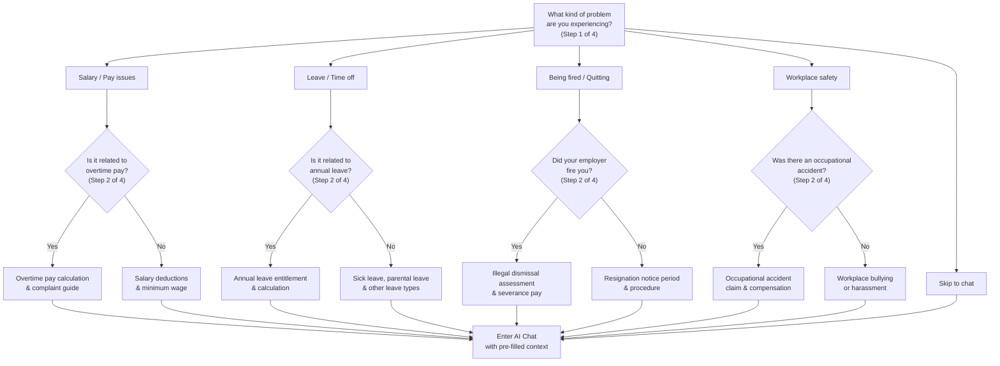

# Epic 01: AI Chat Interface

## Overview

The core conversational interaction layer of the Labor Law Assistant. This epic covers the basic Q&A interface, contextual question guidance, layered information display, voice input, and conversation history. Together these features enable users to ask labor law questions naturally and receive structured, understandable answers.

## Feature List

| Feature ID | Name | Priority | Description |
|---|---|---|---|
| M-05 | Basic Q&A Interface | Must Have | Clean conversational query interface |
| M-01 | Contextual Question Guidance | Must Have | Guide questions based on user identity and context |
| M-03 | Layered Information Display | Must Have | Summary first, expandable detailed legal articles |
| M-14 | PII Auto-Sanitization | Must Have | Detect and mask sensitive personal information in user input |
| M-15 | Simplified Wizard Mode | Must Have | Step-by-step yes/no guidance for low digital literacy users |
| S-02 | Voice Input | Should Have | Speech-to-text queries |
| S-08 | Conversation History | Should Have | Save query history (local storage) |

---

## MVP Scope (Must Have)

### M-05: Basic Q&A Interface

**User Story**
> As a user, I want a simple chat-like interface to ask labor law questions, so that I can get answers without navigating complex menus.

**Acceptance Criteria**
- [ ] Single-page chat interface with message input area and conversation display
- [ ] Support text input with send button and Enter key submission
- [ ] Display AI responses with streaming text generation (token-by-token)
- [ ] Show typing/loading indicator while AI is generating response
- [ ] Responsive layout that works on mobile (375px+) and desktop
- [ ] Input field auto-focuses on page load
- [ ] Support multi-turn conversation (follow-up questions maintain context)
- [ ] Display timestamps on messages
- [ ] Auto-scroll to latest message

**UI Mockup**
```
+----------------------------------+
|     Labor Law Assistant          |
+----------------------------------+
|                                  |
|  [AI] Welcome! What labor law    |
|  question can I help you with?   |
|                                  |
|       [User] How is overtime     |
|       pay calculated?            |
|                                  |
|  [AI] Overtime pay is calculated |
|  at 1.34x-1.67x hourly rate...  |
|  [Source: Labor Standards Act    |
|   Article 24]                    |
|                                  |
+----------------------------------+
| Type your question...     [Send] |
+----------------------------------+
```

---

### M-01: Contextual Question Guidance

**User Story**
> As a general worker, I want the system to guide me in describing my problem, because I don't know legal terminology and I'm not sure which category my problem falls into.

**Acceptance Criteria**
- [ ] Homepage displays identity selection: "I am a Worker", "I am an Employer", "I am HR"
- [ ] Based on identity, show corresponding common scenarios (salary, leave, resignation, etc.)
- [ ] Each scenario provides 5-10 question templates
- [ ] Users can directly click or modify templates
- [ ] Support free-form input with keyword suggestions
- [ ] Identity selection is optional (can skip directly to free-form input)
- [ ] Question templates are stored in a configurable data source (not hardcoded)
- [ ] Track which templates are most used (for optimization)

**UI Mockup**
```
+---------------------------------+
|      Labor Law Assistant        |
+---------------------------------+
|                                 |
|   I want to understand my       |
|   labor rights. I am...         |
|                                 |
|  +---------+ +---------+       |
|  | Worker  | | Employer|       |
|  +---------+ +---------+       |
|       +---------+              |
|       |   HR    |              |
|       +---------+              |
|                                 |
|  ------- or type directly ----- |
|  +-------------------------+   |
|  | Type your question...   |   |
|  +-------------------------+   |
|                                 |
+---------------------------------+
```

**Scenario Templates (Worker)**
| Scenario | Sample Questions |
|----------|----------------|
| Salary & Overtime | "How is overtime pay calculated?", "Can my employer deduct my salary?", "What is the current minimum wage?" |
| Leave & Rest | "How many annual leave days do I have?", "What are the sick leave rules?", "Can my employer deny my leave request?" |
| Resignation & Severance | "How much is my severance pay?", "How many days notice must I give?", "Can my employer fire me without reason?" |
| Workplace Issues | "What should I do about workplace bullying?", "How do I report sexual harassment?", "I was injured at work, what are my rights?" |

---

### M-01 & M-15 Integration Strategy

M-01 (Contextual Guidance) and M-15 (Simplified Wizard Mode) share the same underlying infrastructure to avoid maintaining two separate systems.

**Unified Architecture**:
```
Homepage Entry
    |
    +-- Option A: "I know what to ask" → M-01 Scenario Selector → Free-form chat
    +-- Option B: "I don't know how to ask" → M-15 Wizard Mode → Guided yes/no flow → Chat
    +-- Option C: "Quick search" → Direct text input → Chat
```

**Shared Infrastructure**:
- Both use a unified Question Configuration DB (single data source)
- M-01 scenario templates = leaf nodes of the wizard decision tree
- M-15 wizard questions = intermediate nodes of the decision tree
- CMS admin interface manages ONE tree structure, generating both UX modes

**Development Order**:
1. Sprint 5: Build M-01 scenario selector + template library (MVP foundation)
2. Sprint 6: Add M-15 wizard layer on top (progressive enhancement using the same tree)
3. Sprint 7: Usability test both modes with low-literacy users (5 participants)

**UX Rule**: M-15 wizard is NOT a separate tool, but an alternative navigation path to the same chat endpoint. Both modes ultimately produce a user query that enters the standard RAG pipeline.

---

### M-03: Layered Information Display

**User Story**
> As a general worker, I want to see a simple answer first and only see detailed legal articles if needed, because too much information will make me give up reading.

**Acceptance Criteria**
- [ ] Layer 1: Direct answer (within 30 characters, heading-level text)
- [ ] Layer 2: Plain language explanation (within 200 characters, readable inline)
- [ ] Layer 3: Legal article citations (expandable/collapsible)
- [ ] Layer 4: Related cases (expandable/collapsible)
- [ ] Layer 5: Extended reading (link list)
- [ ] Each layer displays a "confidence" indicator
- [ ] Response footer shows "data update date"
- [ ] Expand/collapse state persists during the session
- [ ] Smooth expand/collapse animation (< 300ms)

**UI Mockup**
```
+---------------------------------------------+
| Your question: How is overtime pay calculated?|
+---------------------------------------------+
|                                              |
| Direct Answer                                |
| Weekday overtime is 1.34-1.67x hourly rate   |
|                                              |
| Detailed Explanation                         |
| Per the Labor Standards Act, weekday overtime |
| first 2 hours are 1.34x hourly rate,        |
| hours 3-4 are 1.67x...                      |
|                                              |
| > View original legal text                   |
| > View calculation examples                  |
| > Use overtime calculator                    |
|                                              |
| ------------------------------------------- |
| Confidence: High | Updated: 2026-01-15      |
| Warning: This is reference info, not legal   |
| advice                                       |
|                                              |
| [Helpful] [Not Helpful] [Report Error]       |
+---------------------------------------------+
```

---

### M-14: PII Auto-Sanitization

**User Story**
> As a user who may accidentally share personal information, I want the system to automatically detect and mask my sensitive data, so that my privacy is protected.

**Acceptance Criteria**
- [ ] Detect Taiwan National ID numbers (regex: `[A-Z][12]\d{8}`) and mask to `A1****xxxx`
- [ ] Detect phone numbers (regex: `09\d{2}-?\d{3}-?\d{3}`, `0\d{1,2}-?\d{3,4}-?\d{3,4}`) and mask to `09xx-xxx-xxx`
- [ ] Detect email addresses and mask to `u***@***.com`
- [ ] Sanitization runs on user input BEFORE sending to LLM API (server-side)
- [ ] Display notification to user: "We have automatically removed personal information from your message to protect your privacy."
- [ ] Original unsanitized input is NOT stored in any log or database
- [ ] Sanitization is also applied to voice input transcriptions (S-02)
- [ ] Admin can configure additional PII patterns via environment config
- [ ] Log sanitization event count (not content) for monitoring abuse patterns
- [ ] PII patterns are tested against common Taiwan formats (ID, phone, ARC number)

---

### M-15: Simplified Wizard Mode

**User Story**
> As a user with low digital literacy, I want a step-by-step guided process with simple yes/no questions, so that I can get answers without needing to type or describe my problem.

**Acceptance Criteria**
- [ ] Homepage offers a visible "I don't know how to ask" entry point alongside the identity selector
- [ ] Wizard uses simple yes/no or multiple-choice questions (e.g., "Do you have a problem with your salary?")
- [ ] Maximum 5 questions to reach a scenario and generate a relevant response
- [ ] All questions use 6th-grade reading level language
- [ ] Wizard provides a visual progress indicator (e.g., "Step 2 of 4")
- [ ] Users can go back to previous questions or exit to free-form input at any time
- [ ] Wizard results include the same layered display format (M-03) and action guide (M-06)
- [ ] Wizard question tree is configurable via admin (not hardcoded)
- [ ] Wizard tested with low-literacy users (5 participants in Phase 0.5)
- [ ] Track wizard completion rate and drop-off step for optimization

**UI Mockup (Wizard Decision Flow)**



---

## Error Handling & Edge Cases

| Scenario | Handling | User Message |
|----------|----------|-------------|
| LLM API timeout (>10s) | Retry once with GPT-4o-mini fallback | "Response is taking longer than expected. Trying an alternative..." |
| LLM API failure (both providers) | Show cached FAQ if query matches, else error | "We're experiencing technical difficulties. Here are some common answers that may help: [FAQ links]" |
| RAG retrieval returns no results (similarity < threshold) | Skip RAG, use LLM general knowledge with low confidence | "I couldn't find a specific legal article for your question. Here's general guidance (low confidence)..." |
| User input is empty or too short (<3 chars) | Prevent submission | "Please describe your question in more detail." |
| User input is too long (>2000 chars) | Truncate with warning | "Your message was truncated to 2000 characters. Please try to be more concise." |
| User asks system to help circumvent regulations | Refuse per User Rights Charter #1 | "This system is designed to protect workers' rights. We cannot assist with circumventing labor regulations." |
| User input contains profanity/spam | Filter, allow resubmission | "Please rephrase your question. We're here to help with labor law questions." |
| Rate limiting triggered (>20 queries/hour) | Throttle with countdown | "You've reached the query limit. Please try again in [X] minutes." |
| WebSocket/SSE disconnection during streaming | Auto-reconnect, resume from last token | "Connection interrupted. Reconnecting..." |
| Browser doesn't support Web Speech API (S-02) | Hide microphone button | (No voice input shown) |

---

## Extended Scope (Should Have)

### S-02: Voice Input

**User Story**
> As a user with limited typing ability (elderly, injured, or multitasking), I want to ask questions by speaking, so that I can still use the system without typing.

**Acceptance Criteria**
- [ ] Microphone button in the input area
- [ ] Browser-native Web Speech API for speech-to-text
- [ ] Visual feedback during recording (animation, waveform)
- [ ] Transcribed text appears in input field for review/edit before sending
- [ ] Support Traditional Chinese (zh-TW) speech recognition
- [ ] Graceful fallback if browser doesn't support Web Speech API
- [ ] Clear permission prompt for microphone access
- [ ] Stop recording button and auto-stop after silence (3 seconds)
- [ ] Support Taiwanese Hokkien and Hakka speech recognition via fallback to Google Cloud Speech-to-Text
- [ ] Display transcription confidence score; if low (<70%), prompt user to retype or use simpler words
- [ ] Provide voice input tutorial (30-second guide with captions, accessible without audio)

---

### S-08: Conversation History

**User Story**
> As a returning user, I want to see my previous queries, so that I don't have to re-ask the same questions.

**Acceptance Criteria**
- [ ] Store conversation history in browser LocalStorage/IndexedDB
- [ ] Display history list with query preview and timestamp
- [ ] Click on history item to view full conversation
- [ ] Delete individual history items
- [ ] Clear all history option
- [ ] History persists across browser sessions (same device)
- [ ] Maximum storage limit (e.g., 100 conversations) with oldest auto-purge
- [ ] No server-side storage (privacy-first)
- [ ] Export conversation as text/PDF (optional enhancement)

---

## Technical Dependencies

| Dependency | Component | Notes |
|------------|-----------|-------|
| FastAPI WebSocket / SSE | Backend | For streaming AI responses |
| Vercel AI SDK | Frontend | React hooks for chat streaming |
| react-markdown | Frontend | Render markdown in AI responses |
| Web Speech API | Browser | Voice input (S-02) |
| LocalStorage / IndexedDB | Browser | Conversation history (S-08) |
| TanStack Query | Frontend | Server state management for chat |
| Zustand | Frontend | Client state (UI state, active conversation) |

## Epic Dependencies

| Relationship | Epic | Reason |
|-------------|------|--------|
| **Depends on** | Epic 02 (RAG Legal Search) | Chat responses require RAG retrieval for meaningful answers |
| **Integrates with** | Epic 03 (Response Quality) | Chat UI displays confidence scores, disclaimers, and feedback buttons |
| **Integrates with** | Epic 04 (Action Guide) | Chat responses include action guide sections |
| **Can develop in parallel** | Epic 05 (Accessibility) | A11y is a cross-cutting concern applied to chat UI |
| **Can develop in parallel** | Epic 06 (Calculators) | Calculators are standalone but link back to chat via "Ask AI" |

> **Recommended development order**: Start with chat UI shell (M-05) in Sprint 5-6, after Epic 02 RAG foundation is ready (Sprint 1-4). M-01 guided Q&A and M-03 layered display depend on RAG responses.

## Related ADRs

- [ADR-002: FastAPI as Web Framework](../../adr/002-web-framework-fastapi.md)
- [ADR-004: Next.js as Frontend Framework](../../adr/004-frontend-nextjs.md)
- [ADR-008: LLM Provider (Claude Sonnet 4.5)](../../adr/008-llm-provider.md)
- [ADR-009: Authentication Strategy](../../adr/009-authentication-strategy.md)
