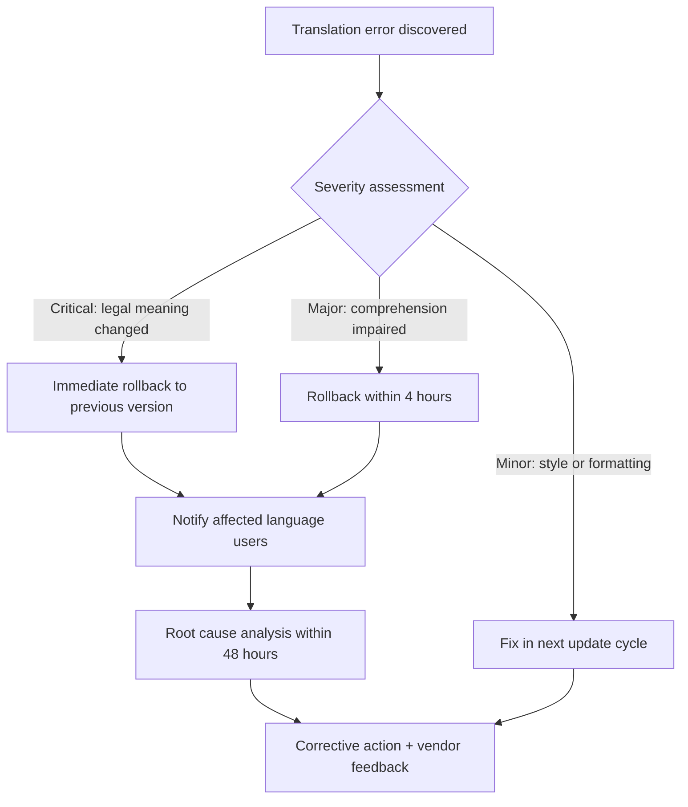

# Epic 05: Accessibility & Internationalization

## Overview

The inclusive design layer ensuring the Labor Law Assistant is usable by all Taiwan workers, regardless of physical ability, device, or language. This epic covers mobile-first responsive design, WCAG 2.1 AA accessibility compliance, and multilingual support for foreign workers.

## Feature List

| Feature ID | Name | Priority | Description |
|---|---|---|---|
| M-11 | Mobile-First Design | Must Have | Mobile-First responsive web design |
| M-12 | Accessibility Basics | Must Have | WCAG 2.1 AA compliance |
| S-01 | Multi-language Support | Should Have | Vietnamese, Indonesian, Thai, Filipino |

---

## MVP Scope (Must Have)

### M-11: Mobile-First Design

**User Story**
> As a worker who primarily uses a mobile phone, I want the system to work perfectly on my phone, so that I can query labor law information anytime, anywhere.

**Acceptance Criteria**
- [ ] Mobile-first CSS approach (design for mobile, enhance for desktop)
- [ ] Responsive breakpoints: 375px (mobile), 768px (tablet), 1024px (laptop), 1280px (desktop)
- [ ] All interactive elements have minimum 44x44px touch targets
- [ ] Single-column layout on mobile, multi-column on desktop
- [ ] Navigation collapses to hamburger menu on mobile
- [ ] Chat input is fixed at bottom of viewport on mobile
- [ ] No horizontal scrolling at any viewport width
- [ ] Images and diagrams are responsive (max-width: 100%)
- [ ] Font sizes are readable without zooming (minimum 16px body text)
- [ ] Test on: iPhone SE, iPhone 15, Samsung Galaxy S23, iPad
- [ ] Lighthouse mobile performance score >= 90
- [ ] First Contentful Paint < 2 seconds on 3G connection
- [ ] Support PWA manifest (installable on home screen)
- [ ] Offline fallback page for no-connectivity scenarios

**Responsive Layout Strategy**
| Viewport | Layout | Navigation | Chat Input |
|----------|--------|------------|------------|
| < 640px (mobile) | Single column, full width | Hamburger menu | Fixed bottom bar |
| 768px (tablet) | Single column, centered (720px) | Side panel (collapsible) | Fixed bottom bar |
| 1024px+ (desktop) | Two-column (sidebar + main) | Persistent sidebar | Inline at bottom of chat |

#### Offline Capability Scope

| Feature | Online Required | Offline Support | Strategy |
|---------|:--------------:|:---------------:|----------|
| AI Chat | Yes | No | Requires LLM API; show offline fallback page |
| Calculator | No | Yes | Client-side JavaScript, no API dependency |
| FAQ Cache | No | Yes | Service Worker pre-caches top 50 FAQ responses |
| Conversation History | No | Yes | LocalStorage; sync when reconnected |
| Legal DB Search | Yes | No | Requires pgvector API; show offline fallback |
| Emergency Contacts | No | Yes | Static data cached in Service Worker |

**Service Worker Caching Strategy**:
- **Cache-first**: Static assets (CSS, JS, images), emergency contact data, calculator logic
- **Network-first**: AI chat, RAG search, FAQ content (fallback to cached version if offline)
- **Stale-while-revalidate**: FAQ list, legal article metadata
- Cache storage limit: ~5 MB per origin (conservative for low-end devices)

> **Cross-reference**: See [ADR-010: Deployment Infrastructure](../../adr/010-deployment-infrastructure.md) for PWA hosting and Service Worker deployment details.

---

### M-12: Accessibility Basics

**User Story**
> As a visually impaired user, I want to use the system with my screen reader, so that I can access labor law information independently.

**Acceptance Criteria**

**Perceivable**
- [ ] All images have descriptive alt text
- [ ] All form inputs have associated labels
- [ ] Color is never the sole means of conveying information
- [ ] Text contrast ratio >= 4.5:1 (normal text), >= 3:1 (large text)
- [ ] High contrast mode toggle available
- [ ] Text is scalable to 200% without loss of functionality
- [ ] All non-text content has text alternatives

**Operable**
- [ ] Full keyboard navigation (Tab, Shift+Tab, Enter, Escape, Arrow keys)
- [ ] Visible focus indicators on all interactive elements
- [ ] Skip-to-content link at the top of every page
- [ ] No keyboard traps
- [ ] No time-limited interactions
- [ ] Focus management for dynamic content (chat messages, modals)
- [ ] Escape key closes modals and overlays

**Understandable**
- [ ] Page language declared in HTML lang attribute (zh-TW)
- [ ] Consistent navigation across all pages
- [ ] Form validation errors clearly described with suggestions
- [ ] Labels and instructions provided for user input
- [ ] Plain language used (see Appendix G content strategy)

**Robust**
- [ ] Valid, semantic HTML5 (header, main, nav, article, section, footer)
- [ ] ARIA landmarks for major page sections
- [ ] ARIA live regions for dynamic updates (chat messages, notifications)
- [ ] Compatible with: NVDA (Windows), JAWS (Windows), VoiceOver (macOS/iOS), TalkBack (Android)
- [ ] All interactive components use appropriate ARIA roles
- [ ] Tested with axe-core automated accessibility checker (0 critical issues)

**Accessibility Testing Plan**
| Test Type | Tool | Frequency | Target |
|-----------|------|-----------|--------|
| Automated scan | axe-core + Lighthouse | Every PR | 0 critical, 0 serious |
| Screen reader | VoiceOver, NVDA | Weekly (during development) | All flows navigable |
| Keyboard-only | Manual testing | Every feature | Full functionality |
| Color contrast | Colour Contrast Analyser | Design phase | >= 4.5:1 |
| Zoom | Browser zoom 200% | Every feature | No loss of functionality |

---

## Extended Scope (Should Have)

### S-01: Multi-language Support

**User Story**
> As a Vietnamese worker in Taiwan, I want to use the system in my native language, so that I can understand labor law information despite the language barrier.

**Acceptance Criteria**
- [ ] Language selector accessible from every page (top navigation)
- [ ] Supported languages (Phase 2): Vietnamese, Indonesian, Thai, Filipino
- [ ] UI text (buttons, labels, navigation) fully translated
- [ ] AI responses generated in the selected language
- [ ] Legal article citations shown in both original Chinese and translated version
- [ ] Disclaimer translated into all supported languages
- [ ] Emergency resources display language-specific hotline info (1955 supports multilingual)
- [ ] Language preference persisted in session/cookie
- [ ] Fallback to Traditional Chinese if translation is unavailable
- [ ] RTL layout not required (no RTL languages in scope)

**i18n Architecture**
| Layer | Approach | Library |
|-------|----------|---------|
| UI text | Static translation files (JSON) | next-intl or react-i18next |
| AI responses | LLM generates in target language | Claude Sonnet 4.5 multilingual |
| Legal citations | Pre-translated + machine translated | Human review required |
| URL structure | `/[locale]/...` path prefix | Next.js i18n routing |

**Translation Priority**
| Language | Target Users | Estimated Translation Effort | Timeline |
|------|---------|---------|------|
| Traditional Chinese | All local users | Baseline (done) | MVP |
| Simplified Chinese | Lower literacy users | Rewrite (not machine translate) | MVP |
| Vietnamese | ~230K workers | Professional + review | V2 |
| Indonesian | ~260K workers | Professional + review | V2 |
| Thai | ~70K workers | Professional + review | V2 |
| Filipino | ~150K workers | Professional + review | V2 |
| English | Other foreign nationals | In-house | V3 |

**Translation Quality Assurance**
1. Professional human translation (native speaker with legal domain knowledge)
2. Review by bilingual labor rights advocate
3. User testing with target language speakers (5 users per language)
4. Continuous feedback loop for improvement

**Additional QA Acceptance Criteria**
- [ ] Each language has at least 10 core FAQ translations reviewed by native legal professional
- [ ] Comprehension test: 5 target-language users correctly interpret 80%+ of key legal concepts
- [ ] "Report translation error" button on every translated response
- [ ] Translation version control: track when each translation was last updated
- [ ] Automated CI check: all UI translation keys have values for all enabled languages (no missing keys)
- [ ] Legal disclaimer translations verified by bilingual legal advisor
- [ ] Playwright visual regression test passes for each enabled language (no layout regression between releases)
- [ ] No text truncation or button overflow detected in any enabled language at all responsive breakpoints
- [ ] Cross-lingual UI consistency test plan executed per [testing-strategy.md §8](../../testing/testing-strategy.md) detailed test procedures

#### Translation Vendor Management

**Vendor Selection Criteria**

| Criteria | Requirement | Weight |
|----------|-------------|:------:|
| Legal domain expertise | Demonstrated experience translating legal documents (labor law preferred) | 25% |
| Native speaker status | Must be native speaker of the target language | 20% |
| Taiwan labor law familiarity | Basic understanding of Taiwan labor regulations and terminology | 15% |
| Turnaround time | Initial translation within 10 business days per 5,000 words | 10% |
| Cost range | Within market rate: NT$ 2-5/word (varies by language pair) | 10% |
| NDA willingness | Must sign NDA covering all translated content and source materials | 5% |
| Test translation pass rate | Score >= 85% on a 500-word test translation evaluated by Legal Advisor | 10% |
| Tool compatibility | Ability to work with i18n JSON key-value format and translation management tools | 5% |

**Vendor SLAs**

| SLA Metric | Target | Measurement |
|------------|--------|-------------|
| Initial translation turnaround | 10 business days per 5,000 words | Delivery date vs. agreed deadline |
| Review turnaround | 5 business days after translator delivery | Review completion date |
| Urgent turnaround - P0 | 24 hours for critical legal content corrections | Delivery timestamp |
| Error correction turnaround | 3 business days after error report | Fix delivery date |
| Availability | Respond to communications within 1 business day | Response timestamp |
| Communication responsiveness | Acknowledge new project briefs within 4 hours during business hours | Acknowledgment timestamp |

**Translation Cost Budget**

| Language | Estimated Volume | Unit Cost (NT$/word) | Total Cost (NT$) | Timeline |
|----------|:----------------:|:--------------------:|:----------------:|----------|
| Simplified Chinese (zh-CN) | 15,000 words | 1.5 (rewrite, not translate) | 22,500 | MVP |
| Vietnamese (vi) | 15,000 words | 3.5 | 52,500 | V2 |
| Indonesian (id) | 15,000 words | 3.0 | 45,000 | V2 |
| Thai (th) | 15,000 words | 3.5 | 52,500 | V2 |
| Filipino (fil) | 15,000 words | 3.0 | 45,000 | V2 |
| English (en) | 15,000 words | 2.0 (in-house) | 30,000 | V3 |
| **Total** | **90,000 words** | | **NT$ 247,500** | |

> **Note**: Costs are estimates for initial translation only. Ongoing maintenance (monthly updates, new content) estimated at ~10% of initial cost per year. See [Appendix L: MVP Development Budget](../README.md#appendix-l-mvp-development-budget) for budget integration.

**Escalation Procedures**

1. **Translation quality dispute**: Translator -> i18n Team Lead -> Legal Advisor -> Product Owner (escalation within 2 business days per level)
2. **Missed SLA**: Auto-notification at 80% of SLA elapsed -> i18n Team Lead escalation -> vendor penalty clause activation (3 consecutive misses trigger vendor review)
3. **Legal accuracy concern**: Immediate halt of publication -> Legal Advisor review within 24 hours -> corrective action plan within 48 hours

**Rollback Procedures**

Rollback steps:
1. Detect error via user report, QA check, or automated CI
2. Assess severity: Critical / Major / Minor
3. Execute rollback via translation version control — revert JSON translation file to last tagged version
4. Notify users viewing affected language: "Translation is being updated. Showing previous version."
5. Root cause analysis within 48 hours
6. Vendor feedback and preventive action documented

> **CI/CD Integration**: Translation rollback is integrated into the CI/CD pipeline. See [testing-strategy.md §11](../../testing/testing-strategy.md) for pipeline design including automated translation coverage checks, merge blocking on incomplete translations, and staging rollback verification.

**Continuous Improvement Metrics**

| Metric | Target | Measurement Frequency | Owner |
|--------|--------|:---------------------:|-------|
| Translation error rate | < 2% of translated strings per release | Per release | i18n Team Lead |
| User comprehension score | > 85% correct interpretation in usability test | Quarterly | UX Designer |
| Vendor on-time delivery rate | > 95% of deliveries within SLA | Monthly | i18n Team Lead |
| Translation feedback positive rate | > 80% positive on "Was this translation helpful?" | Monthly | Product Owner |
| Time-to-fix for reported errors | < 24 hours for Critical, < 72 hours for Major | Per incident | i18n Team Lead |
| Terminology consistency score | > 98% adherence to glossary terms | Per release (automated) | QA Engineer |
| Translation coverage | 100% of enabled UI keys have translations | Per deployment (CI check) | DevOps |

> **Cross-reference**: For regulation content update SLA by priority level (P0: 24hr / P1: 3 days / P2: 7 days), see [PRD Appendix G.4](../README.md#appendix-g-content-strategy--update-plan).

---

## Error Handling & Edge Cases

| Scenario | Handling | User Message |
|----------|----------|-------------|
| Screen reader cannot parse dynamic chat content | Use ARIA live regions with polite announcements | (Screen reader announces new messages automatically) |
| High contrast mode breaks chart/diagram readability | Provide text-only alternative for all visual content | "View as text table" link for every chart |
| Zoom to 200% causes layout overlap | Tested at all breakpoints, single-column reflow | (Layout adjusts gracefully) |
| Keyboard focus lost after dynamic content update | Programmatic focus management to new content | (Focus moves to latest chat message) |
| Touch target too small on older Android devices | Minimum 48x48px on mobile, verified via Lighthouse | (Larger touch targets on mobile) |
| Translation missing for specific legal term | Show original Chinese with annotation | "[Chinese term] (translation pending)" |
| AI generates response in wrong language | Detect language mismatch, re-prompt LLM | "Regenerating response in your selected language..." |
| i18n route returns 404 for unsupported locale | Redirect to default locale (zh-TW) | "This language is not yet supported. Showing Traditional Chinese." |
| PWA offline mode with missing translations | Cache critical translations in service worker | (Cached translations available offline) |

---

## Technical Dependencies

| Dependency | Component | Notes |
|------------|-----------|-------|
| Next.js 15 App Router | Frontend | i18n routing, SSR for SEO |
| next-intl or react-i18next | Frontend | Static translation management |
| Tailwind CSS | Frontend | Responsive design, utility-first CSS |
| shadcn/ui | Frontend | Accessible component library (ARIA built-in) |
| axe-core | Testing | Automated accessibility testing |
| Playwright | Testing | Cross-browser accessibility testing |
| Lighthouse CI | CI/CD | Performance and accessibility scoring per PR |

## Epic Dependencies

| Relationship | Epic | Reason |
|-------------|------|--------|
| **Depends on** | None | Cross-cutting concern, can start anytime |
| **Applied to** | All Epics | Accessibility and i18n affect every UI component |
| **Can develop in parallel** | All Epics | A11y/i18n work is layered on top of features |

> **Recommended development order**: M-11 (RWD) and M-12 (a11y basics) should be established as design system foundations in Sprint 1-2, then enforced throughout all subsequent sprints. S-01 (multi-language) is Phase 2 work.

## Related ADRs

- [ADR-004: Next.js as Frontend](../../adr/004-frontend-nextjs.md) - App Router, i18n routing
- [ADR-008: LLM Provider](../../adr/008-llm-provider.md) - Multilingual response generation
- [ADR-010: Deployment Infrastructure](../../adr/010-deployment-infrastructure.md) - Vercel global CDN for APAC performance
