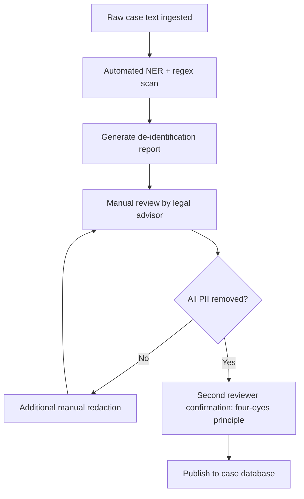
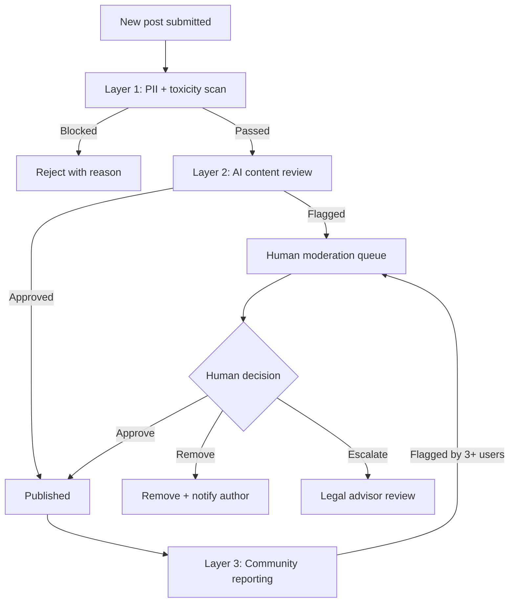
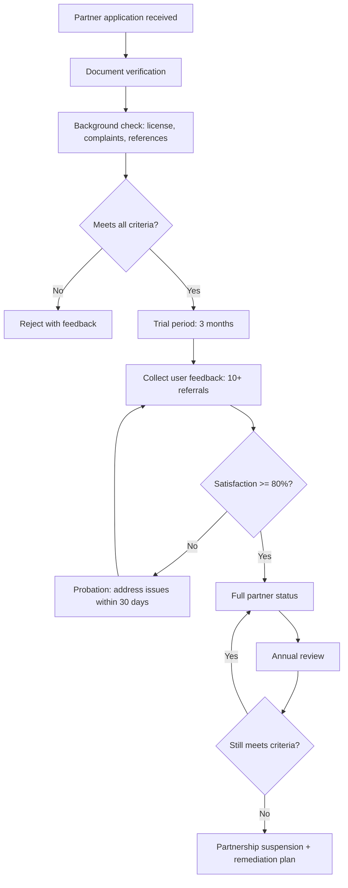
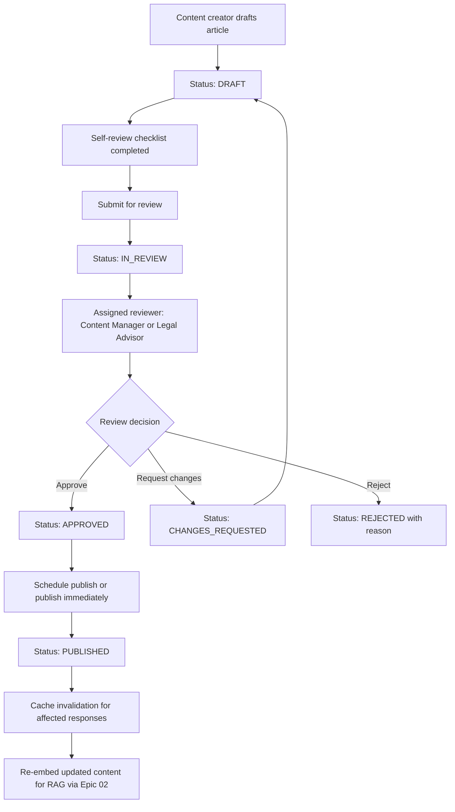

# Epic 07: Future Features (Phase 3+)

## Overview

Advanced features planned for Phase 3+ that extend the Labor Law Assistant beyond core Q&A into case learning, community support, expert connections, and operational management. These features will be evaluated for development at the Phase 4 decision point (3 months post-launch) using the RICE scoring framework defined in PRD Section 5.3.

## Feature List

| Feature ID | Name | Priority | Description |
|---|---|---|---|
| C-01 | Document Template Library | Could Have | Labor contract and regulation templates download |
| C-02 | Compliance Self-Assessment Tool | Could Have | Enterprise labor law compliance check |
| C-03 | Case Database | Could Have | De-identified real case analysis and learning |
| C-04 | Community Forum | Could Have | Anonymous experience sharing and mutual support |
| C-05 | Expert Referral Service | Could Have | Lawyer and labor organization connections |
| C-06 | Analytics Dashboard | Could Have | Usage data visualization and system operations |
| C-07 | CMS Content Management | Could Have | Backend legal content management (merged with C-06) |

---

## C-01: Document Template Library (Placeholder)

> Detailed specification will be created at Phase 4 decision point after RICE scoring with real usage data (PRD Section 5.3).

**User Story**
> As an HR staff or small business owner, I want to download standard labor contract and regulation templates, so that I can ensure my employment documents comply with Taiwan labor law.

**Brief Description**: Downloadable templates including labor contracts, salary statements, leave request forms, termination notices, and workplace safety checklists. All templates reviewed by Legal Advisor for accuracy.

**Estimated Effort**: 2-3 sprints

**Prerequisites**:
- Legal Advisor review of all templates for compliance
- Template version control system (reuse C-07 CMS infrastructure)
- PDF generation capability

**RICE Score (Estimated)**: Reach 800, Impact 2, Confidence 70%, Effort 10 weeks → RICE = 112 (see PRD Section 5.3)

**Epic Assignment**: TBD at Phase 4 — may create new Epic or extend Epic 04

---

## C-02: Compliance Self-Assessment Tool (Placeholder)

> Detailed specification will be created at Phase 4 decision point after RICE scoring with real usage data (PRD Section 5.3).

**User Story**
> As a small business owner, I want to check if my company complies with major labor regulations, so that I can identify and fix compliance gaps before they become legal problems.

**Brief Description**: Interactive checklist covering key areas of Taiwan labor law compliance (working hours, overtime, leave, salary, insurance, workplace safety). Generates a compliance score and identifies specific gaps with links to relevant legal articles.

**Estimated Effort**: 3-4 sprints

**Prerequisites**:
- Legal database complete (Epic 02 M-13)
- Legal Advisor review of assessment criteria and scoring logic
- Integration with RAG pipeline for contextual explanations

**RICE Score (Estimated)**: Reach 300, Impact 2, Confidence 60%, Effort 14 weeks → RICE = 26 (see PRD Section 5.3)

**Epic Assignment**: TBD at Phase 4 — may create new Epic or extend Epic 06

---

## C-03: Case Database

**User Story**
> As a worker facing a labor dispute, I want to see how similar cases were resolved, so that I can understand what to expect and make informed decisions.

**Acceptance Criteria**
- [ ] Browse cases by category: salary, dismissal, harassment, occupational injury, leave, contract, insurance
- [ ] Each case includes: scenario summary, legal issues involved, resolution outcome, key takeaways
- [ ] All cases are fully de-identified following the De-identification Checklist below
- [ ] Each case links to relevant legal articles (integration with Epic 02 RAG)
- [ ] Search and filter by case type, law referenced, resolution channel, outcome
- [ ] Cases display a "relevance to your query" score when accessed from chat
- [ ] Minimum 30 cases at launch of C-03, growing by 5-10 per month
- [ ] Each case shows disclaimer: "Each case has unique circumstances. Outcomes may vary."

### Case Sourcing Channels

| Source | Method | Volume Estimate | Legal Clearance | Priority |
|--------|--------|:---------------:|-----------------|:--------:|
| Public court judgments - judicial.gov.tw | Automated crawl + manual curation | ~500 relevant cases/year | Public domain, no clearance needed | P0 |
| Labor mediation records | Partnership with county/city labor bureaus | ~50 anonymized cases/year | Requires government MOU | P1 |
| Legal Aid Foundation cases | Partnership with LAF | ~30 anonymized cases/year | Requires LAF data sharing agreement | P1 |
| NGO-contributed cases: TIWA, SPA | Voluntary contribution by partner NGOs | ~20 cases/year | Contributor consent + de-identification | P2 |
| User-submitted experiences | In-app submission form via C-04 forum | Variable | User consent + editorial review | P2 |

### De-identification Checklist

| PII Category | Detection Method | Replacement Strategy |
|-------------|-----------------|---------------------|
| Personal names | NER + regex | Replace with pseudonyms: "Worker A", "Employer B" |
| Company names | NER + business registry lookup | Replace with industry descriptors: "A mid-size manufacturing company" |
| Dates | Regex: YYYY/MM/DD patterns | Convert to relative time: "approximately 2 years ago" |
| Locations | NER + address regex | Generalize to region: "a northern Taiwan city" |
| ID numbers / ARC numbers | Regex: same as M-14 PII patterns | Remove entirely |
| Phone numbers | Regex: same as M-14 | Remove entirely |
| Monetary amounts | Preserve - essential for case understanding | Keep exact amounts |
| Job titles | Context-dependent manual review | Generalize if uniquely identifying |

### De-identification Pipeline

**Validation**: Each case must pass both automated scan (0 PII detections) AND manual review by a different person than the preparer (four-eyes principle).

### NER Model Selection

The automated NER scan in the De-identification Pipeline (Layer 1) requires a model optimized for Traditional Chinese text.

**Recommended Model**: `spaCy zh_core_web_trf` (transformer-based, Traditional Chinese)

**Target Entity Types**:
| Entity Type | Description | Example |
|-------------|-------------|---------|
| PERSON | Personal names | "王大明" |
| ORG | Organization / company names | "台積電股份有限公司" |
| GPE | Geographic / political entities (cities, districts) | "台北市信義區" |
| DATE | Date expressions | "2026年3月15日", "民國115年" |

**Supplementary Regex Patterns** (Taiwan-specific, complementing NER):
| Pattern | Regex | Example Match |
|---------|-------|---------------|
| National ID | `[A-Z][12]\d{8}` | A123456789 |
| Mobile phone | `09\d{2}-?\d{3}-?\d{3}` | 0912-345-678 |
| Company Tax ID (統一編號) | `\d{8}` (contextual) | 12345678 |
| ARC Number (居留證號) | `[A-Z]{2}\d{8,10}` | AB12345678 |

**Validation Criteria**:
- 50 manually curated test cases covering all entity types and regex patterns
- NER Recall target: >= 95% (missed PII is unacceptable; false positives are tolerable)
- Validation performed before pipeline goes live, and quarterly thereafter

**Fallback**: If automated NER Recall < 95% on validation set, all cases undergo full manual de-identification by Legal Advisor until model is retrained or replaced.

**Fallback Execution by Recall Level**:

| Recall Level | Action | Timeline | Owner |
|:------------:|--------|:--------:|-------|
| 90-95% | Add supplementary regex rules for missed patterns; quarterly model retraining with expanded training data | Within 1 month | AI Engineer |
| 85-90% | Hybrid approach: automated NER + mandatory manual review by 2 reviewers (four-eyes principle) | Immediate | Legal Advisor + Content Manager |
| < 85% | Suspend automated pipeline; full manual de-identification; evaluate alternative models (e.g., BERT-based Chinese NER, CKIP Transformers) | Immediate | Tech Lead + Legal Advisor |

> **Escalation**: If Recall remains below 90% after 2 quarterly retraining cycles, escalate to Tech Lead for model replacement decision at the next Phase 4 Decision Meeting.

### Categorization Scheme

| Dimension | Categories | Example |
|-----------|-----------|---------|
| Primary Law | Labor Standards Act, Labor Pension Act, Gender Equality in Employment Act, Occupational Safety and Health Act, Labor Incident Act, Employment Insurance Act, etc. | "Labor Standards Act" |
| Issue Type | Wages, Overtime, Leave, Dismissal, Harassment, Occupational Injury, Contract, Insurance | "Overtime pay dispute" |
| Resolution Channel | Direct negotiation, Labor bureau complaint, Mediation, Arbitration, Court | "Labor-management mediation" |
| Outcome | Favorable to worker, Favorable to employer, Settlement, Partial resolution, Pending | "Settlement" |
| Complexity | Simple: single issue, Medium: multiple issues, Complex: cross-law | "Medium" |
| Vulnerable Group Tag | Foreign worker, Elderly, Disabled, Part-time, Domestic worker, None | "Foreign worker" |

### Legal Review Requirements

Every case must be reviewed by the Legal Advisor before publication.

**Review checklist**:
1. De-identification complete (no residual PII)
2. Legal analysis accurate (correct law citations, correct interpretation)
3. Outcome correctly represented (no exaggeration or minimization)
4. No misleading generalizations (outcome cannot be extrapolated to all cases)
5. Disclaimer present and appropriate

**Review SLA**: Within 5 business days of submission
**Annual audit**: 10% random sample re-reviewed for continued accuracy

### Case Format Specification

| Field | Type | Required | Description |
|-------|------|:--------:|-------------|
| case_id | string | Yes | Unique identifier, e.g. "CASE-2026-001" |
| title | string | Yes | Descriptive title, max 50 characters |
| category_primary | enum | Yes | Primary law category |
| category_issues | array of enum | Yes | Issue type tags, 1-3 items |
| scenario_summary | text | Yes | De-identified scenario description, 200-500 characters |
| legal_issues | array of object | Yes | Legal articles involved + analysis |
| resolution_channel | enum | Yes | How the case was resolved |
| resolution_outcome | enum | Yes | Outcome category |
| resolution_detail | text | Yes | What happened, 200-300 characters |
| key_takeaways | array of string | Yes | 2-4 actionable lessons |
| related_articles | array of article_ref | Yes | Links to legal article DB via Epic 02 |
| source | enum | Yes | Sourcing channel |
| reviewed_by | string | Yes | Legal reviewer identifier |
| reviewed_date | date | Yes | Date of legal review |

---

## C-04: Community Forum

**User Story**
> As a worker who has experienced a labor dispute, I want to share my experience anonymously and learn from others, so that I feel supported and can make better decisions.

**Acceptance Criteria**
- [ ] Users can post anonymously (no registration required for reading; anonymous account for posting)
- [ ] Posts categorized by topic (same categories as C-03 case database)
- [ ] Upvote/downvote system for helpful responses
- [ ] "Verified information" badge for content confirmed by legal advisor
- [ ] Search and filter by topic, recency, popularity
- [ ] Report button on every post and comment
- [ ] AI-powered content moderation for first-pass filtering
- [ ] Human moderator review queue for flagged content

### Moderation Policy

**Core Principles**:
1. Protect user safety above all else
2. Maintain legal accuracy (no harmful legal misinformation)
3. Preserve anonymity and privacy
4. Foster supportive, non-judgmental community

**Prohibited Content**:

| Category | Examples | Action |
|----------|---------|--------|
| Personally identifiable information | Real names, company names, addresses | Auto-detect + immediate removal |
| Legal misinformation | Fabricated law citations, incorrect legal advice | Flag for legal review -> removal within 24hr |
| Hate speech / discrimination | Attacks based on nationality, gender, disability | Immediate removal + account suspension |
| Employer retaliation threats | Threatening posts from employers toward workers | Immediate removal + report to admin |
| Self-harm / suicide mentions | Direct or implied self-harm | Auto-detect -> show crisis resources: 1925 hotline + flag for human review |
| Spam / advertising | Commercial content, scams | Auto-detect + immediate removal |
| Doxxing | Exposing others' personal information | Immediate removal + permanent ban |

### Content Guidelines

Guidelines displayed to users before posting:
1. Use general descriptions - do not name specific companies or people
2. Share facts, not speculation
3. Be supportive and respectful
4. Include relevant law references when possible
5. Mark opinions clearly as opinions, not legal facts
6. Remember: forum content is NOT legal advice

### AI vs. Human Moderation Architecture

| Layer | Method | Coverage | Response Time |
|-------|--------|----------|:------------:|
| Layer 1: Automated | PII regex reusing M-14 patterns + keyword blocklist + toxicity classifier | 100% of posts | Real-time, < 1 second |
| Layer 2: AI Review | LLM-based content classification for legal accuracy check, tone assessment | Posts that pass Layer 1 | Within 5 minutes |
| Layer 3: Community | User reporting via flag button + trusted user flagging | Community-driven | Variable |
| Layer 4: Human | Moderator review queue for flagged/escalated content | Flagged posts only | Within 24 business hours |

### Safety Mechanisms

| Mechanism | Description |
|-----------|-------------|
| Auto-PII detection | Same regex patterns as M-14 applied to all posts |
| Rate limiting | Max 5 posts/day per anonymous session |
| Flood protection | Duplicate content detection via text similarity |
| Crisis intervention | Self-harm keyword detection triggers 1925 crisis resource display |
| Cooldown period | 30-second delay between posts to prevent harassment storms |
| Shadow banning | Persistent violators' content visible only to themselves |

### Account System

| Account Type | Capabilities | Data Stored |
|-------------|-------------|-------------|
| Anonymous reader | Browse, search, read | No data, no session |
| Anonymous poster | Post, comment, upvote, report | Session cookie only, no PII |
| Registered user (optional, via ADR-009 OAuth) | All above + notification preferences + post history | Email encrypted, display name as pseudonym |
| Trusted contributor | All above + "trusted" badge, can flag content for priority review | Same as registered |
| Moderator | All above + review queue access, content removal, user suspension | Staff account with audit log |

### Reporting and Appeal Process

1. **Report**: Any user can report content via flag button (select reason from predefined list)
2. **Review**: Human moderator reviews within 24 business hours
3. **Action**: Approve / Remove / Warn author / Suspend account
4. **Notification**: Author notified of action with reason
5. **Appeal**: Author can submit one appeal within 7 days
6. **Appeal Review**: Different moderator reviews appeal within 48 business hours
7. **Final Decision**: Second moderator's decision is final

---

## C-05: Expert Referral Service

**User Story**
> As a worker with a complex legal problem that the AI cannot fully address, I want to be connected with a qualified lawyer or labor organization, so that I can get professional help affordably or for free.

**Acceptance Criteria**
- [ ] System identifies when a query exceeds AI capability (low confidence, complex multi-issue cases)
- [ ] Automatic referral suggestion for low-confidence responses (integration with M-07)
- [ ] Referral directory categorized by: type, specialization, language support, cost
- [ ] Each partner entry shows: name, description, services offered, cost, contact info, operating hours, language support
- [ ] Users can filter partners by location, language, specialization, cost
- [ ] "Request referral" button generates a pre-formatted inquiry (no PII auto-included)
- [ ] Track referral click-through rate (anonymous, aggregate only)

### Partnership Criteria

| Criterion | Requirement | Verification Method |
|-----------|-------------|---------------------|
| Legal standing | Registered organization or licensed practitioner | Business registration / bar license check |
| Specialization | Labor law expertise, minimum 2 years | Portfolio review, case history |
| Language capability | Must serve at least one non-Chinese language (for foreign worker partners) | Self-declaration + user feedback |
| Free or affordable | Must offer free or sliding-scale services, at least partially | Fee schedule review |
| Ethical standards | No history of malpractice, complaint-free for 2+ years | Bar association check, reference check |
| Accessibility | Physical office or remote consultation available | Verification visit or interview |
| Outcome reporting | Agree to share anonymized resolution data for system improvement | Partnership agreement clause |
| NDA compliance | Agree to not use referral data for marketing | Partnership agreement clause |

### Potential Partners List

| Organization | Type | Services | Languages | Cost | Priority |
|-------------|------|----------|-----------|------|:--------:|
| Legal Aid Foundation - LAF | Legal aid | Free legal consultation, court representation | zh-TW, vi, id, th, fil, en | Free: income-qualified | P0 |
| County/City Labor Bureaus | Government | Mediation, complaint processing, labor inspection | zh-TW, some multilingual | Free | P0 |
| TIWA - Taiwan International Workers Association | NGO | Foreign worker advocacy, legal support, shelter | zh-TW, vi, id, th, fil | Free | P0 |
| SPA - TransAsia Sisters Association | NGO | New immigrant support, legal advocacy | zh-TW, vi, id | Free | P1 |
| Serve the People Association - Taoyuan | NGO | Foreign worker rights, legal aid | zh-TW, vi, id, th, fil | Free | P1 |
| Industry Unions | Union | Collective bargaining, legal support, membership benefits | zh-TW | Membership fee | P1 |
| TCTU - Taiwan Confederation of Trade Unions | Union | Policy advocacy, legal consultation | zh-TW | Free for members | P1 |
| Taipei Bar Association - Labor Law Committee | Bar association | Pro-bono labor law consultation | zh-TW, en | Free: limited slots | P2 |
| Private labor law firms | Law firm | Full legal representation | zh-TW, en | Paid: sliding scale available | P2 |

### Vetting Process

### Referral SLA

| SLA Metric | Target | Measurement |
|------------|--------|-------------|
| Directory information accuracy | Updated within 7 days of any change | Quarterly audit |
| Partner response to referral | Within 3 business days | User feedback survey |
| Referral satisfaction rate | >= 80% | Post-referral survey: optional, anonymous |
| Partner availability confirmation | Annual verification | Admin outreach |
| Complaint resolution | Within 14 business days | Ticket system |

### Fee Model

| Service Type | Fee to User | Fee to System | Revenue Model |
|-------------|-------------|---------------|---------------|
| Free legal aid referral: LAF, government | Free | Free | Non-commercial partnership |
| NGO referral: TIWA, SPA, etc. | Free | Free | Non-commercial partnership |
| Union referral | Union membership fee: user responsibility | Free | Non-commercial partnership |
| Pro-bono lawyer referral | Free: limited availability | Free | Volunteer arrangement |
| Paid lawyer referral | Lawyer's standard fee: disclosed upfront | No commission | User pays lawyer directly |

> **Note**: The system NEVER charges referral fees or commissions. Revenue model is purely non-commercial per [User Rights Charter #5](../README.md#23-user-rights-charter): "Core features permanently free."

### Liability Framework

| Aspect | Policy |
|--------|--------|
| Referral disclaimer | "This referral is informational only. We do not guarantee the quality of services provided by referred partners." |
| No agency relationship | System acts as information directory, NOT as agent of any partner |
| User responsibility | Users must independently evaluate referred partners |
| Partner malpractice | System is not liable for partner misconduct; user reports trigger review process |
| Data sharing | NO user query data shared with partners; user initiates contact independently |
| Complaint handling | System facilitates user complaints about partners through the vetting review cycle |
| Insurance | Evaluate E&O insurance for referral service at Phase 3 launch |

---

## C-06 + C-07: Admin Dashboard & CMS

**User Story (C-06 - Analytics Dashboard)**
> As an operations team member, I want to view usage analytics and system health data in a centralized dashboard, so that I can monitor system performance and make data-driven decisions.

**User Story (C-07 - Content Management)**
> As a content manager, I want to create, review, and publish legal content through a structured workflow, so that content updates are accurate and auditable.

**Acceptance Criteria**
- [ ] Dashboard requires authentication (admin accounts, not public-facing)
- [ ] Role-based access control for all admin functions
- [ ] Real-time usage metrics display: queries/day, active users, response times
- [ ] Content management workflow: Draft -> Review -> Publish with version control
- [ ] Audit trail for all content changes with mandatory change reason field

### Admin Roles

| Role | Description | Headcount - MVP |
|------|-------------|:---------------:|
| Super Admin | Full system access, role management, system configuration | 1: Tech Lead |
| Content Manager | Legal content CRUD, FAQ management, case database management, translation management | 1-2: Legal Advisor + Content Team |
| Operations Manager | Analytics viewing, user feedback review, support ticket overview | 1: Support Manager |
| Moderator | Forum moderation queue for C-04, content flagging review | 1-2: Support Specialist |
| Read-Only Viewer | Dashboard viewing only, no edit capabilities | Unlimited: stakeholders |

### Permission Matrix

| Function | Super Admin | Content Manager | Ops Manager | Moderator | Viewer |
|----------|:-----------:|:---------------:|:-----------:|:---------:|:------:|
| View analytics dashboard | Yes | Yes | Yes | No | Yes |
| Export analytics data | Yes | No | Yes | No | No |
| Manage legal articles - CRUD | Yes | Yes | No | No | No |
| Manage FAQ - CRUD | Yes | Yes | No | No | No |
| Manage case database - CRUD | Yes | Yes | No | No | No |
| Manage translation keys | Yes | Yes | No | No | No |
| Review and publish content | Yes | Yes | No | No | No |
| View feedback and error reports | Yes | Yes | Yes | Yes | Yes |
| Moderate forum content | Yes | No | No | Yes | No |
| Manage partner directory for C-05 | Yes | Yes | No | No | No |
| Manage user roles | Yes | No | No | No | No |
| System configuration | Yes | No | No | No | No |
| View audit trail | Yes | No | Yes | No | No |
| Manage emergency resources | Yes | Yes | No | No | No |

### RBAC Audit Trail

All role and permission changes are logged to maintain security accountability and regulatory compliance.

**Logged Events**:
| Event Type | Logged Data | Triggered By |
|------------|-------------|-------------|
| Role assignment | Target user, new role, assigning admin, timestamp, reason (mandatory) | Super Admin assigns role |
| Role revocation | Target user, removed role, revoking admin, timestamp, reason (mandatory) | Super Admin revokes role |
| Permission matrix update | Changed permission, old value, new value, admin, timestamp | Super Admin modifies permissions |
| Sensitive action | Action type (e.g., content deletion, user suspension), performing user, target, timestamp | Any admin performing destructive action |

**Storage**:
- Table: `admin_audit_log` in PostgreSQL
- Retention: 5 years (aligned with Taiwan Personal Data Protection Act record-keeping requirements)
- Indexing: by `event_type`, `performing_user`, `timestamp` for efficient querying

**Access Control**:
- View audit trail: Super Admin only (per Permission Matrix above)
- Audit log records are append-only (no edit, no delete)
- Export: CSV/JSON export available for Super Admin

**Quarterly Review**: Product Owner + Tech Lead review audit log summary quarterly. Review focus: unusual patterns, privilege escalation attempts, role churn. Findings documented in quarterly security review report.

### Feature Modules

**Module 1: Analytics Dashboard**
- Real-time metrics: DAU/MAU, queries/day, response time P50/P95, error rate
- Usage trends: daily/weekly/monthly charts
- Feature usage breakdown: chat vs. calculator vs. FAQ vs. emergency triggers
- Language distribution: queries by language
- Device distribution: mobile vs. desktop
- Geographic distribution: by county/city (anonymized, IP-based approximation)
- Feedback summary: positive rate, error report count, NPS trend
- Cost monitoring: LLM API cost daily/monthly, infrastructure cost

**Module 2: Content Management System**
- Legal article management: view, edit, version history, rollback
- FAQ management: create, edit, categorize, reorder, publish/unpublish
- Case database management for C-03: create, de-identification workflow, review, publish
- Translation management: view translation keys, coverage dashboard, mark for review
- Emergency resource directory: manage hotlines, partner contacts

**Module 3: Feedback and Support**
- Feedback review queue: browse thumbs-down feedback, error reports, user comments
- Feedback analytics: common issues, trending complaints, resolution tracking
- Support ticket overview: integration with ticket system (Freshdesk per Appendix J)

**Module 4: Forum Moderation (for C-04)**
- Moderation queue: flagged/reported content pending review
- User management: view anonymous sessions, suspend accounts, manage trusted contributors
- Content removal log with audit trail

### Content Workflow

**Version Control**:
- Every edit creates a new version with diff
- Rollback to any previous version with one click
- Audit trail: who changed what, when, and why (mandatory change reason field)

### Dashboard Metrics Definition

| Metric | Definition | Data Source | Refresh Rate |
|--------|-----------|-------------|:------------:|
| DAU | Unique sessions with >= 1 query in a day | Analytics: session cookie | Real-time |
| MAU | Unique sessions with >= 1 query in 30-day window | Analytics | Daily |
| Queries/Day | Total AI chat queries per day | Backend API log | Real-time |
| Response Time P95 | 95th percentile of API response latency | APM: Sentry | Real-time |
| Error Rate | Percentage of API responses returning 5xx | APM | Real-time |
| Positive Feedback Rate | Thumbs-up / total feedback per day | Feedback DB | Hourly |
| Error Report Count | Number of "Report Error" submissions per day | Feedback DB | Hourly |
| LLM Cost/Day | Sum of Claude API charges + fallback GPT-4o-mini charges | Provider billing API or token counting | Daily |
| Cache Hit Rate | Redis cache hits / total requests | Redis metrics | Real-time |
| FAQ Coverage | Percentage of queries matched by FAQ, bypassing LLM | Backend log | Daily |
| Emergency Trigger Count | Number of emergency keyword detections per day | Backend log | Real-time |
| Translation Coverage | Percentage of UI keys with translations for each enabled language | CI translation check | Per deployment |

---

## Error Handling & Edge Cases

| Scenario | Handling | User Message |
|----------|----------|-------------|
| De-identification failure detected post-publication (C-03) | Immediate case removal, incident report, re-run de-identification pipeline | Case temporarily unavailable. We are reviewing its content. |
| Mass-reporting abuse / coordinated flagging attack (C-04) | Detect anomaly: same IP or session reporting 10+ posts in 1 hour -> flag for admin review, do not auto-remove | (No user-facing message; admin alerted) |
| Forum post triggers crisis response (C-04) | Auto-display 1925 crisis hotline + safety resources, flag for human moderator | If you are in crisis, please call 1925 for immediate help. |
| Partner organization ceases operations (C-05) | Mark partner as inactive, notify users who bookmarked, suggest alternatives | This organization is currently unavailable. Here are alternative resources. |
| No matching referral partners for user query (C-05) | Show general legal aid hotline (04-2229-7566) and labor bureau number | We could not find a specialized partner. Please contact the Legal Aid Foundation at 04-2229-7566. |
| Unauthorized access attempt to admin dashboard (C-06) | Log attempt, block after 5 failures, alert Super Admin | Access denied. Please contact your administrator. |
| Concurrent edit conflict on same article (C-07) | Optimistic locking: show diff, let second editor merge or overwrite | This article was modified by another user. Please review the changes before saving. |
| Dashboard data source unavailable (C-06) | Show stale data with "last updated" timestamp, retry in background | Data may be outdated. Last updated: [timestamp]. |
| CMS publish fails due to embedding error (C-07) | Publish content but mark RAG index as "pending re-index", retry embedding | Content published. Search index will be updated shortly. |
| Forum database full / storage limit (C-04) | Auto-archive posts older than 2 years, notify admin | (No user-facing message; admin alerted to increase storage) |
| Translation vendor delivers late (Epic 05 S-01 integration) | Escalation procedure per S-01 vendor SLA, delay affected language launch | [Language] translation update is delayed. Current version remains available. |
| Case database search returns no results (C-03) | Suggest browsing by category, offer to search via AI chat instead | No matching cases found. Try browsing by category or ask the AI assistant. |
| User submits case with insufficient de-identification (C-03) | Auto-scan rejects submission, show which PII types were detected | Your submission contains personal information. Please remove: [PII types listed]. |

---

## Technical Dependencies

| Dependency | Component | Notes |
|------------|-----------|-------|
| PostgreSQL + pgvector | Database | Case storage, forum posts, admin accounts, audit logs |
| Upstash Redis | Cache | Forum content cache, dashboard metrics cache |
| Next.js 15 | Frontend | Admin dashboard UI in separate route group /admin |
| NextAuth.js | Auth | Admin authentication, distinct from public anonymous access (ADR-009) |
| Recharts or Chart.js | Frontend | Analytics visualization for dashboard |
| TanStack Table | Frontend | Data tables for content management and moderation queues |
| Resend or SendGrid | Email | Moderation notifications, partner communications |

## Epic Dependencies

| Relationship | Epic | Reason |
|-------------|------|--------|
| **Depends on** | Epic 02 (RAG Legal Search) | C-03 cases integrate with legal article DB; C-07 CMS feeds RAG pipeline |
| **Depends on** | Epic 03 (Response Quality) | C-06 dashboard displays M-09 feedback data |
| **Depends on** | Epic 04 (Action Guide) | C-05 extends M-10 emergency referral flow |
| **Depends on** | ADR-009 (Authentication) | C-04 forum accounts and C-06 admin auth require auth infrastructure |
| **Can develop in parallel** | Epic 05, Epic 06 | No direct dependency |

## Related ADRs

- [ADR-003: SQLAlchemy as ORM](../../adr/003-orm-sqlalchemy.md) - Database for case, forum, admin data
- [ADR-005: Redis Caching Strategy](../../adr/005-caching-redis.md) - Caching for dashboard metrics
- [ADR-009: Authentication Strategy](../../adr/009-authentication-strategy.md) - Admin auth, forum accounts
- [ADR-010: Deployment Infrastructure](../../adr/010-deployment-infrastructure.md) - Admin dashboard hosting
