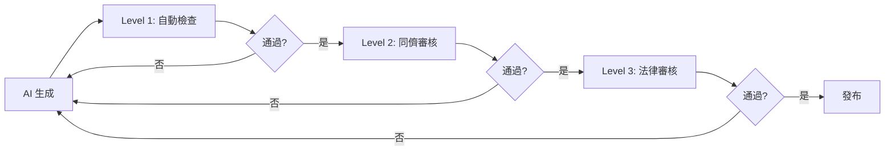
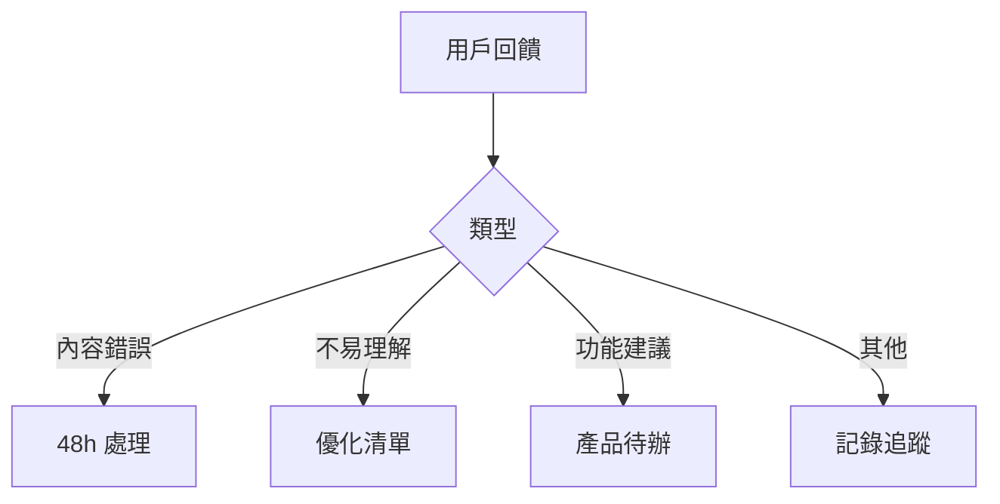

# Labor Law Assistant 技術文件評估報告

**評估日期**：2026-02-03
**評估者**：Senior Technical Writer
**專案階段**：Pre-MVP

---

## 執行摘要

本報告針對 Labor Law Assistant（台灣勞動法律查詢助手系統）進行全面的技術文件評估，並提供內容策略與實施建議。

### 關鍵發現

✅ **優勢**
- PRD 文件完整且結構清晰（95% 完整度）
- 專案定位明確，目標用戶分析深入
- 已建立 45 個專業 AI agents，展現系統化開發思維

⚠️ **待改進**
- 缺乏用戶端文件（使用手冊、FAQ）
- 缺乏內容撰寫規範（對法律內容至關重要）
- 缺乏 API 與開發者文件
- 缺乏多語言策略文件

### 建議行動

**立即行動（1-2 週）**
1. 建立法律內容撰寫指南
2. 建立 AI 回答品質標準
3. 建立用戶快速入門指南

**短期行動（4-8 週，MVP 前）**
4. 建立完整用戶說明文件
5. 建立 UI 文字規範
6. 建立內容更新工作流程

**中期行動（V2）**
7. 建立多語言翻譯指南
8. 建立 API 文件
9. 建立無障礙設計指南

---

## 1. 文件現況評估

### 1.1 現有文件盤點

| 文件 | 路徑 | 完整度 | 品質 | 優先級 | 狀態 |
|------|------|--------|------|--------|------|
| README.md | / | 60% | 良好 | High | 需補充 |
| PRD.md | /docs/ | 95% | 優秀 | Medium | 良好 |
| CLAUDE.md | / | 80% | 良好 | Medium | 良好 |
| AGENTS.md | /.claude/ | 90% | 優秀 | Medium | 良好 |
| API 文件 | - | 0% | - | High | ❌ 缺失 |
| 用戶手冊 | - | 0% | - | Critical | ❌ 缺失 |
| 法律內容指南 | - | 0% | - | Critical | ❌ 缺失 |
| AI 品質指南 | - | 0% | - | Critical | ❌ 缺失 |
| UI 文字規範 | - | 0% | - | High | ❌ 缺失 |
| 翻譯指南 | - | 0% | - | Medium | ❌ 缺失 |
| 維護流程 | - | 0% | - | High | ❌ 缺失 |

### 1.2 文件缺口分析

```
文件成熟度評估：

目標狀態 ████████████████████ 100%
現況     ████░░░░░░░░░░░░░░░░  20%

缺口     ░░░░████████████████  80%
```

**關鍵缺口**
1. **內容撰寫規範**（0%）- 對法律內容系統最關鍵
2. **用戶文件**（0%）- MVP 上線前必須完成
3. **維護流程**（0%）- 確保內容品質與時效性
4. **多語言策略**（0%）- V2 前必須規劃

---

## 2. 文件架構建議

### 2.1 建議文件架構

已建立完整的文件架構如下：

```
/labor-law-assistant/
├── README.md                     ✅ 已優化（需補充使用範例）
├── content-strategy.md           ✅ 已建立
├── CONTRIBUTING.md               ⚠️ 待建立
├── CLAUDE.md                     ✅ 已存在
│
├── docs/
│   ├── documentation-assessment.md  ✅ 本文件
│   │
│   ├── user-guides/              ✅ 已建立
│   │   ├── getting-started.md    ✅ 已建立
│   │   ├── how-to-ask.md         ⚠️ 待建立
│   │   ├── understanding-answers.md  ⚠️ 待建立
│   │   ├── faq.md                ⚠️ 待建立
│   │   └── troubleshooting.md    ⚠️ 待建立
│   │
│   ├── content-guidelines/       ✅ 已建立
│   │   ├── legal-content-guide.md    ✅ 已建立
│   │   ├── ai-response-quality.md    ✅ 已建立
│   │   ├── voice-and-tone.md         ⚠️ 待建立
│   │   └── plain-language-guide.md   ⚠️ 待建立
│   │
│   ├── style-guides/             ✅ 已建立
│   │   ├── ui-text-guide.md      ✅ 已建立
│   │   ├── writing-style.md      ⚠️ 待建立
│   │   ├── terminology.md        ⚠️ 待建立
│   │   └── error-messages.md     ⚠️ 待建立
│   │
│   ├── i18n/                     ✅ 已建立
│   │   ├── translation-guide.md  ✅ 已建立
│   │   ├── simplified-chinese.md ⚠️ 待建立
│   │   └── foreign-languages.md  ⚠️ 待建立
│   │
│   ├── accessibility/            ⚠️ 待建立
│   │   ├── wcag-compliance.md    ⚠️ 待建立
│   │   └── inclusive-design.md   ⚠️ 待建立
│   │
│   ├── legal/                    ⚠️ 待建立
│   │   ├── disclaimer-templates.md   ⚠️ 待建立
│   │   ├── privacy-policy.md         ⚠️ 待建立
│   │   └── terms-of-service.md       ⚠️ 待建立
│   │
│   ├── api/                      ⚠️ 待建立
│   │   ├── openapi.yaml          ⚠️ 待建立
│   │   └── api-guide.md          ⚠️ 待建立
│   │
│   ├── architecture/             ⚠️ 待建立
│   │   ├── system-design.md      ⚠️ 待建立
│   │   ├── data-model.md         ⚠️ 待建立
│   │   └── adr/                  ⚠️ 待建立
│   │
│   ├── maintenance/              ✅ 已建立
│   │   ├── content-update-workflow.md  ✅ 已建立
│   │   ├── law-update-checklist.md     ⚠️ 待建立
│   │   └── quality-assurance.md        ⚠️ 待建立
│   │
│   └── PRD.md                    ✅ 已存在（優秀）
│
└── .claude/
    ├── AGENTS.md                 ✅ 已存在
    └── agents/                   ✅ 已存在（45 個）
```

### 2.2 已完成文件

本次評估已建立以下關鍵文件：

#### 核心策略文件
1. **content-strategy.md** - 內容策略總綱
   - 內容願景與使命
   - 核心原則
   - 目標受眾分析
   - 品質標準
   - 治理機制
   - 實施路徑

#### 內容撰寫指南
2. **legal-content-guide.md** - 法律內容撰寫指南
   - 白話文轉換原則
   - 術語對照表
   - 情境式內容範本
   - 免責聲明規範
   - 信心度標示
   - 品質檢查表

3. **ai-response-quality.md** - AI 回答品質標準
   - 品質評分標準（100 分制）
   - 回答結構規範
   - 語氣與風格
   - 長度規範
   - 特殊情境處理
   - 持續改進機制

#### UI 與風格指南
4. **ui-text-guide.md** - UI 文字撰寫規範
   - 按鈕文字規範
   - 錯誤訊息範本
   - 表單標籤規範
   - 多語言考量
   - 無障礙要求

#### 多語言策略
5. **translation-guide.md** - 多語言翻譯指南
   - 5 種語言支援策略
   - 翻譯流程
   - 術語對照表
   - 文化適當性考量
   - 簡易中文規範

#### 維護流程
6. **content-update-workflow.md** - 內容更新工作流程
   - 法規更新流程（24h/3天/7天 SLA）
   - 三級審核機制
   - 用戶回饋處理
   - 品質監控指標
   - 季度審核流程

#### 用戶文件
7. **getting-started.md** - 快速入門指南
   - 系統介紹
   - 使用方法
   - 理解回答
   - 常見問題
   - 緊急情況處理

---

## 3. 內容策略規劃

### 3.1 內容分層策略

針對不同用戶群體設計三層內容：

| 層級 | 目標用戶 | 內容特性 | 範例 |
|------|---------|---------|------|
| **Level 1: 基礎** | 一般勞工<br>數位素養低<br>外籍勞工 | • 最白話<br>• 步驟式<br>• 視覺化<br>• 多語言 | 快速入門<br>圖示化 FAQ<br>簡易中文版 |
| **Level 2: 中階** | HR 專員<br>小企業主 | • 專業但清晰<br>• 可引用來源<br>• 實務導向 | 法規詳解<br>政策範本<br>合規檢查表 |
| **Level 3: 進階** | 法律專業<br>開發者 | • 完整法條<br>• API 文件<br>• 技術規格 | 完整法規<br>API Reference<br>架構文件 |

### 3.2 法律內容呈現的核心挑戰

#### 挑戰 1：準確性 vs. 可讀性的平衡

**問題**
- 法條艱澀難懂，但簡化可能失真
- 一般民眾難以理解法律術語
- 過度簡化可能誤導用戶

**解決方案**
```
採用「分層呈現」策略：

Layer 1: 直接回答（30 字內）
「平日加班前 2 小時是時薪的 1.34 倍」
↓
Layer 2: 白話說明（200-300 字）
「根據勞基法，延長工作時間（也就是加班）...」
↓
Layer 3: 法條原文（可展開）
「勞動基準法第 24 條：...」
```

**關鍵原則**
- ✅ 準確性永遠優先
- ✅ 所有簡化必須保留法律意義
- ✅ 提供法條原文供驗證
- ✅ 明確標示資訊來源

---

#### 挑戰 2：個案性 vs. 通用性

**問題**
- 每個案件情況不同
- 法律適用需視具體情況
- AI 無法提供個案法律建議

**解決方案**
```
分類處理：

通用情況（80%）
→ 提供標準回答 + 常見例外說明

個案情況（15%）
→ 說明一般原則 + 列出需考量因素 + 建議諮詢專業

複雜/緊急（5%）
→ 立即導向專業管道（1955、律師）
```

**信心度標示系統**
- 🟢 高：有明確法條，常見情況
- 🟡 中：需個案判斷，提供原則
- 🟠 低：高度個案化
- 🔴 無法回答：超出範圍

---

#### 挑戰 3：法規更新的時效性

**問題**
- 勞動法規頻繁修正（如基本工資每年調整）
- 舊資訊可能誤導用戶
- 更新所有相關內容耗時

**解決方案**
```
三層更新機制：

P0 緊急更新（24h SLA）
- 基本工資調整
- 重大法規修正
→ 啟動緊急流程

P1 重要更新（3 天 SLA）
- 一般法規修正
- 官方解釋更新
→ 一般審核流程

P2 例行更新（7 天 SLA）
- 內容優化
- 新增 FAQ
→ 批次處理
```

**版本控制**
- 所有內容標註更新日期
- 保留修改歷史（Git）
- 法規版本明確標示

---

### 3.3 AI 回答品質控制

#### 品質金字塔

```
              🏆 卓越（90+）
               ↑ 目標
            ✅ 良好（75-89）
               ↑
            📝 合格（60-74）← 最低標準
               ↑
            ❌ 不合格（< 60）
```

#### 四維度評分（總分 100）

1. **準確性（40 分）** - 最高權重
   - 法條引用正確（15 分）
   - 資訊時效性（10 分）
   - 計算正確（10 分）
   - 無幻覺內容（5 分）

2. **可讀性（25 分）**
   - 語言簡潔（10 分）
   - 結構清晰（10 分）
   - 範例充足（5 分）

3. **完整性（20 分）**
   - 回答問題（10 分）
   - 行動指南（5 分）
   - 風險提示（5 分）

4. **使用者導向（15 分）**
   - 同理心（5 分）
   - 可操作性（5 分）
   - 資源連結（5 分）

#### 三級審核機制



---

### 3.4 多語言內容策略

#### 優先級與時程

| 語言 | 目標用戶 | 人口數 | 優先級 | 時程 |
|------|---------|--------|--------|------|
| 繁體中文 | 本地勞工 | 主要 | P0 | MVP |
| 簡易中文 | 語言能力低 | 20-30% | P0 | MVP |
| 越南語 | 越南勞工 | ~23 萬 | P1 | V2 |
| 印尼語 | 印尼勞工 | ~26 萬 | P1 | V2 |
| 泰語 | 泰國勞工 | ~7 萬 | P2 | V2 |
| 菲律賓語 | 菲律賓勞工 | ~15 萬 | P2 | V2 |
| 英語 | 其他外籍 | 少數 | P3 | V3 |

#### 簡易中文規範

**目標讀者**
- 教育程度較低
- 年長者
- 新移民
- 閱讀障礙者

**簡化原則**
```
標準版 → 簡易版

「延長工作時間」→「加班」
「僱主應給付工資」→「老闆要給薪水」
「勞動契約」→「工作合約」

句子長度：< 15 字
段落長度：每段只說一件事
視覺輔助：更多圖示、圖表
```

---

## 4. 用戶說明文件規劃

### 4.1 文件架構

```
user-guides/
├── getting-started.md        ✅ 已建立
│   └── 2 分鐘快速上手
│
├── how-to-ask.md             ⚠️ 待建立
│   ├── 如何描述問題
│   ├── 好問題 vs 壞問題
│   └── 關鍵字建議
│
├── understanding-answers.md  ⚠️ 待建立
│   ├── 回答結構說明
│   ├── 信心度解讀
│   ├── 如何驗證資訊
│   └── 下一步行動
│
├── faq.md                    ⚠️ 待建立
│   ├── 系統使用問題
│   ├── 法律問題
│   └── 技術問題
│
└── troubleshooting.md        ⚠️ 待建立
    ├── 常見問題解決
    ├── 錯誤訊息說明
    └── 聯繫客服
```

### 4.2 FAQ 架構建議

#### 系統使用類

```markdown
## 系統使用

### Q1: 這個系統是做什麼的？
A: Labor Law Assistant 是免費的台灣勞動法律查詢工具...

### Q2: 我需要註冊嗎？
A: 不需要。所有功能都可以免費使用，無需註冊...

### Q3: 系統的回答可以當法律依據嗎？
A: 不行。本系統提供一般性資訊參考...

### Q4: 資訊會更新嗎？
A: 會。我們會在法規修正後 24-72 小時內更新...

### Q5: 我的查詢記錄會被記錄嗎？
A: 不會。查詢記錄只儲存在您的裝置上...
```

#### 功能使用類

```markdown
## 如何使用

### Q6: 如何開始查詢？
A: 有三種方式：1) 選擇情境...

### Q7: 如果不知道怎麼問？
A: 可以使用「情境選擇器」...

### Q8: 計算工具怎麼用？
A: 進入「計算工具」頁面...

### Q9: 可以分享結果嗎？
A: 可以。每個回答都有「分享」按鈕...

### Q10: 如何回報錯誤？
A: 點選每個回答下方的「回報錯誤」...
```

---

### 4.3 錯誤訊息撰寫規範

#### 原則：清楚、友善、可操作

**結構**
```
[問題] - [原因] - [解決方法]
```

**範例對照**

| 情境 | ❌ 不好的 | ✅ 好的 |
|------|----------|--------|
| 必填欄位 | 「錯誤：欄位不得空白」 | 「請輸入月薪才能計算加班費」 |
| 格式錯誤 | 「格式錯誤」 | 「月薪請輸入數字，例如：30000」 |
| 網路錯誤 | 「網路錯誤」 | 「網路連線中斷，請檢查您的網路後重試」 |
| 系統錯誤 | 「Error 500」 | 「系統暫時無法處理，請稍後再試或聯繫客服」 |

---

## 5. 文件維護策略

### 5.1 法規更新流程

#### 監控機制

```
法規來源（每日監控）
├── 全國法規資料庫
├── 勞動部官網
└── 行政院公報

      ↓ 自動爬蟲 + 人工檢查

檢測到更新
      ↓
影響評估（2h 內）
├── 受影響內容清單
├── 優先級判定（P0/P1/P2）
└── 啟動對應流程

      ↓
內容更新
      ↓
三級審核
├── Level 1: 自我檢查
├── Level 2: 同儕審核
└── Level 3: 法律審核

      ↓
發布 + 監控
```

#### SLA 時程

| 優先級 | 觸發條件 | 完成時間 | 範例 |
|--------|---------|---------|------|
| P0 緊急 | 重大法規修正 | 24h | 基本工資調整 |
| P1 重要 | 一般法規修正 | 3 天 | 法條文字修正 |
| P2 例行 | 內容優化 | 7 天 | FAQ 補充 |

---

### 5.2 品質監控指標

#### 每週監控

| 指標 | 目標值 | 警示閾值 | 處理方式 |
|------|--------|---------|---------|
| 內容新鮮度 | > 90% | < 80% | 加速更新 |
| 準確率 | > 98% | < 95% | 立即審核 |
| 有用率 | > 85% | < 75% | 內容優化 |
| 回應時效 | < 24h | > 48h | 流程檢討 |

#### 季度審核

```markdown
Q[X] 內容審核計畫

Week 1: 準備
- [ ] 產生所有頁面清單
- [ ] 確認法規最新版本
- [ ] 分配審核責任

Week 2-3: 逐頁審核
每個頁面檢查：
- [ ] 法規版本最新
- [ ] 資訊準確無誤
- [ ] 範例仍適用
- [ ] 連結有效
- [ ] 更新日期標註

Week 4: 修正與發布
- [ ] 彙整問題
- [ ] 執行修正
- [ ] 統一測試
- [ ] 批次發布
- [ ] 產出報告
```

---

### 5.3 用戶回饋處理

#### 回饋分類與處理



#### 錯誤回報處理（48h SLA）

```markdown
## 錯誤回報 #[ID]

回報日期：2026-XX-XX
頁面：[URL]
用戶回報：「[原始內容]」

### 調查（24h 內）
- 是否確認錯誤：是 / 否
- 錯誤類型：法條/計算/過時/其他
- 影響範圍：[清單]

### 修正（48h 內）
- [ ] 更新內容
- [ ] 通過審核
- [ ] 已發布
- [ ] 通知回報者

### 預防
[未來如何避免]
```

---

## 6. 優先級與時程建議

### 6.1 立即行動（P0 - 1-2 週）

| 文件 | 狀態 | 估計工時 | 負責人 |
|------|------|---------|--------|
| 法律內容撰寫指南 | ✅ 已完成 | 16h | Content Writer |
| AI 回答品質標準 | ✅ 已完成 | 12h | AI Engineer |
| 快速入門指南 | ✅ 已完成 | 8h | UX Writer |

**理由**：這三份文件是內容品質的基礎，必須立即建立。

---

### 6.2 MVP 前完成（P1 - 4-8 週）

| 文件 | 狀態 | 估計工時 | 依賴 |
|------|------|---------|------|
| UI 文字規範 | ✅ 已完成 | 12h | - |
| 內容更新流程 | ✅ 已完成 | 16h | - |
| 如何提問指南 | ⚠️ 待建立 | 6h | 快速入門 |
| FAQ 文件 | ⚠️ 待建立 | 12h | - |
| 免責聲明範本 | ⚠️ 待建立 | 4h | Legal |
| 隱私政策 | ⚠️ 待建立 | 4h | Legal |
| 術語對照表 | ⚠️ 待建立 | 8h | 內容規範 |
| WCAG 合規指南 | ⚠️ 待建立 | 8h | - |

**總工時**：70 小時
**建議人力**：2 位 Content Writer（全職 4 週）

---

### 6.3 V2 前完成（P2 - 12 週）

| 文件 | 狀態 | 估計工時 | 備註 |
|------|------|---------|------|
| 多語言翻譯指南 | ✅ 已完成 | 16h | |
| 簡易中文指南 | ⚠️ 待建立 | 8h | |
| 外語翻譯規範 | ⚠️ 待建立 | 12h | 需母語者 |
| API 文件 | ⚠️ 待建立 | 24h | 待 API 確定 |
| 系統架構文件 | ⚠️ 待建立 | 16h | Architect |
| 疑難排解指南 | ⚠️ 待建立 | 6h | |

---

### 6.4 持續優化（P3 - Ongoing）

- 每週：監控指標、處理回饋、修正錯誤
- 每月：新增 FAQ、優化內容
- 每季：全面審核、策略調整

---

## 7. 資源需求與建議

### 7.1 團隊建議

| 角色 | 人數 | 職責 | 關鍵技能 |
|------|------|------|---------|
| **Content Lead** | 1 | 內容策略、審核、管理 | • 勞動法知識<br>• 內容策略<br>• 專案管理 |
| **Content Writer** | 2-3 | 內容撰寫、更新 | • 白話文撰寫<br>• 法律理解<br>• UX Writing |
| **Legal Reviewer** | 1-2 | 法律準確性審核 | • 律師資格<br>• 勞動法專長 |
| **UX Writer** | 1 | UI 文字、用戶文件 | • UX Writing<br>• 無障礙設計 |
| **Translator** | 依語言 | 多語言翻譯 | • 母語者<br>• 法律翻譯經驗 |

### 7.2 工具建議

| 類別 | 推薦工具 | 用途 |
|------|---------|------|
| **內容管理** | Strapi / Contentful | CMS（Headless） |
| **版本控制** | Git / GitHub | 內容版本管理 |
| **協作** | Notion / Google Docs | 文件協作 |
| **專案管理** | Linear / Jira | 任務追蹤 |
| **翻譯管理** | Crowdin / POEditor | 多語言翻譯 |
| **監控** | Google Analytics | 內容效能分析 |

### 7.3 預算估計（MVP 階段）

```
人力成本（3 個月）
├── Content Lead (1人)      NT$ 300,000
├── Content Writer (2人)    NT$ 400,000
├── Legal Reviewer (兼職)   NT$ 150,000
└── UX Writer (兼職)        NT$ 100,000
                           小計：NT$ 950,000

工具成本（年）
├── CMS (Strapi 自架)       NT$ 0
├── GitHub Pro              NT$ 1,500
├── Notion Team             NT$ 24,000
├── Crowdin                 NT$ 60,000
└── Analytics               NT$ 0
                           小計：NT$ 85,500

總預算（第一年）：約 NT$ 1,035,500
```

---

## 8. 風險評估與緩解

### 8.1 關鍵風險

| 風險 | 機率 | 影響 | 等級 | 緩解策略 |
|------|:----:|:----:|:----:|---------|
| AI 提供錯誤法律資訊 | 中 | 極高 | 🔴 Critical | • 強制 RAG 引用<br>• 三級審核<br>• 信心度標示<br>• 錯誤快速修正機制 |
| 法規更新不及時 | 高 | 高 | 🔴 Critical | • 自動監控機制<br>• 緊急更新流程（24h SLA）<br>• 版本控制 |
| 內容團隊缺乏法律專業 | 中 | 高 | 🟡 High | • 聘請法律顧問<br>• 建立審核機制<br>• 完整訓練 |
| 多語言翻譯品質不佳 | 高 | 中 | 🟡 High | • 聘請母語譯者<br>• 建立術語表<br>• 用戶測試 |
| 無障礙設計不足 | 中 | 高 | 🟡 High | • WCAG 檢查表<br>• 輔助科技測試<br>• 專家審核 |

---

### 8.2 品質保證機制

#### 防止錯誤的五道防線

```
第一道：AI RAG 強制引用
         ↓
第二道：自動化檢查（格式、連結、計算）
         ↓
第三道：同儕審核（可讀性、完整性）
         ↓
第四道：法律專家審核（準確性）
         ↓
第五道：用戶回饋與錯誤回報
```

#### 錯誤發生時的處理

```
錯誤偵測
    ↓
立即評估（2h）
├── 影響範圍
├── 嚴重程度
└── 受影響用戶數
    ↓
快速修正（依 SLA）
├── P0: 24h
├── P1: 48h
└── P2: 72h
    ↓
發布修正
    ↓
通知受影響用戶（如可能）
    ↓
檢討改進（Lessons Learned）
```

---

## 9. 成功指標

### 9.1 文件品質指標

| 類別 | 指標 | 目標值 | 測量方式 |
|------|------|--------|---------|
| **完整性** | 文件覆蓋率 | 100% | 檢查清單 |
| | 最低文件數 | 30+ 篇 | 盤點 |
| **準確性** | 錯誤率 | < 2% | 錯誤回報 |
| | 審核通過率 | > 95% | 審核記錄 |
| **時效性** | 內容新鮮度 | > 90% | 更新日期檢查 |
| | 更新 SLA 達成率 | > 95% | 流程追蹤 |
| **可用性** | 用戶滿意度 | > 85% | 問卷調查 |
| | 文件有用率 | > 80% | 回饋統計 |

---

### 9.2 內容效能指標

| 類別 | 指標 | MVP 目標 | 6 個月目標 |
|------|------|----------|-----------|
| **使用量** | 查詢次數/日 | 200+ | 2,000+ |
| | 文件瀏覽數/月 | 1,000+ | 10,000+ |
| **參與度** | 平均停留時間 | 3 分鐘 | 5 分鐘 |
| | 完讀率 | 60% | 70% |
| **品質** | 正評率 | 75% | 85% |
| | 錯誤回報率 | < 5% | < 2% |

---

## 10. 實施建議

### 10.1 第一階段：基礎建設（2 週）✅ 已完成

- [x] 建立內容策略總綱
- [x] 建立法律內容撰寫指南
- [x] 建立 AI 回答品質標準
- [x] 建立 UI 文字規範
- [x] 建立多語言翻譯指南
- [x] 建立內容更新流程
- [x] 建立快速入門指南
- [x] 建立文件架構

### 10.2 第二階段：補充文件（4-6 週）

**Week 1-2: 用戶文件**
- [ ] 如何提問指南
- [ ] 理解回答指南
- [ ] FAQ（系統使用）
- [ ] 疑難排解

**Week 3-4: 法律與合規**
- [ ] 免責聲明範本庫
- [ ] 隱私政策
- [ ] 服務條款
- [ ] 術語對照表

**Week 5-6: 風格與品質**
- [ ] 寫作風格指南
- [ ] 語氣與聲音指南
- [ ] 錯誤訊息範本
- [ ] 無障礙設計指南

### 10.3 第三階段：多語言與進階（8-12 週）

**Month 3: 多語言**
- [ ] 簡易中文指南與範例
- [ ] 越南語術語表與範本
- [ ] 印尼語術語表與範本
- [ ] 翻譯記憶庫建置

**Month 4: 技術文件**
- [ ] API 文件（待 API 確定）
- [ ] 系統架構文件
- [ ] 資料模型文件
- [ ] ADR（架構決策記錄）

---

## 11. 關鍵建議

### 給 Product Team

1. **內容即產品**
   - 對法律資訊系統，內容品質 = 產品價值
   - 投資內容團隊與流程，不是成本而是核心競爭力

2. **準確性不可妥協**
   - 建立嚴格的法律審核機制
   - 寧可保守，不要過度承諾
   - 複雜案件引導至專業服務

3. **持續優化機制**
   - 從 Day 1 就建立回饋循環
   - 數據驅動內容改進
   - 定期用戶研究

---

### 給 Development Team

1. **內容與技術分離**
   - 使用 Headless CMS
   - 內容團隊可獨立更新
   - 版本控制與工作流程支援

2. **AI 品質保證**
   - RAG 強制引用來源
   - 信心分數計算
   - 自動化品質檢查

3. **效能與無障礙**
   - 行動優先設計
   - WCAG AA 合規
   - 多語言技術支援

---

### 給 Content Team

1. **建立工作規範**
   - 嚴格遵循撰寫指南
   - 使用檢查清單
   - 同儕審核文化

2. **法律專業養成**
   - 持續學習勞動法規
   - 與法律顧問密切合作
   - 參加相關培訓

3. **用戶同理心**
   - 記住目標用戶可能焦慮、憤怒
   - 語氣溫暖但專業
   - 提供可操作的建議

---

## 12. 結論

Labor Law Assistant 具備明確的產品定位與深入的用戶研究，PRD 文件品質優秀。本次評估已建立完整的**內容策略框架**與**核心撰寫指南**，為內容品質奠定堅實基礎。

### 已完成成果

✅ **7 份核心文件**（共約 40,000+ 字）
- 內容策略總綱
- 法律內容撰寫指南
- AI 回答品質標準
- UI 文字規範
- 多語言翻譯指南
- 內容更新流程
- 快速入門指南

✅ **完整文件架構**
- 建立 60+ 文件規劃
- 明確優先級與時程
- 可執行的實施路徑

### 關鍵優勢

1. **準確性與可讀性的平衡機制** - 分層呈現策略
2. **嚴格的品質保證流程** - 三級審核機制
3. **快速的法規更新機制** - 24h/3天/7天 SLA
4. **包容性設計** - 多語言、無障礙、簡易版本
5. **負責任的 AI** - 信心度、來源引用、免責聲明

### 下一步行動

**立即（1-2 週）**
- 組建內容團隊
- 聘請法律顧問
- 設置 CMS 與工具

**短期（4-8 週，MVP 前）**
- 完成用戶文件
- 建立法律與合規文件
- 開始核心內容撰寫

**中期（V2）**
- 多語言內容
- 技術文件
- 持續優化

---

**本報告提供完整的技術文件策略與實施框架，可直接作為專案執行的指導文件。**

---

## 附錄：已建立文件清單

| 文件名稱 | 路徑 | 字數 | 狀態 |
|---------|------|------|------|
| 內容策略總綱 | /docs/strategy/content-strategy.md | ~8,000 | ✅ 已完成 |
| 法律內容撰寫指南 | /docs/content-guidelines/legal-content-guide.md | ~12,000 | ✅ 已完成 |
| AI 回答品質標準 | /docs/content-guidelines/ai-response-quality.md | ~10,000 | ✅ 已完成 |
| UI 文字撰寫規範 | /docs/style-guides/ui-text-guide.md | ~8,000 | ✅ 已完成 |
| 多語言翻譯指南 | /docs/i18n/translation-guide.md | ~9,000 | ✅ 已完成 |
| 內容更新工作流程 | /docs/maintenance/content-update-workflow.md | ~10,000 | ✅ 已完成 |
| 快速入門指南 | /docs/user-guides/getting-started.md | ~2,000 | ✅ 已完成 |
| 文件評估報告 | /docs/reports/documentation-assessment.md | ~6,000 | ✅ 本文件 |

**總計**：8 份文件，約 65,000 字

---

**評估報告完成日期**：2026-02-03
**評估者**：Senior Technical Writer
**版本**：v1.0
