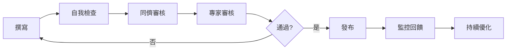

# 內容策略總綱

**Labor Law Assistant - Taiwan Labor Law Query Assistant**

---

## 文件目的

本文件是 Labor Law Assistant 的內容策略指導文件，定義內容願景、原則、架構與執行方針。

---

## 目錄

1. [內容願景與使命](#1-內容願景與使命)
2. [核心原則](#2-核心原則)
3. [目標受眾](#3-目標受眾)
4. [內容架構](#4-內容架構)
5. [內容類型與規範](#5-內容類型與規範)
6. [語氣與風格](#6-語氣與風格)
7. [品質標準](#7-品質標準)
8. [治理與維護](#8-治理與維護)
9. [成功指標](#9-成功指標)
10. [實施路徑](#10-實施路徑)

---

## 1. 內容願景與使命

### 願景
> 成為台灣最易懂、最可信賴的勞動法律資訊來源

### 使命
1. **讓法律知識民主化**：將艱澀法條轉化為人人都能理解的內容
2. **縮小資訊落差**：確保弱勢族群也能平等獲取資訊
3. **賦權而非說教**：幫助用戶理解權益並知道如何行動
4. **保持準確可信**：堅持法律準確性，建立用戶信任

### 內容憲章

我們承諾：
- ✅ **準確優先**：絕不為簡化而犧牲準確性
- ✅ **保護勞工**：立場明確站在保護勞工權益
- ✅ **透明可溯**：所有資訊可追溯來源
- ✅ **包容設計**：確保所有人都能使用
- ✅ **持續更新**：法規更新後立即同步
- ✅ **負責任的 AI**：清楚標示 AI 生成內容的限制

---

## 2. 核心原則

### 原則 1：準確性是基礎（Accuracy First）

```
準確性 > 可讀性 > 美觀性

寧可保留法律原文，也不要錯誤的簡化。
```

**實踐方式**
- 所有內容必須經過法律專家審核
- 建立嚴格的引用與追溯機制
- 法規更新後 24-72 小時內同步
- 公開錯誤修正記錄

---

### 原則 2：可讀性是目標（Readability as Goal）

```
目標閱讀程度：國小六年級

每個法律問題都應該有：
1 句話直接回答 + 白話文說明 + 法條原文（可展開）
```

**實踐方式**
- 使用白話文取代法律術語（或提供解釋）
- 提供具體範例而非抽象描述
- 使用視覺層級（標題、清單、圖示）
- 分層呈現資訊（從簡單到詳細）

---

### 原則 3：包容性是責任（Inclusivity as Duty）

```
設計對象：最需要幫助的人

包括：外籍勞工、視障者、年長者、數位素養較低者
```

**實踐方式**
- 符合 WCAG 2.1 AA 無障礙標準
- 提供多語言版本（至少 5 種語言）
- 提供簡易中文版本
- 使用清楚的視覺設計
- 避免只有文字的內容（加上圖示、圖表）

---

### 原則 4：可操作性是價值（Actionability as Value）

```
知道權益 ≠ 能保護權益

每個回答都應告訴用戶「下一步該做什麼」
```

**實踐方式**
- 提供具體行動步驟
- 說明需要收集什麼證據
- 提供申訴管道與聯絡方式
- 標註行動的難易度
- 複雜案件建議諮詢專業

---

### 原則 5：負責任的 AI（Responsible AI）

```
AI 是工具，不是替代品

清楚標示 AI 的能力與限制
```

**實踐方式**
- 每個 AI 回答標示信心度
- 強制引用來源（RAG）
- 複雜案件不由 AI 單獨處理
- 提供人工審核機制
- 明確的免責聲明

---

## 3. 目標受眾

### 主要受眾（Primary Audience）

#### Persona 1：一般勞工（60% 流量）

**特徵**
- 年齡：20-45 歲
- 教育：高中到大學
- 數位素養：中等
- 裝置：主要使用手機

**需求**
- 快速得到答案（5 分鐘內）
- 用白話文理解法律
- 知道下一步該做什麼
- 情緒支持（可能焦慮或憤怒）

**內容策略**
- 語言：最白話、最簡單
- 範例：生活化情境
- 長度：精簡
- 視覺：多用圖示、列點

---

#### Persona 2：HR 專員（25% 流量）

**特徵**
- 年齡：28-45 歲
- 教育：大學以上（人資相關）
- 數位素養：高
- 裝置：主要使用電腦

**需求**
- 專業準確的資訊
- 可引用的法條來源
- 政策制定參考
- 類似案例

**內容策略**
- 語言：專業但清晰
- 範例：企業情境
- 長度：可較詳細
- 附加：可下載、可列印

---

#### Persona 3：小企業主（15% 流量）

**特徵**
- 年齡：35-60 歲
- 教育：高中到大學
- 數位素養：中低
- 裝置：手機和電腦都用

**需求**
- 簡單明瞭的指引
- 避免觸法的方法
- 實務操作建議
- 成本影響評估

**內容策略**
- 語言：實務導向
- 範例：小企業情境
- 長度：精簡、重點明確
- 附加：檢查表、範本

---

### 次要受眾（Secondary Audience）

- 法律專業人士（研究參考）
- 勞工團體（倡議工具）
- 學術研究者（資料來源）
- 媒體記者（資訊查證）

---

### 弱勢族群（需特別關注）

| 族群 | 特殊需求 | 解決方案 |
|------|---------|---------|
| 外籍勞工 | 語言障礙 | 多語言版本（越南、印尼、泰、菲） |
| 視障者 | 無法看見螢幕 | WCAG AA、螢幕閱讀器支援 |
| 年長者 | 字太小、操作複雜 | 大字體模式、簡化介面 |
| 低收入者 | 舊手機、流量有限 | 輕量化設計、離線功能 |

---

## 4. 內容架構

### 資訊架構總覽

```
首頁
│
├── 【情境式查詢】（主要功能）
│   ├── 選擇身分（勞工/雇主/HR）
│   ├── 選擇情境
│   │   ├── 💰 薪資與加班
│   │   ├── 🏖️ 請假與休息
│   │   ├── 👋 離職與資遣
│   │   ├── ⚠️ 職場問題
│   │   └── 📋 其他問題
│   └── 查看回答
│
├── 【快速查詢】
│   └── 搜尋框（輸入問題）
│
├── 【計算工具】
│   ├── 加班費計算器
│   ├── 特休天數計算器
│   └── 資遣費計算器
│
├── 【常見問題】
│   ├── 依類別瀏覽
│   └── 搜尋 FAQ
│
├── 【法規查詢】
│   ├── 依法規瀏覽
│   ├── 依關鍵字搜尋
│   └── 法規更新通知
│
├── 【緊急協助】
│   ├── 1955 勞工專線
│   ├── 各縣市勞工局
│   ├── 法律扶助基金會
│   └── 勞工團體資源
│
└── 【關於我們】
    ├── 使用說明
    ├── 免責聲明
    ├── 隱私政策
    └── 意見回饋
```

---

### 內容層級設計

每個法律問題回答包含 5 個層級：

```
Level 1: 直接回答（20-30 字）
         ↓ 滿足 80% 快速查詢需求
Level 2: 白話說明（200-400 字）
         ↓ 滿足深入理解需求
Level 3: 法條依據（可展開）
         ↓ 滿足驗證需求
Level 4: 實務案例（可展開）
         ↓ 滿足參考需求
Level 5: 延伸閱讀（連結）
         ↓ 滿足探索需求
```

**折疊策略**
- 手機版：預設顯示 Level 1-2，其餘折疊
- 桌機版：預設顯示 Level 1-3，其餘折疊

---

## 5. 內容類型與規範

### 內容類型矩陣

| 內容類型 | 目的 | 目標受眾 | 更新頻率 | 負責團隊 |
|---------|------|---------|---------|---------|
| **AI 問答回應** | 回答用戶即時問題 | 全部 | 實時 | AI + 審核 |
| **FAQ 文章** | 回答常見問題 | 全部 | 每月 | Content |
| **法規解說** | 深入解釋法規 | HR/專業 | 法規更新時 | Legal + Content |
| **計算工具** | 協助試算 | 勞工/HR | 法規更新時 | Dev + Content |
| **使用指南** | 教學如何使用 | 新用戶 | 每季 | UX + Content |
| **案例分析** | 真實案例參考 | HR/專業 | 每季 | Legal |
| **法規更新通知** | 告知法規變更 | 訂閱用戶 | 即時 | Legal + Content |

---

### 各內容類型範本

詳見：
- [法律內容撰寫指南](/docs/content-guidelines/legal-content-guide.md)
- [AI 回答品質標準](/docs/content-guidelines/ai-response-quality.md)
- [UI 文字撰寫規範](/docs/style-guides/ui-text-guide.md)

---

## 6. 語氣與風格

### 品牌語氣（Brand Voice）

```
我們是：
🎯 專業的        - 基於法律專業知識
💙 溫暖的        - 理解用戶的處境與情緒
💪 賦權的        - 幫助用戶了解並行使權利
🔍 透明的        - 清楚說明資訊來源與限制
🤝 平等的        - 對所有人一視同仁

我們不是：
❌ 冷漠的機器人
❌ 權威式的教條者
❌ 同情濫情的社工
❌ 對抗性的倡議者
```

### 寫作風格（Writing Style）

| 層面 | 規範 | 範例 |
|------|------|------|
| **稱呼** | 使用「您」 | ✅「您可以...」❌「你可以...」 |
| **視角** | 以用戶為中心 | ✅「您的權益是...」❌「法律規定...」 |
| **語態** | 主動語態 | ✅「老闆必須給...」❌「應被給予...」 |
| **句長** | < 30 字 | 分段說明，避免長句 |
| **術語** | 白話優先 | ✅「加班」❌「延長工作時間」 |
| **範例** | 具體數字 | ✅「月薪 30,000」❌「一定金額」 |

---

### 情境化語氣調整

| 情境 | 語氣調整 | 範例 |
|------|---------|------|
| 緊急危險 | 直接、明確、支持 | 「請立即撥打 1955」 |
| 權益受損 | 同理、賦權、指引 | 「您有權拒絕...」 |
| 複雜案件 | 謹慎、建議專業 | 「建議諮詢律師...」 |
| 一般查詢 | 友善、清楚、實用 | 「簡單來說...」 |

---

## 7. 品質標準

### 內容品質金字塔

```
              🏆 卓越（90+ 分）
                 ↑
              ✅ 良好（75-89）
                 ↑
              📝 合格（60-74）← 最低標準
                 ↑
              ❌ 不合格（< 60）
```

### 評分維度（總分 100）

| 維度 | 權重 | 評分項目 |
|------|------|---------|
| **準確性** | 40% | 法條正確、資訊時效、無幻覺 |
| **可讀性** | 25% | 語言簡潔、結構清晰、有範例 |
| **完整性** | 20% | 回答問題、行動指南、風險提示 |
| **使用者導向** | 15% | 同理心、可操作性、資源連結 |

詳細評分標準見：[AI 回答品質標準](/docs/content-guidelines/ai-response-quality.md)

---

### 品質保證流程



---

## 8. 治理與維護

### 內容治理架構

```
                    Content Governance Board
                    （內容治理委員會）
                            |
        ┌──────────────────┼──────────────────┐
        |                  |                  |
   Content Lead      Legal Advisor       Product Owner
   (內容策略)          (法律審核)          (產品方向)
        |
   ┌────┴────┐
   |         |
Writers   Translators
(撰寫)     (翻譯)
```

### 角色與職責

| 角色 | 職責 | KPI |
|------|------|-----|
| **Content Governance Board** | 內容策略決策、品質標準制定 | 季度審核 |
| **Content Lead** | 內容規劃、團隊管理、品質把關 | 內容新鮮度 > 90% |
| **Content Writer** | 內容撰寫、更新、優化 | 正評率 > 85% |
| **Legal Advisor** | 法律準確性審核 | 錯誤率 < 2% |
| **Translator** | 多語言翻譯、在地化 | 翻譯品質 > 80% |
| **QA Tester** | 內容測試、品質檢查 | 測試覆蓋率 100% |

---

### 更新與維護機制

| 更新類型 | 觸發條件 | SLA | 流程 |
|---------|---------|-----|------|
| **緊急** | 法規重大修正 | 24h | 見[內容更新流程](/docs/maintenance/content-update-workflow.md) |
| **重要** | 法規一般修正 | 3天 | 同上 |
| **例行** | 內容優化 | 7天 | 同上 |
| **計畫** | 季度審核 | 依排程 | 同上 |

---

### 版本控制

- **工具**：Git + GitHub
- **分支策略**：Git Flow
- **Commit 規範**：Conventional Commits
- **審核機制**：Pull Request + Code Review

---

## 9. 成功指標

### 內容效能指標

| 類別 | 指標 | 定義 | 目標值 |
|------|------|------|--------|
| **品質** | 準確率 | 無錯誤回報的內容佔比 | > 98% |
| | 有用率 | 獲得正評的內容佔比 | > 85% |
| | 完整度 | 通過檢查表的內容佔比 | 100% |
| **時效** | 新鮮度 | 更新 < 6 個月的內容佔比 | > 90% |
| | 回應速度 | 錯誤回報平均處理時間 | < 48h |
| **涵蓋** | 法規涵蓋 | 已涵蓋的主要法規 | 8 部法規 |
| | FAQ 涵蓋 | 常見問題已涵蓋 | > 90% |
| **可及** | 多語言 | 支援語言數 | 5 種 |
| | 無障礙 | WCAG 合規等級 | AA |

---

### 用戶體驗指標

| 指標 | 定義 | 目標值 | 測量工具 |
|------|------|--------|---------|
| 查詢成功率 | 找到答案的用戶佔比 | > 80% | 用戶調查 |
| 平均閱讀時間 | 停留在回答頁面的時間 | 2-5 分鐘 | Analytics |
| 理解度 | 用戶理解回答的比例 | > 85% | 理解度測試 |
| 行動率 | 根據建議採取行動的比例 | > 60% | 用戶追蹤 |

---

### 業務影響指標

| 指標 | 目標值 | 時程 |
|------|--------|------|
| 月活躍用戶（MAU） | 10,000+ | 上線後 6 個月 |
| 查詢次數 | 30,000+/月 | 上線後 6 個月 |
| NPS（淨推薦值） | > 30 | 上線後 3 個月 |
| 回訪率（7 天） | > 20% | 上線後 3 個月 |

---

## 10. 實施路徑

### Phase 0: 基礎建設（4 週）

**目標**：建立內容基礎設施

```markdown
Week 1-2: 文件與規範
- [x] 建立內容策略文件
- [x] 建立撰寫指南
- [x] 建立品質標準
- [ ] 建立術語表

Week 3-4: 工具與流程
- [ ] 設置 CMS
- [ ] 建立 Git 工作流程
- [ ] 設置協作工具
- [ ] 建立審核流程
```

---

### Phase 1: MVP 內容（8 週）

**目標**：核心法規 100% 涵蓋

```markdown
Week 1-2: 勞動基準法
- [ ] 工資與工時（20 篇）
- [ ] 休假（15 篇）
- [ ] 離職與資遣（10 篇）

Week 3-4: 勞保與勞退
- [ ] 勞工保險（15 篇）
- [ ] 勞工退休金（10 篇）

Week 5-6: 其他主要法規
- [ ] 就業服務法（10 篇）
- [ ] 性別工作平等法（10 篇）
- [ ] 職業安全衛生法（10 篇）

Week 7-8: FAQ 與工具
- [ ] Top 50 FAQ（50 篇）
- [ ] 計算工具說明（3 篇）
- [ ] 使用指南（5 篇）

**產出**: 150+ 篇核心內容
```

---

### Phase 2: 優化與擴充（12 週）

**目標**：內容深度與廣度

```markdown
Week 1-4: 深度內容
- [ ] 複雜情境案例（20 篇）
- [ ] 特殊行業規定（15 篇）
- [ ] 政策制定指南（10 篇）

Week 5-8: 多語言
- [ ] 簡易中文版本（100%）
- [ ] 越南語版本（核心 50 篇）
- [ ] 印尼語版本（核心 50 篇）

Week 9-12: 互動內容
- [ ] 情境模擬（5 個）
- [ ] 視覺化圖表（20 個）
- [ ] 影片教學（10 支）

**產出**:
- 300+ 篇總內容
- 3 種語言版本
- 多媒體內容
```

---

### Phase 3: 持續優化（ongoing）

**目標**：根據數據持續改進

```markdown
每週:
- 監控內容效能指標
- 處理用戶回饋
- 修正錯誤
- 優化低表現內容

每月:
- 新增 FAQ
- 優化搜尋關鍵字
- A/B 測試新格式

每季:
- 全面內容審核
- 法規更新盤點
- 策略調整
```

---

## 附錄：相關文件索引

### 內容撰寫指南
- [法律內容撰寫指南](/docs/content-guidelines/legal-content-guide.md)
- [AI 回答品質標準](/docs/content-guidelines/ai-response-quality.md)
- [白話文撰寫指南](/docs/content-guidelines/plain-language-guide.md)

### 風格指南
- [UI 文字撰寫規範](/docs/style-guides/ui-text-guide.md)
- [語氣與風格指南](/docs/style-guides/voice-and-tone.md)
- [術語對照表](/docs/style-guides/terminology.md)

### 多語言指南
- [翻譯指南](/docs/i18n/translation-guide.md)
- [簡易中文指南](/docs/i18n/simplified-chinese.md)
- [外語翻譯規範](/docs/i18n/foreign-languages.md)

### 維護流程
- [內容更新工作流程](/docs/maintenance/content-update-workflow.md)
- [法規更新檢查表](/docs/maintenance/law-update-checklist.md)
- [品質保證流程](/docs/maintenance/quality-assurance.md)

### 用戶文件
- [快速入門指南](/docs/user-guides/getting-started.md)
- [如何提問](/docs/user-guides/how-to-ask.md)
- [常見問題](/docs/user-guides/faq.md)

---

## 變更記錄

| 版本 | 日期 | 變更內容 | 作者 |
|------|------|---------|------|
| 1.0 | 2026-02-02 | 初版建立 | Content Strategy Team |

---

## 審核簽核

| 角色 | 姓名 | 日期 | 簽核 |
|------|------|------|------|
| Content Lead | | | ☐ |
| Legal Advisor | | | ☐ |
| Product Owner | | | ☐ |
| Tech Lead | | | ☐ |

---

**文件版本**：v1.0
**建立日期**：2026-02-02
**負責單位**：Content Strategy Team
**下次審核**：2026-05-02（每季審核）
