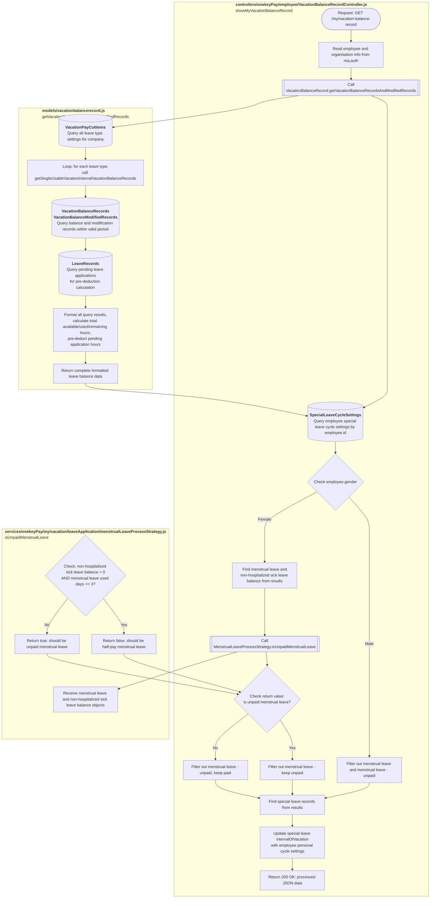

# Flow Chart Style Guide

## Spec

### Basic Rules
- Use Mermaid syntax for all flow charts
- Use standard Flow Chart Diagram for each node
- Flow start nodes use stadium-shaped diagram `([...])`
- Each node's content describes the purpose of that code segment in text
- Mermaid node text MUST NOT use parentheses `()`; rewrite if encountered, but preserve the content within

### Block Division Principles
- One function = one `subgraph` block
- Each block must include the corresponding file path and function name as its title
- Main functions must be independent blocks
- Validation functions (async-prefixed) must be independent blocks
- Core service class `generate`/`process` methods should be independent blocks
- Simple utility functions can be represented as subroutine nodes without independent blocks

### Naming Conventions

- File names in English (e.g., `LeaveRecordController.js`)
- Each step's action described in Chinese
- Node IDs use English letters + numbers (e.g., A1, A2, B1, B2)
- Nodes within the same block use the same prefix (Block A uses A1, A2...)

### Node Type Usage

1. **Stadium-shaped `([...])` - Flow Start**
   - Used for HTTP Request entry points
   - Example: `(["Request: POST /api/endpoint"])`

2. **Rectangle `[...]` - General Processing Step**
   - Variable assignment, data processing, formatting, etc.
   - Example: `["Read parameters from req.body"]`

3. **Subroutine `[[...]]` - Function Call**
   - Calling custom functions
   - Example: `[["Call<br>functionName(...)"]]`

4. **Database `(...)` - Database Operation**
   - Format: `("<b>TABLE_NAME</b><br>Operation description")`
   - Operation description must include: operation type (Create/Read/Update/Delete) + conditions/notes
   - Example: `("<b>LeaveRecords</b><br>Query leave records by id<br>Condition: status=approved")`

5. **Diamond `{...}` - Conditional Branch**
   - Used for if/else, switch/case, etc.
   - Example: `{"Check if status is approved"}`

6. **Double Circle `{{...}}` - Error Handling**
   - Used for catch blocks or error handling
   - Example: `{{"Error occurred"}}`

### What to Include
- Key business logic
- Conditional branches (if/else, switch/case)
- Exception handling (try/catch)
- Database operations (CRUD)
- Important function calls (Services, Strategies, Validators)
- Transaction control (transaction begin/commit/rollback)

### What to Omit
- Simple variable assignments (unless business-critical)
- console.log and debug code
- Simple data format conversions (unless complex)
- Internal workings of third-party packages

### Error Handling Drawing Rules
- Use dashed arrows `-.->` for exception flows
- Error nodes use double circles `{{...}}`
- Must indicate post-error handling (rollback, throw, etc.)

### Mermaid Syntax Rules & Best Practices

**Mandatory Rules**:

1. **Arrow label syntax**
   - Wrong: `A -- "condition" --> B` (may cause Chinese parsing errors)
   - Correct: `A -->|condition| B` (recommended, supports Chinese)
   - Correct: `A --> B` (when no label)

2. **No parentheses `()` in node text**
   - Wrong: `["(loop) process data"]`
   - Correct: `["loop: process data"]` or `["loop - process data"]`

3. **No single quotes `'` in node text**
   - Wrong: `["Filter 'special leave' data from records"]`
   - Correct: `["Filter special leave data from records"]`

4. **No curly braces `{}` in node text**
   - Wrong: `["Destructure { employee, records }"]`
   - Correct: `["Destructure employee and records"]`

5. **Avoid double quotes `"` in node text**
   - Wrong: `["Query "active" status"]`
   - Correct: `["Query active status"]`

**Arrow & Conditional Best Practices**:

1. **Conditional branches should use diamond nodes**
   ```
   A{"Check condition"}
   A -->|Yes| B
   A -->|No| C
   ```

2. **Loop handling**
   ```
   LOOP{"Loop: process each batch"}
   LOOP -->|Has data| PROCESS
   LOOP -->|Done| END
   ```

3. **Error handling uses dashed arrows and double circles**
   ```
   A{"Validate"}
   A -->|Fail| ERROR{{"Error handling"}}
   ```

**Text Description Guidelines**:
- Use colon `:` instead of parentheses for explanations
  - Example: `"Loop: process each record"` not `"(loop) process each record"`
- Use Chinese conjunctions instead of curly braces
  - Example: `"employee and records"` not `"{ employee, records }"`
- Use words directly, avoid wrapping in quotes
  - Example: `"special leave data"` not `"'special leave' data"`

## Response Example

- Respond in markdown Mermaid syntax following this format
- Verify Mermaid syntax is correct, ensuring the diagram renders properly
- **Note**: Use `-->|label|` format for arrow labels


