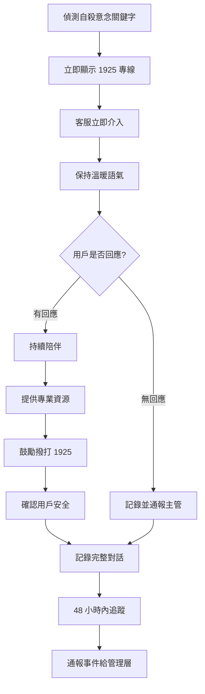
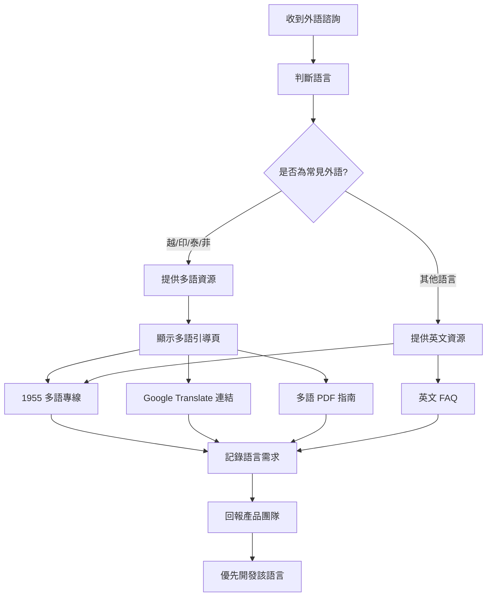
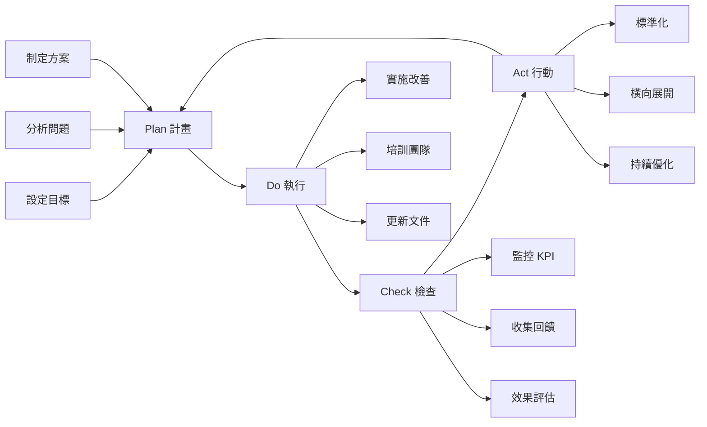

# Labor Law Assistant 客戶支援體系完整規劃

> **文件資訊**
> 版本：v1.0
> 建立日期：2026-02-03
> 負責人：Senior Customer Support Specialist
> 狀態：待審核

---

## 目錄

1. [支援管道架構](#1-支援管道架構)
2. [客服團隊規劃](#2-客服團隊規劃)
3. [標準作業流程 (SOP)](#3-標準作業流程-sop)
4. [知識庫建設](#4-知識庫建設)
5. [品質管理機制](#5-品質管理機制)
6. [特殊情境處理](#6-特殊情境處理)
7. [工具與系統需求](#7-工具與系統需求)
8. [持續改善機制](#8-持續改善機制)
9. [實施路徑與時程](#9-實施路徑與時程)
10. [成本預算](#10-成本預算)
11. [風險與應對](#11-風險與應對)
12. [附錄：話術範本庫](#12-附錄話術範本庫)

---

## 1. 支援管道架構

### 1.1 多層次支援管道設計

```
用戶進入
    ↓
┌────────────────────────────────────────────────────────────┐
│ L1：自助服務 (Self-Service)                                │
├────────────────────────────────────────────────────────────┤
│ • 常見問題 (FAQ)                                           │
│ • 使用指南 / 教學影片                                       │
│ • 情境式引導                                                │
│ • 計算工具（加班費、特休、資遣費）                           │
│                                                            │
│ 解決率目標：40%   |   回應時間：即時                        │
└────────────────────────────────────────────────────────────┘
    ↓ (無法解決)
┌────────────────────────────────────────────────────────────┐
│ L2：AI 智能問答 (AI Assistant)                             │
├────────────────────────────────────────────────────────────┤
│ • RAG 驅動法律查詢                                          │
│ • 引導式問答                                                │
│ • 分層資訊呈現                                              │
│ • 自動信心度評估                                            │
│                                                            │
│ 解決率目標：45%   |   回應時間：< 5 秒                      │
└────────────────────────────────────────────────────────────┘
    ↓ (AI 信心度低 / 用戶不滿意 / 偵測到緊急情境)
┌────────────────────────────────────────────────────────────┐
│ L3：真人客服 (Human Support)                               │
├────────────────────────────────────────────────────────────┤
│ • 線上文字客服（優先）                                      │
│ • Email 支援                                                │
│ • 電話支援（緊急情境）                                      │
│ • 錯誤回報處理                                              │
│                                                            │
│ 解決率目標：13%   |   回應時間：一般 24h / 緊急 2h         │
└────────────────────────────────────────────────────────────┘
    ↓ (複雜法律案件 / 需要專業判斷)
┌────────────────────────────────────────────────────────────┐
│ L4：專業轉介 (Professional Referral)                       │
├────────────────────────────────────────────────────────────┤
│ • 1955 勞工諮詢專線                                         │
│ • 法律扶助基金會                                            │
│ • 各縣市勞工局                                              │
│ • 勞工權益 NGO                                              │
│ • 合作律師事務所（未來規劃）                                 │
│                                                            │
│ 轉介率目標：2%    |   回應時間：依合作方                    │
└────────────────────────────────────────────────────────────┘
```

### 1.2 服務時間與回應 SLA

| 管道 | 服務時間 | 首次回應時間 | 解決時間目標 | 可用性目標 |
|------|---------|-------------|-------------|-----------|
| **L1 自助** | 24/7 | 即時 | N/A | 99.5% |
| **L2 AI** | 24/7 | < 5 秒 | 即時 | 99% |
| **L3 線上客服** | 週一至週五 09:00-18:00 | 一般：24 小時<br>緊急：2 小時 | 一般：3 個工作日<br>緊急：1 個工作日 | 服務時段內 95% |
| **L3 Email** | 24/7 接收 | 24 小時 | 5 個工作日 | N/A |
| **L3 電話** | 僅緊急情境<br>週一至週五 09:00-18:00 | 即時 | 依情況 | 服務時段內 90% |
| **L4 轉介** | 依外部資源 | 即時提供資訊 | N/A | N/A |

### 1.3 緊急情境快速通道

#### 緊急關鍵字清單

| 類別 | 關鍵字 | 處理方式 |
|------|--------|---------|
| **職業災害** | 職災、受傷、住院、危險、斷指、骨折 | 顯示職災通報專線 + 勞動部職安署 |
| **非法解雇** | 今天被開除、馬上離職、強迫離職、沒預告 | 顯示 1955 + 法律扶助基金會 |
| **薪資未給付** | 不給薪水、沒發薪、積欠薪資、欠薪 | 顯示勞工局申訴管道 |
| **職場暴力** | 暴力、威脅、恐嚇、傷害、打人 | 顯示 113 + 警察局 + 勞工局 |
| **性騷擾** | 性騷擾、性侵害、猥褻 | 顯示 113 + 性騷申訴專線 |
| **自殺意念** | 想死、活不下去、自殺、結束生命 | 立即顯示 1925 自殺防治專線 |

#### 緊急情境處理介面

```
偵測到緊急關鍵字 → 立即顯示
┌─────────────────────────────────────────┐
│ 🚨 我們偵測到您可能遇到緊急情況          │
├─────────────────────────────────────────┤
│                                         │
│ 請立即聯絡專業協助：                     │
│                                         │
│ 📞 1955 勞工諮詢專線                    │
│    24 小時免費服務（提供多語言）         │
│    [一鍵撥打] [查看服務時間]             │
│                                         │
│ 📞 法律扶助基金會：412-8518             │
│    提供免費法律諮詢與訴訟協助             │
│    [一鍵撥打] [了解申請資格]             │
│                                         │
│ 📍 您所在地的勞工局                      │
│    [台北市] [新北市] [桃園市] ...       │
│                                         │
│ ⚠️ 重要提醒：                           │
│ • 保留相關證據（對話記錄、文件、照片）   │
│ • 不要單獨面對雇主（可請工會或親友陪同） │
│ • 職災發生請立即通報，不要延誤治療       │
│ • 不要在壓力下簽署任何文件               │
│                                         │
│ [我仍要查詢相關法規]                     │
└─────────────────────────────────────────┘
```

---

## 2. 客服團隊規劃

### 2.1 MVP 階段團隊配置（上線後 6 個月）

#### 團隊結構

```
客服主管 (Customer Support Lead) - 1 人
    ↓
┌─────────────────┬─────────────────┬─────────────────┐
│                 │                 │                 │
客服專員 A         客服專員 B         客服專員 C (兼職)
(全職)            (全職)            (高峰時段)
```

#### 人力需求預估

| 時期 | 預估 DAU | 預估查詢/日 | L3 需處理量 (15%) | 客服人力 |
|------|---------|-----------|------------------|---------|
| 上線首月 | 100 | 200 | 30 | 1 人 + 1 備援 |
| 3 個月 | 500 | 1,000 | 150 | 2 人 |
| 6 個月 | 1,000 | 2,000 | 300 | 3 人 |

### 2.2 角色職責與技能需求

#### 客服主管 (Customer Support Lead)

| 項目 | 內容 |
|------|------|
| **主要職責** | • 建立客服 SOP 與知識庫<br>• 管理客服團隊與排班<br>• 監控服務品質與 KPI<br>• 處理升級與投訴案件<br>• 分析用戶回饋並回報產品團隊<br>• 維護外部轉介資源清單<br>• 客服團隊培訓與考核 |
| **技能要求** | • 5 年以上客服管理經驗<br>• 熟悉台灣勞動法規（優先）<br>• 數據分析能力<br>• 衝突處理與情緒管理<br>• 專案管理能力<br>• 優秀的溝通與領導力 |
| **次要職責** | • 填補客服專員空缺<br>• 複雜案件親自處理<br>• 培訓新進客服<br>• 參與產品會議提供用戶視角 |
| **KPI** | • CSAT ≥ 85%<br>• 首次解決率 ≥ 70%<br>• 平均回應時間 < 24h<br>• 團隊流動率 < 20%<br>• 知識庫完整度 ≥ 90% |

#### 客服專員 (Customer Support Specialist)

| 項目 | 內容 |
|------|------|
| **主要職責** | • 處理線上客服與 Email 諮詢<br>• 回應 AI 錯誤回報<br>• 協助用戶使用系統<br>• 記錄常見問題與建議<br>• 更新內部知識庫<br>• 提供情緒支援與同理心回應 |
| **技能要求** | • 2 年以上客服經驗<br>• 基礎勞動法知識（可培訓）<br>• 優秀的文字溝通能力<br>• 耐心與同理心<br>• 能處理情緒化用戶<br>• 資訊查詢與整理能力 |
| **次要職責** | • 測試新功能並提供回饋<br>• 撰寫 FAQ 內容<br>• 參與用戶研究<br>• 協助新人培訓 |
| **KPI** | • 個人 CSAT ≥ 85%<br>• 回應時間 < 24h<br>• 處理量：15-20 案件/日<br>• 知識庫貢獻：≥ 2 篇/月<br>• 準確度 ≥ 95% |

### 2.3 排班與值班制度

#### MVP 階段排班（3 人團隊）

| 時段 | 週一至週五 | 週末與國定假日 |
|------|-----------|---------------|
| **09:00-12:00** | 專員 A + 專員 B | 待命制（輪流） |
| **12:00-13:00** | 專員 A（午休由 B 代） | - |
| **13:00-18:00** | 專員 A + 專員 B | - |
| **18:00-21:00** | 專員 C（高峰時段） | - |
| **夜間/假日** | 自動回覆 + 緊急待命 | 自動回覆 + 緊急待命 |

#### 待命制規則

- 週末與國定假日採「輪流待命」制
- 待命期間需在 2 小時內回應緊急案件
- 待命津貼：每日 NT$ 500
- 緊急案件定義：職災、非法解雇、薪資爭議、系統重大故障

### 2.4 培訓計畫

#### 新進客服培訓（2 週）

| 週次 | 主題 | 內容 | 時數 | 驗收方式 |
|------|------|------|------|---------|
| **Week 1** | 產品與系統 | • 產品定位與用戶族群<br>• 系統功能操作<br>• AI 運作原理與限制<br>• 常見技術問題<br>• 工單系統操作 | 16h | 系統操作測驗（80 分及格） |
| | 勞動法基礎 | • 勞基法重點章節<br>• 8 大勞動法規概要<br>• 常見法律問題<br>• 法條查詢技巧<br>• 案例分析 | 8h | 筆試 + 口試（85 分及格） |
| **Week 2** | 客服技能 | • SOP 與工單系統<br>• 溝通技巧與話術<br>• 情緒管理與同理心<br>• 升級與轉介<br>• 危機處理 | 12h | 角色扮演（主管評分） |
| | 實務演練 | • 影子客服（觀摩資深專員）<br>• 模擬案例處理（10 個）<br>• 主管審核回覆<br>• 實際案件處理（監督下） | 12h | 實際案件處理（3 個以上獨立完成） |

#### 在職進階培訓（持續）

| 主題 | 頻率 | 內容 | 時數 |
|------|------|------|------|
| **法規更新** | 每月 | 最新法規修正、判例分析、實務影響 | 2h |
| **產品更新** | 每次發版 | 新功能介紹、操作教學、常見問題 | 1h |
| **案例研討** | 每季 | 複雜案件討論、最佳實踐分享、經驗交流 | 3h |
| **軟技能** | 每半年 | 溝通技巧、壓力管理、情緒輔導 | 4h |

#### 外部培訓資源

| 資源 | 提供單位 | 內容 | 建議 |
|------|---------|------|------|
| **勞動法令諮詢種子培訓** | 勞動部 | 勞動法規深度培訓 | 客服主管必修 |
| **客服證照課程** | 中華民國顧客滿意協會 | CCS、CCSP 證照 | 鼓勵考取 |
| **情緒管理課程** | 張老師基金會 | 情緒輔導技巧 | 每年至少 1 次 |
| **無障礙服務訓練** | 身心障礙聯盟 | 如何服務特殊需求用戶 | 建議參加 |

---

## 3. 標準作業流程 (SOP)

### 3.1 一般諮詢處理流程

#### 詳細步驟

| 步驟 | 動作 | 時限 | 工具 | 檢查點 |
|------|------|------|------|-------|
| **1. 接收** | • 從工單系統接收案件<br>• 檢查優先級標籤<br>• 確認案件類型 | 即時 | 工單系統 | 是否標記緊急？ |
| **2. 確認** | • 閱讀完整問題描述<br>• 檢查用戶是否提供足夠資訊<br>• 不足則請用戶補充<br>• 理解用戶真正需求 | 30 分鐘內 | 工單系統 | 資訊是否充足？<br>是否涉及個資？ |
| **3. 分類** | • 標記問題類別（系統/法律/內容錯誤/投訴）<br>• 設定優先級（緊急/一般）<br>• 分配給適合的專員 | - | 工單系統 | 分類是否正確？ |
| **4. 查詢** | • 搜尋內部知識庫<br>• 必要時查詢法規原文<br>• 諮詢主管或法律顧問（複雜案件）<br>• 記錄查詢過程 | - | 知識庫系統<br>全國法規資料庫 | 來源是否可靠？<br>資訊是否最新？ |
| **5. 回覆** | • 使用標準回覆模板<br>• 檢查語氣與準確性<br>• 附上法規來源<br>• 提供下一步建議<br>• 加入免責聲明 | 一般：24h<br>緊急：2h | 工單系統 | 是否清楚易懂？<br>是否完整回答？<br>法規引用正確？ |
| **6. 追蹤** | • 確認用戶滿意度<br>• 回答後續問題<br>• 必要時升級<br>• 提供額外資源 | 3 個工作日內 | 工單系統 | 用戶是否滿意？<br>問題是否解決？ |
| **7. 結案** | • 記錄解決方式<br>• 更新知識庫（新問題）<br>• 標記案件狀態<br>• 滿意度調查 | - | 工單系統 | 是否可標準化？<br>需要升級產品？ |

### 3.2 錯誤回報處理流程

#### 錯誤嚴重程度定義

| 等級 | 定義 | 範例 | 處理 SLA | 通報對象 |
|------|------|------|---------|---------|
| **🔴 P0 嚴重** | 法律資訊完全錯誤，可能導致用戶損失 | • 加班費計算完全錯誤<br>• 法條引用錯誤<br>• 給出違法建議 | 2 小時內通知<br>24 小時內修正 | 產品負責人<br>AI 工程師<br>法律顧問 |
| **🟡 P1 重要** | 資訊不完整或有誤導性 | • 未說明例外情況<br>• 白話文解釋不清<br>• 計算器某情境錯誤 | 3 個工作日內修正 | AI 工程師<br>內容團隊 |
| **🟢 P2 一般** | 體驗不佳但不影響正確性 | • 排版錯誤<br>• 用詞不當<br>• 連結失效 | 下次更新時修正 | 相關團隊 |

#### 錯誤回報記錄表單

```markdown
## 錯誤回報記錄 #ER-2026-0203-001

**回報時間**：2026-02-03 14:30
**回報用戶**：User #8234（匿名）
**處理客服**：Alice

### 錯誤資訊
- **錯誤類型**：☑ 法律內容錯誤  ☐ 系統功能錯誤  ☐ 其他
- **嚴重程度**：☑ P0 嚴重  ☐ P1 重要  ☐ P2 一般
- **發生位置**：AI 問答 - 特休計算
- **用戶問題**：「我工作 1 年 3 個月，有幾天特休？」
- **AI 回答**：「您有 10 天特休假」
- **錯誤描述**：應為 3 天，AI 誤以為滿 2 年

### 驗證結果
- **驗證人員**：Alice（客服專員）
- **正確答案**：「您工作滿 1 年，有 3 天特休假。滿 2 年才有 10 天。」
- **法規依據**：勞基法第 38 條
- **確認錯誤**：☑ 是  ☐ 否

### 處理動作
- **通知對象**：☑ 產品團隊  ☑ AI 工程師  ☐ 內容團隊
- **通知時間**：2026-02-03 15:00
- **預計修正**：2026-02-04
- **實際修正**：2026-02-04 11:30
- **用戶回覆**：已主動聯絡用戶提供正確答案並道歉

### 根本原因分析
AI 在計算年資時，錯誤將「1 年 3 個月」判斷為「2 年」區間

### 預防措施
- ☑ 加入測試案例（邊界值測試）
- ☑ 更新 Prompt（明確年資計算邏輯）
- ☑ 調整 RAG 檢索權重
- ☐ 其他：__________

### 後續追蹤
- 2026-02-05：已部署修正，測試通過
- 2026-02-06：監控類似問題，未再發生
```

### 3.3 投訴抱怨處理流程

#### LAST 溝通模型

| 步驟 | 英文 | 中文 | 動作 | 話術範例 |
|------|------|------|------|---------|
| **L** | Listen | 傾聽 | 讓用戶完整表達，不打斷 | 「我在聽，請您詳細說明發生了什麼事。」 |
| **A** | Apologize | 道歉 | 真誠道歉，即使非我們錯誤 | 「很抱歉造成您的困擾，這確實讓人沮喪。」 |
| **S** | Solve | 解決 | 提出具體解決方案 | 「我們會立即檢查這個問題，並在 24 小時內給您完整回覆。」 |
| **T** | Thank | 感謝 | 感謝用戶回饋 | 「感謝您的回饋，這幫助我們改進服務品質。」 |

#### 投訴分級與處理

| 等級 | 定義 | 處理人 | SLA | 處理方式 |
|------|------|--------|-----|---------|
| **一般投訴** | 對服務不滿但態度平和 | 客服專員 | 24 小時內回應 | LAST 模型 + 解決方案 |
| **嚴重投訴** | 強烈不滿、要求道歉或賠償 | 客服主管 | 2 小時內回應 | 升級處理 + 主管介入 |
| **危機投訴** | 威脅提告、媒體曝光、人身攻擊 | 產品負責人 | 即時處理 | 法律顧問諮詢 + 危機處理 |

### 3.4 緊急情境處理流程

#### 自殺意念處理 SOP（最高優先級）



**處理話術**：

```
我注意到您可能正在經歷很大的壓力和痛苦。
首先，請讓我告訴您，您的生命很重要，您不是孤單的。

請立即撥打：
📞 1925 自殺防治專線（24 小時免費）
   專業心理諮商師會陪伴您

📞 生命線：1995
📞 張老師：1980

這些都是專業的心理諮商服務，他們比我更能幫助您。
如果現在不方便打電話，也可以使用線上諮詢。

如果您願意，也可以告訴我發生了什麼事，
雖然我不是專業心理諮商師，但我會盡力陪伴您。

請不要獨自承受這些痛苦，讓專業的人幫助您。
```

#### 職災處理 SOP

```
您提到職業災害，這非常緊急！請立即採取以下步驟：

🏥 第一步：確保人身安全
• 如有傷勢，立即就醫（不要延誤！）
• 保留所有就醫證明與診斷書

📞 第二步：立即通報
• 通報雇主（雇主有法定通報義務）
• 撥打勞動部職安署：02-8995-6666
• 撥打 1955 勞工諮詢專線

📋 第三步：保留證據
• 拍照記錄現場環境（如可行且安全）
• 保留工作記錄、打卡紀錄
• 保留與雇主的對話記錄

⚠️ 重要權益：
• 治療期間雇主不得解雇您
• 醫療費用由雇主或勞保給付
• 薪資補償：原領工資
• 不要簽署任何和解書（未諮詢專業前）

我會持續關心您的狀況，需要什麼協助請隨時告訴我。
```

---

## 4. 知識庫建設

### 4.1 內部知識庫架構

```
Labor Law Assistant 知識庫
│
├── 📘 1. 客服手冊
│   ├── 1.1 新人培訓教材
│   │   ├── 產品介紹簡報
│   │   ├── 系統操作手冊
│   │   ├── 勞動法基礎課程
│   │   └── 客服技巧訓練
│   ├── 1.2 SOP 文件
│   │   ├── 一般諮詢處理 SOP
│   │   ├── 錯誤回報處理 SOP
│   │   ├── 投訴處理 SOP
│   │   ├── 緊急情境處理 SOP
│   │   └── 個資保護 SOP
│   ├── 1.3 話術範本庫
│   │   ├── 標準回覆模板
│   │   ├── 情緒安撫話術
│   │   ├── 升級轉介話術
│   │   └── 危機處理話術
│   └── 1.4 疑難排解指南
│       ├── 系統常見問題
│       ├── AI 回答異常處理
│       └── 工單系統故障處理
│
├── 📖 2. 法律知識庫
│   ├── 2.1 八大法規摘要
│   │   ├── 勞動基準法重點整理
│   │   ├── 勞工保險條例重點整理
│   │   ├── 就業保險法重點整理
│   │   ├── 勞工退休金條例重點整理
│   │   ├── 職業安全衛生法重點整理
│   │   ├── 性別工作平等法重點整理
│   │   ├── 勞資爭議處理法重點整理
│   │   └── 大量解僱勞工保護法重點整理
│   ├── 2.2 常見問題 FAQ（100+ 題）
│   │   ├── 薪資與加班（25 題）
│   │   ├── 請假與休息（20 題）
│   │   ├── 離職與資遣（15 題）
│   │   ├── 職場問題（15 題）
│   │   └── 其他問題（25 題）
│   ├── 2.3 案例分析庫
│   │   ├── 職災案例
│   │   ├── 非法解雇案例
│   │   ├── 薪資爭議案例
│   │   └── 性騷擾案例
│   └── 2.4 法規更新日誌
│       └── 按時間記錄法規變更
│
├── 🛠️ 3. 系統操作知識
│   ├── 3.1 產品功能說明
│   │   ├── AI 問答功能
│   │   ├── 計算工具使用
│   │   ├── 多語言切換
│   │   └── 無障礙功能
│   ├── 3.2 故障排除指南
│   │   ├── 無法載入頁面
│   │   ├── AI 無回應
│   │   ├── 計算結果異常
│   │   └── 瀏覽器相容性問題
│   └── 3.3 工具使用教學
│       ├── 工單系統操作
│       ├── 知識庫搜尋技巧
│       └── 報表產生方式
│
├── 📊 4. 數據與報表
│   ├── 4.1 週報範本
│   ├── 4.2 月報範本
│   ├── 4.3 KPI 追蹤表
│   └── 4.4 案例統計分析
│
└── 🔗 5. 外部資源目錄
    ├── 5.1 政府資源
    │   ├── 勞動部與各署
    │   ├── 各縣市勞工局
    │   └── 相關政府機關
    ├── 5.2 法律扶助資源
    │   ├── 法律扶助基金會
    │   ├── 律師公會
    │   └── 大學法律服務社
    ├── 5.3 NGO 與工會
    │   ├── 勞工權益團體
    │   ├── 工會組織
    │   └── 職災協助團體
    └── 5.4 申訴與諮詢管道
        ├── 專線清單
        ├── 線上申訴系統
        └── 調解仲裁機構
```

### 4.2 FAQ 標準格式與範例

#### FAQ 範本格式

```markdown
## FAQ #001：加班費怎麼計算？

**分類**：薪資與加班
**難度**：⭐⭐☆☆☆
**關鍵字**：`加班費` `延長工時` `工資` `計算`
**最後更新**：2026-02-03
**審核者**：勞動法顧問 XX 律師

---

### 快速回答
平日加班前 2 小時為時薪 1.34 倍，第 3-4 小時為 1.67 倍，第 5 小時起為 2.67 倍。

### 詳細說明
根據勞動基準法第 24 條，加班費（延長工時工資）依不同時段有不同倍率：

**平日加班**
- 前 2 小時：平日每小時工資額 × 4/3 (1.34 倍)
- 第 3-4 小時：平日每小時工資額 × 5/3 (1.67 倍)
- 第 5 小時起：平日每小時工資額 × 8/3 (2.67 倍)

**休息日加班**
- 前 2 小時：平日每小時工資額 × 4/3 (1.34 倍)
- 第 3-8 小時：平日每小時工資額 × 5/3 (1.67 倍)
- 第 9 小時起：平日每小時工資額 × 8/3 (2.67 倍)

**例假日、國定假日**
- 工資加倍發給（原薪 + 加班費 1 倍）

### 法律依據
- **法規名稱**：勞動基準法
- **條文**：第 24 條
- **原文**：「雇主延長勞工工作時間者，其延長工作時間之工資，依下列標準加給：一、延長工作時間在二小時以內者，按平日每小時工資額加給三分之一以上。二、再延長工作時間在二小時以內者，按平日每小時工資額加給三分之二以上。」
- **來源**：[全國法規資料庫連結](https://law.moj.gov.tw/LawClass/LawAll.aspx?pcode=N0030001)

### 實際範例

**案例：小明的加班費計算**

小明月薪 33,000 元，每月正常工作 176 小時（每週 40 小時）

**步驟 1：計算時薪**
33,000 ÷ 176 = 187.5 元/小時

**步驟 2：某日加班 3 小時的加班費**
- 前 2 小時：187.5 × 4/3 × 2 = 500 元
- 第 3 小時：187.5 × 5/3 × 1 = 312.5 元
- **合計**：812.5 元

💡 **快速試算**：使用我們的[加班費計算器](#)

### 常見誤解
- ❌ 「所有加班費都是 1.5 倍」
  ✅ 不同時段倍率不同，最低 1.34 倍，最高 2.67 倍

- ❌ 「週末加班一定是 2 倍」
  ✅ 要區分休息日、例假日、國定假日，倍率不同

- ❌ 「加班可以只補休不給錢」
  ✅ 補休需勞資協商同意，且應同倍數補休

- ❌ 「雇主說公司規定加班不給錢」
  ✅ 這違反勞基法，可向勞工局申訴

### 下一步行動

**如果雇主未給付加班費**：
1. 先確認您的加班時數與應得金額（使用計算器）
2. 保留加班證據（打卡記錄、工作紀錄、主管指示）
3. 與雇主溝通要求給付
4. 若雇主拒絕，可撥打 1955 或向勞工局申訴
5. 申訴時效：2 年內

**需要協助**：
- [使用加班費計算器](#)
- [查看加班時數上限規定](#)
- [了解如何申訴](#)

### 相關問題
- [雇主可以強制我加班嗎？](#faq002)
- [加班時數有上限嗎？](#faq003)
- [加班可以換補休嗎？](#faq004)
- [沒打卡的加班有加班費嗎？](#faq005)

### 外部資源
- [勞動部加班費試算系統](https://labweb.mol.gov.tw/)
- [1955 勞工諮詢專線](tel:1955)（24 小時免費）
- [勞動部 Q&A](https://www.mol.gov.tw/)

---

**⚠️ 免責聲明**
本資訊僅供一般參考，不構成法律建議。個案情況可能因具體事實而異，建議諮詢專業律師或撥打 1955 勞工諮詢專線。
```

### 4.3 知識庫維護機制

#### 內容更新頻率

| 內容類型 | 更新頻率 | 負責人 | 觸發條件 |
|---------|---------|--------|---------|
| **法規內容** | 法規變更時立即更新 | 內容團隊 + 法律顧問 | 政府公告修法 |
| **FAQ** | 每月檢視一次 | 客服主管 | 新問題出現、舊答案過時 |
| **SOP** | 每季檢視一次 | 客服主管 | 流程優化、問題發現 |
| **話術範本** | 每月更新 | 客服團隊 | 發現更好的表達方式 |
| **外部資源** | 每季檢視一次 | 客服專員 | 連結失效、資源變更 |

#### 知識庫品質檢核

```markdown
## 知識庫品質檢核表

### 準確性檢核
- [ ] 法律資訊已經法律顧問審核
- [ ] 引用法條為最新版本
- [ ] 計算範例經過驗證
- [ ] 外部連結可正常開啟

### 完整性檢核
- [ ] 包含快速回答
- [ ] 包含詳細說明
- [ ] 包含法律依據
- [ ] 包含實際範例
- [ ] 包含常見誤解
- [ ] 包含下一步行動
- [ ] 包含相關問題連結

### 易讀性檢核
- [ ] 使用白話文（避免過多法律術語）
- [ ] 適當使用列表、表格
- [ ] 關鍵資訊使用粗體或顏色標示
- [ ] 段落長度適中（不超過 5 行）

### 可搜尋性檢核
- [ ] 標題清楚（問句形式）
- [ ] 關鍵字標籤完整
- [ ] 分類正確
- [ ] 交叉引用充足

### 合規性檢核
- [ ] 包含免責聲明
- [ ] 不提供個案法律建議
- [ ] 適時建議諮詢專業律師
- [ ] 符合產品定位

---
檢核人：___________
檢核日期：___________
審核結果：☐ 通過  ☐ 需修正
```

---

## 5. 品質管理機制

### 5.1 客服品質 KPI 儀表板

#### 核心指標定義

| KPI | 英文全名 | 計算公式 | MVP 目標 | 6 個月目標 | 監控頻率 |
|-----|---------|---------|---------|-----------|---------|
| **FRT** | First Response Time | 從工單建立到首次回覆的平均時間 | < 24h | < 12h | 每日 |
| **AHT** | Average Handling Time | 從接案到結案的平均時間 | < 3 天 | < 2 天 | 每週 |
| **FCR** | First Contact Resolution | 首次回覆即解決 ÷ 總案件數 × 100% | ≥ 60% | ≥ 70% | 每週 |
| **CSAT** | Customer Satisfaction Score | (滿意+非常滿意) ÷ 總評分數 × 100% | ≥ 80% | ≥ 85% | 每週 |
| **NPS** | Net Promoter Score | 推薦者% - 批評者% | ≥ 30 | ≥ 50 | 每月 |
| **Accuracy** | Accuracy Rate | 專家覆核通過數 ÷ 抽查總數 × 100% | ≥ 95% | ≥ 98% | 每月 |
| **Escalation** | Escalation Rate | 升級案件數 ÷ 總案件數 × 100% | < 10% | < 5% | 每週 |

### 5.2 品質監控方法

#### 隨機抽查 (Random Sampling)

| 項目 | 內容 |
|------|------|
| **頻率** | 每週一次 |
| **樣本量** | 10% 案件（最少 10 件） |
| **抽查者** | 客服主管 |
| **評分項目** | 準確性、完整性、清晰度、專業性、效率、附加價值 |
| **評分方式** | 使用品質評分表（總分 100 分） |
| **及格標準** | 70 分及格，90 分以上優秀 |
| **結果處理** | • 優秀案例：團隊分享<br>• 不及格案例：一對一輔導 |

#### 品質評分表 (QA Scorecard)

```markdown
## 客服品質評分表

**案件編號**：#12345
**客服人員**：Alice
**評分者**：客服主管
**評分日期**：2026-02-03

---

### 評分項目

| 項目 | 配分 | 評分標準 | 得分 | 備註 |
|------|------|---------|------|------|
| **準確性** | 30 | 資訊完全正確 (30)<br>小錯誤不影響理解 (20)<br>重大錯誤 (0) | 30 | 法規引用正確 |
| **完整性** | 20 | 完整回答所有疑問 (20)<br>部分遺漏 (10)<br>未完整回答 (0) | 18 | 未提供下一步建議 |
| **清晰度** | 15 | 易懂且有條理 (15)<br>尚可理解 (10)<br>難以理解 (0) | 15 | 表達清晰 |
| **專業性** | 15 | 專業且有同理心 (15)<br>尚可 (10)<br>不專業 (0) | 15 | 語氣適當 |
| **效率** | 10 | 符合 SLA (10)<br>稍慢但可接受 (5)<br>超時 (0) | 10 | 6 小時內回覆 |
| **附加價值** | 10 | 提供延伸資源與建議 (10)<br>基本回答 (5)<br>無延伸 (0) | 5 | 可加強資源提供 |

**總分**：93 / 100
**評級**：✅ 優秀

---

### 優點
- 法規引用準確，來源明確
- 回覆速度快
- 語氣專業且有同理心

### 改進建議
- 可在回答後提供「下一步行動」建議
- 可提供更多相關資源連結（如計算工具）

### 行動計畫
- [ ] 與 Alice 分享此評分
- [ ] 將此案例作為優秀範例分享給團隊
- [ ] 提醒團隊注意「附加價值」項目

---
評分者簽名：___________
```

### 5.3 滿意度調查設計

#### 調查時機與類型

| 觸發點 | 調查類型 | 問題數 | 完成時間 | 回收率目標 |
|-------|---------|-------|---------|-----------|
| AI 回答後 | 快速評分 | 1 題（👍/👎） | 5 秒 | 30% |
| 客服結案後 | CSAT 短問卷 | 3 題 | 1 分鐘 | 20% |
| 使用 7 天後 | 體驗問卷 | 5-7 題 | 3 分鐘 | 15% |
| 每季 | NPS 深度調查 | 8-10 題 | 5 分鐘 | 10% |

#### NPS 計算與分級

```
NPS 計算公式：
NPS = 推薦者% - 批評者%

分類標準：
• 推薦者 (Promoters)：評分 9-10 分
• 中立者 (Passives)：評分 7-8 分
• 批評者 (Detractors)：評分 0-6 分

NPS 評級：
• 優秀：NPS ≥ 50
• 良好：NPS 30-49
• 及格：NPS 0-29
• 不佳：NPS < 0

範例計算：
100 位受訪者
- 60 人給 9-10 分 → 推薦者 60%
- 25 人給 7-8 分 → 中立者 25%
- 15 人給 0-6 分 → 批評者 15%

NPS = 60% - 15% = 45 (良好)
```

---

## 6. 特殊情境處理

### 6.1 情緒激動用戶應對策略

#### LEAP 同理心溝通法

| 步驟 | 動作 | 心理學原理 | 話術範例 |
|------|------|-----------|---------|
| **L - Listen** | 傾聽不打斷<br>讓用戶完整表達 | 釋放情緒需求 | 「我在聽，請您說。」<br>「我理解這對您很重要。」 |
| **E - Empathize** | 表達同理心<br>認同感受（非認同事實） | 建立情感連結 | 「我完全理解您的憤怒/難過/焦慮。」<br>「這種情況確實讓人很沮喪。」 |
| **A - Apologize** | 真誠道歉<br>即使非我們錯誤 | 降低防衛心 | 「很抱歉讓您遇到這種狀況。」<br>「我們造成了您的困擾，真的很抱歉。」 |
| **P - Partner** | 成為解決夥伴<br>共同面對問題 | 建立合作關係 | 「讓我們一起來解決這個問題。」<br>「我會陪您找到解決方法。」 |

#### 避免地雷字眼對照表

| ❌ 絕對不要說 | ✅ 改用這樣說 | 原因 |
|------------|------------|------|
| 「您冷靜一點」 | 「我理解您的感受，我會幫您處理」 | 否定情緒會加劇憤怒 |
| 「這不是我們的問題」 | 「讓我了解發生了什麼事」 | 推卸責任破壞信任 |
| 「您應該...」 | 「您可以考慮...」 | 命令語氣引發反感 |
| 「我不知道」 | 「讓我幫您查詢」 | 展現無能降低信任 |
| 「這是規定」 | 「根據法律規定...」 | 冰冷規定欠缺同理 |
| 「其他人都沒問題」 | 「讓我們一起解決您的問題」 | 暗示用戶有問題 |
| 「您誤會了」 | 「我可能沒解釋清楚」 | 指責用戶理解力 |

### 6.2 外籍勞工語言障礙處理

#### 臨時應對流程（MVP 階段）



#### 多語資源準備清單

| 語言 | 優先級 | 準備資源 | 負責單位 |
|------|-------|---------|---------|
| **越南語** | P0 | • 常見問題 PDF<br>• 1955 越語專線資訊<br>• 視覺化操作指南 | 內容團隊 + 翻譯 |
| **印尼語** | P0 | • 常見問題 PDF<br>• 1955 印尼語專線資訊<br>• 視覺化操作指南 | 內容團隊 + 翻譯 |
| **泰語** | P1 | • 常見問題 PDF<br>• 1955 泰語專線資訊 | 內容團隊 + 翻譯 |
| **菲律賓語** | P1 | • 常見問題 PDF<br>• 1955 英語專線資訊 | 內容團隊 + 翻譯 |

#### 視覺化溝通輔助

使用通用圖示減少語言障礙：

```
💰 薪資問題
⏰ 工時問題
🏖️ 請假問題
🏥 職災問題
📋❌ 解雇問題
👷 工作安全
📞 尋求協助
```

### 6.3 法律邊界問題標準回應

#### 我們能做與不能做的界線

| 我們能做 ✅ | 我們不能做 ❌ |
|-----------|-------------|
| 提供法律資訊與條文解釋 | 提供個案法律建議 |
| 說明一般法律原則 | 預測訴訟結果 |
| 提供計算工具與範例 | 代寫法律文件 |
| 提供文件範本參考 | 指導訴訟策略 |
| 說明申訴管道與流程 | 保證特定結果 |
| 轉介專業法律資源 | 代為聯絡律師或政府 |

#### 標準免責聲明（三層次）

**簡短版（每次 AI 回答）**
```
⚠️ 本資訊僅供參考，不構成法律建議。
   個案請諮詢專業律師或撥打 1955。
```

**標準版（客服回覆）**
```
⚠️ 免責聲明

本系統提供的資訊僅供一般參考，不構成法律建議。
每個案件的情況不同，法律適用可能因具體事實而異。

若您需要個案法律建議、訴訟代理或法律文件撰寫，
請諮詢專業律師。

我們建議您：
• 撥打 1955 勞工諮詢專線（24 小時免費）
• 聯絡法律扶助基金會（412-8518）
• 諮詢各縣市勞工局
```

**完整版（首次使用、導出文件）**
```
免責聲明與使用條款

1. 服務性質
   本系統提供台灣勞動法律資訊查詢服務，所有內容僅供一般參考，
   不構成法律建議、法律服務或律師-當事人關係。

2. 資訊限制
   • 法律資訊可能因法規修正而變更
   • AI 回答可能存在錯誤或不完整
   • 個案情況複雜，需專業判斷

3. 用戶責任
   • 重要決定前請諮詢專業律師
   • 不應僅依賴本系統做出法律決策
   • 保留相關證據以備專業諮詢

4. 建議管道
   若您需要專業法律協助，請聯絡：
   • 1955 勞工諮詢專線
   • 法律扶助基金會：412-8518
   • 各縣市勞工局
   • 執業律師

5. 責任限制
   本系統及其營運者對於因使用本服務而產生的任何損失，
   不承擔法律責任。

使用本服務即表示您已閱讀並同意上述條款。
```

---

## 7. 工具與系統需求

### 7.1 客服工單系統功能需求

#### MVP 階段必要功能

| 功能模組 | 必要子功能 | 優先級 | 預期效益 |
|---------|-----------|-------|---------|
| **工單管理** | • 工單建立、分配、追蹤<br>• 優先級標記（緊急/一般）<br>• 狀態流轉（新建→處理中→已解決→已關閉）<br>• SLA 倒數計時與提醒 | P0 | 基礎作業流程 |
| **溝通整合** | • Email 收發整合<br>• 網站表單自動建單<br>• 內部註記功能 | P0 | 統一溝通介面 |
| **知識庫** | • 內建知識庫<br>• 快速插入回覆<br>• 全文搜尋<br>• 標籤分類 | P0 | 提升回覆效率 |
| **報表** | • 基本 KPI 儀表板<br>• 工單統計<br>• 客服個人績效 | P1 | 績效監控 |
| **自動化** | • 自動分類（關鍵字）<br>• 罐頭訊息<br>• 自動升級規則 | P1 | 減少重複工作 |

#### 系統選型建議

| 工具 | 價格（USD/月） | 優點 | 缺點 | 推薦度 | 適用階段 |
|------|---------------|------|------|-------|---------|
| **Freshdesk** | $15/agent | • CP 值高<br>• 功能完整<br>• 易上手<br>• 中文介面 | 進階功能需付費 | ⭐⭐⭐⭐⭐ | MVP 首選 |
| **Zendesk** | $49/agent | • 功能最強<br>• 整合性佳<br>• 穩定可靠 | 價格較高 | ⭐⭐⭐⭐ | 成長期 |
| **Intercom** | $74/月起 | • 現代化介面<br>• AI 輔助 | 偏向行銷<br>價格高 | ⭐⭐⭐ | 成長期 |
| **Zammad** | 免費（自架） | • 開源免費<br>• 可客製化 | 需自行維護 | ⭐⭐⭐ | 預算極有限 |

**MVP 推薦**：Freshdesk
**理由**：價格合理（約 NT$ 450/人/月）、功能足夠、快速上線

### 7.2 知識庫系統選型

| 工具 | 價格（USD/月） | 優點 | 缺點 | 推薦度 |
|------|---------------|------|------|-------|
| **Notion** | $8/人（或免費） | • 免費方案可用<br>• 協作方便<br>• 彈性高<br>• 中文介面 | 非專用知識庫<br>搜尋稍弱 | ⭐⭐⭐⭐⭐ |
| **GitBook** | $6.70/人 | • 介面美觀<br>• 版本控制<br>• 公開/私有頁面 | 功能較單純 | ⭐⭐⭐⭐ |
| **Confluence** | $5.75/人 | • 企業級<br>• 整合 Jira | 介面複雜<br>學習曲線陡 | ⭐⭐⭐ |

**MVP 推薦**：Notion
**理由**：免費方案即可滿足需求，團隊協作方便

### 7.3 數據分析工具

| 工具 | 用途 | 價格 | 推薦度 |
|------|------|------|-------|
| **Google Analytics** | 用戶行為分析 | 免費 | ⭐⭐⭐⭐⭐ |
| **Mixpanel** | 事件追蹤 | $25/月起 | ⭐⭐⭐⭐ |
| **Metabase** | 數據視覺化（開源） | 免費 | ⭐⭐⭐⭐ |
| **Looker Studio** | Google 報表 | 免費 | ⭐⭐⭐⭐ |

**MVP 推薦組合**：
- Google Analytics（用戶行為）
- 工單系統內建報表（客服 KPI）
- Looker Studio（整合報表）

---

## 8. 持續改善機制

### 8.1 PDCA 持續改善循環



### 8.2 定期檢討會議架構

| 會議 | 頻率 | 時長 | 參與者 | 主要議程 | 產出 |
|------|------|------|--------|---------|------|
| **每日站會** | 每日 | 15 分鐘 | 客服團隊 | • 昨日亮點<br>• 今日待辦<br>• 阻礙事項 | 今日行動清單 |
| **每週檢討** | 每週五 | 1 小時 | 客服團隊 | • KPI 檢視<br>• 案例分享<br>• 問題討論 | 改善清單 |
| **每月品質會** | 每月初 | 2 小時 | 客服+產品+AI 團隊 | • 品質報告<br>• 錯誤分析<br>• 優化提案 | 月度行動計畫 |
| **每季策略會** | 每季末 | 4 小時 | 全公司 | • 成果回顧<br>• 用戶研究<br>• 策略調整 | 季度 OKR |

### 8.3 用戶回饋閉環管理

```
用戶回饋 → 分類整理 → 優先排序 → 規劃執行 → 上線通知 → 效果追蹤
    ↑                                                          ↓
    └──────────────────── 持續循環 ────────────────────────────┘
```

#### 回饋處理流程

| 步驟 | 動作 | 負責人 | 時限 |
|------|------|--------|------|
| **1. 收集** | 從各管道收集回饋 | 客服專員 | 即時 |
| **2. 分類** | 標記類別與優先級 | 客服主管 | 每週 |
| **3. 彙整** | 產生週報/月報 | 客服主管 | 每週五/每月初 |
| **4. 討論** | 產品會議討論 | 產品團隊 | 每週 |
| **5. 規劃** | 排入開發待辦 | 產品經理 | 2 週內 |
| **6. 執行** | 開發與測試 | 開發團隊 | 依規劃 |
| **7. 通知** | 告知回饋用戶 | 客服團隊 | 上線後 3 天內 |
| **8. 追蹤** | 監控改善效果 | 產品+客服 | 上線後 1 個月 |

---

## 9. 實施路徑與時程

### 9.1 分階段實施計畫

#### Phase 0：準備期（上線前 4 週）

| 週次 | 重點任務 | 產出 | 負責人 |
|------|---------|------|--------|
| **Week -4** | • 招募客服主管<br>• 採購工單系統<br>• 建立知識庫架構 | • 客服主管到職<br>• Freshdesk 開通<br>• Notion 空間建立 | HR + IT |
| **Week -3** | • 撰寫核心 SOP<br>• 建立前 20 個 FAQ<br>• 設計培訓教材 | • SOP v1.0<br>• FAQ 初版<br>• 培訓簡報 | 客服主管 |
| **Week -2** | • 招募客服專員<br>• 建立外部資源清單<br>• 設定工單系統 | • 2 名專員到職<br>• 資源清單完成<br>• 系統設定完成 | 客服主管 |
| **Week -1** | • 客服團隊培訓<br>• 模擬演練<br>• 上線前檢查 | • 培訓完成<br>• 通過考核<br>• 上線檢查表 | 客服主管 |

#### Phase 1：MVP 上線（前 3 個月）

| 月份 | 重點目標 | 關鍵指標 | 主要任務 |
|------|---------|---------|---------|
| **Month 1** | 建立基礎服務能力 | • FRT < 24h<br>• CSAT > 75% | • 處理實際案件<br>• 每週檢討會<br>• FAQ 持續擴充（+30 個）<br>• 收集問題清單 |
| **Month 2** | 優化服務品質 | • FRT < 18h<br>• CSAT > 80%<br>• FCR > 60% | • SOP 優化<br>• 話術範本完善<br>• AI 錯誤回報機制上線<br>• 月度品質會議 |
| **Month 3** | 穩定運營 | • FRT < 12h<br>• CSAT > 85%<br>• FCR > 65% | • 流程標準化<br>• 客服技能進階培訓<br>• 季度策略會議<br>• 評估擴編需求 |

#### Phase 2：成長期（4-6 個月）

| 月份 | 重點目標 | 擴展項目 |
|------|---------|---------|
| **Month 4-6** | 擴大服務規模 | • 增聘 1 名專員<br>• 多語言資源上線（PDF）<br>• 進階培訓計畫<br>• 外部轉介合作建立 |

### 9.2 關鍵里程碑

| 里程碑 | 預計時間 | 驗收標準 |
|--------|---------|---------|
| **M1：團隊就緒** | Week -1 | • 客服主管+2 專員到職<br>• 通過培訓考核<br>• 系統設定完成 |
| **M2：服務上線** | Day 1 | • 工單系統運作<br>• 知識庫可用<br>• SOP 發布 |
| **M3：穩定運營** | Month 1 | • 處理 200+ 案件<br>• CSAT > 75%<br>• 無重大事故 |
| **M4：品質達標** | Month 3 | • CSAT > 85%<br>• FCR > 65%<br>• NPS > 30 |
| **M5：規模擴展** | Month 6 | • 月處理 1000+ 案件<br>• 團隊擴至 3 人<br>• 知識庫 100+ FAQ |

---

## 10. 成本預算

### 10.1 人力成本（MVP 首年）

| 項目 | 人數 | 月薪（NT$） | 年薪（NT$） | 備註 |
|------|------|------------|-----------|------|
| **客服主管** | 1 | 60,000 | 720,000 | 含勞健保、獎金 |
| **客服專員 A** | 1 | 40,000 | 480,000 | 全職 |
| **客服專員 B** | 1 | 40,000 | 480,000 | 全職 |
| **客服專員 C** | 1 | 20,000 | 240,000 | 兼職（時薪計） |
| **法律顧問** | 外包 | 10,000 | 120,000 | 顧問費（每月） |
| **合計** | - | - | **2,040,000** | - |

### 10.2 系統工具成本（年）

| 項目 | 方案 | 月費（USD） | 年費（NT$） | 備註 |
|------|------|------------|-----------|------|
| **Freshdesk** | 3 agents | $45 | 16,200 | $15 × 3 人 |
| **Notion** | Team | $24 | 8,640 | $8 × 3 人 |
| **Google Workspace** | Business | $18 | 6,480 | $6 × 3 人 |
| **其他工具** | - | - | 10,000 | 雜項 |
| **合計** | - | - | **41,320** | - |

### 10.3 培訓與營運成本（年）

| 項目 | 預算（NT$） | 說明 |
|------|-----------|------|
| **新人培訓** | 30,000 | 外部講師、教材 |
| **在職培訓** | 40,000 | 每季課程 |
| **客服證照** | 20,000 | 鼓勵考取 |
| **待命津貼** | 60,000 | 週末/假日待命 |
| **團隊活動** | 30,000 | 季度聚餐、激勵 |
| **合計** | **180,000** | - |

### 10.4 總成本預估

| 類別 | 金額（NT$） | 佔比 |
|------|-----------|------|
| 人力成本 | 2,040,000 | 90.2% |
| 系統工具 | 41,320 | 1.8% |
| 培訓營運 | 180,000 | 8.0% |
| **年度總計** | **2,261,320** | 100% |

**月均成本**：約 NT$ 188,443

**單案件成本估算**：
- 預估年處理量：3,600 案件（月 300 件）
- 單案件成本：2,261,320 ÷ 3,600 ≈ NT$ 628

---

## 11. 風險與應對

### 11.1 客服風險矩陣

| 風險 | 機率 | 影響 | 風險等級 | 應對策略 |
|------|:----:|:----:|:--------:|---------|
| **客服人員流動** | 中 | 高 | 🟡 | • 具競爭力的薪資<br>• 良好的培訓與發展<br>• 建立備援機制 |
| **法律諮詢超出能力** | 高 | 高 | 🔴 | • 明確界定服務範圍<br>• 建立轉介機制<br>• 法律顧問支援 |
| **用戶情緒失控** | 中 | 中 | 🟡 | • 情緒管理培訓<br>• 升級機制<br>• 心理支持資源 |
| **AI 錯誤導致信任危機** | 中 | 高 | 🟡 | • 完善錯誤回報機制<br>• 快速修正流程<br>• 透明溝通 |
| **工作負荷過大** | 中 | 中 | 🟡 | • 監控案件量<br>• 及時擴編<br>• 自動化提升 |
| **知識庫過時** | 中 | 高 | 🟡 | • 定期更新機制<br>• 法規變更通知<br>• 專人負責維護 |
| **個資外洩** | 低 | 極高 | 🟡 | • 最小化收集原則<br>• 權限控制<br>• 定期稽核 |

### 11.2 應急預案

#### 案件量突增（例如：新聞事件、法規修改）

```
應對計畫：

1. 立即行動（當日）
   - 客服主管評估情況
   - 啟動加班或待命機制
   - 優先處理緊急案件

2. 短期應對（3 天內）
   - 製作該議題 FAQ
   - 罐頭訊息快速回覆
   - 延長服務時間

3. 中期調整（1 週內）
   - 評估是否需臨時增援
   - 調整 SLA 標準（告知用戶）
   - 增加自動化回覆

4. 長期規劃
   - 評估是否需永久擴編
   - 建立彈性人力池
```

#### 客服團隊成員突然離職

```
應對計畫：

1. 備援機制
   - 客服主管可隨時填補
   - 兼職人員增加時數
   - 臨時降低服務時間

2. 快速招募
   - 維持候選人管道
   - 2 週內完成招募
   - 加速培訓流程（1 週）

3. 知識移轉
   - 完整 SOP 文件化
   - 案件交接清單
   - 影子訓練機制
```

---

## 12. 附錄：話術範本庫

### 12.1 開場與結尾話術

#### 開場白

**一般諮詢**
```
您好，我是 Labor Law Assistant 客服 [姓名]。
感謝您的來信，我已經了解您的問題。
讓我為您查詢相關資訊，請稍候片刻。
```

**緊急情境**
```
您好，我注意到您的問題可能比較緊急。
我會優先為您處理，同時也建議您可以先撥打 1955 勞工諮詢專線，
他們可以立即提供協助。
現在讓我為您確認相關資訊...
```

**情緒激動**
```
您好，我完全理解您現在的心情，這種情況確實讓人很沮喪。
請放心，我會仔細了解您的問題，並盡全力協助您。
能否請您詳細說明發生了什麼事？
```

#### 結尾語

**問題解決**
```
以上是關於您問題的說明，希望對您有幫助。

如果還有任何疑問，歡迎隨時再與我們聯絡。
也歡迎您為本次服務評分，您的回饋能幫助我們持續改進。

祝您順利！
```

**需要後續追蹤**
```
關於您的問題，我已經為您記錄下來，
並會在 [時間] 前回覆您後續處理結果。

如果期間有任何進展或疑問，我會主動與您聯絡。
請留意您的信箱/本系統訊息。
```

**轉介外部資源**
```
關於您的情況，建議您尋求專業法律協助，
會比我們的資訊查詢服務更能幫助到您。

我為您整理了以下資源：
[資源清單]

如果在尋求協助的過程中，還有任何我們能幫上忙的，
請隨時聯絡我們。
```

### 12.2 情境話術範本

#### 情境 1：AI 回答錯誤的道歉與處理

```
非常抱歉，我們的 AI 系統提供了不正確的資訊給您。
這是我們的疏失，可能造成您的困擾或誤解。

正確的資訊應該是：
[提供正確答案]

法規依據：
[法條引用]

我已經將這個錯誤回報給我們的技術團隊，
確保不會再有其他使用者收到相同的錯誤資訊。

再次為我們的失誤向您道歉。
如果這個錯誤已經造成您的損失，請告訴我們，
我們會盡力協助您補救。

您還有其他問題嗎？我很樂意繼續為您服務。
```

#### 情境 2：用戶要求個案法律建議

```
我理解您希望得到針對您情況的具體建議，
但很抱歉，我們無法提供個案法律建議。

原因是：
1. 我們的服務定位是提供法律資訊，而非法律諮詢
2. 每個案件都有其獨特性，需要專業律師判斷
3. 個案建議涉及法律責任，需要律師資格

我們能為您做的是：
✅ 說明相關法律規定
✅ 提供計算工具與範例
✅ 說明您可能擁有的權利
✅ 告訴您申訴管道與流程

建議您：
• 撥打 1955 勞工諮詢專線（免費，24 小時）
  他們可以提供更深入的評估

• 聯絡法律扶助基金會（412-8518）
  符合資格可獲得免費法律協助

• 諮詢執業律師
  針對您的情況提供專業建議

需要我提供更多這些資源的資訊嗎？
```

#### 情境 3：用戶因被解雇而情緒激動

```
我非常理解您現在的憤怒與不安。
突然失去工作確實是很大的打擊，任何人在這種情況下都會感到憤怒和無助。

首先，請您深呼吸，讓我們一起來確認您的權益。

請您先回答幾個問題，幫助我更了解您的情況：
1. 雇主有說明解雇的理由嗎？
2. 您在這家公司工作多久了？
3. 雇主有提到資遣費或預告期嗎？
4. 有提供書面的解雇通知嗎？

同時，建議您立即：

📞 撥打 1955 勞工諮詢專線（24 小時免費）
   專業人員可以立即協助您評估情況

📋 保留所有證據：
   • 解雇通知（書面或對話記錄）
   • 勞動契約
   • 薪資單
   • 打卡記錄
   • 與主管的對話記錄

⚠️ 暫時不要：
   • 簽署任何文件（尤其是和解書）
   • 刪除任何對話或郵件
   • 單獨與雇主協商（建議有人陪同）

根據勞基法，雇主不能任意解雇勞工。
如果是非法解雇，您可以：
• 要求復職
• 要求給付資遣費
• 申請勞資爭議調解

我會陪伴您了解您的權益，
您不是一個人在面對這個困境。

請告訴我上面那幾個問題的答案，
讓我為您查詢更具體的資訊。
```

#### 情境 4：用戶詢問「我這樣告得贏嗎？」

```
我理解您想知道勝算，這是很自然的擔心。
但很抱歉，我無法預測訴訟結果。

原因是每個案件的結果取決於很多因素：
• 具體事實細節
• 證據的完整性與可信度
• 法院的見解與判例
• 律師的訴訟策略
• 甚至法官的認定

我可以告訴您的是：

📋 法律上的規定：
[說明相關法條與原則]

🔍 關鍵證據：
這類案件通常需要證明：
• [證據項目 1]
• [證據項目 2]
• [證據項目 3]

💡 您的情況：
根據您提供的資訊：
✅ 有利因素：[列出]
⚠️ 需要注意：[列出]

📞 建議您：
1. 撥打 1955 勞工諮詢專線
   他們有處理類似案件的經驗，可提供更深入評估

2. 諮詢法律扶助基金會（412-8518）
   律師可以評估您的勝算並提供建議

3. 先準備好所有證據
   [提供證據清單]

記住：
即使法律站在您這邊，訴訟也需要時間、精力和證據。
專業律師能幫助您評估是否值得提告，或有其他更好的解決方式。

需要我提供證據收集清單或申訴流程嗎？
```

#### 情境 5：外籍勞工語言障礙（檢測到外語）

```
Hello! / Xin chào! / Halo!

I notice you may need help in another language.
我們注意到您可能需要其他語言協助。

Please call 1955 for multilingual service:
請撥打 1955 多語言專線：

📞 1955
• Press 1 for Vietnamese（越南語）
• Press 2 for Indonesian（印尼語）
• Press 3 for Thai（ภาษาไทย）
• Press 4 for English（英語）

Or use Google Translate:
或使用 Google 翻譯：
[一鍵開啟 Google Translate]

We also have guides in multiple languages:
我們也有多語言指南：
📄 [Vietnamese Guide 越南語指南]
📄 [Indonesian Guide 印尼語指南]
📄 [Thai Guide 泰語指南]

If you can read Chinese, I'm happy to help you here.
如果您能閱讀中文，我很樂意在這裡協助您。
```

---

## 結語

本客戶支援體系規劃涵蓋了 Labor Law Assistant 從 MVP 到成長期的完整支援架構。核心理念是：

1. **以用戶為中心**：理解勞工處境，提供同理心與專業兼具的服務
2. **明確服務邊界**：清楚界定資訊服務與法律諮詢的差異
3. **多層次支援**：從自助到專業轉介的完整路徑
4. **持續改善**：建立回饋機制，不斷優化服務品質
5. **保護弱勢**：特別關注外籍勞工、身心障礙者等族群

### 實施優先級

**立即執行（上線前）**：
- ✅ 招募客服團隊
- ✅ 建立核心 SOP
- ✅ 採購工單系統
- ✅ 建立知識庫（前 20 個 FAQ）

**上線首月**：
- ✅ 處理實際案件，收集問題
- ✅ 每週檢討會議
- ✅ 擴充 FAQ 至 50 個

**3 個月內**：
- ✅ 流程標準化
- ✅ 品質管理機制上線
- ✅ 多語言資源準備

**6 個月內**：
- ✅ 團隊擴編評估
- ✅ 外部轉介合作建立
- ✅ 進階培訓計畫

### 成功關鍵

1. **優秀的客服主管**：具備勞動法知識、客服管理經驗與同理心
2. **完整的知識庫**：準確、及時、易懂的法律資訊
3. **明確的服務界線**：避免提供法律建議，管理用戶期待
4. **快速的回應機制**：特別是緊急情境的處理
5. **持續的團隊培訓**：法規更新、客服技能、情緒管理

---

**文件版本**：v1.0
**建立日期**：2026-02-03
**下次檢視**：2026-05-03（3 個月後）
**負責人**：Senior Customer Support Specialist

---

## 附件清單

1. 客服 SOP 手冊（詳細操作步驟）
2. 話術範本完整版（50+ 情境）
3. FAQ 內容範例（100 題）
4. 培訓教材簡報
5. KPI 追蹤表格範本
6. 品質評分表範本
7. 錯誤回報表單範本
8. 週報/月報範本

*這些附件將在實施階段逐步建立與完善。*
