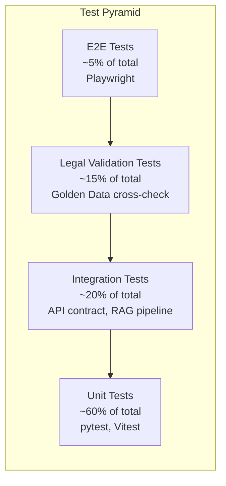

# Testing Strategy

## Document Metadata

| Field | Value |
|-------|-------|
| **Version** | v1.0 |
| **Created** | 2026-02-13 |
| **Last Updated** | 2026-02-13 |
| **Status** | Draft |
| **Owner** | QA Lead |
| **Reviewers** | Tech Lead, Product Owner, Legal Advisor |
| **PRD Reference** | [PRD README.md](../prd/README.md) v2.6 |
| **ADR References** | [ADR-004 Frontend](../adr/004-frontend-nextjs.md), [ADR-010 Deployment](../adr/010-deployment-infrastructure.md) |

---

## Table of Contents

1. [Overview & Objectives](#1-overview--objectives)
2. [Test Pyramid & Strategy Overview](#2-test-pyramid--strategy-overview)
3. [Unit Testing Strategy](#3-unit-testing-strategy)
4. [Integration Testing Strategy](#4-integration-testing-strategy)
5. [E2E Testing Strategy](#5-e2e-testing-strategy)
6. [Performance Testing Strategy](#6-performance-testing-strategy)
7. [Security Testing Strategy](#7-security-testing-strategy)
8. [Accessibility Testing Strategy](#8-accessibility-testing-strategy)
9. [Legal Accuracy Testing](#9-legal-accuracy-testing)
10. [Test Environments](#10-test-environments)
11. [CI/CD Integration](#11-cicd-integration)
12. [Test Data Management](#12-test-data-management)
13. [Quality Gates](#13-quality-gates)
14. [Specialized Testing](#14-specialized-testing)
15. [Testing Schedule & Milestones](#15-testing-schedule--milestones)
16. [Roles & Responsibilities](#16-roles--responsibilities)
17. [Appendices](#17-appendices)

---

## 1. Overview & Objectives

This document consolidates testing requirements that are currently spread across the [PRD](../prd/README.md) (SS10.4), [6 Epic specs](../prd/epics/), [ADR-004](../adr/004-frontend-nextjs.md), [ADR-010](../adr/010-deployment-infrastructure.md), and [CLAUDE.md](../../CLAUDE.md) into a single, centralized testing strategy.

### Why This System Needs Rigorous Testing

The Labor Law Assistant is a legal information system serving vulnerable populations (workers facing labor disputes, foreign workers, visually impaired users). Incorrect legal information can lead to real-world harm. This elevates testing from a quality practice to an ethical obligation.

### Testing Objectives

| # | Objective | Target | Source |
|---|-----------|--------|--------|
| 1 | Legal calculation correctness | 100% accuracy | [Epic 06](../prd/epics/06-calculation-tools.md) |
| 2 | RAG citation accuracy | >= 95% (Beta), >= 98% (Launch) | [PRD SS9.3](../prd/README.md) |
| 3 | WCAG 2.1 AA compliance | Full compliance | [PRD SS6.1](../prd/README.md), [Epic 05](../prd/epics/05-accessibility-i18n.md) |
| 4 | PII zero leakage | 0 incidents | [PRD SS6.3](../prd/README.md), [Epic 01 M-14](../prd/epics/01-chat-interface.md) |
| 5 | API response time (P95) | < 3 seconds | [PRD SS6.4](../prd/README.md) |

---

## 2. Test Pyramid & Strategy Overview

### Test Distribution



### Strategy by Layer

| Layer | Backend (Python) | Frontend (TypeScript) |
|-------|-----------------|----------------------|
| Framework | pytest + pytest-asyncio | Vitest |
| E2E | pytest + httpx (API-level) | Playwright |
| Coverage tool | pytest-cov | @vitest/coverage-v8 |
| Mocking | unittest.mock, fakeredis | vitest mocks, MSW |
| CI runner | GitHub Actions | GitHub Actions |

### Automation Target

- Overall automation rate: **>= 90%**
- Manual-only: screen reader testing, legal advisor review, exploratory testing, trauma-informed response evaluation

---

## 3. Unit Testing Strategy

### Coverage Targets

| Metric | Backend (Python) | Frontend (TypeScript) |
|--------|:----------------:|:---------------------:|
| **Line coverage** | >= 80% overall, >= 95% legal modules | >= 80% overall, >= 95% calculator modules |
| **Branch coverage** | >= 75% overall, >= 90% legal modules | >= 75% overall, >= 90% calculator modules |
| **CI enforcement** | `pytest --cov-fail-under=80` | `vitest --coverage --threshold 80` |
| **Frequency** | Every commit | Every commit |
| **Owner** | Backend developer | Frontend developer |

### Backend Key Test Scope

| Module | Test Focus | Priority |
|--------|-----------|----------|
| Overtime pay calculation | LSA Art. 24 multipliers (1.34x, 1.67x, 2.67x), hourly rate formula | P0 |
| Annual leave calculation | LSA Art. 38 tiers (6mo-1yr: 3 days ... 10+yr: 15+1/yr, max 30) | P0 |
| Severance pay calculation | New system (0.5mo/yr) vs old system (1mo/yr), mixed calculation | P0 |
| PII detection & masking | National ID (`[A-Z][12]\d{8}`), phone (`09\d{2}-?\d{3}-?\d{3}`), email patterns | P0 |
| Confidence scoring | M-07 formula: RAG similarity + LLM self-assessment + citation count | P1 |
| RAG similarity threshold | Returns "no applicable regulation" when similarity < 0.3 | P1 |
| Emergency keyword detection | 6 categories of trigger keywords (time urgency, dismissal, safety, detention, threats, self-harm) | P1 |

### Frontend Key Test Scope

| Module | Test Focus | Priority |
|--------|-----------|----------|
| Calculator components | Client-side overtime/leave/severance calculations | P0 |
| Form validation | Zod schemas for all calculator inputs (min wage check, date range) | P0 |
| Zustand stores | Chat state, conversation history, UI state management | P1 |
| i18n completeness | All translation keys have values for enabled languages | P1 |

---

## 4. Integration Testing Strategy

### API Contract Testing

| Area | Tool | What to Test | Owner |
|------|------|-------------|-------|
| Endpoint schemas | httpx + pytest | Request/response Pydantic schema validation for all FastAPI endpoints | Backend lead |
| CORS configuration | httpx + pytest | Allowed origins, methods, headers | Backend lead |
| Error responses | httpx + pytest | Correct HTTP status codes and error body format for all Epic error handling scenarios (see [Epic 01](../prd/epics/01-chat-interface.md), [Epic 02](../prd/epics/02-rag-legal-search.md), [Epic 03](../prd/epics/03-response-quality.md)) | Backend lead |
| Rate limiting | httpx + pytest | 20 queries/hour throttle per IP | Backend lead |

**Frequency**: Every PR
**Quality gate**: 100% endpoint coverage

### RAG Pipeline Integration

Test the complete pipeline: User Query -> Embedding -> pgvector search -> Rerank -> LLM generation -> Citation validation

| Test Case | Expected Behavior | Source |
|-----------|------------------|--------|
| Query with high similarity match | Returns response with valid citations from legal DB | [Epic 02 M-02](../prd/epics/02-rag-legal-search.md) |
| Query with similarity < 0.3 | Returns low-confidence warning, skips RAG | [Epic 02 Error Handling](../prd/epics/02-rag-legal-search.md) |
| RAG retrieval > 2s | Returns partial results, continues loading | [Epic 02 Error Handling](../prd/epics/02-rag-legal-search.md) |
| RAG retrieval timeout > 5s | Falls back to FAQ, then general LLM | [Epic 02 Error Handling](../prd/epics/02-rag-legal-search.md) |
| Cited article number not in DB | Citation silently filtered, Sentry alert | [Epic 02 Error Handling](../prd/epics/02-rag-legal-search.md) |
| Cited article recently amended | Shows stale warning with sync date | [Epic 02 Error Handling](../prd/epics/02-rag-legal-search.md) |
| Embedding API failure | Uses cached embeddings or returns error | [Epic 02 Error Handling](../prd/epics/02-rag-legal-search.md) |
| LLM API timeout (>10s) | Retry once, then fall back to GPT-4o-mini | [Epic 01 Error Handling](../prd/epics/01-chat-interface.md) |
| LLM API rate limit / quota exceeded | Queue request with exponential backoff, show loading message | [Epic 01 Error Handling](../prd/epics/01-chat-interface.md) |
| Legal data version conflict | Uses the version matching the effective date of the regulation | [Epic 02 M-13](../prd/epics/02-rag-legal-search.md) |

**Tool**: pytest with mocked LLM API responses (deterministic, repeatable)
**Frequency**: Every PR (core tests), daily build (full pipeline)
**Quality gate**: Citation accuracy >= 95%

### Cross-Epic Integration Testing

Beyond API and pipeline-level integration tests, cross-epic integration points must be explicitly validated to ensure features spanning multiple epics work together correctly.

| Integration Point | Source Epic | Target Epic | Test Approach | Priority |
|-------------------|:----------:|:----------:|---------------|:--------:|
| Chat -> RAG retrieval | Epic 01 (M-05) | Epic 02 (M-02) | E2E: user query produces cited response | P0 |
| RAG -> Confidence scoring | Epic 02 (M-02) | Epic 03 (M-07) | Integration: RAG similarity feeds confidence formula | P0 |
| Chat -> Action Guide | Epic 01 (M-05) | Epic 04 (M-06) | E2E: response includes "What you can do" section | P1 |
| Confidence -> Disclaimer | Epic 03 (M-07) | Epic 03 (M-08) | Integration: Low confidence triggers enhanced disclaimer | P0 |
| Chat -> Emergency panel | Epic 01 (M-05) | Epic 04 (M-10) | E2E: emergency keyword triggers overlay | P0 |

**Mock Strategy for Dependent Epics**:
- When testing an epic in isolation (before dependent epics are implemented), use MSW (frontend) or `unittest.mock` (backend) to simulate the dependent epic's API responses
- Mock responses should match the Pydantic schema contracts defined in API contract testing (SS4.1)
- As epics are completed, replace mocks with live integrations in the daily build

**Execution Order** (aligned with sprint dependencies, see [PRD SS10.4](../prd/README.md)):
1. Sprint 1-2: Epic 02 (RAG) standalone tests
2. Sprint 3-4: Epic 02 -> Epic 03 integration (RAG -> Confidence)
3. Sprint 5-6: Epic 01 -> Epic 02 integration (Chat -> RAG)
4. Sprint 7-8: Epic 01 -> Epic 04 integration (Chat -> Action Guide + Emergency)
5. Sprint 9: Full cross-epic integration suite

### Database Integration

| Test Case | Tool | What to Test |
|-----------|------|-------------|
| Alembic migrations | pytest + Docker Compose PostgreSQL | All migrations run forward and backward successfully |
| pgvector search | pytest + Docker Compose PostgreSQL + pgvector | Vector similarity search returns ranked results |
| Legal data versioning | pytest | M-13 legal DB version control tracks changes correctly |

### Cache Integration

| Test Case | Tool | What to Test |
|-----------|------|-------------|
| FAQ cache hit | pytest + fakeredis | Cached FAQ returns instantly without DB query |
| Cache invalidation | pytest + fakeredis | Legal data update triggers cache refresh |
| Redis unavailable | pytest + fakeredis | Graceful degradation to direct DB query |

---

## 5. E2E Testing Strategy

**Tool**: Playwright ([ADR-004](../adr/004-frontend-nextjs.md))
**Environment**: Next.js dev server + FastAPI backend (Docker Compose)

### Test Case Inventory (25 Cases)

| # | Test Case | Feature | Priority | Type |
|---|-----------|---------|:--------:|------|
| 1 | Homepage loads with identity selector displayed | M-01, M-05 | P0 | Happy path |
| 2 | Select "I am a Worker" shows scenario templates | M-01 | P0 | Happy path |
| 3 | Click question template enters chat interface | M-01, M-05 | P0 | Happy path |
| 4 | Free-text question receives streaming response | M-05 | P0 | Happy path |
| 5 | Response includes expandable legal article citations | M-02, M-04 | P0 | Happy path |
| 6 | Response displays confidence indicator (high/medium/low) | M-07 | P0 | Happy path |
| 7 | Disclaimer banner appears on first visit | M-08 | P0 | Happy path |
| 8 | Every response footer includes disclaimer text | M-08 | P0 | Happy path |
| 9 | Thumbs up/down feedback buttons work | M-09 | P1 | Happy path |
| 10 | "I don't know how to ask" enters wizard mode | M-15 | P0 | Happy path |
| 11 | Wizard reaches result within 5 questions | M-15 | P0 | Happy path |
| 12 | Emergency keyword triggers emergency panel overlay | M-10 | P0 | Emergency |
| 13 | Emergency panel shows 1955 hotline link | M-10 | P0 | Emergency |
| 14 | PII auto-detection masks National ID number | M-14 | P0 | Security |
| 15 | PII auto-detection masks phone number | M-14 | P0 | Security |
| 16 | Overtime pay calculator computes correctly | S-03a | P1 | Calculator |
| 17 | Annual leave calculator computes correctly | S-03b | P1 | Calculator |
| 18 | Severance pay calculator computes correctly | S-03c | P1 | Calculator |
| 19 | Response includes action guide section | M-06 | P1 | Action guide |
| 20 | Action guide "Save action plan" button works | M-06, S-08 | P1 | Action guide |
| 21 | Full query flow navigable by keyboard only | M-12 | P0 | Accessibility |
| 22 | High contrast mode toggles correctly | M-12 | P1 | Accessibility |
| 23 | Mobile RWD layout correct at 375px | M-11 | P0 | Mobile |
| 24 | Layered information expands/collapses smoothly | M-03 | P1 | UI |
| 25 | Error report button submits report | M-09 | P1 | Feedback |

### Execution Strategy

| Scope | When | Cases | Threshold |
|-------|------|:-----:|-----------|
| Smoke tests | Every PR | 10 P0 cases | 100% pass |
| Full suite | Daily build | All 25 cases | P0: 100%, P1: >= 95% |
| Release gate | Before deploy | All 25 cases | 100% pass |

---

## 6. Performance Testing Strategy

### Performance Targets

Reference: [PRD SS6.4](../prd/README.md)

| Metric | Target | Tool | Scenario |
|--------|--------|------|----------|
| API response time (P95) | < 3 seconds | k6 | 100 concurrent users, 10 min |
| RAG retrieval time | < 1 second | k6 + custom metrics | Vector search isolated timing |
| LLM first token time | < 2 seconds | k6 | Streaming response |
| LLM total generation time | < 5 seconds | k6 | Full response |
| First load time (3G) | < 3 seconds | Lighthouse CI | Mobile throttling |
| FCP (First Contentful Paint) | < 2 seconds | Lighthouse CI | Mobile |
| Lighthouse Performance Score | >= 90 | Lighthouse CI | Mobile |

### Load Testing Profiles

Reference: [PRD SS6.5](../prd/README.md)

| Phase | Expected Traffic | k6 Config | Success Criteria |
|-------|:----------------:|-----------|-----------------|
| MVP | 100 DAU | 50 VUs, 5 min ramp-up, 10 min steady | 0% error rate, P95 < 3s |
| V2 | 1,000 DAU | 200 VUs, 10 min ramp-up, 15 min steady | < 1% error rate, P95 < 5s |
| V3 | 10,000 DAU | 1,000 VUs, 15 min ramp-up, 20 min steady | < 1% error rate, P95 < 5s |

**Frequency**: Sprint 9 (pre-Beta), before each release
**Owner**: DevOps / Backend lead

---

## 7. Security Testing Strategy

### OWASP Top 10 Testing Plan

Reference: [PRD SS6.3](../prd/README.md)

| OWASP Category | Test Method | Tool | Priority |
|----------------|-----------|------|:--------:|
| A01 Broken Access Control | Unauthorized API access testing | Manual + Burp Suite | P0 |
| A02 Cryptographic Failures | TLS configuration check, sensitive data transmission | SSLyze, testssl.sh | P0 |
| A03 Injection | SQL Injection, XSS, Command Injection | OWASP ZAP, SQLMap | P0 |
| A04 Insecure Design | Business logic vulnerability analysis | Manual threat modeling | P1 |
| A05 Security Misconfiguration | CORS, security headers, error message exposure | OWASP ZAP | P0 |
| A06 Vulnerable Components | Dependency CVE scanning | Trivy, pip-audit, pnpm audit | P0 |
| A07 Authentication Failures | Session management, OAuth flow (V2+ only, MVP is anonymous per [ADR-009](../adr/009-authentication-strategy.md)) | Manual + Burp Suite | P2 |
| A08 Data Integrity Failures | Legal data tampering protection | Manual review | P0 |
| A09 Logging Failures | Security event audit logging | Manual review | P1 |
| A10 SSRF | API proxy security (Next.js API routes) | Manual testing | P1 |

### PII Leakage Detection

Reference: [Epic 01 M-14](../prd/epics/01-chat-interface.md)

| PII Type | Detection Pattern | Masking Format |
|----------|------------------|----------------|
| National ID | `[A-Z][12]\d{8}` | `A1****xxxx` |
| Mobile phone | `09\d{2}-?\d{3}-?\d{3}` | `09xx-xxx-xxx` |
| Landline phone | `0\d{1,2}-?\d{3,4}-?\d{3,4}` | `0x-xxxx-xxxx` |
| Email | Standard email regex | `u***@***.com` |

**Verification points** (PII must NOT appear in):
- Server logs
- Database records
- LLM API request payloads
- Error tracking (Sentry) events
- Browser console output

**Quality gate**: PII leakage = **0 (zero tolerance, blocker)**
**Frequency**: Every PR (Sprint 6+, after M-14 implementation)

### Dependency Scanning

| Tool | Scope | Frequency | Quality Gate |
|------|-------|-----------|-------------|
| Trivy | Container images | Every PR + weekly schedule | 0 critical/high CVE |
| pip-audit | Python dependencies | Every PR | 0 critical/high CVE |
| pnpm audit | Node.js dependencies | Every PR | 0 critical/high CVE |

---

## 8. Accessibility Testing Strategy

Reference: [Epic 05 M-12](../prd/epics/05-accessibility-i18n.md), [PRD SS6.1](../prd/README.md)

**Target**: WCAG 2.1 AA full compliance

### Testing Matrix

| Test Type | Tool | Frequency | Target | Owner |
|-----------|------|-----------|--------|-------|
| Automated scan | axe-core + Playwright | Every PR | 0 critical, 0 serious | Frontend lead |
| Lighthouse a11y score | Lighthouse CI | Every PR | Score = 100 | Frontend lead |
| VoiceOver (macOS/iOS) | Manual | Weekly during dev | All flows navigable | QA |
| NVDA (Windows) | Manual | Beta phase | All flows navigable | QA |
| TalkBack (Android) | Manual | Beta phase | Core flows navigable | QA |
| Keyboard navigation | Manual | Every feature | Full functionality | Developer |
| Color contrast | Colour Contrast Analyser | Design phase | >= 4.5:1 (normal text), >= 3:1 (large text) | Designer |
| Zoom 200% | Browser zoom | Every feature | No loss of functionality | QA |

### Cross-Lingual UI Consistency Testing

When multi-language support is enabled (Phase 2, Epic 05 S-01), UI consistency must be validated across all enabled languages.

**Automated Visual Regression** (Playwright):
| Page | Breakpoints Tested | Languages | Frequency |
|------|-------------------|-----------|-----------|
| Homepage | 375px, 768px, 1024px | All enabled | Every PR with UI changes |
| Chat interface | 375px, 768px, 1024px | All enabled | Every PR with UI changes |
| Calculator | 375px, 768px, 1024px | All enabled | Every PR with UI changes |

**Automated Checks**:
- Button text overflow: verify no CSS overflow/truncation on buttons and navigation items
- Text truncation: verify no `text-overflow: ellipsis` triggered on critical content
- Modal/dialog width: verify modals accommodate longest translation without horizontal scroll
- Form label alignment: verify labels and inputs remain aligned in all languages

**Manual Review** (Beta Phase):
- 2 native speakers per enabled language review critical flows
- Focus: natural phrasing, legal term accuracy, cultural appropriateness
- Findings logged as translation issues in the project issue tracker

> **Cross-reference**: See [Epic 05 Additional QA Acceptance Criteria](../prd/epics/05-accessibility-i18n.md) for the corresponding acceptance criteria.

### Screen Reader Test Flows

These 5 core flows must be fully navigable via screen reader:

1. **Identity selection -> scenario template -> chat** (M-01 -> M-05)
2. **Wizard mode: question 1 -> result** (M-15)
3. **Chat response with layered display: expand/collapse** (M-03)
4. **Emergency panel: trigger -> read content -> call hotline** (M-10)
5. **Calculator: input -> calculate -> read result** (S-03)

### Beta A11y Testing

Reference: [PRD SS10.5](../prd/README.md)

- 8-10 visually impaired Beta users (daily screen reader users)
- 8-10 elderly users (55+, low-medium digital literacy)
- Task success rate target: > 70%
- WCAG 2.1 AA audit pass required for launch

---

## 9. Legal Accuracy Testing

This is the most critical and unique testing domain for this system. Incorrect legal information can cause real-world harm to vulnerable users.

### Legal Validation Matrix

| Test Item | Legal Basis | Validation Method | Frequency | Quality Gate |
|-----------|------------|-------------------|-----------|:------------:|
| Overtime pay formula | LSA Art. 24 | Cross-validate with MOL official calculator | Every Sprint | 100% match |
| Annual leave calculation | LSA Art. 38 | Cross-validate with official reference table | Every Sprint | 100% match |
| Severance pay calculation | LPA / LSA | Cross-validate with MOL official calculator | Every Sprint | 100% match |
| Legal citation accuracy | All 8 laws | RAG citations vs legal DB cross-check | Every deploy | >= 95% (Beta), >= 98% (Launch) |
| Regulation timeliness | All laws | Compare with law.moj.gov.tw latest version | Weekly | Sync delay < 7 days |
| Confidence score calibration | M-07 | Low-confidence responses should not contain incorrect citations | Monthly | False high confidence < 5% |
| Hallucination detection | M-02 | Check for non-existent article numbers in LLM responses | Every deploy | 0 hallucinated citations |

### Golden Data Validation

Golden Data = authoritative test cases derived from official government sources (MOL calculators, official interpretation letters).

**Validation workflow**:
1. Collect official examples from Ministry of Labor (MOL) website
2. Convert to structured test fixtures (JSON)
3. Run system calculations against Golden Data
4. Any mismatch = **P0 blocker** (immediate fix required)
5. Legal advisor reviews Golden Data quarterly for regulation changes

### Legal Compliance Weight

**Legal accuracy is a permanent blocker** -- no deployment is allowed if legal validation fails.

| Standard | Weight | Threshold |
|----------|:------:|-----------|
| Code quality | 15% | >= 80/100 |
| Test coverage | 25% | >= 80% |
| Security | 15% | 0 critical/high |
| **Legal compliance** | **30%** | **100% -- no waiver allowed** |
| Performance | 15% | SLO targets met |

---

## 10. Test Environments

Reference: [ADR-010](../adr/010-deployment-infrastructure.md)

| Environment | Purpose | Infrastructure | Data | Deployment |
|-------------|---------|---------------|------|------------|
| **Local** | Developer testing | Docker Compose (PostgreSQL + pgvector + Redis + FastAPI) | Synthetic fixtures | Manual |
| **CI/CD** | Automated testing | GitHub Actions runner | Synthetic fixtures | Every commit |
| **Staging** | Pre-production validation | Vercel Preview + Render staging + Neon branch + Upstash | Anonymized data | PR merge |
| **Production** | Live system | Vercel + Render + Neon + Upstash | Real data | Release only |

### Environment Isolation

- **Neon branching**: Each staging deployment uses an isolated database branch (no shared state)
- **Vercel preview deployments**: Each PR gets a unique preview URL for frontend testing
- **Environment variables**: GitHub Secrets (CI) / Render Secrets (prod) / Vercel Env Vars (frontend)

---

## 11. CI/CD Integration

Reference: [ADR-010](../adr/010-deployment-infrastructure.md), existing `.github/workflows/ci.yml`

### Target Pipeline Design

```
Push to branch
    |
    v
Stage 1: Code Quality (parallel)
    +-- lint (ruff check + ruff format --check)
    +-- typecheck (mypy --strict)
    +-- frontend-lint (eslint + prettier)
    |
    v
Stage 2: Tests (parallel)
    +-- unit-tests-backend (pytest --cov, fail-under=80)
    +-- unit-tests-frontend (vitest --coverage)
    +-- security-scan (Trivy + pip-audit + pnpm audit)
    |
    v
Stage 3: Integration (sequential)
    +-- integration-tests (pytest + Docker services)
    +-- a11y-scan (axe-core + Lighthouse CI)
    +-- pii-sanitization-test (custom regex tests)
    |
    v
Stage 4: E2E (PR to main only)
    +-- playwright-smoke (10 P0 core flows)
    +-- legal-validation (Golden Data cross-check)
    |
    v
Merge to main
    +-- Vercel auto-deploy frontend
    +-- Render auto-deploy backend
    +-- Alembic migrations (pre-deploy)
```

### Implementation Notes

- **Docker services in CI**: Stage 3 integration tests use GitHub Actions [service containers](https://docs.github.com/en/actions/using-containerized-services) for PostgreSQL (with pgvector extension) and Redis
- **Frontend CI**: Current `ci.yml` only covers backend. Frontend jobs (eslint, prettier, vitest) to be added when frontend project is initialized
- **PII sanitization tests**: Implemented as a dedicated test file (`test_pii_sanitization.py`) with `@pytest.mark.pii` marker for selective execution

### PR Quality Gates

Reference: [PRD SS10.4 Definition of Done](../prd/README.md)

| Check | Threshold | Blocker? |
|-------|-----------|:--------:|
| Lighthouse Performance | >= 80 (PR gate) / >= 90 (Release gate) | Yes |
| Lighthouse Accessibility | = 100 | Yes |
| axe-core | 0 critical, 0 serious | Yes |
| Backend coverage | >= 80% (legal modules >= 95%) | Yes |
| Frontend coverage | >= 80% | Yes |
| Security vulnerabilities | 0 critical/high | Yes |
| PII sanitization tests | All pass | Yes (Sprint 6+) |
| Keyboard navigation tests | All pass (new features) | Yes |
| Translation coverage (i18n) | 100% for all enabled languages | Yes (when i18n enabled) |

#### Translation CI/CD Checks

When i18n is enabled (Phase 2, after Epic 05 S-01 implementation):

| CI Step | Trigger | Action | Threshold |
|---------|---------|--------|-----------|
| Detect i18n JSON changes | PR diff includes `locales/*.json` | Run translation coverage check | Auto |
| Translation coverage check | Any i18n file change | Verify all UI keys have values for all enabled languages | 100% coverage or **block merge** |
| Missing key report | Coverage < 100% | PR comment listing missing keys by language | Informational |
| Rollback test (staging) | Pre-deploy to staging | Simulate rollback to previous translation version, verify no 500 errors | Pass/Fail |

> **Cross-reference**: See [Epic 05 S-01 Rollback Procedures](../prd/epics/05-accessibility-i18n.md) for the translation rollback workflow and severity assessment criteria.

### Pre-Release Additional Checks

| Check | Tool | Threshold |
|-------|------|-----------|
| Full Playwright suite | Playwright | 25/25 pass |
| Load test | k6 | SLO targets met |
| Legal Golden Data validation | pytest | 100% match |
| WCAG audit | axe-core + manual | AA pass |

---

## 12. Test Data Management

### Data Categories

| Category | Purpose | Source | Update Frequency |
|----------|---------|--------|-----------------|
| **Golden Data** | Authoritative validation cases (cross-validate with MOL) | Ministry of Labor official examples | Every regulation amendment |
| **Boundary Data** | Edge case testing (min/max values, transitions) | Manual design | Every Sprint |
| **Error Data** | Invalid input validation | Manual + fuzzing | Every Sprint |
| **Legal Fixtures** | Legal article texts (8 major laws, full text by article) | law.moj.gov.tw | Weekly sync |

### Test Fixtures Directory Structure

```
tests/fixtures/
+-- legal/
|   +-- labor_standards_act.json         # LSA full text (by article)
|   +-- labor_pension_act.json           # LPA full text
|   +-- gender_equality_act.json         # Gender Equality in Employment Act
|   +-- occupational_safety_act.json     # Occupational Safety and Health Act
|   +-- labor_insurance_act.json         # Labor Insurance Act
|   +-- employment_service_act.json      # Employment Service Act
|   +-- labor_incident_act.json          # Labor Incident Act
|   +-- mass_layoff_act.json             # Mass Layoff Protection Act
+-- golden_data/
|   +-- overtime_calculations.json       # Overtime pay Golden Data
|   +-- annual_leave.json                # Annual leave Golden Data
|   +-- severance_pay.json               # Severance pay Golden Data
+-- boundary/
|   +-- boundary_conditions.json         # Boundary condition cases
+-- error/
    +-- invalid_inputs.json              # Invalid input cases
```

### Privacy Protection

- **Zero real PII**: All test data uses synthetic data only
- **No production data in test environments**: Staging uses anonymized data
- **PDPA compliance**: Test data management follows Taiwan Personal Data Protection Act

### Golden Data Maintenance Ownership

Golden Data fixtures require active maintenance to remain accurate as regulations change. This section defines ownership and SLA.

**Owner**: Legal Advisor (0.5 FTE allocation, shared with legal content review responsibilities per [PRD SS8.4.2](../prd/README.md))

**Maintenance Cadence**:
| Trigger | Type | SLA | Action |
|---------|------|:---:|--------|
| Legal regulation amendment | Reactive | 3 business days after legal data update (M-13) | Update affected Golden Data fixtures, re-run validation |
| Quarterly review | Proactive | End of each quarter | Review all Golden Data for continued accuracy, add new edge cases |
| Test failure | Reactive | Same Sprint | Investigate: if law changed, update fixture; if bug, file P0 issue |

**Update Workflow**:
1. Legal Advisor updates Golden Data JSON fixtures (`tests/fixtures/golden_data/`)
2. Legal Advisor submits PR with updated fixtures + changelog note
3. Backend Developer reviews PR for JSON format correctness and test compatibility
4. CI runs full legal validation suite against updated fixtures
5. Merge on green CI + Backend Developer approval

**Escalation**: If Golden Data update SLA is missed (e.g., Legal Advisor unavailable), escalate to PO within 1 business day. PO may temporarily designate Tech Lead to update fixtures with PO sign-off on legal accuracy.

---

## 13. Quality Gates

### Four-Layer Gate System

| Gate | Trigger | Key Criteria | Blocks Deploy? |
|------|---------|-------------|:--------------:|
| **Gate 1: Code Commit** | PR created | Lint pass, type check pass, unit tests 100% pass, coverage >= 80% | Yes |
| **Gate 2: Sprint Release** | Sprint end | All automated tests pass, 0 critical bugs, code review complete | Yes |
| **Gate 3: Staging** | Deploy to staging | Integration tests pass, performance baseline met, security scan pass, legal compliance verified | Yes |
| **Gate 4: Production** | Deploy to production | All tests pass, legal compliance 100%, WCAG audit pass, rollback plan ready | Yes |

### Legal System Weight Distribution

| Standard | Weight | Threshold | Waiver Allowed? |
|----------|:------:|-----------|:---------------:|
| Code quality | 15% | >= 80/100 | Yes (with justification) |
| Test coverage | 25% | >= 80% | Yes (with justification) |
| Security | 15% | 0 critical/high | No |
| **Legal compliance** | **30%** | **100%** | **No -- never** |
| Performance | 15% | SLO targets met | Yes (with justification) |

---

## 14. Specialized Testing

### 14.1 RAG Pipeline Quality Testing

Reference: [Epic 02 M-02](../prd/epics/02-rag-legal-search.md)

| Test Area | What to Validate | Method |
|-----------|-----------------|--------|
| Embedding quality | Similar queries produce similar embeddings | Cosine similarity comparison on known-similar question pairs |
| Retrieval relevance | Top-K results contain the correct legal articles | Precision@K and Recall@K on curated query-article pairs |
| LLM instruction following | LLM only cites articles from retrieved context | Automated check: all cited article numbers exist in RAG context |
| Citation validation | Cited article numbers exist in the legal database | DB lookup for every cited article number in responses |
| Context window utilization | Retrieved context is within LLM token limits | Token count check before LLM call |

### 14.2 Emergency Fast Track Testing

Reference: [Epic 04 M-10](../prd/epics/04-action-guide-emergency.md)

| Category | Sample Keywords | Expected Behavior |
|----------|----------------|-------------------|
| Time urgency | "today", "immediately", "now" | Emergency panel displayed |
| Dismissal | "fired", "dismissed", "terminated" | Emergency panel + labor bureau contacts |
| Safety | "occupational accident", "injured", "sexual harassment" | Emergency panel + relevant hotlines |
| Detention | "won't let me leave", "confiscated passport" | Emergency panel + police + NGO resources |
| Threats | "threatened", "violence", "intimidation" | Emergency panel + 110 police |
| Self-harm | "don't want to live", "suicide" | **Immediate crisis resources (1925) BEFORE legal content** |

**False positive testing**: Phrases like "I was fired up about my project" should NOT trigger the emergency panel.

### 14.3 Trauma-Informed Response Testing

Reference: [PRD SS10.5 Beta Testing Plan](../prd/README.md)

| Scenario | Test Query | Success Criteria |
|----------|-----------|-----------------|
| Sexual harassment | "My manager sexually harassed me" | Prioritizes third-party intervention (labor bureau, NGO), NOT "talk to your employer" |
| Occupational death | "My colleague died in a workplace accident" | Empathetic tone, emotional support resources (1980, 1925) shown |
| Illegal detention | "My employer confiscated my passport" | Immediate emergency resources, police contact, NGO resources |

**Metric targets**:
- User reports "felt supported": > 80%
- User reports "did not feel re-traumatized": 100%

#### Evaluation Rubric

Each trauma-sensitive test scenario is scored on 5 criteria by two evaluators: Legal Advisor + User Advocate (or designated UX Researcher with trauma-informed training).

| # | Criterion | Description | Scale |
|---|-----------|-------------|:-----:|
| 1 | Empathy | Response acknowledges user's emotional state without being patronizing | 1-5 |
| 2 | Safety First | Response prioritizes user's physical and emotional safety above legal information | 1-5 |
| 3 | Avoid Re-traumatization | Response avoids graphic details, victim-blaming language, or minimizing language | 1-5 |
| 4 | Resource Clarity | Emergency resources (hotlines, NGOs) are clearly presented and actionable | 1-5 |
| 5 | Empowerment | Response reinforces user's agency and provides choices rather than directives | 1-5 |

**Scoring Thresholds**:
- **Pass**: Average score across all criteria >= 4.0/5.0 AND minimum score per individual scenario >= 3.5/5.0
- **Conditional Pass**: Average 3.5-3.9 -> revise prompts and re-evaluate within 1 Sprint
- **Fail**: Average < 3.5 or any single criterion < 2.0 -> block release, require prompt engineering review + re-evaluation

**Evaluator Calibration**: Before first evaluation, both evaluators independently score 3 sample responses and discuss discrepancies to align scoring standards.

### 14.4 Future Features Testing (Epic 07)

Testing strategies for C-01 (Document Templates), C-02 (Compliance Tool), C-03 (Case Database), C-04 (Community Forum), C-05 (Expert Referral), C-06 + C-07 (Admin Dashboard + CMS) will be documented at the Phase 4 decision point when these features are prioritized.

**Anticipated testing areas**:

| Feature | Key Testing Focus |
|---------|------------------|
| C-01 Document Templates | Template legal accuracy, PDF generation, download functionality |
| C-02 Compliance Tool | Assessment scoring accuracy, question completeness, result interpretation |
| C-03 Case Database | PII de-identification validation (automated + manual), legal reviewer approval workflow, categorization accuracy |
| C-04 Community Forum | Content moderation accuracy (Layer 1-4), spam detection rate, crisis keyword detection, PII auto-removal |
| C-05 Expert Referral | Partner vetting process validation, referral satisfaction tracking, directory data accuracy |
| C-06 + C-07 Admin Dashboard + CMS | Role-based access control (RBAC) security, content version control integrity, audit trail completeness |

> Refer to [Epic 07: Future Features](../prd/epics/07-future-features.md) for full specifications.

---

## 15. Testing Schedule & Milestones

Aligned with [PRD SS10.1 Timeline](../prd/README.md) (44 weeks)

| Phase | Timeline | Testing Activities |
|-------|----------|-------------------|
| **Phase 0** (Week 11-15) | Tech prep | Set up test frameworks (pytest, Vitest, Playwright), configure CI/CD pipeline, create test environments, build legal Golden Data fixtures |
| **Sprint 1-2** (Week 16-19) | RAG foundation | Unit tests for legal DB, embedding pipeline integration tests, Golden Data baseline for 8 laws |
| **Sprint 3-4** (Week 20-23) | Quality controls | Integration tests for citation validation, confidence scoring unit tests |
| **Sprint 5-6** (Week 24-27) | Chat UI | E2E smoke tests begin, axe-core a11y scanning on every PR, PII sanitization tests |
| **Sprint 7-8** (Week 28-31) | Action guide + a11y | Full E2E suite (25 cases), screen reader testing begins, emergency panel testing |
| **Sprint 9** (Week 32) | **Integration test sprint** | k6 load testing, full WCAG audit, PII verification, legal cross-validation, security scan |
| **Phase 2 Beta** (Week 33-39) | Beta testing | 100 users, 500+ queries, screen reader testing (8-10 visually impaired users), trauma-informed response evaluation |
| **Phase 3 Launch** (Week 40-44) | Security audit | Penetration testing (OWASP ZAP), final WCAG audit, performance optimization, pre-launch legal review |

---

## 16. Roles & Responsibilities

| Role | Testing Responsibility | Tools |
|------|----------------------|-------|
| Backend Developer | Unit tests, API integration tests, PII sanitization tests | pytest, httpx, fakeredis |
| Frontend Developer | Unit tests, component tests, basic a11y (axe-core) | Vitest, axe-core |
| QA Engineer | E2E tests, manual testing, screen reader testing, exploratory testing | Playwright, VoiceOver, NVDA |
| DevOps | CI/CD pipeline, performance testing, security scanning | GitHub Actions, k6, Trivy |
| Legal Advisor | Legal accuracy review, Golden Data validation, regulation update verification | Manual review |
| Product Owner | Beta test coordination, user feedback analysis | Built-in feedback system |
| AI Engineer | RAG pipeline testing, LLM response quality evaluation | pytest, custom evaluation scripts |

---

## 17. Appendices

### Appendix A: Cross-Reference Index

| Document | Path | Referenced Sections |
|----------|------|-------------------|
| PRD README | [`docs/prd/README.md`](../prd/README.md) | SS6.1-6.5, SS9.1-9.5, SS10.1-10.6 |
| Epic 01: Chat Interface | [`docs/prd/epics/01-chat-interface.md`](../prd/epics/01-chat-interface.md) | M-05, M-01, M-14, M-15, Error Handling |
| Epic 02: RAG Legal Search | [`docs/prd/epics/02-rag-legal-search.md`](../prd/epics/02-rag-legal-search.md) | M-02, M-04, M-13, Error Handling |
| Epic 03: Response Quality | [`docs/prd/epics/03-response-quality.md`](../prd/epics/03-response-quality.md) | M-07, M-08, M-09, Error Handling |
| Epic 04: Action Guide | [`docs/prd/epics/04-action-guide-emergency.md`](../prd/epics/04-action-guide-emergency.md) | M-06, M-10, Error Handling |
| Epic 05: Accessibility | [`docs/prd/epics/05-accessibility-i18n.md`](../prd/epics/05-accessibility-i18n.md) | M-11, M-12, S-01, Accessibility Testing Plan |
| Epic 06: Calculators | [`docs/prd/epics/06-calculation-tools.md`](../prd/epics/06-calculation-tools.md) | S-03a/b/c, Error Handling |
| ADR-004: Frontend | [`docs/adr/004-frontend-nextjs.md`](../adr/004-frontend-nextjs.md) | Vitest + Playwright decision |
| ADR-006: Observability | [`docs/adr/006-observability-stack.md`](../adr/006-observability-stack.md) | Sentry integration, structlog, monitoring |
| ADR-010: Deployment | [`docs/adr/010-deployment-infrastructure.md`](../adr/010-deployment-infrastructure.md) | CI/CD pipeline, container strategy |
| Epic 07: Future Features | [`docs/prd/epics/07-future-features.md`](../prd/epics/07-future-features.md) | C-03~C-07 testing (Phase 4+) |
| CLAUDE.md | [`CLAUDE.md`](../../CLAUDE.md) | pytest, mypy, ruff configuration |

### Appendix B: Testing Tool Inventory

| Tool | Purpose | Scope | License |
|------|---------|-------|---------|
| pytest | Backend unit/integration testing | Python | MIT |
| pytest-cov | Coverage reporting | Python | MIT |
| pytest-asyncio | Async test support | Python | MIT |
| httpx | API test client | Python | BSD |
| Vitest | Frontend unit testing | TypeScript | MIT |
| Playwright | E2E testing | Cross-browser | Apache 2.0 |
| axe-core | Automated a11y scanning | Frontend | MPL 2.0 |
| Lighthouse CI | Performance/a11y scoring | Frontend | Apache 2.0 |
| k6 | Load testing | Backend | AGPL 3.0 |
| Trivy | Container/dependency scanning | DevOps | Apache 2.0 |
| pip-audit | Python dependency CVE scan | Python | Apache 2.0 |
| OWASP ZAP | Penetration testing | Security | Apache 2.0 |
| fakeredis | Redis mock for testing | Python | MIT |

### Appendix C: Changelog

| Version | Date | Author | Changes |
|---------|------|--------|---------|
| v1.0 | 2026-02-13 | QA Lead | Initial creation -- consolidated from PRD/Epic/ADR sources |
